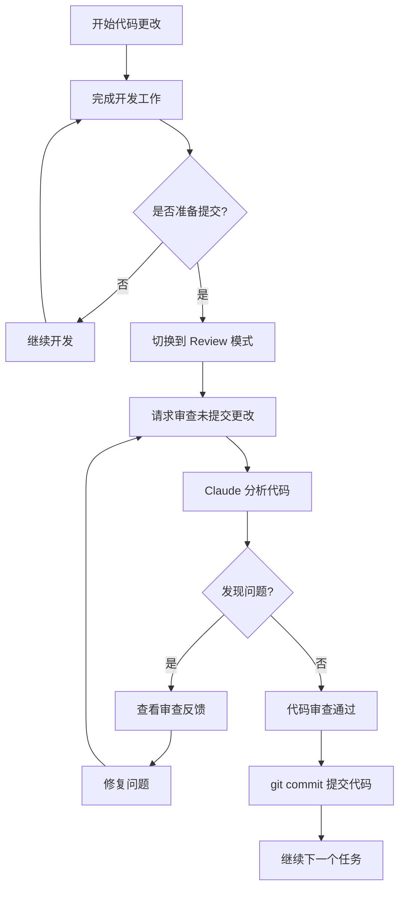

# 使用 Kilo Code/Cline 的 Review 模式进行代码审查指南

## 概述

Kilo Code 扩展提供了专门的 **Review 模式**，用于在提交代码之前审查您的更改。该模式专门针对系统化的代码审查、分析变更和识别潜在问题进行了优化。

## 如何进入 Review 模式

### 方法一：通过模式切换器

1. 在 VS Code 中打开 Kilo Code 面板
2. 点击模式选择器（通常显示当前模式如 "Code" 或 "Architect"）
3. 从下拉列表中选择 **"Review"** 模式

### 方法二：直接在对话中请求

在任何模式下，您可以输入类似以下的请求：
- "请切换到 Review 模式帮我审查代码"
- "Review my code changes"

## Review 模式的主要功能

### 1. 审查未提交的更改 - Uncommitted Changes

这是最常用的场景 - 在 `git commit` 之前审查您的工作：

```
请审查我当前未提交的代码更改
```

或

```
Review my uncommitted changes
```

Claude 会：
- 分析您工作目录中所有已修改但未提交的文件
- 识别潜在的 bug、安全问题、性能问题
- 提供代码改进建议
- 检查代码风格和最佳实践

### 2. 比较分支差异 - Branch Comparison

将您的开发分支与主分支进行对比：

```
将我当前分支与 main 分支进行对比审查
```

或

```
Compare my branch against develop
```

### 3. 审查特定提交 - Specific Commits

审查特定的提交历史：

```
审查最近 3 次提交的更改
```

或

```
Review the last commit
```

### 4. 审查合并前的更改 - Pre-merge Review

在合并代码之前进行全面审查：

```
审查 feature-branch 合并到 main 之前的所有更改
```

## 代码审查流程图



## 实际使用示例

### 示例 1：基础代码审查

**您的输入：**
```
请审查我当前所有未提交的更改，重点关注：
1. 潜在的 bug
2. 性能问题
3. 代码可读性
```

**Claude 会提供：**
- 逐文件的详细审查
- 具体的代码位置和行号
- 改进建议和原因说明
- 优先级排序的问题列表

### 示例 2：安全审查

**您的输入：**
```
请对我的代码更改进行安全审查，检查是否存在：
- SQL 注入风险
- XSS 漏洞
- 敏感信息泄露
- 不安全的 API 调用
```

### 示例 3：团队代码规范审查

**您的输入：**
```
请根据以下规范审查我的代码：
- 使用 TypeScript 严格模式
- 函数不超过 50 行
- 必须有适当的错误处理
- 所有公共 API 需要 JSDoc 注释
```

## Review 模式的优势

| 特性 | 说明 |
|------|------|
| **专注审查** | 专门针对代码审查优化，不会修改代码 |
| **Git 集成** | 直接与 Git 版本控制系统集成 |
| **全面分析** | 涵盖安全、性能、可读性等多个维度 |
| **具体建议** | 提供行号级别的具体改进建议 |
| **即时反馈** | 提交前发现问题，减少后期返工 |

## 最佳实践

### 1. 频繁小批量审查

不要等到大量代码变更后才审查，建议：
- 每完成一个功能模块就进行审查
- 每天工作结束前进行审查
- 在提交重要更改前进行审查

### 2. 提供上下文信息

在请求审查时提供背景信息：
```
我正在实现用户认证功能，请审查以下更改，特别关注安全性
```

### 3. 指定审查重点

根据代码类型指定审查重点：
- **API 代码**：安全性、输入验证
- **数据库代码**：SQL 注入、性能
- **前端代码**：XSS、用户体验
- **核心算法**：正确性、边界条件

### 4. 结合自动化工具

Review 模式可以与其他工具配合：
- ESLint / Prettier 进行格式检查
- Jest / Mocha 进行单元测试
- SonarQube 进行静态分析

## 常见问题解答

### Q: Review 模式会修改我的代码吗？

A: 不会。Review 模式专门设计为只读模式，它只会分析和提供建议，不会直接修改您的代码。如果您想应用建议的修改，需要切换到 Code 模式。

### Q: 可以审查特定文件吗？

A: 可以。您可以指定要审查的文件：
```
请只审查 src/auth/*.ts 文件的更改
```

### Q: 审查结果可以保存吗？

A: 可以请求 Claude 将审查结果整理成 markdown 文件保存。

## 下一步

准备好开始代码审查了吗？您可以：

1. **立即切换到 Review 模式** 开始审查您的代码
2. **先完成当前的开发任务** 然后进行审查
3. **设置自定义审查标准** 创建团队代码规范文档

---

*本指南适用于 Kilo Code / Cline VS Code 扩展*
