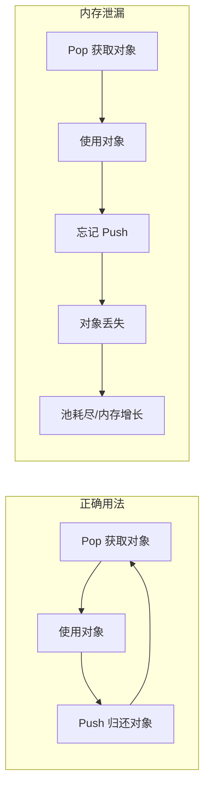
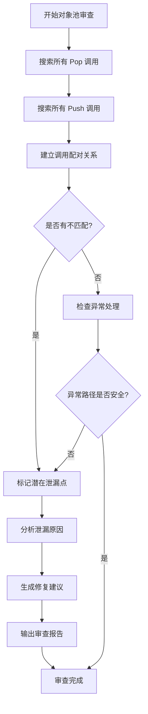

# Unity 对象池内存泄漏审查指南 - 使用 Claude Code

## 概述

本指南介绍如何使用 Claude Code 审查 Unity 项目中的对象池使用情况，特别是检测使用 `itemPool.Pop<T>()` 创建但未使用 `itemPool.Push()` 释放的对象，这是一种常见的内存泄漏问题。

## 对象池内存泄漏问题说明



## 方法一：使用 Review 模式进行代码审查

### 步骤 1：切换到 Review 模式

在 VS Code 的 Kilo Code / Cline 面板中，切换到 **Review** 模式。

### 步骤 2：使用专门的审查提示词

复制以下提示词模板到对话框中：

```
请审查项目中的对象池使用情况，找出所有可能的内存泄漏：

审查目标：
1. 查找所有使用 itemPool.Pop<T>() 或类似方法获取对象的代码
2. 检查每个 Pop 调用是否有对应的 Push 释放
3. 特别关注以下模式：
   - _skinUIItem = itemPool.Pop<SkinUIItem>()
   - 类似的泛型对象池获取方法

检查清单：
- [ ] Pop 的对象是否在同一作用域或类中有对应的 Push
- [ ] 是否在 OnDestroy、Dispose 或清理方法中释放对象
- [ ] 是否在异常处理中正确释放对象
- [ ] 是否存在早期 return 导致 Push 未执行的情况

请按文件列出所有潜在的泄漏点，并提供修复建议。
```

### 步骤 3：针对特定文件审查

如果您知道具体文件，可以使用更精确的提示：

```
请审查以下文件中的对象池使用：
- Assets/Scripts/UI/SkinPanel.cs
- Assets/Scripts/UI/ItemListView.cs

检查所有 Pop<T> 调用是否有对应的 Push 释放，列出所有不匹配的情况。
```

## 方法二：使用 Code 模式配合搜索

### 使用 search_files 工具

在 Code 或 Architect 模式下，可以请求 Claude 使用搜索功能：

```
请在项目中搜索所有对象池相关代码：
1. 首先搜索所有 Pop<.*> 的调用
2. 然后搜索所有 Push 的调用
3. 对比分析是否有不匹配的情况
```

### 常用正则表达式

以下正则表达式可用于搜索对象池使用：

| 用途 | 正则表达式 | 说明 |
|------|-----------|------|
| 查找 Pop 调用 | `\w+Pool[^.]*\.Pop<\w+>` | 匹配各种命名的池的 Pop 调用 |
| 查找 Push 调用 | `\w+Pool[^.]*\??\.\s*Push` | 匹配 Push 调用，包括 ?. 写法 |
| 查找赋值的 Pop | `\w+\s*=\s*\w+Pool[^.]*\.Pop<` | 匹配将 Pop 结果赋值给变量 |
| 查找特定类型 | `Pop<SkinUIItem>` | 查找特定类型的 Pop 调用 |

### 示例搜索提示词

```
请执行以下搜索任务：

1. 搜索正则: \.Pop<\w+>\s*\(\s*\)
   目录: Assets/Scripts
   文件类型: *.cs

2. 搜索正则: \.Push\s*\(
   目录: Assets/Scripts  
   文件类型: *.cs

3. 对比两个搜索结果，找出不平衡的使用
```

## 方法三：请求全面的静态分析

### 完整分析提示词

```
请对 Unity 项目进行对象池内存泄漏的完整静态分析：

分析要求：
1. 扫描所有 .cs 文件
2. 识别所有对象池相关的类和方法
3. 建立 Pop/Push 调用的配对关系
4. 输出分析报告，包含：
   - 所有对象池使用的统计
   - 潜在泄漏点列表（有 Pop 无 Push）
   - 风险等级评估
   - 修复建议

输出格式：Markdown 表格
```

## 审查检查清单

### 类级别检查

```markdown
- [ ] 类中的私有字段如 _skinUIItem 是否在适当位置释放
- [ ] 是否实现了 IDisposable 接口
- [ ] OnDestroy 方法中是否清理了所有池对象
- [ ] OnDisable 方法中是否需要临时归还对象
```

### 方法级别检查

```markdown
- [ ] 方法中 Pop 获取的对象是否在方法结束前 Push
- [ ] try-finally 块是否确保 Push 一定执行
- [ ] 早期 return 语句前是否释放了对象
- [ ] 异步方法中对象生命周期是否正确管理
```

### 代码模式检查

```csharp
// 危险模式 1：没有在 finally 中释放
void BadExample1()
{
    var item = pool.Pop<Item>();
    DoSomething(); // 如果这里抛异常，item 永远不会归还
    pool.Push(item);
}

// 正确模式 1：使用 try-finally
void GoodExample1()
{
    var item = pool.Pop<Item>();
    try
    {
        DoSomething();
    }
    finally
    {
        pool.Push(item);
    }
}

// 危险模式 2：早期返回导致泄漏
void BadExample2()
{
    _item = pool.Pop<Item>();
    if (someCondition)
        return; // 泄漏！
    // ...
    pool.Push(_item);
}

// 正确模式 2：在返回前释放
void GoodExample2()
{
    _item = pool.Pop<Item>();
    if (someCondition)
    {
        pool.Push(_item);
        _item = null;
        return;
    }
    // ...
    pool.Push(_item);
}
```

## 审查工作流程



## 自动化审查脚本提示

如果您希望 Claude Code 创建一个自动化审查脚本：

```
请帮我创建一个 Python/C# 脚本，用于自动检测 Unity 项目中的对象池泄漏：

功能要求：
1. 扫描指定目录下所有 .cs 文件
2. 提取所有 Pop<T> 调用的位置和类型
3. 提取所有 Push 调用的位置
4. 分析类级别的配对情况
5. 生成 CSV 或 Markdown 格式的报告

输出应包含：
- 文件路径
- 行号
- Pop 类型
- 是否找到对应 Push
- 风险等级
```

## 最佳实践建议

### 1. 建立对象池使用规范

```csharp
/// <summary>
/// 对象池使用规范：
/// 1. Pop 后必须在同一作用域或类的清理方法中 Push
/// 2. 使用 using 模式或 try-finally 确保释放
/// 3. 成员变量的池对象必须在 OnDestroy 中释放
/// </summary>
```

### 2. 使用 RAII 模式封装

```csharp
public struct PooledObject<T> : IDisposable where T : class
{
    private readonly IObjectPool<T> _pool;
    public T Value { get; }
    
    public PooledObject(IObjectPool<T> pool)
    {
        _pool = pool;
        Value = pool.Pop<T>();
    }
    
    public void Dispose()
    {
        _pool?.Push(Value);
    }
}

// 使用方式
using (var pooled = new PooledObject<SkinUIItem>(itemPool))
{
    // 使用 pooled.Value
} // 自动释放
```

### 3. 添加调试工具

```csharp
#if UNITY_EDITOR
public class PoolLeakDetector
{
    private Dictionary<object, string> _activeObjects = new();
    
    public T Pop<T>(IObjectPool<T> pool) where T : class
    {
        var obj = pool.Pop<T>();
        _activeObjects[obj] = Environment.StackTrace;
        return obj;
    }
    
    public void Push<T>(IObjectPool<T> pool, T obj) where T : class
    {
        _activeObjects.Remove(obj);
        pool.Push(obj);
    }
    
    public void LogLeaks()
    {
        foreach (var kvp in _activeObjects)
            Debug.LogWarning($"Leaked: {kvp.Key}\n{kvp.Value}");
    }
}
#endif
```

## 快速参考卡片

| 场景 | 提示词关键词 |
|------|-------------|
| 快速扫描 | 搜索 Pop 和 Push 调用，对比数量 |
| 深度审查 | 分析每个 Pop 的生命周期，检查释放路径 |
| 类审查 | 检查类的所有成员变量是否在 OnDestroy 中释放 |
| 异常安全 | 检查 try-finally 和异常处理中的释放逻辑 |
| 生成报告 | 输出 Markdown 格式的泄漏检测报告 |

## 总结

使用 Claude Code 审查对象池内存泄漏的关键步骤：

1. **切换到 Review 模式** 进行代码审查
2. **使用精确的提示词** 描述审查目标
3. **结合搜索功能** 找出所有 Pop/Push 调用
4. **建立配对关系** 分析潜在泄漏点
5. **考虑异常路径** 确保所有代码路径都正确释放
6. **生成审查报告** 记录发现和修复建议

---

*本指南适用于 Kilo Code / Cline / Claude Code VS Code 扩展*
