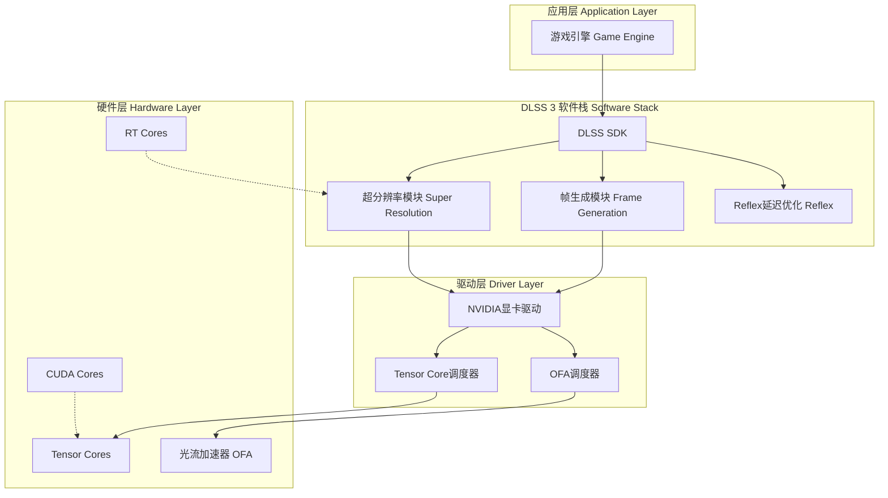
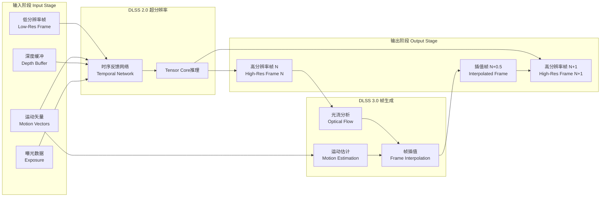
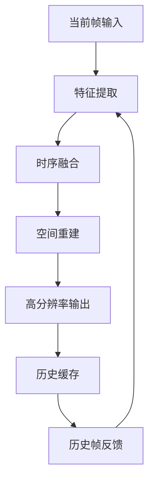
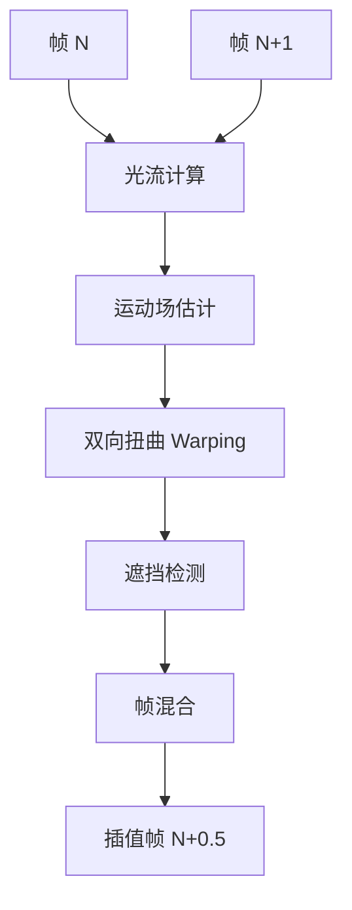
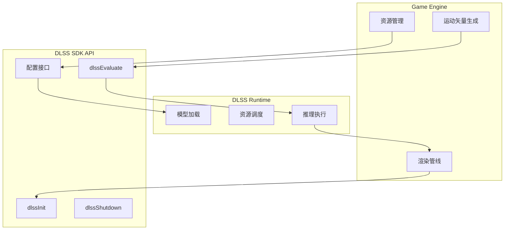
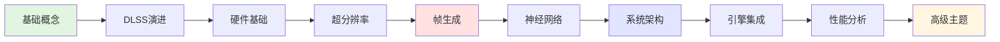

# NVIDIA DLSS 3 技术架构概览

## 🏗️ 核心架构层次图



## 🔄 DLSS 3 完整数据流程



## 📚 技术栈分层详解

### 1️⃣ 硬件层 Hardware Foundation

| 组件 | 功能 | 首次引入 |
|------|------|----------|
| **Tensor Cores** | AI推理加速，执行矩阵运算 | Turing架构（2018） |
| **RT Cores** | 光线追踪加速 | Turing架构（2018） |
| **Optical Flow Accelerator** | 光流计算硬件加速 | Ampere架构（2020） |
| **4th Gen Tensor Cores** | 2倍AI性能提升 | Ada Lovelace（2022） |
| **3rd Gen RT Cores** | 2倍光追性能 | Ada Lovelace（2022） |

**关键指标**：
- Tensor Core吞吐量：高达1400+ TOPS（RTX 4090）
- 光流处理：每秒300+帧（1080p）
- 内存带宽：1TB/s+

---

### 2️⃣ 算法层 Algorithm Layer

#### A. 超分辨率算法 Super Resolution



**核心技术**：
- **Temporal Anti-Aliasing**：时序抗锯齿
- **Jitter Sampling**：亚像素偏移采样
- **Motion Vector Guided**：运动矢量引导
- **Feedback Loop**：历史帧反馈循环

#### B. 帧生成算法 Frame Generation



**核心技术**：
- **Optical Flow**：密集光流场计算
- **Motion Compensated Interpolation**：运动补偿插值
- **Occlusion Handling**：遮挡区域处理
- **UI Separation**：UI元素分离渲染

---

### 3️⃣ 模型层 Model Layer

#### 神经网络架构特点

```
输入层 Input Layer (多通道)
    ↓
特征提取 Feature Extraction (多尺度卷积)
    ↓
时序融合 Temporal Fusion (递归连接)
    ↓
上采样 Upsampling (亚像素卷积)
    ↓
输出层 Output Layer (RGB输出)
```

**网络规模**：
- 参数量：约20-30M参数
- 输入通道：8-16通道（RGB、Motion、Depth等）
- 网络深度：30-50层卷积层
- 推理时间：1-2ms（4K分辨率）

**训练策略**：
- 数据集：数千游戏场景，数百万帧
- 损失函数：感知损失 + 时序一致性损失
- 优化器：Adam with learning rate scheduling
- 量化：FP32训练 → FP16/INT8推理

---

### 4️⃣ 集成层 Integration Layer

#### DLSS SDK架构



**集成步骤**：
1. 初始化DLSS上下文
2. 配置质量模式（Performance/Balanced/Quality）
3. 提供输入资源（Color、Motion Vectors、Depth等）
4. 调用评估函数
5. 获取高分辨率输出

---

## 🎯 DLSS 3关键创新点

### 与DLSS 2.0的区别

| 特性 | DLSS 2.0 | DLSS 3.0 |
|------|----------|----------|
| **核心功能** | 空间超分辨率 | 超分辨率 + 帧生成 |
| **输出帧数** | 1x | 最高2x |
| **硬件依赖** | Tensor Cores | Tensor Cores + OFA |
| **GPU支持** | RTX 20/30/40系列 | 仅RTX 40系列 |
| **性能提升** | 2-3x | 3-4x |
| **延迟** | 略有降低 | 需配合Reflex |

### 技术突破

1. **硬件加速光流**：
   - OFA专用硬件，不占用CUDA核心
   - 实时计算密集光流场
   - 功耗效率极高

2. **AI驱动帧生成**：
   - 超越传统帧插值
   - 理解场景运动语义
   - 处理复杂遮挡关系

3. **异步计算**：
   - 超分辨率与帧生成并行
   - 最小化延迟增加
   - 配合Reflex技术

---

## 🔬 深入研究方向

### 理论基础
1. **深度学习超分辨率**：
   - SRCNN、ESPCN等经典网络
   - 时序一致性约束
   - 感知损失与对抗训练

2. **光流估计**：
   - PWC-Net、FlowNet系列
   - 密集光流场计算
   - 实时优化算法

3. **视频帧插值**：
   - DAIN、RIFE等方法
   - 运动补偿技术
   - 遮挡检测算法

### 实现细节
1. **Tensor Core编程**：
   - CUDA Tensor Core API
   - WMMA指令集
   - 混合精度计算

2. **内存优化**：
   - 纹理压缩格式
   - 环形缓冲区设计
   - 异步数据传输

3. **管线集成**：
   - 延迟渲染适配
   - 运动矢量生成规范
   - 深度缓冲格式要求

### 工程实践
1. **性能调优**：
   - Profiling工具使用
   - 瓶颈识别与优化
   - 不同场景适配

2. **质量控制**：
   - 伪影检测方法
   - 画质评估指标
   - A/B测试流程

3. **兼容性处理**：
   - 不同引擎适配
   - 渲染特性支持检测
   - 降级方案设计

---

## 📊 性能指标基准

### 典型性能数据（RTX 4090）

| 游戏场景 | Native 4K | DLSS 3 Quality | DLSS 3 Performance | FPS提升 |
|----------|-----------|----------------|-------------------|---------|
| 光栅化游戏 | 60 FPS | 150 FPS | 200+ FPS | 2.5-3.5x |
| 光追游戏 | 30 FPS | 90 FPS | 120 FPS | 3-4x |
| 路径追踪 | 15 FPS | 50 FPS | 70 FPS | 3.5-4.5x |

### 画质损失分析

| 质量模式 | 渲染分辨率 | 输出分辨率 | PSNR | SSIM |
|----------|-----------|-----------|------|------|
| Ultra Performance | 720p | 4K | 38-40 dB | 0.92-0.94 |
| Performance | 1080p | 4K | 40-42 dB | 0.94-0.96 |
| Balanced | 1440p | 4K | 42-44 dB | 0.96-0.97 |
| Quality | 1660p | 4K | 44-46 dB | 0.97-0.98 |

---

## 🛠️ 开发者资源

### 官方资源
- [NVIDIA Developer Portal](https://developer.nvidia.com/dlss)
- DLSS SDK下载与文档
- Streamline SDK集成框架
- Sample Code与Best Practices

### 学习材料
- GDC技术演讲
- SIGGRAPH论文
- 开发者博客
- 视频教程

### 社区支持
- NVIDIA开发者论坛
- GitHub示例项目
- Discord技术讨论
- Stack Overflow

---

## 📖 推荐阅读顺序



**学习里程碑**：
- ✅ **里程碑1**：理解DLSS基本原理（第1-3层）
- ✅ **里程碑2**：掌握核心技术细节（第4-6层）
- ✅ **里程碑3**：能够集成与优化（第7-8层）
- ✅ **里程碑4**：深入研究与创新（第9-10层）

---

## 🎓 学习成果验证

完成学习后，您应该能够：

### 理论理解
- ✓ 解释DLSS 3的工作原理
- ✓ 对比不同超采样技术的优劣
- ✓ 分析硬件架构对性能的影响
- ✓ 理解神经网络在图形学的应用

### 实践能力
- ✓ 在游戏引擎中集成DLSS SDK
- ✓ 配置不同质量模式
- ✓ 诊断和解决集成问题
- ✓ 进行性能profiling和优化

### 研究能力
- ✓ 阅读相关学术论文
- ✓ 评估新技术的可行性
- ✓ 提出改进方案
- ✓ 探索前沿研究方向

---

## 下一步

准备好开始学习了吗？

**→ 前往 [DLSS3 架构学习计划主文档](./DLSS3_Architecture_Study.md)**

**→ 或直接开始 [第一层：基础概念](./docs/01_fundamentals.md)**

祝您学习愉快！🚀
