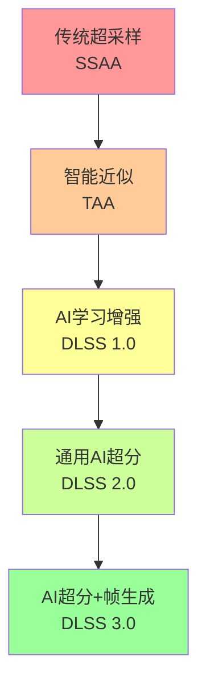
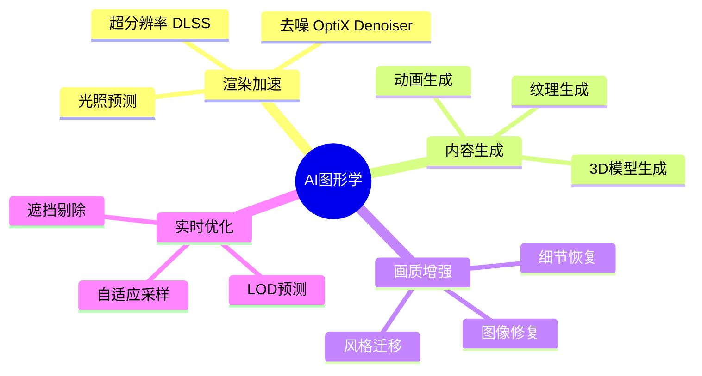
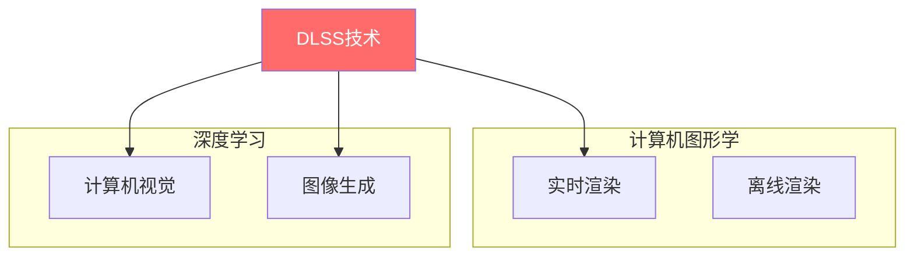

# 第一层：基础概念

## 📋 本层概述

本层将建立学习DLSS 3所需的基础知识体系，包括GPU渲染管线、分辨率与性能的关系、传统抗锯齿技术以及AI在图形学中的应用背景。

**学习目标**：
- 理解GPU渲染管线的基本流程
- 掌握分辨率对性能的影响机制
- 了解传统抗锯齿和超采样技术
- 理解为什么需要AI驱动的超采样技术

**预计学习时间**：1.5-2小时

---

## 1. GPU渲染管线基础

### 1.1 现代GPU渲染管线流程


### 1.2 关键渲染阶段

#### 顶点处理阶段
```
输入：顶点位置、法线、纹理坐标
处理：模型变换、视图变换、投影变换
输出：屏幕空间顶点坐标
```

**性能特点**：
- 计算量相对较小
- 并行度高，GPU擅长处理
- 通常不是性能瓶颈

#### 光栅化阶段
```
输入：三角形顶点
处理：确定哪些像素被三角形覆盖
输出：片元（潜在像素）
```

**关键概念**：
- **片元**：可能成为像素的候选点
- **覆盖率**：片元被图元覆盖的程度
- 生成的片元数量与分辨率成正比

#### 片元着色阶段
```
输入：片元位置、插值属性
处理：光照计算、纹理采样、材质评估
输出：最终颜色值
```

**性能特点**：
- ⚠️ **最主要的性能瓶颈**
- 计算复杂度高（特别是光线追踪）
- 片元数量 = 分辨率 × 场景复杂度
- **DLSS主要优化的环节**

---

## 2. 分辨率与性能的权衡

### 2.1 分辨率对性能的影响

#### 不同分辨率的像素数量对比

| 分辨率 | 像素数量 | 相对于1080p | 相对于4K |
|--------|----------|-------------|----------|
| **720p** (HD) | 921,600 | 0.44x | 0.11x |
| **1080p** (FHD) | 2,073,600 | 1.0x | 0.25x |
| **1440p** (2K) | 3,686,400 | 1.78x | 0.44x |
| **4K** (UHD) | 8,294,400 | 4.0x | 1.0x |
| **8K** | 33,177,600 | 16.0x | 4.0x |

#### 性能影响公式

```
GPU负载 ≈ 像素数量 × 每像素复杂度

例如：
- 1080p @ 60 FPS = 124M pixels/sec
- 4K @ 60 FPS = 497M pixels/sec (4倍负载)
```

### 2.2 实际游戏性能示例

以RTX 3080为例（原生渲染，无DLSS）：

| 游戏类型 | 1080p | 1440p | 4K |
|----------|-------|-------|-----|
| **轻量级游戏** | 144+ FPS | 100+ FPS | 60 FPS |
| **3A大作（光栅化）** | 100 FPS | 70 FPS | 40 FPS |
| **光线追踪游戏** | 60 FPS | 40 FPS | 20-25 FPS |
| **完全路径追踪** | 30 FPS | 20 FPS | 10 FPS |

**核心问题**：
> 如何在保持高分辨率画质的同时，达到流畅的帧率？

---

## 3. 传统抗锯齿与超采样技术

### 3.1 为什么需要抗锯齿？

#### 锯齿效应的产生

```
原理：
连续的几何图形 → 离散像素采样 → 锯齿（Aliasing）

例如：对角线边缘
理想：光滑连续的边缘
实际：像素级阶梯状边缘
```

**锯齿的视觉影响**：
- 物体边缘呈阶梯状
- 细小物体闪烁（时序锯齿）
- 纹理摩尔纹
- 破坏画面沉浸感

### 3.2 传统抗锯齿技术对比

#### A. SSAA (Super-Sampling Anti-Aliasing)

**原理**：
```
1. 以更高分辨率渲染场景（如2x2 = 4x SSAA）
2. 将多个像素平均为一个输出像素
```

**特点**：
- ✅ 画质最好，完全消除锯齿
- ❌ 性能开销巨大（4x SSAA = 4倍性能消耗）
- ❌ 不适合现代高分辨率游戏

**性能影响**：
```
4K + 4x SSAA = 渲染 8K 分辨率
像素数：8294万 → 3.3亿（4倍）
```

#### B. MSAA (Multi-Sampling Anti-Aliasing)

**原理**：
```
1. 仅对几何边缘进行多重采样
2. 片元着色器仍按实际分辨率执行
3. 混合边缘采样点
```

**特点**：
- ✅ 性能优于SSAA
- ✅ 有效处理几何边缘锯齿
- ❌ 不处理着色器内部的锯齿（如alpha test）
- ❌ 与延迟渲染兼容性差
- ❌ 现代引擎较少使用

**性能影响**：
```
4x MSAA ≈ 1.3-1.8倍性能消耗
```

#### C. FXAA (Fast Approximate Anti-Aliasing)

**原理**：
```
1. 后处理着色器
2. 检测边缘对比度
3. 模糊边缘
```

**特点**：
- ✅ 性能开销极小（< 1ms）
- ✅ 易于集成
- ❌ 画面整体略微模糊
- ❌ 可能丢失细节

#### D. TAA (Temporal Anti-Aliasing)

**原理**：
```
1. 每帧使用不同的亚像素偏移渲染（jitter）
2. 结合历史帧信息
3. 时间域累积多帧结果
```

**特点**：
- ✅ 画质好，接近超采样效果
- ✅ 性能开销适中（1-2ms）
- ✅ 现代游戏主流方案
- ❌ 快速运动时可能产生重影
- ❌ 需要运动矢量

**DLSS的基础**：
> TAA是DLSS 2.0的技术前身，DLSS本质上是"AI增强的时序超采样"

### 3.3 技术对比总结

| 技术 | 画质 | 性能开销 | 实现复杂度 | 现代应用 |
|------|------|----------|-----------|----------|
| **SSAA** | ⭐⭐⭐⭐⭐ | 非常高 | 简单 | 很少 |
| **MSAA** | ⭐⭐⭐⭐ | 高 | 中等 | 较少 |
| **FXAA** | ⭐⭐ | 很低 | 简单 | 常用（备选） |
| **TAA** | ⭐⭐⭐⭐ | 中等 | 复杂 | 主流 |
| **DLSS** | ⭐⭐⭐⭐⭐ | **负开销** | 集成简单 | RTX显卡主流 |

---

## 4. 超采样技术演进

### 4.1 从传统到AI超采样



### 4.2 技术演进路线

#### 阶段1：暴力超采样（2000s）
```
策略：渲染更多像素
问题：性能开销不可接受
代表：SSAA、MSAA
```

#### 阶段2：智能近似（2010s）
```
策略：后处理算法 + 时序信息
问题：画质有损，伪影明显
代表：FXAA、TAA、SMAA
```

#### 阶段3：AI驱动超采样（2018-今）
```
策略：深度学习重建高分辨率图像
优势：画质好 + 性能提升
代表：DLSS、FSR 2.0、XeSS
```

### 4.3 AI超采样的核心优势

#### 传统方法的局限
```
传统算法 = 预定义规则
- 无法理解图像语义
- 难以区分重要细节与噪声
- 无法学习和改进
```

#### AI方法的突破
```
神经网络 = 数据驱动学习
- 学习高质量图像的特征
- 理解边缘、纹理、运动模式
- 智能重建缺失细节
- 持续优化改进
```

**关键洞察**：
> DLSS不是简单的放大算法，而是理解游戏画面语义的智能重建系统

---

## 5. AI在计算机图形学的应用

### 5.1 深度学习在图形学的应用领域



### 5.2 为什么AI适合超分辨率任务？

#### 传统超分辨率的挑战

```
低分辨率图像 → ？？？ → 高分辨率图像

问题：
- 信息确实已经丢失
- 简单插值产生模糊
- 锐化产生伪影
- 缺乏语义理解
```

#### AI超分辨率的方法

```
训练阶段：
高分辨率图像 → 降采样 → 低分辨率图像
              ↓
        神经网络学习逆向过程
              ↓
        学会从低分辨率重建高分辨率

推理阶段：
游戏低分辨率帧 → 训练好的网络 → 高质量高分辨率输出
```

**核心能力**：
1. **特征学习**：理解边缘、纹理、结构
2. **先验知识**：从大量训练数据学习图像统计规律
3. **语义理解**：区分重要细节和噪声
4. **时序一致性**：利用历史帧信息保持稳定

### 5.3 DLSS的技术定位



**DLSS的独特性**：
- 结合实时渲染需求（低延迟）
- 利用深度学习能力（高质量）
- 硬件加速支持（Tensor Core）
- 游戏引擎深度集成

---

## 6. DLSS为什么可能？

### 6.1 三大支柱

#### 1. 硬件支持：Tensor Core
```
专用AI加速单元：
- 矩阵乘法加速（GEMM）
- 混合精度计算（FP16/INT8）
- 高吞吐量（数百TOPS）
- 低功耗（相比CUDA核心）
```

#### 2. 算法创新：时序超分辨率
```
不仅仅是单帧超分：
- 利用运动信息（Motion Vectors）
- 时序积累（Temporal Accumulation）
- 亚像素采样（Jittering）
- 智能融合历史帧
```

#### 3. 生态支持：游戏引擎集成
```
深度引擎整合：
- 标准化运动矢量输出
- 统一的深度缓冲格式
- SDK简化集成流程
- 主流引擎内置支持
```

### 6.2 性能提升的秘密

```
原生4K渲染：
分辨率：3840×2160 = 8.3M像素
性能：假设30 FPS

DLSS 4K Quality模式：
实际渲染：2560×1440 = 3.7M像素（44%）
AI超分：1440p → 4K
性能：可达60-90 FPS

性能提升 = 8.3M / 3.7M ≈ 2.2x
加上GPU其他负载优化 ≈ 2-3x总体提升
```

**关键洞察**：
> DLSS不是加速渲染过程，而是用更少的渲染获得同样的视觉效果

---

## 7. 关键概念总结

### 核心术语表

| 术语 | 英文 | 解释 |
|------|------|------|
| **渲染管线** | Rendering Pipeline | GPU渲染图像的完整流程 |
| **片元着色** | Fragment Shading | 计算像素颜色的阶段，性能瓶颈 |
| **分辨率** | Resolution | 图像的像素数量（宽×高） |
| **抗锯齿** | Anti-Aliasing | 消除图像锯齿的技术 |
| **超采样** | Super-Sampling | 以更高分辨率渲染再降采样 |
| **时序反馈** | Temporal Feedback | 利用历史帧信息改善当前帧 |
| **超分辨率** | Super-Resolution | 从低分辨率重建高分辨率 |
| **运动矢量** | Motion Vectors | 描述像素在帧间的运动 |
| **Jittering** | Jitter Offset | 亚像素偏移采样 |

### 理解检查清单

在继续下一层学习前，确保您能够：

- [ ] 绘制GPU渲染管线的基本流程
- [ ] 解释为什么分辨率对性能影响如此显著
- [ ] 说明至少3种抗锯齿技术的原理和优缺点
- [ ] 理解TAA为什么是DLSS的基础
- [ ] 解释AI超采样相比传统方法的优势
- [ ] 描述DLSS性能提升的基本原理

---

## 8. 实践思考题

1. **计算题**：如果一款游戏在1080p下运行60 FPS，在4K下大约会运行多少帧率？（假设片元着色是主要瓶颈）

2. **分析题**：为什么说"DLSS可以在性能不变的情况下提升分辨率"这种说法不够准确？正确的理解应该是什么？

3. **对比题**：制作一个表格对比SSAA、TAA和DLSS在画质、性能、实现复杂度方面的差异。

4. **思考题**：如果你设计一个AI超分辨率系统，你认为最大的技术挑战是什么？

---

## 9. 扩展阅读

### 推荐资源

1. **GPU架构基础**
   - 《Real-Time Rendering》第3章：GPU架构
   - NVIDIA CUDA编程指南

2. **抗锯齿技术**
   - 《GPU Gems》系列关于AA的章节
   - "Temporal Antialiasing in Uncharted 4" GDC演讲

3. **AI超分辨率**
   - SRCNN、ESPCN论文（图像超分辨率经典论文）
   - "Image Super-Resolution Using Deep Convolutional Networks"

### 相关技术博客

- NVIDIA技术博客：DLSS系列文章
- Digital Foundry：DLSS技术分析视频
- 各大游戏引擎官方文档中关于抗锯齿的章节

---

## 下一步

您已经掌握了学习DLSS 3所需的基础知识！

**→ 继续学习 [第二层：DLSS演进史](./02_dlss_evolution.md)**

在下一层中，我们将深入了解DLSS技术从1.0到3.5的发展历程，理解每个版本的关键改进和技术演进。

---

**学习进度**：[■□□□□□□□□□] 10% (1/10层完成)
