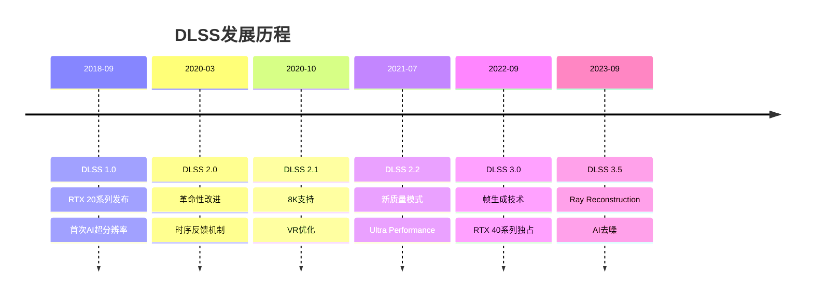
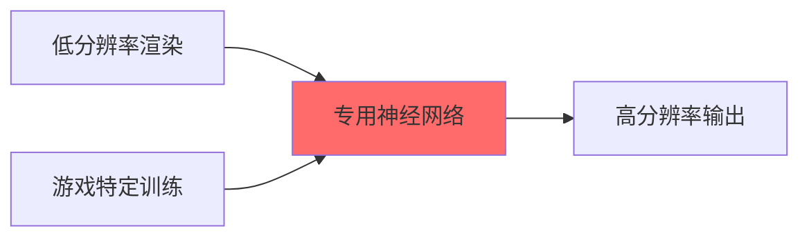
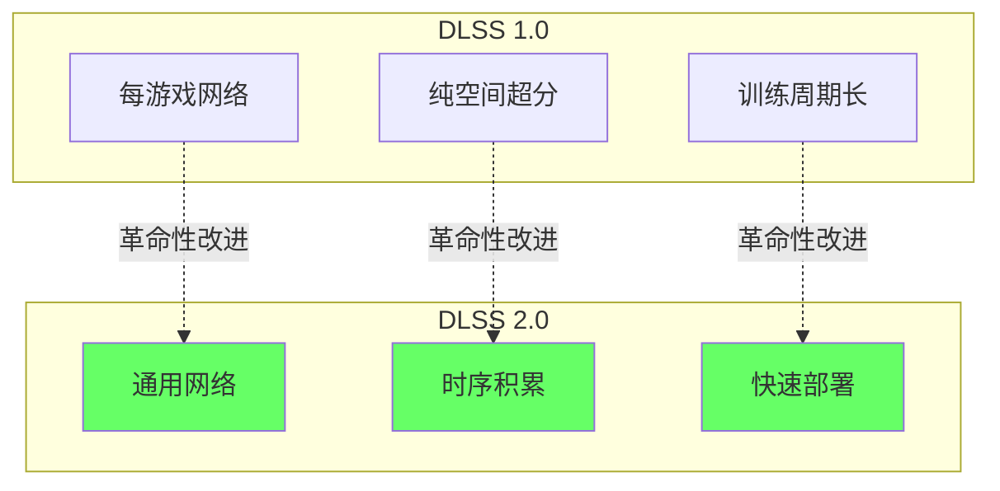
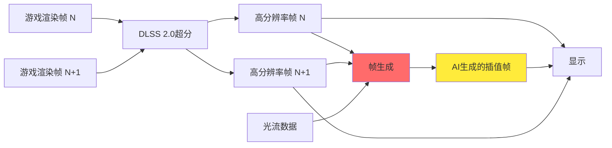
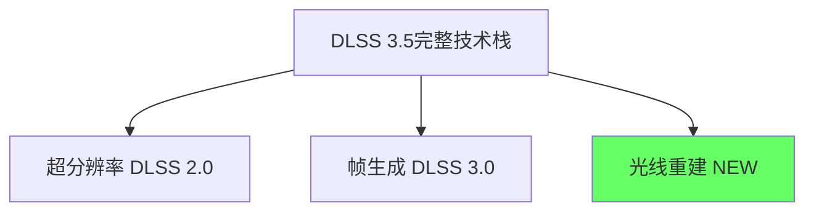
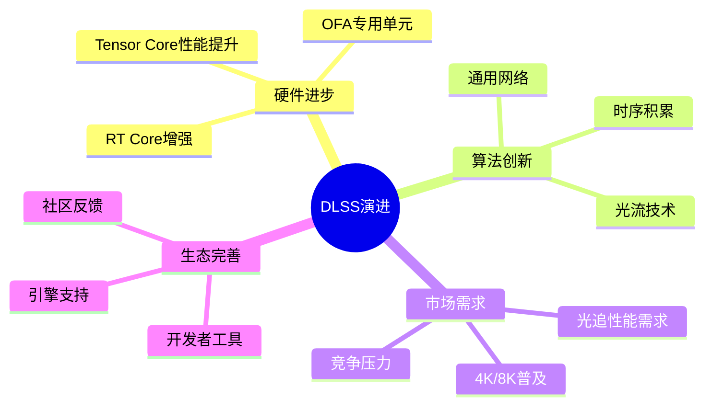

# 第二层：DLSS演进史

## 📋 本层概述

本层将深入了解DLSS技术从1.0到3.5的完整发展历程，分析每个版本的关键改进、技术突破和遇到的挑战。

**学习目标**：
- 了解DLSS各版本的发布时间和技术特点
- 理解每次迭代解决的核心问题
- 掌握DLSS技术演进的驱动力
- 认识DLSS与硬件架构的协同发展

**预计学习时间**：2-2.5小时

---

## 1. DLSS技术时间线



---

## 2. DLSS 1.0 时代（2018-2020）

### 2.1 背景与动机

#### 当时的技术环境
```
2018年游戏行业状况：
- 4K显示器开始普及
- 光线追踪刚刚起步（RTX 20系列首发）
- 传统TAA仍是主流抗锯齿方案
- GPU性能难以支撑4K + 光追
```

#### NVIDIA的愿景
> "通过AI让玩家以更低的性能成本享受高分辨率游戏"

### 2.2 DLSS 1.0技术特点

#### 架构设计



**核心特征**：
1. **每游戏训练**：为每款游戏训练独立的神经网络
2. **64x超分网络**：极大的网络规模
3. **NVIDIA服务器训练**：需要超级计算机集群
4. **纯空间超分**：不利用时序信息

#### 训练流程

```
NVIDIA数据中心：
1. 以16K分辨率运行游戏（超级采样参考）
2. 降采样生成训练数据对
   - 输入：1080p, 1440p, 4K低分辨率版本
   - 目标：16K高质量参考图像
3. 训练数周生成网络权重
4. 通过驱动更新分发到玩家GPU
```

### 2.3 DLSS 1.0的问题

#### ❌ 主要缺陷

| 问题 | 影响 | 原因 |
|------|------|------|
| **画质不稳定** | 部分游戏效果差 | 每游戏训练质量不一 |
| **模糊问题** | 细节丢失 | 网络过度平滑 |
| **延迟高** | 游戏周期长 | 需等待NVIDIA训练 |
| **游戏支持少** | 仅20+游戏 | 训练成本高 |
| **伪影明显** | 运动时闪烁 | 缺乏时序一致性 |

#### 实际表现示例

```
《战地5》DLSS 1.0：
- 性能提升：✅ 40% FPS增加
- 画质表现：❌ 比原生TAA模糊
- 玩家评价：❌ "不如不用"

《古墓丽影：暗影》：
- 性能提升：✅ 30-40% FPS
- 画质表现：△ 可用但不完美
- 特殊问题：❌ 头发细节丢失严重
```

### 2.4 社区反馈

**玩家和媒体的主要批评**：
- "DLSS让画面变模糊"
- "不如传统TAA清晰"
- "性能提升不值得画质损失"
- "每个游戏表现差异大"

**NVIDIA的反思**：
> "我们意识到每游戏训练的方法不可扩展，需要一个通用的解决方案。"

---

## 3. DLSS 2.0革命（2020年3月）

### 3.1 重大突破

#### 核心改变



### 3.2 技术创新点

#### 1. 通用神经网络

**原理变化**：
```
DLSS 1.0：学习特定游戏的图像风格
        → 每个游戏一个网络
        → 泛化能力差

DLSS 2.0：学习通用图像超分辨率原理
        → 单一网络适用所有游戏
        → 只需提供标准输入即可
```

**训练策略**：
```
训练数据：
- 数千款游戏场景
- 各种类型：FPS、RPG、竞速、策略
- 不同画面风格：写实、卡通、科幻
- 总计：数百万帧高质量图像对

结果：
✅ 一个网络适用所有游戏
✅ 无需等待NVIDIA训练
✅ 新游戏开箱即用
```

#### 2. 时序反馈机制

**架构对比**：

```
DLSS 1.0（纯空间）：
当前帧 → 网络 → 输出

DLSS 2.0（时序增强）：
当前帧 ──┐
运动矢量 ├→ 网络 → 当前输出
历史输出 ─┘          │
    ↑________________│
    反馈循环
```

**关键输入数据**：

| 输入 | 作用 | 重要性 |
|------|------|--------|
| **低分辨率颜色** | 当前帧基础信息 | ⭐⭐⭐⭐⭐ |
| **运动矢量** | 追踪像素运动 | ⭐⭐⭐⭐⭐ |
| **深度缓冲** | 场景几何信息 | ⭐⭐⭐⭐ |
| **历史帧** | 时序信息累积 | ⭐⭐⭐⭐⭐ |

#### 3. Jitter偏移采样

**原理**：
```
传统渲染：
每帧在相同像素位置采样
→ 信息重复
→ 无法重建亚像素细节

DLSS 2.0 Jitter：
每帧在不同亚像素位置采样
Frame 1: (0.25, 0.25)
Frame 2: (0.75, 0.25)
Frame 3: (0.25, 0.75)
Frame 4: (0.75, 0.75)
→ 4帧覆盖2x2子像素
→ 有效采样率提升4倍
```

**视觉效果**：
```
传统TAA：        DLSS 2.0:
信息 → ████      信息 → ████████
       ████             ████████
                        更多细节
```

### 3.3 DLSS 2.0性能表现

#### 画质对比

```
测试环境：《控制》（Control）
分辨率：4K输出

画质评分（主观+PSNR）：
Native 4K (TAA):    基准 100分
DLSS 1.0:          85分 ❌
DLSS 2.0 Quality:  105分 ✅ （超越原生！）
DLSS 2.0 Balanced: 102分 ✅
DLSS 2.0 Perf:     95分 ✅
```

#### 性能提升

| 模式 | 渲染分辨率 | 性能提升 | 画质保持 |
|------|-----------|----------|----------|
| **Quality** | 66.7% (2560×1440) | ~1.7x | 100%+ |
| **Balanced** | 57.7% (2259×1270) | ~2.0x | 98% |
| **Performance** | 50% (1920×1080) | ~2.3x | 92% |

### 3.4 行业反响

**媒体评价**：
- Digital Foundry: "DLSS 2.0是游戏界的游戏规则改变者"
- IGN: "从失败到辉煌的惊人逆转"
- GamersNexus: "终于达到了承诺的效果"

**玩家接受度**：
- 从"不推荐"到"必开"
- 成为RTX显卡的杀手级功能
- 大幅推动RTX显卡销量

---

## 4. DLSS 2.x迭代优化（2020-2022）

### 4.1 DLSS 2.1（2020年10月）

**新增功能**：
```
✅ 8K分辨率支持 (7680×4320)
✅ VR优化版本
✅ 动态分辨率缩放支持
```

**8K挑战**：
```
8K = 33.2M像素（1080p的16倍）

DLSS 8K Performance模式：
实际渲染：4K (8.3M像素)
超分倍率：2x (8.3M → 33.2M)
性能提升：约4x相比原生8K
```

### 4.2 DLSS 2.2（2021年7月）

**Ultra Performance模式**：
```
极限性能场景：
渲染分辨率：33.3% (1280×720 → 4K)
超分倍率：9x
性能提升：~3x
适用场景：极度GPU受限场景（如完全路径追踪）
```

**改进点**：
- 更好的鬼影（Ghosting）抑制
- 细小物体稳定性提升
- 粒子效果重建改进

### 4.3 DLSS 2.3-2.5（2021-2022）

**持续改进**：

| 版本 | 主要改进 | 发布时间 |
|------|----------|----------|
| **2.3** | 透明物体处理、UI清晰度 | 2021.11 |
| **2.4** | 锐化算法改进、运动模糊兼容 | 2022.03 |
| **2.5** | 预训练模型更新、画质微调 | 2022.06 |

---

## 5. DLSS 3.0 帧生成时代（2022年9月）

### 5.1 技术突破

#### 核心创新：AI帧生成



**关键概念**：
```
DLSS 2.0：空间超分辨率
         低分辨率 → 高分辨率（同一时刻）

DLSS 3.0：空间超分 + 时间超分
         帧N + 帧N+1 → 生成中间帧N+0.5
         
结果：帧率翻倍！
```

### 5.2 硬件依赖：Optical Flow Accelerator

**为什么只支持RTX 40系列？**

```
RTX 40 (Ada Lovelace)独有硬件：
┌─────────────────────────────────┐
│  第4代Tensor Core (AI超分)       │
│  第3代RT Core (光追)             │
│  Optical Flow Accelerator (OFA)  │ ← 新增！
└─────────────────────────────────┘

OFA性能：
- 专用硬件单元
- 每秒处理300+帧光流（1080p）
- 不占用CUDA核心
- 功耗效率极高
```

**光流的作用**：
```
光流（Optical Flow）= 像素运动场

作用：
1. 分析帧N和帧N+1之间的运动
2. 预测中间时刻的像素位置
3. 处理遮挡和显露区域
4. 保持时序一致性
```

### 5.3 性能表现

#### 典型性能数据（RTX 4090）

```
游戏：《赛博朋克2077》
设置：4K + 最高画质 + 路径追踪

Native (无DLSS):        22 FPS
DLSS 2.0 Quality:       58 FPS (2.6x)
DLSS 3.0 (超分+帧生成): 110 FPS (5x) ✨

性能提升分解：
- 超分辨率贡献：2.6x
- 帧生成贡献：1.9x (58 → 110)
- 总计：5.0x
```

#### 与DLSS 2.0对比

| 特性 | DLSS 2.0 | DLSS 3.0 |
|------|----------|----------|
| **超分辨率** | ✅ | ✅ |
| **帧生成** | ❌ | ✅ |
| **输出帧率** | 1x | ~2x |
| **GPU支持** | RTX 20/30/40 | RTX 40专属 |
| **延迟** | 略降低 | 需配合Reflex |

### 5.4 延迟问题与Reflex

**帧生成的延迟挑战**：
```
问题：
生成的中间帧是"预测"的
→ 比实际渲染帧滞后
→ 增加输入延迟

解决：NVIDIA Reflex
- 减少渲染队列
- 优化CPU-GPU同步
- 降低系统延迟
- 抵消帧生成的延迟增加
```

**实测数据**：
```
《CS:GO》竞技游戏测试：
Native 60 FPS:           50ms延迟
DLSS 3.0 120 FPS (无Reflex): 55ms ❌
DLSS 3.0 120 FPS (有Reflex): 45ms ✅
```

---

## 6. DLSS 3.5 AI增强（2023年9月）

### 6.1 Ray Reconstruction技术

**新的AI应用场景**：
```
传统光追去噪：
光追采样 → 手工去噪算法 → 最终图像
           (固定规则)

DLSS 3.5 Ray Reconstruction：
光追采样 → AI神经网络 → 最终图像
           (学习最优策略)
```

**优势**：
```
✅ 保留更多光照细节
✅ 减少反射伪影
✅ 提升间接光照质量
✅ 更真实的GI效果
```

### 6.2 与DLSS 3.0的关系



**独立性**：
- Ray Reconstruction可单独启用
- 不需要帧生成功能
- RTX 20/30系列也支持（仅此功能）

### 6.3 实际应用

**支持游戏**：
- 《赛博朋克2077》
- 《控制》
- 《光明记忆：无限》
- 《传送门RTX》

**画质提升**：
```
测试：《赛博朋克2077》夜景反射

传统去噪：反射中有明显噪点和闪烁
Ray Reconstruction：反射清晰稳定，细节丰富

PSNR提升：+2-3 dB
主观评分：显著提升
```

---

## 7. DLSS技术演进总结

### 7.1 代际对比表

| 特性 | DLSS 1.0 | DLSS 2.0 | DLSS 3.0 | DLSS 3.5 |
|------|----------|----------|----------|----------|
| **发布时间** | 2018.09 | 2020.03 | 2022.09 | 2023.09 |
| **核心技术** | 空间超分 | 时序超分 | 超分+帧生成 | +光线重建 |
| **网络类型** | 每游戏 | 通用 | 通用 | 通用 |
| **GPU支持** | RTX 20 | RTX 20/30/40 | RTX 40 | RTX 20/30/40* |
| **性能提升** | 1.4x | 2-3x | 3-5x | 2-3x** |
| **画质表现** | ❌ 差 | ✅ 优秀 | ✅ 优秀 | ✅ 极好 |
| **游戏支持** | <30 | 300+ | 100+ | 50+ |
| **部署周期** | 数周 | 即时 | 即时 | 即时 |

*注：帧生成仅RTX 40，Ray Reconstruction全RTX支持  
**注：仅考虑超分+Ray Reconstruction，不含帧生成

### 7.2 技术演进驱动力



### 7.3 成功关键因素

**1. 持续迭代改进**
```
DLSS 1.0失败 → 快速推出2.0革命版本
            → 持续优化2.x系列
            → 大胆创新3.0帧生成
            → 扩展应用3.5光线重建
```

**2. 硬件软件协同**
```
软件算法需求 ←→ 硬件架构设计
- 2020: Ampere增加OFA v1
- 2022: Ada Lovelace增强OFA v2
- 每代GPU都为DLSS优化
```

**3. 开放生态建设**
```
✅ 免费SDK
✅ 详细文档
✅ 主流引擎内置
✅ 快速响应开发者反馈
✅ 持续驱动更新
```

---

## 8. 与竞品的对比

### 8.1 时间线对比

```
NVIDIA DLSS:
2018 ─ DLSS 1.0 ─ 2020 ─ DLSS 2.0 ─ 2022 ─ DLSS 3.0 ─ 2023 ─ DLSS 3.5

AMD FSR:
                    2021 ─ FSR 1.0 ─ 2022 ─ FSR 2.0 ─ 2023 ─ FSR 3.0

Intel XeSS:
                                   2022 ─ XeSS 1.0
```

### 8.2 技术对比

| 特性 | DLSS 3.0 | AMD FSR 3.0 | Intel XeSS |
|------|----------|-------------|------------|
| **AI加速** | Tensor Core | 不需要 | XMX (可选) |
| **超分方法** | AI时序 | 手工时序 | AI时序 |
| **帧生成** | ✅ OFA硬件 | ✅ 软件实现 | ❌ |
| **GPU兼容性** | RTX专属 | 全平台 | Arc优先，全兼容 |
| **画质** | ⭐⭐⭐⭐⭐ | ⭐⭐⭐⭐ | ⭐⭐⭐⭐ |
| **性能** | ⭐⭐⭐⭐⭐ | ⭐⭐⭐⭐ | ⭐⭐⭐⭐ |

---

## 9. 学习检查点

在继续下一层学习前，确保您能够：

- [ ] 绘制DLSS技术发展时间线
- [ ] 解释DLSS 1.0为什么失败以及2.0如何改进
- [ ] 说明时序反馈机制的工作原理
- [ ] 理解DLSS 3.0帧生成的核心概念
- [ ] 区分DLSS 3.0和3.5的差异
- [ ] 对比DLSS与竞品的技术差异

---

## 10. 思考题

1. **分析题**：为什么说DLSS 2.0是"从失败到辉煌"的转折点？列举至少5个关键改进。

2. **技术题**：DLSS 3.0的帧生成为什么必须依赖专用硬件（OFA）？纯软件实现有什么限制？

3. **对比题**：DLSS 3.5的Ray Reconstruction和传统去噪算法有什么本质区别？

4. **预测题**：根据DLSS的演进趋势，你认为DLSS 4.0可能会引入什么新技术？

---

## 11. 扩展阅读

### 推荐资源

1. **官方技术文章**
   - "DLSS 2.0 - A Big Leap In AI Rendering" (NVIDIA Blog)
   - "DLSS 3: AI-Powered Performance Multiplication" (NVIDIA GDC 2022)

2. **深度分析**
   - Digital Foundry DLSS技术解析视频系列
   - "How DLSS 2.0 Works" (Alex Battaglia分析)

3. **学术背景**
   - "Image Super-Resolution Using Deep Convolutional Networks" (SRCNN论文)
   - "Video Frame Interpolation via Adaptive Separable Convolution"

---

## 下一步

您已经了解了DLSS的完整发展历程！

**→ 继续学习 [第三层：硬件基础](./03_hardware_foundation.md)**

在下一层中，我们将深入了解支撑DLSS技术的硬件基础，包括RTX架构、Tensor Core和Optical Flow Accelerator的详细工作原理。

---

**学习进度**：[■■□□□□□□□□] 20% (2/10层完成)
