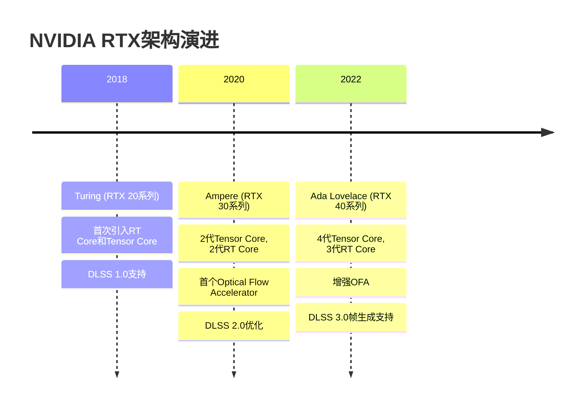
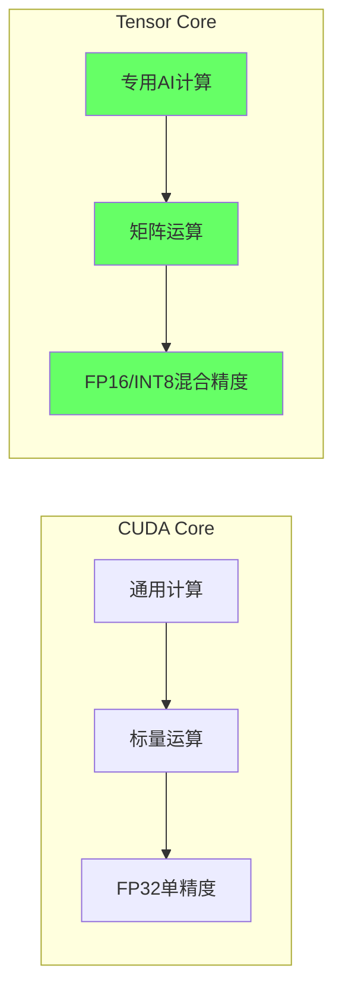
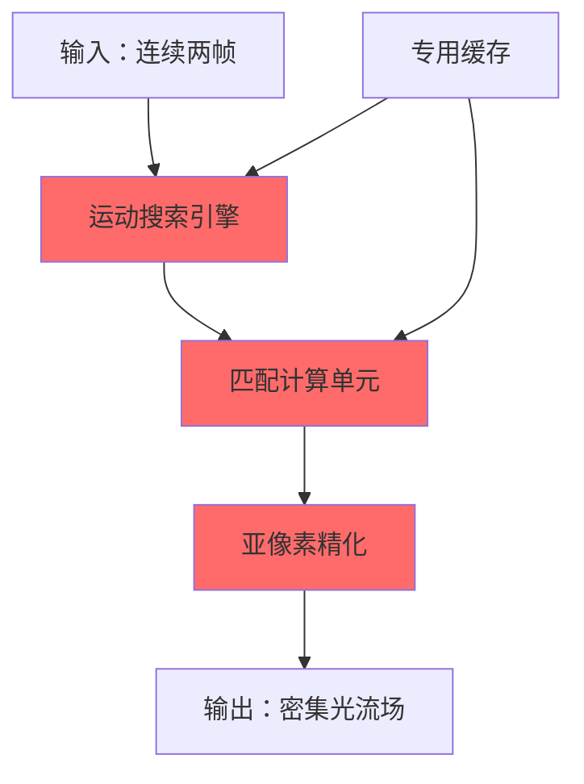
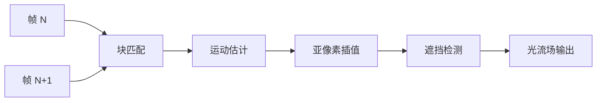
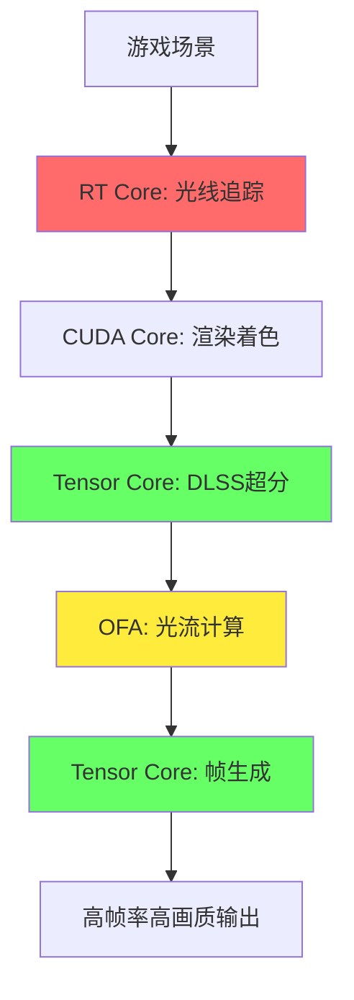

# 第三层：硬件基础

## 📋 本层概述

本层将深入了解支撑DLSS技术的硬件基础，包括NVIDIA RTX架构演进、Tensor Core工作原理、Optical Flow Accelerator详解以及硬件与软件的协同设计。

**学习目标**：
- 理解RTX架构的核心组件
- 掌握Tensor Core的工作原理和性能特点
- 了解Optical Flow Accelerator的硬件设计
- 认识硬件加速对DLSS的重要性

**预计学习时间**：2.5-3小时

---

## 1. RTX架构演进

### 1.1 架构发展时间线



### 1.2 架构对比

| 特性 | Turing (2018) | Ampere (2020) | Ada Lovelace (2022) |
|------|---------------|---------------|---------------------|
| **工艺** | 12nm | 8nm (Samsung) | 4nm (TSMC) |
| **CUDA Cores** | 基准 | 2x密度 | 1.4x (相对Ampere) |
| **Tensor Core** | 1st Gen | 2nd Gen | 4th Gen |
| **RT Core** | 1st Gen | 2nd Gen | 3rd Gen |
| **OFA** | ❌ | V1 | V2 (增强) |
| **DLSS支持** | 1.0, 2.0 | 2.0-2.x | 2.x, 3.0, 3.5 |

---

## 2. Tensor Core详解

### 2.1 什么是Tensor Core？

#### 核心概念

```
Tensor Core = 专用矩阵乘法加速单元

设计目的：
- 加速深度学习推理
- 高效执行矩阵运算（GEMM）
- 混合精度计算支持
```

#### 与CUDA Core的区别



| 特性 | CUDA Core | Tensor Core |
|------|-----------|-------------|
| **计算类型** | 标量/矢量 | 矩阵乘加 |
| **精度** | FP32主 | FP16/BF16/INT8 |
| **吞吐量** | 基准 | 8-16x |
| **功耗效率** | 基准 | 3-4x |
| **适用场景** | 通用计算 | AI推理 |

### 2.2 Tensor Core运算原理

#### 基本运算：D = A × B + C

```
输入矩阵：
A: 4×4矩阵 (FP16)
B: 4×4矩阵 (FP16)
C: 4×4累加器 (FP32)

运算：
D = A × B + C

输出：
D: 4×4结果矩阵 (FP32)

单指令完成！
```

**可视化**：

```
  A (4×4)    B (4×4)    C (4×4)      D (4×4)
┌────────┐ ┌────────┐ ┌────────┐   ┌────────┐
│ FP16   │×│ FP16   │+│ FP32   │ = │ FP32   │
│        │ │        │ │        │   │        │
└────────┘ └────────┘ └────────┘   └────────┘
```

#### CUDA核心 vs Tensor Core性能对比

```
计算任务：4×4矩阵乘法

CUDA Core (FP32):
- 16次乘法 + 12次加法 = 28指令周期
- 吞吐量：~30 TFLOPS (RTX 4090)

Tensor Core (FP16):
- 1次矩阵乘加指令 = 1指令周期
- 吞吐量：~1300+ TOPS (RTX 4090)

性能提升：40+倍！
```

### 2.3 Tensor Core代际演进

#### 1st Gen Tensor Core (Turing, 2018)

```
规格：
- 矩阵大小：4×4×4
- 支持精度：FP16输入, FP32累加
- 吞吐量：~110 TFLOPS (RTX 2080 Ti)

限制：
- 仅支持FP16
- 需要显式编程
- 优化复杂
```

#### 2nd Gen Tensor Core (Ampere, 2020)

```
改进：
✅ 新增BF16支持（更好的数值范围）
✅ 2倍吞吐量
✅ INT8精度支持
✅ 结构化稀疏加速（2:4 sparsity）

性能：
- FP16: ~280 TFLOPS (RTX 3090)
- INT8: ~560 TOPS
```

**结构化稀疏**：
```
2:4稀疏模式：每4个元素中至少2个为零

例如：
原始：[1.2, 0.3, 0.8, 0.5]
稀疏：[1.2, 0.0, 0.8, 0.0]

性能提升：2倍
精度损失：<1% (训练时考虑稀疏性)
```

#### 4th Gen Tensor Core (Ada Lovelace, 2022)

```
突破性改进：
✅ FP8精度支持（Transformer优化）
✅ 2倍密度（更多Tensor Core）
✅ 改进的L2缓存
✅ 针对DLSS 3.0优化

性能巅峰：
- FP16: ~1300 TFLOPS (RTX 4090)
- INT8: ~2600 TOPS
- FP8: ~5000+ TOPS
```

**为什么这么快？**
```
1. 更多单元：128个Tensor Core (RTX 4090)
2. 更高频率：2.5 GHz+ boost
3. 更好缓存：72MB L2 cache
4. 优化数据路径
```

### 2.4 Tensor Core编程模型

#### CUDA层次

```
层次结构：
┌─────────────────────────────────┐
│  cuBLAS / cuDNN (高级库)         │
├─────────────────────────────────┤
│  WMMA API (Warp-level)          │
├─────────────────────────────────┤
│  PTX Assembly                   │
├─────────────────────────────────┤
│  Tensor Core Hardware           │
└─────────────────────────────────┘
```

#### WMMA示例（简化）

```cuda
// Warp Matrix Multiply-Accumulate
#include <mma.h>
using namespace nvcuda;

// 声明矩阵片段
wmma::fragment<matrix_a, 16, 16, 16, half> a_frag;
wmma::fragment<matrix_b, 16, 16, 16, half> b_frag;
wmma::fragment<accumulator, 16, 16, 16, float> c_frag;

// 加载数据
wmma::load_matrix_sync(a_frag, a, 16);
wmma::load_matrix_sync(b_frag, b, 16);
wmma::fill_fragment(c_frag, 0.0f);

// 矩阵乘加
wmma::mma_sync(c_frag, a_frag, b_frag, c_frag);

// 存储结果
wmma::store_matrix_sync(c, c_frag, 16);
```

---

## 3. Optical Flow Accelerator (OFA)

### 3.1 OFA的诞生背景

#### 为什么需要专用光流硬件？

```
光流计算挑战：
1. 计算密集：每像素需与邻域匹配
2. 内存密集：大量纹理读取
3. 实时要求：60+ FPS游戏
4. 占用CUDA核心：影响其他渲染任务

解决方案：专用硬件OFA
```

### 3.2 OFA架构

#### 硬件设计



#### OFA V1 (Ampere, 2020)

```
规格：
- 处理能力：150帧/秒 @ 1080p
- 精度：1/16像素亚像素精度
- 搜索范围：±16像素
- 功耗：~1W
```

**性能对比**：
```
纯CUDA实现光流：
- 占用：20-30% GPU计算资源
- 延迟：5-8ms @ 1080p
- 功耗：~20W

OFA硬件：
- 占用：0% GPU计算资源（独立单元）
- 延迟：<1ms @ 1080p
- 功耗：~1W

效率提升：20x以上！
```

#### OFA V2 (Ada Lovelace, 2022)

```
增强特性：
✅ 2倍处理能力：300帧/秒 @ 1080p
✅ 4K支持优化：75帧/秒 @ 4K
✅ 更大搜索范围：±32像素
✅ 改进的遮挡检测
✅ 多尺度光流
```

### 3.3 光流计算原理

#### 基本概念

```
光流（Optical Flow）= 视觉运动场

目标：为图像中每个像素找到它在下一帧的位置

数学表示：
I(x, y, t) = I(x+dx, y+dy, t+1)

其中：
- (x, y): 当前像素位置
- (dx, dy): 运动矢量（光流）
- t: 时间
```

#### 计算流程



**步骤详解**：

1. **块匹配 (Block Matching)**
```
对帧N中的每个8×8块：
- 在帧N+1的搜索窗口中查找最佳匹配
- 使用SAD (Sum of Absolute Differences) 度量
- 找到运动最相似的块
```

2. **运动估计**
```
计算块中心的位移：
dx = x_new - x_old
dy = y_new - y_old

运动矢量：(dx, dy)
```

3. **亚像素精化**
```
整像素匹配 → 亚像素插值
精度：1/16像素

提高帧插值质量
```

4. **遮挡检测**
```
检测三种情况：
- Occlusion: 像素被遮挡（消失）
- Disocclusion: 像素显露（出现）
- 正常运动

对遮挡区域特殊处理
```

### 3.4 OFA在DLSS 3.0中的应用

#### 帧生成流程

```
游戏渲染帧 N ─────┐
                  ├──→ OFA计算光流 ──→ 帧生成网络 ──→ 插值帧
游戏渲染帧 N+1 ───┘                    ↑
                                      │
                              Tensor Core加速
```

#### 为什么OFA对DLSS 3至关重要？

```
实时约束：
- 目标帧率：120+ FPS
- 每帧时间预算：<8ms
- 光流计算：必须<1ms

OFA优势：
✅ 不占用CUDA核心（渲染不受影响）
✅ 极低延迟（<1ms）
✅ 低功耗（整体效率更高）
✅ 高质量（硬件优化算法）
```

**没有OFA的后果**：
```
软件光流（如AMD FSR 3.0）：
- 占用GPU计算资源（影响渲染）
- 延迟较高（2-3ms）
- 画质可能不如硬件实现
- 但优势是全平台兼容
```

---

## 4. RT Core（光线追踪核心）

### 4.1 RT Core简介

```
RT Core = 光线追踪加速单元

功能：
- BVH (边界体积层次) 遍历
- 射线-三角形相交测试
- 加速光线追踪渲染
```

### 4.2 与DLSS的关系

#### 为什么光追需要DLSS？

```
光线追踪性能成本：

传统光栅化：         RT光线追踪：
1个场景 = 1次渲染    1个场景 = 数百万条光线

性能对比：
4K光栅化：60 FPS
4K光追：   15-20 FPS  ← 需要DLSS救场！
4K光追+DLSS：50-60 FPS ✅
```

#### DLSS与光追的完美结合

```
技术栈：
┌─────────────────────────────┐
│  DLSS 3.0 (性能提升)         │
├─────────────────────────────┤
│  RT Core (光追加速)          │
├─────────────────────────────┤
│  游戏渲染引擎                │
└─────────────────────────────┘

结果：
实时路径追踪成为可能！
```

**实际应用**：
```
《赛博朋克2077》路径追踪模式：

无DLSS：
- 4K: 10-15 FPS ❌ 不可玩

DLSS 2.0 Quality:
- 4K: 30-40 FPS △ 勉强可玩

DLSS 3.0:
- 4K: 80-100 FPS ✅ 流畅！
```

---

## 5. 硬件协同设计

### 5.1 三大核心的分工



### 5.2 数据流与同步

#### RTX 4090完整流水线

```
时间线（单帧8.3ms @ 120 FPS）：

0ms      : 游戏逻辑 CPU
0.5ms    : CUDA Core开始渲染（1080p）
1.0ms    : RT Core光线追踪
2.0ms    : CUDA Core着色
3.0ms    : Tensor Core DLSS超分（1080p→4K）
4.0ms    : OFA计算光流（与下一帧并行）
5.0ms    : Tensor Core帧生成
6.0ms    : 显示输出
6.5ms    : 下一帧开始

并行执行，最大化吞吐量！
```

### 5.3 内存层次优化

#### RTX 4090内存架构

```
层次结构：
┌──────────────────────────────┐
│  L1 Cache: 128KB/SM          │ ← 最快
├──────────────────────────────┤
│  L2 Cache: 72MB (共享)       │ ← DLSS常驻
├──────────────────────────────┤
│  GDDR6X VRAM: 24GB           │
│  带宽: 1TB/s                 │ ← 纹理数据
└──────────────────────────────┘
```

**DLSS数据流优化**：
```
DLSS网络权重：
- 大小：~20-30MB
- 位置：L2 Cache常驻
- 访问：极快（<1ns延迟）

输入纹理：
- 大小：1080p = 8MB
- 位置：VRAM
- 带宽：1TB/s保证

结果：
DLSS推理极少受内存带宽限制
```

---

## 6. 功耗与效率

### 6.1 功耗分配

#### RTX 4090功耗分解（450W TDP）

```
满载游戏场景：

CUDA Cores:      ~300W  (67%)
RT Cores:        ~60W   (13%)
Tensor Cores:    ~40W   (9%)
OFA:             ~1W    (0.2%)
Memory:          ~30W   (7%)
其他:            ~19W   (4%)
─────────────────────────────
总计:            ~450W
```

#### DLSS的功耗效率

```
对比场景：4K游戏

原生4K渲染：
- GPU利用率：95%
- 功耗：420W
- 帧率：40 FPS

DLSS 3.0 (1080p→4K + 帧生成)：
- GPU利用率：60% (降低)
- 功耗：280W (降低33%)
- 帧率：120 FPS (提升3x)

能效比提升：9倍！
(FPS/W: 0.095 → 0.43)
```

### 6.2 为什么专用硬件如此高效？

```
通用计算 (CUDA Core):
- 灵活但低效
- 每次运算：多条指令
- 功耗：高

专用计算 (Tensor Core/OFA):
- 单一用途优化
- 每次运算：单条指令
- 硬件流水线优化
- 功耗：低
- 性能：高

Dark Silicon效应：
- 不用时几乎不耗电
- 用时全速运行
```

---

## 7. 硬件代际性能对比

### 7.1 DLSS性能演进

| GPU | 架构 | DLSS版本 | 4K质量模式性能 | 能效比 |
|-----|------|----------|---------------|--------|
| **RTX 2080 Ti** | Turing | 2.0 | 基准 1.0x | 1.0x |
| **RTX 3090** | Ampere | 2.0 | 1.5x | 1.6x |
| **RTX 4090** | Ada Lovelace | 3.0 | 3.5x | 4.2x |

**提升来源分解**：
```
RTX 4090 vs 2080 Ti (3.5x提升)：

硬件性能：     +80% (更多核心、更高频率)
Tensor Core：  +120% (4代 vs 1代)
DLSS 3.0帧生成：+95% (OFA加持)
─────────────────────────────────
总计：         ~3.5x性能提升
```

### 7.2 未来展望

```
可能的硬件演进方向：

下一代（Blackwell?）：
✅ 5代Tensor Core (FP4支持？)
✅ 增强OFA（多帧预测）
✅ 神经缓存（Neural Cache）
✅ 更高集成度

技术趋势：
- 更多AI专用硬件
- 更低精度（INT4/2-bit）
- 片上神经网络
- 实时训练能力？
```

---

## 8. 关键概念总结

### 核心术语

| 术语 | 含义 | 重要性 |
|------|------|--------|
| **Tensor Core** | AI矩阵运算加速单元 | ⭐⭐⭐⭐⭐ |
| **RT Core** | 光线追踪加速单元 | ⭐⭐⭐⭐ |
| **OFA** | 光流计算专用硬件 | ⭐⭐⭐⭐⭐ (DLSS 3) |
| **WMMA** | Warp级矩阵乘加API | ⭐⭐⭐ |
| **FP16/INT8** | 低精度格式 | ⭐⭐⭐⭐ |
| **结构化稀疏** | 2:4稀疏模式 | ⭐⭐⭐ |

### 硬件设计哲学

```
NVIDIA RTX架构核心思想：

专用硬件 + 通用计算
├─ 专用硬件：极致效率（Tensor/RT/OFA）
└─ 通用计算：灵活性（CUDA）

结果：
- 各负其责
- 并行执行
- 功耗优化
- 性能最大化
```

---

## 9. 学习检查点

确保您能够：

- [ ] 解释Tensor Core与CUDA Core的区别
- [ ] 描述Tensor Core的基本运算（D = A×B+C）
- [ ] 说明OFA的作用和重要性
- [ ] 理解为什么DLSS 3.0只支持RTX 40系列
- [ ] 分析RTX架构中各组件的协同工作
- [ ] 评估专用硬件相比软件实现的优势

---

## 10. 实验与思考

### 实验建议

1. **性能测试**（如有RTX显卡）：
   - 使用MSI Afterburner监控GPU使用率
   - 对比DLSS开关时各项指标变化
   - 观察Tensor Core利用率

2. **代码探索**：
   - 查看CUDA Tensor Core编程示例
   - 理解WMMA API使用方法
   - 尝试简单的矩阵乘法加速

### 思考题

1. **设计题**：如果要设计一个比Tensor Core更高效的AI加速器，你会考虑哪些改进？

2. **分析题**：为什么AMD FSR 3.0选择软件实现帧生成而不是专用硬件？各有什么优劣？

3. **预测题**：未来GPU可能会集成哪些新的专用硬件单元？

---

## 下一步

您已经掌握了DLSS的硬件基础！

**→ 继续学习 [第四层：DLSS 2超分辨率技术](./04_super_resolution.md)**

在下一层中，我们将深入探讨DLSS 2.0的超分辨率算法，包括网络架构、时序反馈机制和运动矢量处理。

---

**学习进度**：[■■■□□□□□□□] 30% (3/10层完成)
