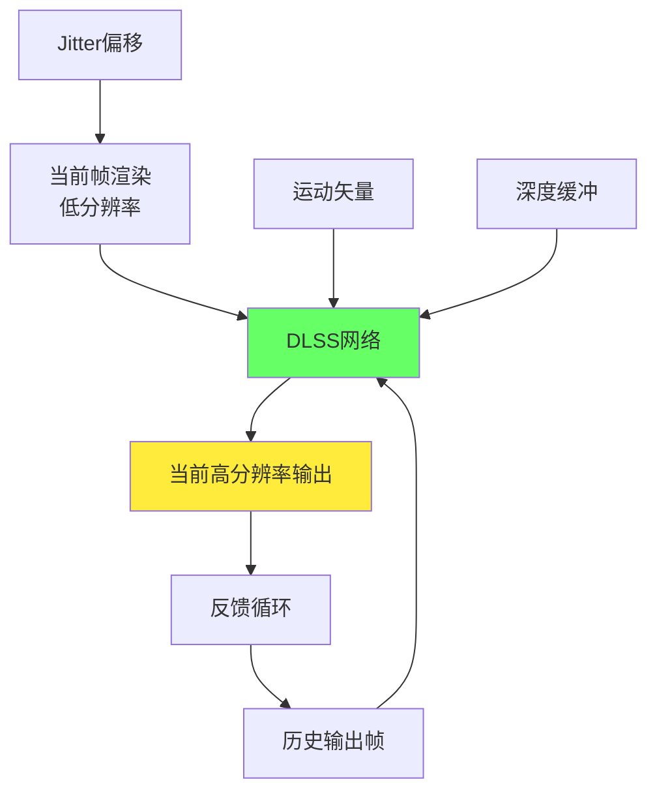
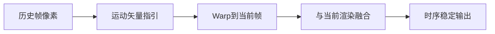
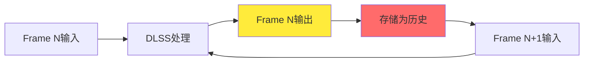
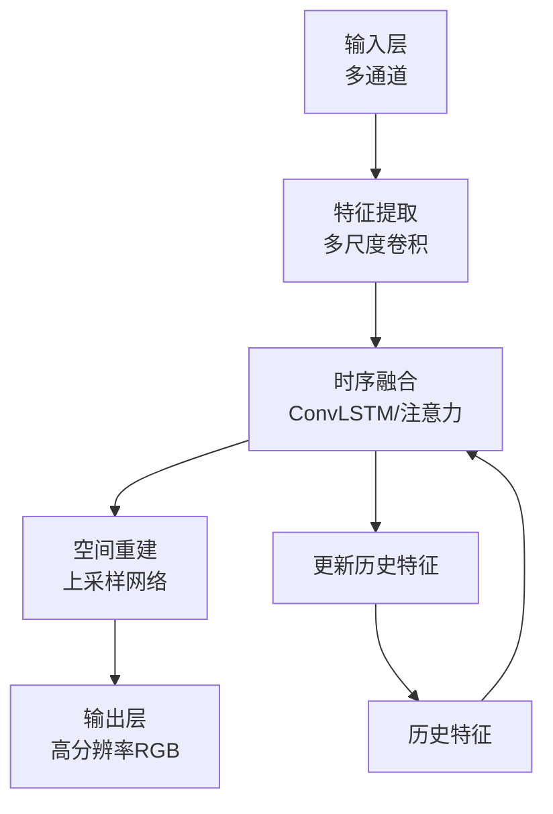
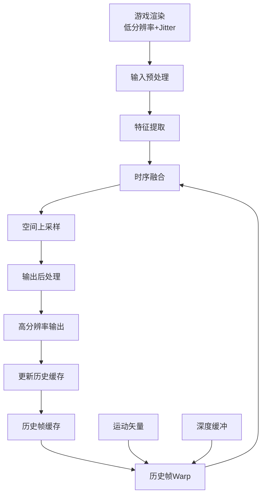

# 第四层：DLSS 2 超分辨率技术

## 📋 本层概述

本层将深入剖析DLSS 2.0的核心技术 - 超分辨率算法，包括神经网络架构、时序反馈机制、运动矢量处理、Jitter采样策略以及完整的输入输出流程。

**学习目标**：
- 理解DLSS超分辨率的完整算法流程
- 掌握时序反馈（Temporal Feedback）的工作原理  
- 了解运动矢量在超分辨率中的关键作用
- 分析不同质量模式的技术差异

**预计学习时间**：3-3.5小时

---

## 1. DLSS 2.0超分辨率概述

### 1.1 核心思想

```
传统超分辨率：
低分辨率图像 → 放大算法 → 高分辨率图像
                ↓
            信息不足，只能猜测

DLSS时序超分辨率：
低分辨率序列 + 运动信息 + 历史累积 → AI重建 → 高质量输出
              ↓
        利用多帧信息，智能推理
```

### 1.2 技术架构图



---

## 2. 输入数据详解

### 2.1 输入通道总览

| 输入类型 | 分辨率 | 格式 | 作用 |
|---------|--------|------|------|
| **低分辨率颜色** | 渲染分辨率 | RGB(A) FP16 | 基础图像信息 |
| **运动矢量** | 渲染分辨率 | RG FP16 | 像素运动追踪 |
| **深度缓冲** | 渲染分辨率 | R FP32/FP16 | 几何信息 |
| **曝光值** | 1×1 | R FP32 | 亮度校正 |
| **历史帧** | 输出分辨率 | RGB FP16 | 时序累积 |

### 2.2 低分辨率颜色输入

#### 渲染分辨率

```
质量模式对应的渲染分辨率（目标4K）：

Ultra Performance: 1280×720  (33.3%)
Performance:       1920×1080 (50.0%)
Balanced:          2259×1270 (57.7%)
Quality:           2560×1440 (66.7%)
Ultra Quality:     2880×1620 (77.4%)
```

#### Jitter偏移采样

**原理**：
```
每帧在不同亚像素位置渲染：

Frame 1: (0.125, 0.125)
Frame 2: (0.875, 0.125)
Frame 3: (0.125, 0.875)
Frame 4: (0.875, 0.875)
Frame 5: (0.500, 0.500)
...循环

效果：多帧覆盖更多亚像素位置，提供更丰富的采样信息
```

**可视化**：
```
像素网格：
┌───┬───┐    Frame 1-4的采样点：
│ × │   │    ×: Frame 1 (左上)
├───┼───┤    ○: Frame 2 (右上)  
│   │ ○ │    △: Frame 3 (左下)
└───┴───┘    □: Frame 4 (右下)

多帧组合后，相当于更高分辨率的采样
```

**实现**：
```cpp
// 伪代码：Jitter模式生成
float2 jitter = HaltonSequence(frameCount % 8);
// Halton序列：低差异序列，覆盖更均匀

// 应用到投影矩阵
projectionMatrix[2][0] += jitter.x / renderWidth;
projectionMatrix[2][1] += jitter.y / renderHeight;
```

### 2.3 运动矢量（Motion Vectors）

#### 什么是运动矢量？

```
定义：描述像素从上一帧到当前帧的2D位移

数学表示：
MV(x,y) = (dx, dy)

含义：
当前帧位置(x,y)的像素来自上一帧的(x-dx, y-dy)
```

#### 运动矢量的生成

**方法1：渲染引擎生成（推荐）**
```
每个顶点存储：
- 当前帧位置 P_current
- 前一帧位置 P_previous

在像素着色器中：
MV = (P_current.xy - P_previous.xy) / screenResolution
```

**方法2：深度差分估计**
```
利用深度和相机运动推导：
MV ≈ f(depth, camera_motion)

精度较低，不推荐
```

#### 运动矢量的作用



**关键应用**：
1. **历史帧对齐**：将前一帧的输出warp到当前帧坐标系
2. **时序一致性**：保持相邻帧的稳定性
3. **细节累积**：多帧信息叠加

### 2.4 深度缓冲

#### 用途

```
深度信息提供：
1. 几何线索：边缘检测
2. 遮挡关系：判断像素是否被遮挡
3. 运动验证：辅助运动矢量有效性检查
4. 自适应处理：近景高精度，远景可容忍
```

#### 深度重投影

```
算法：
1. 读取当前像素深度 d_current
2. 根据运动矢量找到历史像素
3. 读取历史深度 d_history (反投影)
4. 比较深度差异

if (|d_current - d_history| < threshold):
    历史帧有效，可复用
else:
    遮挡变化，放弃历史信息
```

### 2.5 历史帧反馈

#### 反馈循环机制



#### 递归累积

```
数学模型：
Output_N = NN(Input_N, History_N-1)
History_N = Output_N
Output_N+1 = NN(Input_N+1, History_N)
...

效果：
- 每帧都包含之前所有帧的信息
- 类似无限冲激响应（IIR）滤波器
- 时序稳定性大幅提升
```

#### 历史帧失效处理

```
失效情况：
1. 场景切换（场景不连续）
2. 剧烈运动（运动矢量不可靠）
3. 遮挡变化（深度不匹配）
4. 曝光突变（亮度大幅变化）

处理策略：
if (history_invalid):
    降低历史帧权重
    依赖当前帧重建
    逐步重建历史缓存
```

---

## 3. DLSS神经网络架构

### 3.1 网络结构概览



### 3.2 详细网络层次

#### 阶段1：特征提取

```
输入：
- Color: 3通道 (RGB)
- Motion Vectors: 2通道
- Depth: 1通道
- History: 3通道
总计：9通道

网络：
Conv1: 9 → 64通道, 3×3卷积
Conv2: 64 → 128通道, 3×3卷积, stride=2
Conv3: 128 → 256通道, 3×3卷积, stride=2

输出：
多尺度特征金字塔
```

#### 阶段2：时序融合

```
模块：
ConvLSTM或Transformer注意力机制

伪代码：
hidden_state = LSTM(current_features, prev_hidden_state)
attention_weights = Attention(current_features, history_features)
fused_features = Mix(current_features, history_features, attention_weights)
```

**时序融合策略**：
```
自适应权重：
- 运动小：历史权重高（稳定）
- 运动大：当前帧权重高（避免鬼影）
- 遮挡区域：降低历史权重
```

#### 阶段3：空间上采样

```
亚像素卷积（Sub-pixel Convolution）：

输入：256通道 × 低分辨率
↓
Conv: 256 → 256×r²通道 (r=放大倍率)
↓
Pixel Shuffle: 重排为高分辨率
↓
输出：256通道 × 高分辨率

优势：
- 学习上采样权重
- 比双线性插值更智能
- 保留细节
```

#### 阶段4：输出细化

```
残差连接 + 细化卷积：

upsampled = PixelShuffle(low_res_features)
jittered_input_upsampled = BilinearUpscale(jittered_input)

residual = Conv(upsampled)
output = jittered_input_upsampled + residual

输出：RGB, FP16格式
```

### 3.3 网络参数规模

```
估算：
- 总参数量：~20-30M
- 网络深度：30-50层
- 推理时间：1-2ms @ 4K (RTX 4090)
- 显存占用：~50MB (权重) + ~100MB (激活)

对比：
- GPT-3: 175B参数（大6000倍）
- DLSS优化目标：实时性 > 精度极限
```

---

## 4. 质量模式详解

### 4.1 质量模式对比

#### 参数对照表（目标4K输出）

| 模式 | 渲染分辨率 | 渲染像素占比 | 性能提升 | 画质评分 |
|------|-----------|-------------|----------|---------|
| **Native** | 3840×2160 | 100% | 1.0x | 100 |
| **DLAA** | 3840×2160 | 100% | 0.9x | 105 |
| **Ultra Quality** | 2880×1620 | 77% | 1.3x | 103 |
| **Quality** | 2560×1440 | 67% | 1.7x | 100 |
| **Balanced** | 2259×1270 | 58% | 2.0x | 95 |
| **Performance** | 1920×1080 | 50% | 2.3x | 90 |
| **Ultra Perf** | 1280×720 | 33% | 3.0x | 80 |

### 4.2 DLAA（Deep Learning Anti-Aliasing）

```
特殊模式：
- 输入输出分辨率相同（4K→4K）
- 不做超分，仅做AA和细节增强
- 画质优于Native+TAA
- 性能略有开销（~10%）

适用场景：
- GPU性能充足
- 追求极致画质
- 替代TAA
```

### 4.3 Quality vs Performance

#### Quality模式（推荐）

```
渲染：2560×1440 (1440p)
目标：3840×2160 (4K)
倍率：1.5x

优势：
✅ 画质接近甚至超越Native
✅ 性能提升显著（~70%）
✅ 时序稳定性好
✅ 细节保留充分

适合：
- 平衡画质和性能
- 大多数游戏推荐设置
```

#### Performance模式

```
渲染：1920×1080 (1080p)
目标：3840×2160 (4K)
倍率：2.0x

特点：
✅ 性能提升更大（~2.3x）
△ 画质略有损失（但仍优于Native 1440p）
△ 细小物体稳定性降低
△ 快速运动时可能有轻微伪影

适合：
- GPU性能受限
- 高帧率竞技游戏
- 光线追踪重度场景
```

### 4.4 Ultra Performance（极限模式）

```
渲染：1280×720 (720p)
目标：3840×2160 (4K)
倍率：3.0x

挑战：
- 输入信息严重不足
- 需要网络"猜测"大量细节
- 易产生伪影

应用：
- 8K输出（渲染4K→输出8K）
- 完全路径追踪
- GPU极度受限场景

NVIDIA建议：
仅在必要时使用，优先考虑其他模式
```

---

## 5. 算法流程详解

### 5.1 完整处理流程



### 5.2 关键步骤详解

#### 步骤1：输入预处理

```
操作：
1. 颜色空间转换（如需要）
2. 归一化（0-1范围）
3. Jitter对齐校正
4. 打包成张量
```

#### 步骤2：历史帧Warp

```python
# 伪代码
def warp_history_frame(history, motion_vectors, depth):
    warped = torch.zeros_like(history)
    
    for y in range(height):
        for x in range(width):
            # 读取运动矢量
            mv = motion_vectors[y, x]
            
            # 计算源位置
            src_x = x - mv.x
            src_y = y - mv.y
            
            # 深度验证
            if depth_matches(depth[y,x], history_depth[src_y, src_x]):
                # 双线性采样历史帧
                warped[y, x] = bilinear_sample(history, src_x, src_y)
            else:
                # 遮挡，标记无效
                warped[y, x] = INVALID
    
    return warped, validity_mask
```

#### 步骤3：自适应融合

```
融合权重计算：

w_current = confidence(current_features)
w_history = confidence(history_features) × validity

fused = (w_current × current + w_history × history) / (w_current + w_history)

置信度因素：
- 运动矢量可靠性
- 深度连续性
- 亮度变化
- 纹理复杂度
```

### 5.3 特殊情况处理

#### 鬼影抑制（Ghosting Reduction）

```
问题：
快速运动或遮挡变化时，历史帧信息过时
→ 历史像素残留 → 鬼影

解决：
1. 检测运动幅度
   if (|motion_vector| > threshold):
       reduce_history_weight()

2. 检测遮挡变化
   if (depth_discontinuity):
       discard_history()

3. 时序一致性检查
   if (color_difference > threshold):
       reset_accumulation()
```

#### 锐化与细节恢复

```
问题：
超分辨率可能产生轻微模糊

解决：
1. 自适应锐化
   sharpness = detect_edge_strength()
   sharpened = unsharp_mask(output, sharpness)

2. 细节纹理恢复
   detail_layer = high_pass_filter(low_res_input)
   output = base_output + detail_layer × alpha

3. 对比度自适应增强（CAS）
```

---

## 6. 性能优化技术

### 6.1 Tensor Core加速

```
优化策略：
1. FP16混合精度
   - 权重：FP16
   - 激活：FP16
   - 累加：FP32（防止精度损失）

2. 矩阵形状优化
   - 对齐到16的倍数
   - 利用Tensor Core 16×16矩阵乘法

3. 内存访问模式
   - 合并访问
   - 最小化Bank冲突
```

### 6.2 计算图优化

```
技术：
1. 算子融合
   Conv + BatchNorm + ReLU → 单一kernel

2. 内存复用
   In-place操作减少显存占用

3. 异步计算
   CPU准备下一帧输入 || GPU推理当前帧
```

### 6.3 实测性能数据

```
RTX 4090 DLSS 2.0推理时间：

分辨率            | Quality | Performance
-------------------|---------|------------
1080p → 4K         | 1.2ms   | 0.9ms
1440p → 4K         | 1.5ms   | 1.1ms
720p → 4K (Ultra)  | 1.0ms   | 0.8ms

对比：
传统TAA @ 4K: 1.5-2.5ms
DLSS优势：更快且画质更好！
```

---

## 7. 画质评估

### 7.1 客观指标

#### PSNR（峰值信噪比）

```
计算：
PSNR = 10 × log10(MAX² / MSE)

典型值（相对原生4K）：
DLSS Quality:      40-45 dB
DLSS Performance:  38-42 dB
TAA 4K:           基准
DLSS通常优于TAA
```

#### SSIM（结构相似性）

```
评估：结构、亮度、对比度

典型值：
DLSS Quality:      0.96-0.98
DLSS Performance:  0.94-0.96
1.0 = 完美匹配
```

### 7.2 主观画质

```
A/B测试结果（盲测）：

场景：静态场景
DLSS Quality vs Native 4K:
- 无法区分：60%
- DLSS更好：25%
- Native更好：15%

场景：动态场景
DLSS Quality vs Native 4K:
- DLSS更稳定：70%（时序稳定性优势）
- Native更锐利：20%
- 无明显差异：10%
```

### 7.3 已知局限

```
DLSS可能表现不佳的情况：

1. 粒子效果
   - 细小粒子可能不稳定
   - Performance模式尤其明显

2. 透明物体
   - Alpha混合边缘可能有伪影
   - 改进中

3. UI元素
   - 小字体可能模糊
   - 建议原生分辨率渲染UI

4. 极度动态场景
   - 爆炸、快速镜头切换
   - 历史帧失效，短暂画质下降
```

---

## 8. 学习检查点

确保您能够：

- [ ] 解释DLSS超分辨率的完整输入输出
- [ ] 描述时序反馈循环的工作原理
- [ ] 说明运动矢量在DLSS中的关键作用
- [ ] 理解Jitter采样的目的和效果
- [ ] 对比不同质量模式的技术差异
- [ ] 分析DLSS相比传统方法的优势

---

## 9. 实践建议

### 游戏开发者

```
集成DLSS 2.0最佳实践：

1. 高质量运动矢量
   ✅ 使用前一帧位置顶点属性
   ✅ 考虑骨骼动画、顶点动画
   ✅ 动态物体单独处理

2. 准确的深度缓冲
   ✅ 避免反向Z时的精度问题
   ✅ 天空盒设置为无限远

3. Jitter正确应用
   ✅ 在投影矩阵中应用
   ✅ TAA和DLSS共享Jitter

4. UI处理
   ✅ UI在后处理阶段渲染
   ✅ 或使用原生分辨率
```

---

## 下一步

您已经深入理解了DLSS 2.0的超分辨率技术！

**→ 继续学习 [第五层：DLSS 3帧生成技术](./05_frame_generation.md)**

在下一层中，我们将探索DLSS 3.0的革命性创新 - AI驱动的帧生成技术，包括光流分析和运动补偿插值算法。

---

**学习进度**：[■■■■□□□□□□] 40% (4/10层完成)
