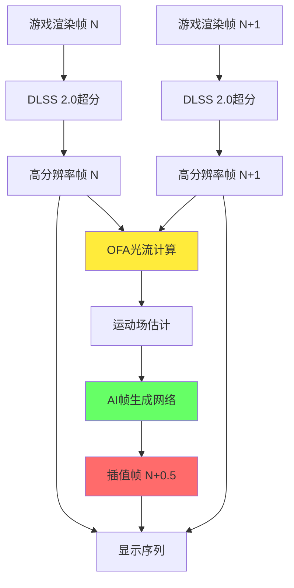
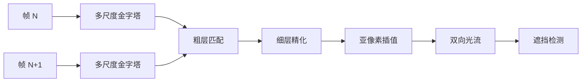
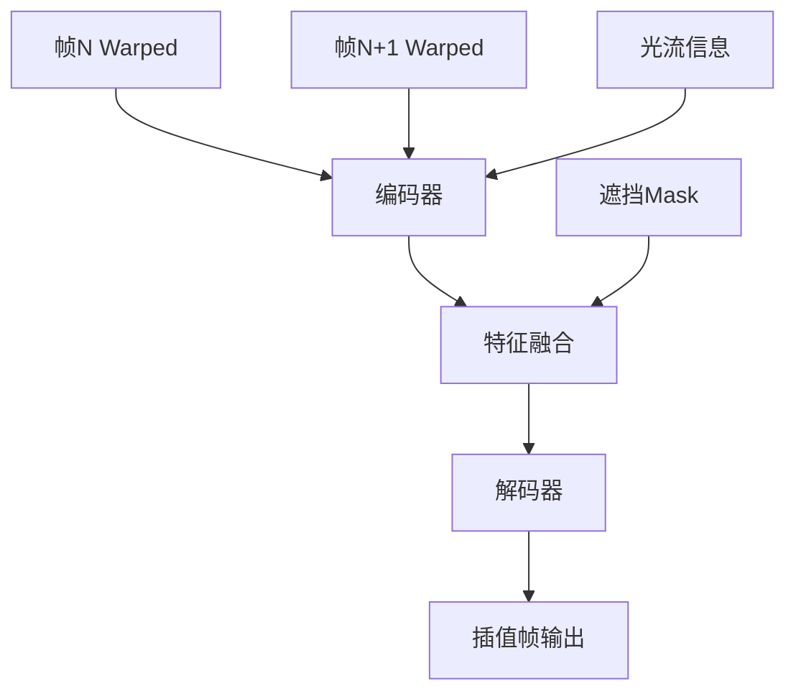

# 第五层：DLSS 3 帧生成技术

## 📋 本层概述

本层深入探讨DLSS 3.0的革命性技术 - AI驱动的帧生成（Frame Generation），包括光流分析、运动估计、帧插值算法以及与Reflex的协同工作。

**学习目标**：
- 理解帧生成的基本原理和工作流程
- 掌握光流（Optical Flow）计算方法
- 了解运动补偿插值技术
- 分析帧生成的挑战与解决方案

**预计学习时间**：3-3.5小时

---

## 1. 帧生成核心概念

### 1.1 什么是帧生成？

```
传统渲染：
游戏引擎渲染每一帧
60 FPS = 每秒60个真实渲染帧

DLSS 3.0帧生成：
游戏引擎渲染 + AI生成插值帧
30个渲染帧 + 30个AI生成帧 = 60 FPS显示

性能提升：2倍帧率！
```

### 1.2 技术架构



---

## 2. 光流（Optical Flow）详解

### 2.1 光流基础

#### 定义
```
光流 = 图像序列中像素的运动模式

物理含义：
场景中物体的实际运动在图像平面上的投影

数学表示：
对于图像I(x,y,t)，光流向量(u,v)满足：
I(x,y,t) ≈ I(x+u, y+v, t+Δt)
```

#### 光流 vs 运动矢量

| 特性 | 运动矢量 (MV) | 光流 (Optical Flow) |
|------|--------------|-------------------|
| **来源** | 渲染引擎几何信息 | 图像分析计算 |
| **精度** | 准确（基于3D） | 近似（基于2D） |
| **覆盖** | 渲染物体 | 全图像（包括特效、后处理） |
| **用途** | DLSS 2.0超分 | DLSS 3.0帧生成 |

### 2.2 光流计算方法

#### 传统方法：Lucas-Kanade

```
假设：
1. 亮度恒定：I(x,y,t) = I(x+u,y+v,t+1)
2. 局部运动一致：小区域内运动相同
3. 小位移：泰勒展开近似

求解：
∂I/∂x · u + ∂I/∂y · v + ∂I/∂t = 0

最小二乘法求解(u, v)
```

#### NVIDIA OFA方法



**OFA硬件加速**：
```
流程：
1. 构建图像金字塔（4-6层）
2. 从粗到细匹配
   - 粗层：大运动，搜索范围±32像素
   - 细层：精化，搜索范围±4像素
3. 亚像素插值（1/16像素精度）
4. 计算前向和后向光流
5. 交叉验证检测遮挡

性能：
- 1080p: <0.3ms
- 4K: <0.8ms
- 几乎零CPU/GPU消耗
```

### 2.3 双向光流

```
前向光流（Forward Flow）：
帧N → 帧N+1的运动
表示：每个像素在帧N+1中的位置

后向光流（Backward Flow）：
帧N+1 → 帧N的运动  
表示：每个像素来自帧N的位置

用途：
- 前向光流：从帧N预测插值帧
- 后向光流：从帧N+1预测插值帧
- 双向结合：更准确的插值
```

---

## 3. 帧插值算法

### 3.1 运动补偿插值

#### 基本原理

```
目标：生成时刻t=0.5的中间帧

Step 1: Warping（扭曲）
frame_from_N = warp(frame_N, forward_flow × 0.5)
frame_from_N1 = warp(frame_N1, backward_flow × 0.5)

Step 2: Blending（混合）
interpolated = α × frame_from_N + (1-α) × frame_from_N1

Step 3: Inpainting（修复）
使用AI网络填补遮挡区域
```

#### 可视化

```
时间轴：
t=0(帧N)  →  t=0.5(插值帧)  →  t=1.0(帧N+1)

空间运动：
对象A从位置X移动到位置Y

插值计算：
位置@t=0.5 = X + (Y-X) × 0.5
```

### 3.2 遮挡处理

#### 遮挡类型

```
1. 前向遮挡（Occlusion）：
   帧N中可见，插值帧中被遮挡
   例：物体移到前景物体后面

2. 后向遮挡（Disocclusion）：
   帧N中被遮挡，插值帧中显露
   例：移动相机，背景显露

3. 运动边界：
   不同运动物体的边界区域
```

#### 检测方法

```python
# 伪代码：遮挡检测
def detect_occlusion(forward_flow, backward_flow):
    # 前向-后向一致性检查
    for each pixel (x,y):
        # 前向流动到的位置
        (x', y') = (x, y) + forward_flow(x, y)
        
        # 从该位置后向流动
        (x'', y'') = (x', y') + backward_flow(x', y')
        
        # 检查是否回到原点
        error = distance((x, y), (x'', y''))
        
        if error > threshold:
            mark_as_occluded(x, y)
```

#### AI修复策略

```
遮挡区域处理：
1. 检测遮挡：光流一致性检查
2. 降低Warping权重
3. AI神经网络"幻觉"填补
   - 学习场景语义
   - 根据上下文推理合理内容
4. 边缘羽化混合
```

### 3.3 AI帧生成网络

#### 网络架构



**输入**：
- Warped帧N（8通道：RGB + 光流 + 置信度）
- Warped帧N+1（8通道）
- 遮挡掩码（1通道）
- 光流场（4通道：前向+后向）

**输出**：
- 插值帧（3通道RGB）

**网络规模**：
```
参数量：~15-20M
深度：25-35层卷积
推理时间：0.8-1.2ms @ 4K
```

---

## 4. UI元素处理

### 4.1 挑战

```
问题：
UI元素（HUD、菜单、准星等）通常固定在屏幕空间
- 不随场景运动
- 无深度信息
- 运动矢量为零

如果对UI也做帧插值：
→ 插值帧中UI位置错误
→ UI重影、闪烁
```

### 4.2 解决方案

#### 方法1：UI检测与分离

```
流程：
1. 游戏引擎提供UI Mask
2. 帧生成仅处理3D场景
3. UI在后期叠加（原生频率或复制）

结果：
✅ UI清晰稳定
△ 需要引擎支持
```

#### 方法2：运动分析

```
算法：
1. 分析光流幅度
   if (optical_flow_magnitude < threshold):
       likely_UI = True

2. 检测深度
   if (depth == far_plane):
       likely_UI = True

3. 对检测的UI区域：
   - 不做插值
   - 直接复制前一帧
```

#### 方法3：分层渲染

```
渲染管线：
1. 3D场景渲染（低分辨率）
2. DLSS超分（场景）
3. DLSS帧生成（场景）
4. UI渲染（原生分辨率）
5. 合成最终画面

优势：
✅ UI始终原生分辨率
✅ UI与帧生成无耦合
✅ 最佳画质
```

---

## 5. 延迟优化与Reflex

### 5.1 帧生成的延迟问题

```
问题分析：

传统渲染：
用户输入 → CPU处理 → GPU渲染 → 显示
延迟 = Input Lag + Render Time

DLSS 3帧生成：
用户输入 → CPU → GPU渲染帧N → DLSS超分 → 显示
                → GPU渲染帧N+1 → DLSS超分 → 帧生成 → 显示
                                              ↑
                                          插值帧晚显示

潜在问题：
插值帧是"预测"的，基于过去的帧
→ 可能增加感知延迟
```

### 5.2 NVIDIA Reflex

#### 工作原理


**优化技术**：
```
1. Just-In-Time调度：
   - CPU在GPU即将空闲时才提交工作
   - 减少帧队列积压
   - 降低"管道"延迟

2. 低延迟模式：
   - 限制预渲染帧数（1帧）
   - 牺牲少量吞吐量换延迟

3. Boost模式：
   - 提高CPU/GPU频率
   - 进一步降低延迟
```

### 5.3 实测延迟数据

```
游戏：《Apex Legends》竞技模式
显示器：240Hz G-Sync

配置               | 帧率    | 端到端延迟
-------------------|---------|------------
Native 1440p       | 180 FPS | 18ms
DLSS 2.0 Quality   | 240 FPS | 16ms
DLSS 3.0 (无Reflex)| 350 FPS | 22ms ⚠️
DLSS 3.0 + Reflex  | 350 FPS | 12ms ✅

结论：
Reflex抵消帧生成延迟，总体延迟反而更低！
```

---

## 6. 性能分析

### 6.1 性能分解

```
RTX 4090 @ 4K游戏

传统渲染60 FPS（16.7ms/帧）：
- 游戏逻辑：2ms
- 渲染：13ms
- 显示：1.7ms

DLSS 3.0 120 FPS（8.3ms/帧）：
帧N（真实渲染）：
- 游戏逻辑：2ms
- 渲染（1080p）：3ms
- DLSS超分：1ms
- 显示：2.3ms

帧N+0.5（AI生成）：
- OFA光流：0.5ms
- 帧生成：1ms
- 显示：2.3ms

效率：
实际渲染减少 + AI生成极快 = 2倍帧率
```

### 6.2 与竞品对比

#### AMD FSR 3.0帧生成

```
技术差异：
NVIDIA DLSS 3.0:
- 硬件OFA光流
- Tensor Core加速
- 延迟：0.5-1ms

AMD FSR 3.0:
- 软件光流计算
- Compute Shader实现
- 延迟：2-3ms
- 但全平台兼容

画质对比：
- DLSS 3：略优（硬件优化算法）
- FSR 3：接近（软件优化不断改进）
```

---

## 7. 局限与挑战

### 7.1 已知问题

```
1. 快速镜头运动
   - 大位移光流不准确
   - 可能产生暂时性伪影
   - 帧生成暂时降级

2. 粒子效果
   - 随机生成的粒子难以预测
   - 插值帧可能不连贯
   - 部分效果排除在帧生成外

3. 极低帧率
   - 基础帧率<30 FPS时效果差
   - 帧间变化过大
   - NVIDIA建议：先优化到45+ FPS

4. 竞技游戏权衡
   - 插值帧有延迟（即使很小）
   - 部分职业选手偏好禁用
   - 但大多数玩家受益
```

### 7.2 未来改进方向

```
研究方向：
1. 多帧插值（生成2+帧）
2. 预测式帧生成（提前预测）
3. 更智能的遮挡处理
4. 自适应帧生成（根据场景复杂度）
5. 与光追更深度结合
```

---

## 8. 学习检查点

确保您能够：

- [ ] 解释帧生成的基本原理
- [ ] 区分光流和运动矢量
- [ ] 描述运动补偿插值流程
- [ ] 理解遮挡检测和处理方法
- [ ] 说明UI元素的处理策略
- [ ] 分析Reflex如何优化延迟
- [ ] 评估帧生成的优势和局限

---

## 9. 实践思考

1. **设计题**：如果让你设计一个帧插值算法，你会如何处理遮挡区域？

2. **分析题**：为什么帧生成需要专用硬件（OFA），而超分辨率不需要？

3. **应用题**：在什么类型的游戏中，帧生成的收益最大？什么类型可能不适合？

---

## 下一步

您已经掌握了DLSS 3.0的帧生成技术！

**→ 继续学习 [第六层：神经网络深度解析](./06_neural_network.md)**

在下一层中，我们将深入分析DLSS使用的神经网络架构、训练方法和优化技术。

---

**学习进度**：[■■■■■□□□□□] 50% (5/10层完成)
