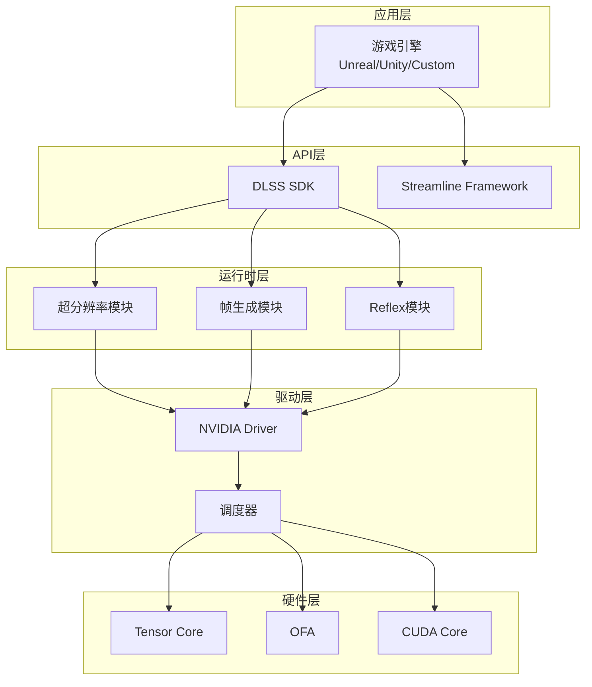

# 第七层：完整系统架构

## 📋 本层概述

本层整合前面所学，展示DLSS 3完整技术栈，分析各组件交互、数据流、渲染管线集成和资源管理策略。

**学习目标**：
- 理解DLSS 3完整系统架构
- 掌握各模块间的交互关系
- 了解端到端数据流
- 学习系统集成最佳实践

**预计学习时间**：2.5-3小时

---

## 1. DLSS 3 完整技术栈

### 1.1 架构分层



---

## 2. 模块详解

### 2.1 超分辨率模块（DLSS 2.0）

```
职责：
- 接收低分辨率渲染输出
- 执行AI超分辨率
- 输出高分辨率图像

输入：
- Color Buffer (RGB)
- Motion Vectors (RG)
- Depth Buffer (R)
- Exposure (标量)

输出：
- High-res Color (RGB)
- History Buffer (内部)

性能：1-2ms @ 4K
```

### 2.2 帧生成模块（DLSS 3.0）

```
职责：
- 分析连续两帧
- 生成中间插值帧
- 处理UI叠加

输入：
- Frame N (高分辨率)
- Frame N+1 (高分辨率)
- Optical Flow (OFA生成)
- UI Mask (可选)

输出：
- Interpolated Frame N+0.5

性能：0.8-1.2ms @ 4K
```

### 2.3 Reflex模块

```
职责：
- 优化渲染队列
- 降低系统延迟
- 同步CPU/GPU

功能：
- Just-In-Time提交
- 低延迟模式
- Boost频率控制

效果：降低延迟20-40%
```

---

## 3. 数据流分析

### 3.1 单帧流程（DLSS 2.0）

```
时间线（假设4K Quality模式）：

T=0ms   : 游戏逻辑更新
T=1ms   : CPU提交渲染命令
T=2ms   : GPU开始渲染（1440p + Jitter）
T=6ms   : 渲染完成，生成:
            - Color Buffer
            - Motion Vectors  
            - Depth
T=7ms   : DLSS SDK调用
T=7.5ms : Tensor Core开始推理
T=9ms   : 高分辨率输出完成
T=9.5ms : 显示输出

总延迟：9.5ms（~105 FPS）
```

### 3.2 双帧流程（DLSS 3.0）

```
帧序列：

Frame N:
T=0-9ms : 渲染 + DLSS超分 → 输出高分辨率帧N

T=9-10ms: OFA计算Frame(N-1)到Frame N的光流

Frame N+0.5 (AI生成):
T=10-11ms: 帧生成网络 → 输出插值帧

T=11ms  : 显示插值帧

Frame N+1:
T=12-21ms: 渲染 + DLSS超分 → 输出高分辨率帧N+1

结果：
- 实际渲染：60 FPS
- 显示输出：120 FPS
- 延迟增加：<2ms（Reflex可抵消）
```

---

## 4. 渲染管线集成

### 4.1 前向渲染集成

```
传统前向渲染：
Clear → 几何 → 光照 → 后处理 → 显示

DLSS集成：
Clear → 几何 → 光照 → DLSS → 后处理 → 显示
                    ↓
              Jitter投影
              运动矢量生成
```

### 4.2 延迟渲染集成

```
延迟渲染+DLSS（推荐）：
G-Buffer Pass (低分辨率 + Jitter)
  ├─ 几何信息
  ├─ 法线
  ├─ 材质
  └─ 深度
    ↓
Lighting Pass
  ├─ 计算光照
  └─ 输出Color Buffer
    ↓
DLSS Pass
  ├─ 输入：Color, Motion, Depth
  └─ 输出：High-res Color
    ↓
Post-Processing (高分辨率)
  ├─ Bloom
  ├─ Tone Mapping
  └─ UI叠加
    ↓
Display
```

---

## 5. 资源管理

### 5.1 显存分配

```
DLSS资源需求（4K输出）：

静态资源：
- 网络权重：30MB
- 常量缓冲：5MB

动态资源（Quality模式）：
- 输入Buffer (1440p×4通道×2): 16MB
- 历史Buffer (4K×3通道×2): 48MB
- 中间特征: 100MB
- 输出Buffer: 24MB

总计：~220MB

对比：
- 4K Native渲染：~300MB
- DLSS节省显存：~27%
```

### 5.2 同步机制

```cpp
// 伪代码：DLSS调用同步
void RenderFrame() {
    // 1. 渲染到低分辨率
    RenderScene(lowResRT, jitter);
    
    // 2. 生成运动矢量
    GenerateMotionVectors(motionVectorRT);
    
    // 3. GPU同步点
    cmdList->Barrier(lowResRT, SHADER_RESOURCE);
    
    // 4. 调用DLSS
    NVSDK_NGX_Parameter* params;
    params->Set(NVSDK_NGX_Parameter_Color, lowResRT);
    params->Set(NVSDK_NGX_Parameter_MotionVectors, motionVectorRT);
    params->Set(NVSDK_NGX_Parameter_Depth, depthRT);
    
    NGX_DLSS_Evaluate(cmdList, dlssFeature, params, highResRT);
    
    // 5. 继续后处理
    PostProcess(highResRT);
}
```

---

## 6. 质量控制

### 6.1 输入验证

```
DLSS SDK内部验证：
1. 运动矢量范围检查
   if (|MV| > max_displacement):
       警告：运动矢量可能不正确
       
2. 深度值合理性
   if (depth < 0 || depth > far_plane):
       错误：深度值无效
       
3. 分辨率匹配
   if (input_res != expected_res):
       错误：分辨率不匹配质量模式
```

### 6.2 自适应质量

```
动态质量调整：

场景静止：
- 增加历史权重
- 提升时序稳定性
- 画质优先

快速运动：
- 降低历史权重  
- 依赖当前帧
- 避免鬼影

遮挡变化：
- 重置历史累积
- 快速适应新场景
```

---

## 7. 多GPU支持

### 7.1 SLI/NVLink场景

```
策略1：单GPU执行DLSS
- GPU 0渲染场景上半部 → 传输到GPU 1
- GPU 1渲染场景下半部 + 合并 + DLSS
- 优点：简化流程
- 缺点：数据传输开销

策略2：每GPU独立DLSS
- GPU 0: 渲染+DLSS上半场景
- GPU 1: 渲染+DLSS下半场景
- 最后合并
- 优点：并行度更高
- 缺点：边界处理复杂
```

---

## 8. 错误处理

### 8.1 降级策略

```
DLSS不可用时：

自动降级路径：
1. 检测GPU型号
   if (!RTX_GPU):
       使用TAA
       
2. 检测驱动版本
   if (driver_version < min_version):
       提示更新驱动
       降级到TAA
       
3. 运行时错误
   if (dlss_init_failed):
       记录错误日志
       切换到TAA
       通知用户
```

---

## 9. 调试工具

### 9.1 NVIDIA Nsight Graphics

```
DLSS调试功能：
1. 输入检查器
   - 可视化运动矢量
   - 检查深度缓冲
   - 验证Jitter应用
   
2. 性能分析器
   - DLSS推理时间
   - Tensor Core利用率
   - 内存带宽使用
   
3. 帧捕获
   - 捕获DLSS前后帧
   - 对比画质
   - 调试伪影
```

---

## 10. 学习检查点

- [ ] 绘制DLSS 3完整架构图
- [ ] 描述单帧和双帧的数据流
- [ ] 解释渲染管线集成方法
- [ ] 理解资源管理和同步机制
- [ ] 掌握质量控制策略

---

## 下一步

**→ 继续学习 [第八层：游戏引擎集成](./08_engine_integration.md)**

学习如何在实际游戏引擎中集成DLSS SDK。

---

**学习进度**：[■■■■■■■□□□] 70% (7/10层完成)
