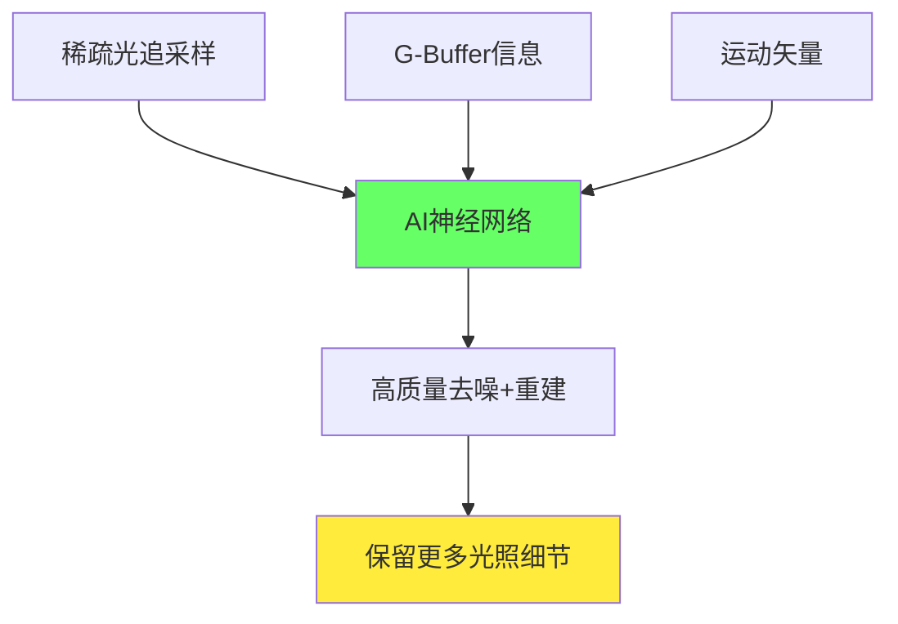

# 第十层：高级主题与前沿研究

## 📋 本层概述

探索DLSS的前沿技术、最新发展（DLSS 3.5 Ray Reconstruction）、学术研究方向以及未来可能的技术演进路径。

**学习目标**：
- 深入理解DLSS 3.5 Ray Reconstruction
- 了解神经渲染前沿研究
- 探索未来技术发展方向
- 拓展相关领域知识

**预计学习时间**：2.5-3小时

---

## 1. DLSS 3.5 Ray Reconstruction

### 1.1 技术背景

```
传统光追去噪流程：
光追采样（稀疏）→ 手工去噪算法 → 最终图像
              (固定规则，保守平滑)

问题：
- 过度模糊，丢失细节
- 反射中的噪点
- 间接光照不稳定
```

### 1.2 Ray Reconstruction原理



**核心创新**：
```
用AI替代传统去噪：
- 学习光照的物理规律
- 理解材质反射特性
- 保留真实光照细节
- 减少伪影和闪烁
```

### 1.3 技术细节

#### 输入数据

```
神经网络输入：
1. 光追结果（嘈杂）
   - 直接光照
   - 反射
   - 折射
   - 全局光照
   
2. G-Buffer
   - 法线
   - 粗糙度
   - 金属度
   - 材质ID
   
3. 运动信息
   - 运动矢量
   - 历史帧

4. 光追采样信息
   - 每像素采样数
   - 命中距离
   - 置信度
```

#### 网络架构

```
编码器：
- 多尺度特征提取
- 物理感知的卷积
- 材质特定分支

时序模块：
- 历史帧累积
- 运动补偿
- 自适应融合

解码器：
- 光照重建
- 细节恢复
- 抗噪点优化

输出：
- 干净的光照结果
- 保留的高频细节
```

### 1.4 效果对比

```
测试场景：《赛博朋克2077》夜景反射

传统去噪：
- 反射模糊
- 细节丢失
- 噪点残留
- PSNR: 32 dB

DLSS 3.5 Ray Reconstruction：
- 反射清晰
- 细节丰富
- 噪点消除
- PSNR: 38 dB

质量提升：~18%
```

---

## 2. 神经渲染（Neural Rendering）

### 2.1 Neural Radiance Fields (NeRF)

```
概念：
用神经网络表示3D场景

原理：
输入：3D位置(x,y,z) + 视角方向(θ,φ)
网络：多层全连接
输出：颜色(R,G,B) + 密度(σ)

应用潜力：
- 实时光场渲染
- 极致压缩场景表示
- 新视角合成
```

### 2.2 Neural Textures

```
用神经网络替代传统纹理：
- 压缩率：100:1 甚至更高
- 质量：无损或接近无损
- 细节：可无限放大（学习特征）

DLSS相关性：
超分辨率本质是"纹理增强"
→ Neural Texture技术可能融合
```

### 2.3 Real-time GI with AI

```
问题：全局光照计算昂贵

AI方案：
1. 稀疏采样GI
2. 神经网络预测完整GI场
3. 时序累积

潜在性能：
- 1 sample/pixel + AI ≈ 64 samples传统
- 64倍加速！
```

---

## 3. DLSS未来演进方向

### 3.1 可能的DLSS 4.0功能

```
预测：

1. 多帧生成
   当前：插值1个中间帧
   未来：生成2-3个中间帧
   效果：3-4倍帧率提升

2. 预测式帧生成
   当前：基于过去两帧
   未来：预测未来帧
   效果：进一步降低延迟

3. 全场景神经渲染
   当前：超分+帧生成
   未来：部分场景直接AI生成
   效果：10倍+性能提升

4. 自适应采样
   重要区域：高采样
   简单区域：低采样+AI补全
   效果：智能性能分配
```

### 3.2 硬件协同演进

```
下一代GPU可能特性：

1. 5代Tensor Core
   - FP4精度支持
   - 3倍AI性能
   - 更低功耗

2. 神经缓存（Neural Cache）
   - 片上神经网络存储
   - 零延迟访问权重
   - 减少显存带宽

3. 增强OFA
   - 多帧光流预测
   - 遮挡预测
   - 场景理解

4. 实时训练单元
   - 在线学习用户偏好
   - 适应特定游戏风格
```

---

## 4. 学术研究方向

### 4.1 超分辨率前沿

#### ESRGAN及后续

```
ESRGAN (Enhanced SRGAN):
- 对抗训练（GAN）
- 感知损失
- 适合静态图像

Real-ESRGAN:
- 实时优化
- 但仍不够快（游戏需求）

研究方向：
- 轻量化网络
- Transformer架构
- 扩散模型（Diffusion）
```

#### Diffusion Models

```
Stable Diffusion用于超分：
优势：生成质量极高
劣势：推理太慢（秒级）

研究：
- 快速采样算法（DDIM, DPM-Solver）
- 蒸馏加速
- 专用硬件

目标：
将扩散模型引入实时渲染
```

### 4.2 Video Frame Interpolation

```
学术方法：
1. DAIN (Depth-Aware Interpolation)
2. RIFE (Real-Time Intermediate Flow Estimation)
3. FILM (Frame Interpolation for Large Motion)

vs DLSS 3.0：
学术：更高质量，但较慢
DLSS：硬件优化，实时性优先

融合潜力：
吸收学术突破 → 工程优化 → 集成到DLSS
```

### 4.3 Neural Rendering

```
SIGGRAPH/CVPR热门方向：

1. Instant NGP (NVIDIA)
   - 实时NeRF渲染
   - 多分辨率哈希编码
   - 可能影响未来DLSS

2. Plenoxels
   - 无需神经网络的场景表示
   - 超快训练

3. 3D Gaussian Splatting
   - 实时新视角合成
   - 潜在游戏应用
```

---

## 5. 跨领域应用

### 5.1 视频编码

```
DLSS技术迁移：

视频压缩新范式：
1. 编码端：降低分辨率编码
2. 解码端：AI超分还原
3. 结果：2-4倍压缩率提升

应用：
- 流媒体（Netflix, YouTube）
- 云游戏
- 视频会议
```

### 5.2 移动端图形

```
挑战：
- 移动GPU性能有限
- 功耗约束严格
- 发热问题

DLSS移动版可能性：
✓ 专用NPU加速（已有）
✓ INT8量化（已成熟）
✓ 轻量化网络
△ 需要大量优化

预计：2-3年内可能实现
```

### 5.3 VR/AR

```
VR特殊需求：
- 极高帧率（90+ FPS）
- 双眼渲染
- 低延迟（<20ms）

DLSS for VR：
1. Foveated Rendering + DLSS
   - 中心高质量
   - 外围DLSS Performance
   
2. 异步时空扭曲 + DLSS
   - 预测头部运动
   - AI补全扭曲

应用案例：
- VR版DLSS已存在
- 持续优化中
```

---

## 6. 竞争技术演进

### 6.1 AMD FSR路线图

```
FSR 4.0展望（预测）：
- 可能加入轻量AI（RDNA 4 AI单元）
- 改进光流算法
- 更好的时序稳定性

策略：
- 保持开放性（全平台）
- 逐步引入AI（可选）
```

### 6.2 Intel XeSS发展

```
XeSS优势：
- AI方法（类似DLSS）
- 跨平台兼容

未来方向：
- 优化Arc GPU性能
- 改进DP4a降级路径
- 扩大游戏支持
```

### 6.3 Microsoft DirectSR

```
统一超采样API：
- 抽象层，支持DLSS/FSR/XeSS
- 游戏一次集成，支持所有技术
- 自动选择最优方案

影响：
✅ 降低开发者门槛
✅ 玩家受益（更多选择）
✅ 推动技术普及
```

---

## 7. 伦理与争议

### 7.1 "真实性"讨论

```
争议：
AI生成的帧是否"真实"？

观点1：不真实
- 插值帧是"猜测"
- 不是真实渲染

观点2：足够真实
- 人眼感知为目标
- 电影24fps也是"不连续"

共识：
技术工具，视场景选择使用
```

### 7.2 竞技公平性

```
电竞争议：
- 插值帧有延迟（即使很小）
- 是否算"性能优势"？

现状：
- 大多数赛事允许
- 部分职业选手禁用
- 个人偏好

建议：
提供完全禁用选项
```

---

## 8. 开发者资源

### 8.1 深入学习资源

```
官方资源：
1. NVIDIA Developer Portal
   https://developer.nvidia.com/dlss
   
2. GDC演讲合集
   - DLSS 2.0技术深入
   - DLSS 3.0架构解析
   
3. SIGGRAPH课程
   - 实时AI渲染
   - 神经渲染前沿

学术论文：
1. "Deep Learning Super Sampling" (NVIDIA)
2. "Neural Supersampling for Real-time Rendering"
3. NeRF、RIFE等相关论文
```

### 8.2 实验项目想法

```
初级项目：
1. 实现简单的超分辨率网络
2. 对比不同上采样方法
3. 测试时序稳定性

中级项目：
1. 集成DLSS到自定义引擎
2. 实现运动矢量生成
3. 优化DLSS输入质量

高级项目：
1. 研究DLSS替代算法
2. 实现神经渲染demo
3. 探索新的AI加速方案
```

---

## 9. 行业影响与展望

### 9.1 游戏开发范式转变

```
传统：提升硬件性能 → 更好画面
现在：AI增强 → 性能飞跃

影响：
✅ 更多预算用于内容而非优化
✅ 独立开发者也能做3A画质
✅ 跨世代游戏（跨GPU性能级别）
```

### 9.2 硬件发展方向

```
趋势：
1. 更多AI专用单元
2. 硬件软件协同设计
3. 异构计算成为常态

预测：
- 5年内：AI渲染占50%+工作负载
- 10年内：大部分渲染任务AI化
```

### 9.3 图形学的未来

```
变革：
传统：手工算法优化
未来：数据驱动AI

机会：
- 新的研究方向
- 跨学科融合（CV+Graphics）
- 更高效的渲染

挑战：
- 可解释性
- 艺术控制vs AI自动化
- 计算资源需求
```

---

## 10. 总结与展望

### 10.1 DLSS的意义

```
技术层面：
✅ 实时光追的关键推动者
✅ AI在图形学的成功应用
✅ 硬件软件协同的典范

行业层面：
✅ 推动GPU架构演进
✅ 引发AI渲染竞争
✅ 改变游戏开发流程

用户层面：
✅ 更好的游戏体验
✅ 延长硬件生命周期
✅ 更高的性价比
```

### 10.2 未来展望

```
短期（1-2年）：
- DLSS 3.5普及
- 更多游戏支持
- 移动端初步尝试

中期（3-5年）：
- DLSS 4.0（可能特性）
- 神经渲染集成
- 跨平台统一

长期（5-10年）：
- AI主导的渲染管线
- 实时照片级画质
- 虚拟与现实难辨
```

---

## 11. 学习成果检验

### 综合能力检查

- [ ] 理解DLSS 3.5 Ray Reconstruction原理
- [ ] 了解神经渲染前沿研究
- [ ] 预测DLSS未来发展方向
- [ ] 掌握相关学术方向
- [ ] 能够批判性思考技术优劣

### 实践能力

- [ ] 能够评估新技术的可行性
- [ ] 可以设计实验验证想法
- [ ] 理解技术背后的权衡
- [ ] 具备持续学习的能力

---

## 12. 继续学习之路

### 推荐路径

```
深化DLSS：
→ 阅读NVIDIA官方论文
→ 实验SDK和示例代码
→ 参与开发者社区讨论

拓展相关领域：
→ 深度学习（CS231n课程）
→ 计算机图形学（GAMES101）
→ 实时渲染（Real-Time Rendering书）

前沿跟踪：
→ SIGGRAPH/CVPR论文
→ NVIDIA GTC/GDC演讲
→ arXiv预印本
```

---

## 恭喜完成学习！

您已经完成了DLSS 3架构的完整学习之旅，从基础概念到前沿研究，建立了全面的知识体系。

**→ 返回 [学习计划主页](../DLSS3_Architecture_Study.md)**

**→ 查看 [参考资料](../references.md)** 继续深入学习

---

**学习进度**：[■■■■■■■■■■] 100% (10/10层完成) ✨

**祝您在图形学和AI的道路上不断前进！** 🚀
