# AI in Game Development: Discussion Summary

> **Date**: 2026-01-24  
> **Topic**: Using AI Agents for Game Business Logic Generation

---

## Original Question

游戏包括引擎，工具，框架，和业务逻辑，其中业务逻辑是最复杂的。这里面业务逻辑代码能否用agent生成，能实现覆盖多少的业务功能，这里面最大的挑战是什么？

**Translation**: Games include engines, tools, frameworks, and business logic. Business logic is the most complex. Can AI agents generate business logic code? How much business functionality can be covered? What are the biggest challenges?

---

## Part 1: AI Agent for Game Business Logic Generation

### Game Architecture Overview

Games typically consist of four layers, with business logic being the most complex:

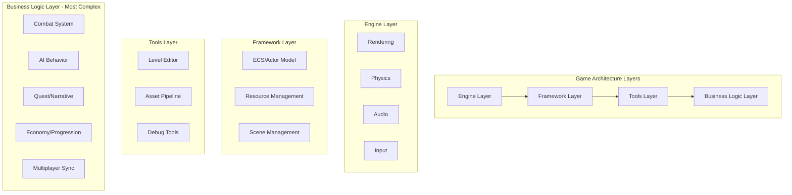

### Can AI Agents Generate Business Logic?

**Yes, but with significant limitations.** Here's a breakdown of coverage potential:

| Business Logic Category | AI Coverage | Feasibility |
|------------------------|-------------|-------------|
| **Simple CRUD Operations** | 80-90% | High - Data management, inventory systems |
| **State Machines** | 70-80% | High - Character states, UI flows |
| **Rule-based Systems** | 60-70% | Medium - Buff/debuff calculations, damage formulas |
| **Procedural Generation** | 50-60% | Medium - Map generation, loot tables |
| **AI Behavior Trees** | 40-50% | Medium - Enemy AI patterns |
| **Complex Interactions** | 20-30% | Low - Multi-system dependencies |
| **Creative Design Logic** | 10-20% | Very Low - Unique game mechanics |
| **Emergent Gameplay** | 5-10% | Very Low - Player-driven dynamics |

### Key Challenges

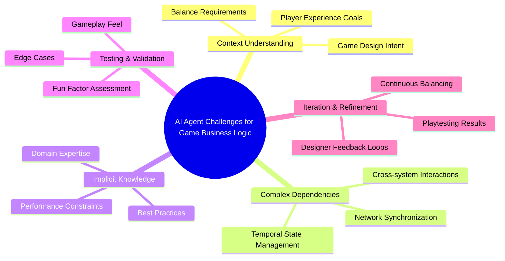

### The 5 Biggest Challenges:

1. **Context Window Limitation**
   - Business logic often spans hundreds of interconnected files
   - AI cannot hold entire codebase context simultaneously
   - Cross-reference dependencies are difficult to track

2. **Implicit Design Intent**
   - Game "feel" and "juice" are hard to specify
   - Design documents rarely capture full requirements
   - Player psychology and experience goals are abstract

3. **Complex State Management**
   - Games have massive state spaces (save systems, multiplayer sync)
   - Race conditions, edge cases, and temporal dependencies
   - AI struggles with non-deterministic state transitions

4. **Balance & Tuning**
   - Numbers matter enormously (damage, cooldowns, resource costs)
   - Requires extensive playtesting and iteration
   - AI cannot evaluate "fun" or engagement

5. **Emergent Behavior Prediction**
   - Players exploit systems in unexpected ways
   - System interactions create unintended outcomes
   - AI cannot anticipate emergent gameplay patterns

### Practical Recommendations

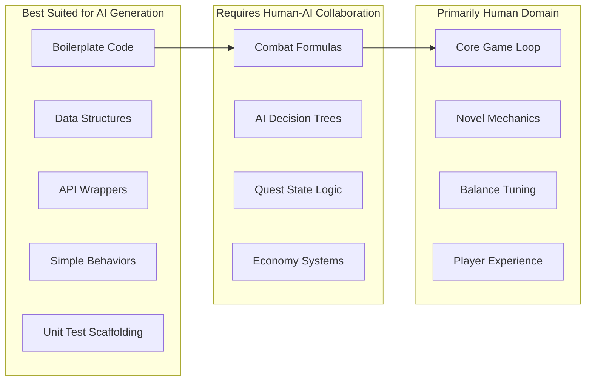

### Initial Conclusion

AI agents can realistically cover **30-40%** of game business logic code generation, primarily in:
- Structured, well-defined systems
- Pattern-based implementations
- Code following established conventions

The remaining **60-70%** requires:
- Human creativity and design judgment
- Iterative playtesting and refinement
- Deep understanding of player psychology
- Cross-system architectural decisions

---

## Part 2: Universal AI Solutions for Game Development

### Introduction: Why AI in Game Development?

The game industry faces a **productivity paradox**: development costs have increased 10x over 20 years while team sizes have ballooned. AI agents offer a path to democratize game development and accelerate production.

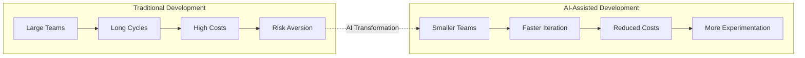

### Universal AI Solutions Architecture

#### Layer 1: Foundation Models + Game Domain Adapters

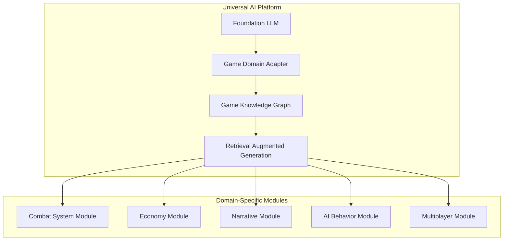

#### Layer 2: Multi-Agent Collaboration System

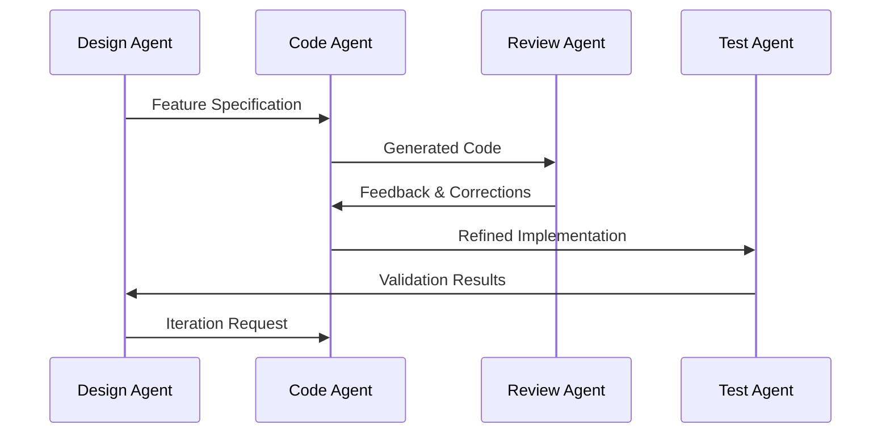

### Universal Solution Components

#### 1. Game DSL (Domain-Specific Language) Generator

| Component | Purpose | AI Capability |
|-----------|---------|---------------|
| **Schema Definition** | Define game data structures | Auto-generate from natural language |
| **Rule Engine** | Express game logic declaratively | Convert design docs to rules |
| **State Machine DSL** | Define entity behaviors | Generate from flowcharts/descriptions |
| **Event System** | Inter-system communication | Pattern-based generation |

#### 2. Template-Based Code Generation

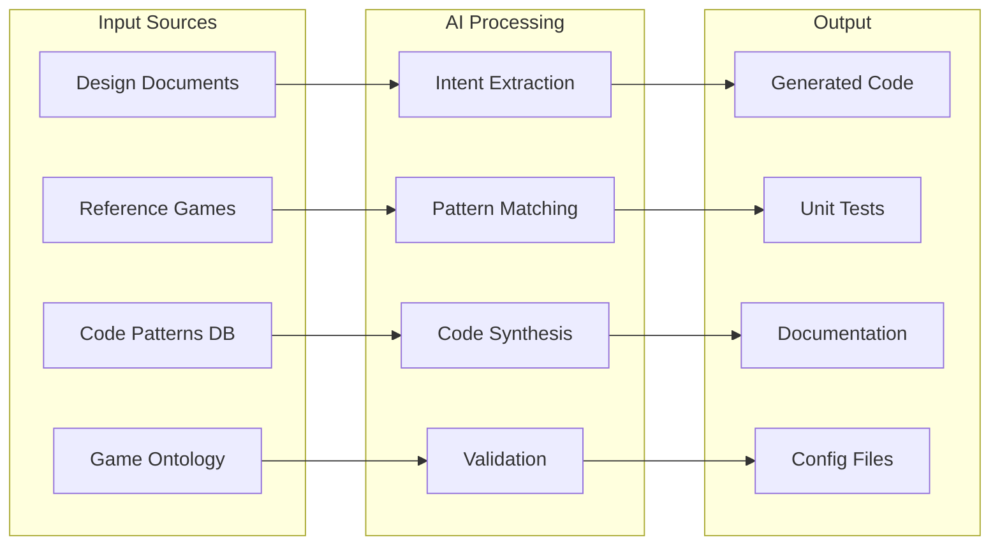

#### 3. Knowledge-Augmented Generation (KAG) for Games

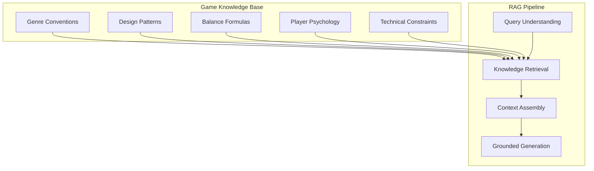

### Coverage Improvement Strategy

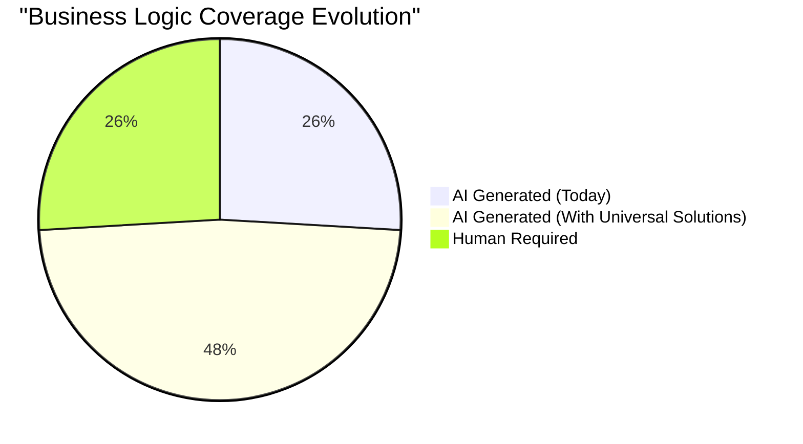

---

## Part 3: Final Conclusion - Optimal Division of Labor

### User Insight

> "Claude Code is more suitable for building engines, frameworks and tools. For game business logic, hard coding is still more appropriate."

### The Reality: Where AI Excels vs. Where Humans Must Lead

```mermaid
quadrantChart
    title AI Suitability for Game Development Tasks
    x-axis Low Creativity Requirement --> High Creativity Requirement
    y-axis High Structure --> Low Structure
    quadrant-1 AI Assisted (Frameworks)
    quadrant-2 Human Domain (Business Logic)
    quadrant-3 AI Optimal (Engine/Tools)
    quadrant-4 Human Led (Game Design)
    
    Engine Core: [0.2, 0.85]
    Rendering Pipeline: [0.15, 0.9]
    Build Tools: [0.1, 0.95]
    Asset Pipeline: [0.2, 0.8]
    ECS Framework: [0.3, 0.75]
    Network Layer: [0.25, 0.85]
    Combat Logic: [0.7, 0.4]
    Quest System: [0.8, 0.35]
    Economy Balance: [0.75, 0.3]
    AI Behavior: [0.65, 0.45]
    Level Design: [0.85, 0.25]
    Game Feel: [0.95, 0.15]
```

### Why Claude Code Excels at Engine/Framework/Tools

| Domain | Why AI Excels | Examples |
|--------|--------------|----------|
| **Engine** | Well-documented algorithms, mathematical foundations, performance patterns | Rendering pipelines, physics engines, memory allocators |
| **Framework** | Design patterns are well-established, clear interfaces | ECS systems, resource managers, scene graphs |
| **Tools** | Functional requirements are explicit, testable | Asset importers, build scripts, debug visualizers |

#### Characteristics that Make These AI-Friendly:

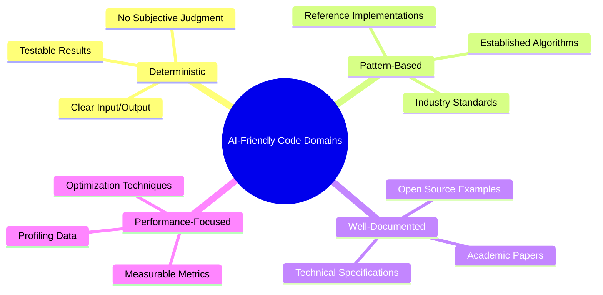

### Why Business Logic Resists AI Generation

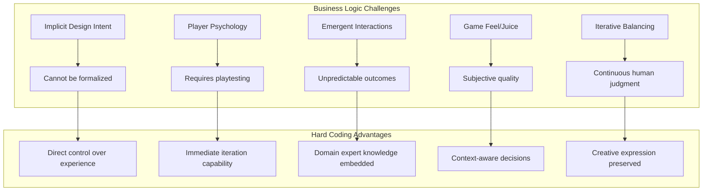

#### The Fundamental Mismatch:

| Business Logic Requirement | AI Limitation |
|---------------------------|---------------|
| "This attack should feel powerful" | Cannot define "feel" |
| "Make the economy not easily exploited" | Cannot predict player creativity |
| "Balance for both casual and hardcore" | Cannot evaluate player segments |
| "The quest should be emotionally impactful" | Cannot assess emotional resonance |
| "Tune until it's fun" | Cannot define or measure "fun" |

### Recommended Division of Labor

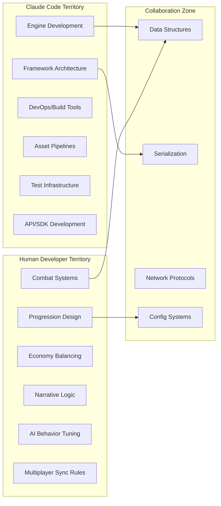

### Practical Workflow

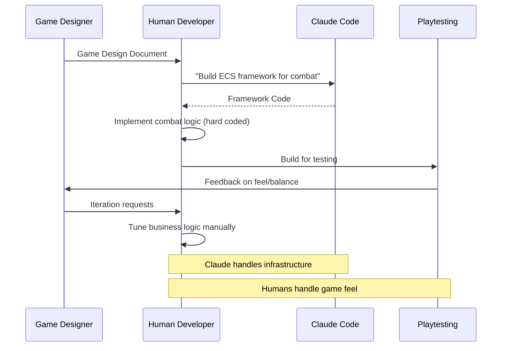

---

## Final Summary

| Aspect | Claude Code | Human Hard Coding |
|--------|-------------|-------------------|
| **Best For** | Engine, Framework, Tools | Business Logic |
| **Coverage** | 80-90% automation possible | 10-20% AI assistance max |
| **Value Add** | Speed, consistency, patterns | Creativity, judgment, feel |
| **Quality Metric** | Performance, correctness | Fun, engagement, balance |
| **Iteration** | Spec-driven refinement | Playtest-driven tuning |

### Key Insight

> **AI amplifies infrastructure development, but game "soul" remains a human craft.**
> 
> Use Claude Code to build the stage; humans must direct the performance.

---

*Document saved: 2026-01-24*
