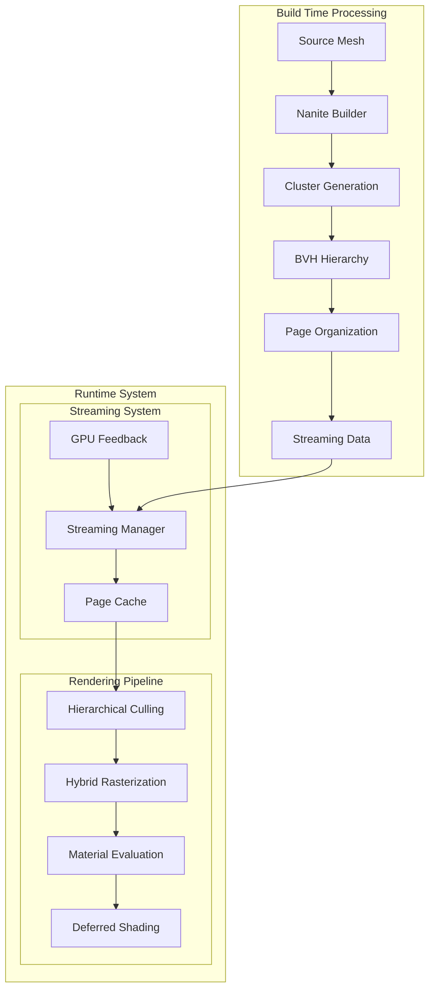

# Nanite Overview

## Introduction

Nanite is Unreal Engine 5's virtualized micropolygon geometry system that enables rendering of extremely high-detail meshes in real-time. It was introduced in UE5 as a revolutionary approach to handle geometric complexity that was previously impossible to render at interactive frame rates.

## Core Concepts

Nanite is built around several key concepts:

1. **Virtualized Geometry**: Similar to virtual texturing, Nanite streams geometry data on demand rather than loading entire meshes into memory.

2. **Hierarchical Level of Detail (HLOD)**: Nanite uses a continuous LOD system based on a hierarchical cluster representation, eliminating traditional discrete LOD transitions.

3. **Cluster-based Architecture**: Meshes are decomposed into small clusters of triangles that can be independently culled, streamed, and rasterized.

4. **Software Rasterization**: Nanite employs a hybrid rasterization approach combining hardware and software rasterization for optimal performance across different triangle sizes.

## Architecture Overview



## Source Code Organization

The Nanite implementation is spread across several modules in the Unreal Engine source code:

### Core Renderer Components
Located in [`Engine/Source/Runtime/Renderer/Private/Nanite/`](../Engine/Source/Runtime/Renderer/Private/Nanite/):

| File | Description |
|------|-------------|
| `Nanite.h` | Main include header aggregating all Nanite rendering functionality |
| `NaniteShared.h` | Core shared definitions, packed view structures, shader parameters |
| `NaniteCullRaster.h` | Culling and rasterization context and interfaces |
| `NaniteVisibility.h` | Visibility query system for material bins |
| `NaniteMaterials.h` | Material slot and debug view information |
| `NaniteShading.h` | Shading pipeline and command building |
| `NaniteVisualize.h` | Debug visualization modes |
| `NaniteComposition.h` | Final composition with scene |
| `NaniteRayTracing.h` | Ray tracing integration |
| `NaniteStreamOut.h` | Geometry stream-out functionality |
| `NaniteFeedback.h` | GPU feedback system for streaming |

### Resource and Streaming Components
Located in [`Engine/Source/Runtime/Engine/Public/Rendering/`](../Engine/Source/Runtime/Engine/Public/Rendering/):

| File | Description |
|------|-------------|
| `NaniteResources.h` | Core resource definitions: clusters, pages, hierarchy nodes |
| `NaniteStreamingManager.h` | Streaming manager implementation |

### Scene Proxy
Located in [`Engine/Source/Runtime/Engine/Public/`](../Engine/Source/Runtime/Engine/Public/):

| File | Description |
|------|-------------|
| `NaniteSceneProxy.h` | Nanite-specific scene proxy base class |

## Key Features

### 1. Unlimited Geometric Detail
- Film-quality assets with billions of triangles
- No need for manual LOD creation
- Automatic detail management based on screen coverage

### 2. Efficient Memory Usage
- Only visible geometry is loaded into memory
- Page-based streaming with priority-driven updates
- Automatic memory budget management

### 3. GPU-Driven Rendering
- Hierarchical culling performed entirely on GPU
- Software rasterization for small triangles
- Hardware rasterization for large triangles

### 4. Full Material Support
- Deferred shading with full material evaluation
- Support for masked materials
- World Position Offset support
- Two-sided material support

## Performance Considerations

Nanite is designed to handle:
- Meshes with millions of triangles
- Scenes with thousands of Nanite instances
- Dynamic objects with real-time updates

Performance depends on:
- Triangle overdraw and complexity
- Material complexity
- Screen resolution
- Available GPU memory

## Platform Support

Nanite requires specific GPU capabilities:
- Shader Model 6.0 or higher
- 64-bit atomics support
- Compute shader support
- Work graph support (optional, for enhanced performance)

As defined in [`RenderUtils.h`](../Engine/Source/Runtime/RenderCore/Public/RenderUtils.h#L427):
```cpp
RENDERCORE_API bool DoesPlatformSupportNanite(EShaderPlatform Platform, bool bCheckForProjectSetting = true);
RENDERCORE_API bool DoesRuntimeSupportNanite(EShaderPlatform ShaderPlatform, bool bCheckForAtomicSupport, bool bCheckForProjectSetting);
```

## Next Steps

For detailed information about specific aspects of Nanite, refer to:

1. [Data Structures](02_DataStructures.md) - Clusters, Pages, and Hierarchy
2. [Rendering Pipeline](03_RenderingPipeline.md) - Culling and Rasterization
3. [Streaming System](04_StreamingSystem.md) - On-demand data loading
4. [Materials and Shading](05_MaterialsAndShading.md) - Material evaluation and shading
