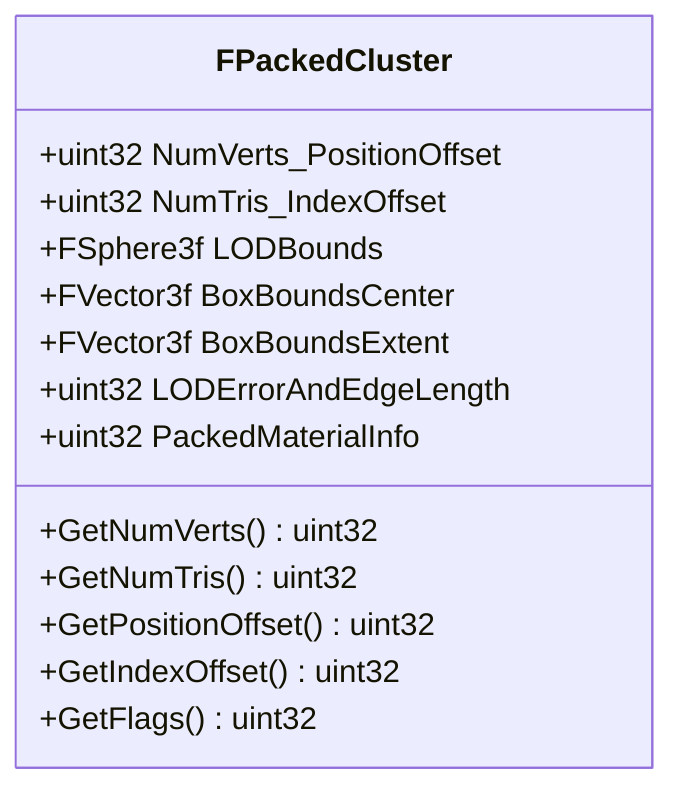
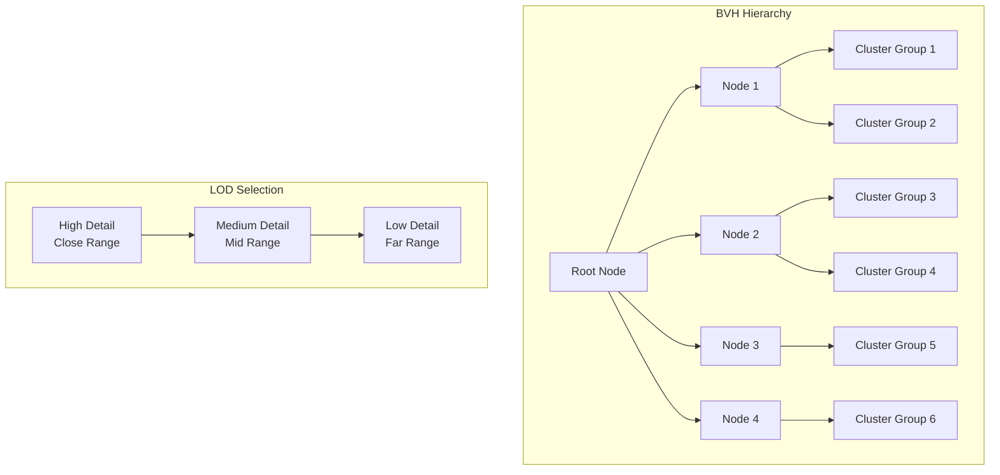
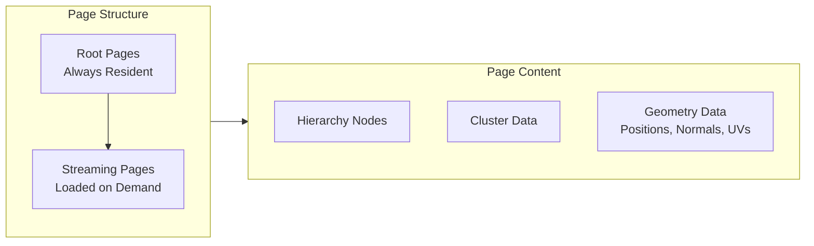
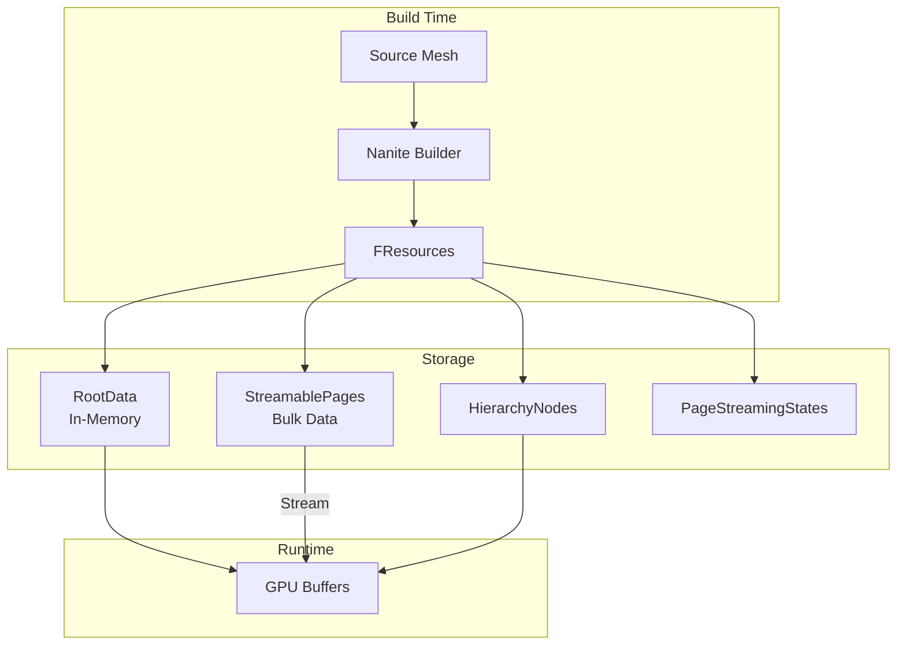
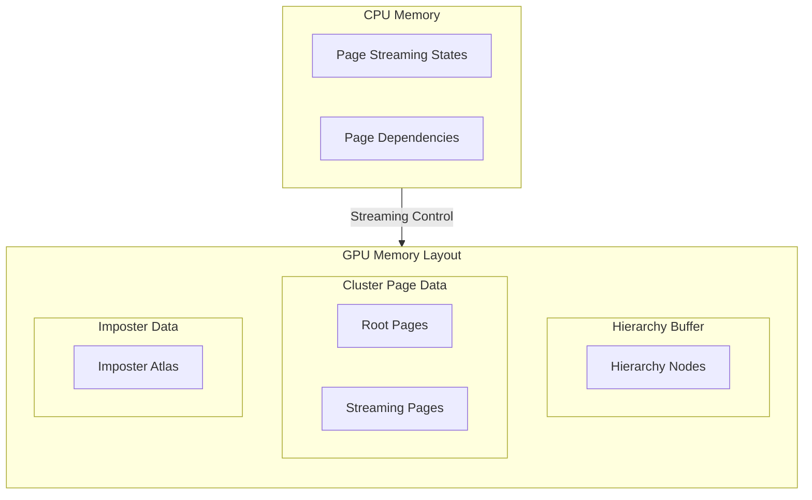

# Nanite Data Structures

## Overview

Nanite's core data structures enable efficient hierarchical representation and streaming of high-detail geometry. This document explains the fundamental data structures used in the Nanite system.

## Cluster Architecture

### FPackedCluster

The [`FPackedCluster`](../Engine/Source/Runtime/Engine/Public/Rendering/NaniteResources.h#L92) structure is the fundamental unit of Nanite geometry. Each cluster contains a small group of triangles that can be independently processed.

```cpp
struct FPackedCluster
{
    // Rasterization members
    uint32 NumVerts_PositionOffset;     // NumVerts:14, PositionOffset:18
    uint32 NumTris_IndexOffset;          // NumTris:8, IndexOffset:24
    uint32 ColorMin;
    uint32 ColorBits_GroupIndex;         // R:4, G:4, B:4, A:4

    FIntVector PosStart;
    uint32 BitsPerIndex_PosPrecision_PosBits_NormalPrecision_TangentPrecision;

    // Culling members
    FSphere3f LODBounds;
    FVector3f BoxBoundsCenter;
    uint32 LODErrorAndEdgeLength;
    FVector3f BoxBoundsExtent;
    uint32 Flags_NumClusterBoneInfluences;

    // Material members
    uint32 AttributeOffset_BitsPerAttribute;
    uint32 DecodeInfoOffset_HasTangents_Skinning_NumUVs_ColorMode;
    uint32 UVBitOffsets;
    uint32 PackedMaterialInfo;

    // Extended data
    uint32 ExtendedDataOffset_Num;
    uint32 BrickDataOffset_Num;
    uint32 VertReuseBatchInfo[4];
};
```

### Cluster Data Layout



### Cluster Properties

| Property | Bits | Description |
|----------|------|-------------|
| NumVerts | 14 | Number of vertices in cluster (max 16384) |
| PositionOffset | 18 | Offset to position data in page |
| NumTris | 8 | Number of triangles (max 256) |
| IndexOffset | 24 | Offset to index data in page |
| BitsPerIndex | 3 | Bits per vertex index (1-8) |
| PosPrecision | 6 | Position quantization precision |
| NormalPrecision | 4 | Normal quantization precision |
| TangentPrecision | 4 | Tangent quantization precision |

## Hierarchy System

### FPackedHierarchyNode

The [`FPackedHierarchyNode`](../Engine/Source/Runtime/Engine/Public/Rendering/NaniteResources.h#L50) structure defines the BVH (Bounding Volume Hierarchy) node structure used for hierarchical culling.

```cpp
struct FPackedHierarchyNode
{
    FVector4f LODBounds[NANITE_MAX_BVH_NODE_FANOUT];
    
    struct {
        FVector3f BoxBoundsCenter;
        uint32 MinLODError_MaxParentLODError;
    } Misc0[NANITE_MAX_BVH_NODE_FANOUT];

    struct {
        FVector3f BoxBoundsExtent;
        uint32 ChildStartReference;
    } Misc1[NANITE_MAX_BVH_NODE_FANOUT];
    
    struct {
        uint32 ResourcePageRangeKey;
        uint32 GroupPartSize_AssemblyPartIndex;
    } Misc2[NANITE_MAX_BVH_NODE_FANOUT];
};
```

### Hierarchy Tree Structure



### Node Fanout

The constant `NANITE_MAX_BVH_NODE_FANOUT` defines the maximum number of children per hierarchy node. Each node stores:

- **LODBounds**: Spherical bounds for LOD selection per child
- **BoxBoundsCenter/Extent**: AABB for frustum culling per child
- **MinLODError/MaxParentLODError**: LOD error metrics for continuous LOD
- **ChildStartReference**: Reference to child nodes or clusters
- **ResourcePageRangeKey**: Key for page dependencies

## Page System

### FPageStreamingState

The [`FPageStreamingState`](../Engine/Source/Runtime/Engine/Public/Rendering/NaniteResources.h#L205) structure tracks the streaming state of each page.

```cpp
struct FPageStreamingState
{
    uint32 BulkOffset;          // Offset in streaming bulk data
    uint32 BulkSize;            // Size of compressed page data
    uint32 PageSize;            // Uncompressed page size
    uint32 DependenciesStart;   // Index to dependency list
    uint16 DependenciesNum;     // Number of dependencies
    uint8  MaxHierarchyDepth;   // Maximum depth in hierarchy
    uint8  Flags;               // Page flags
};
```

### FPageRangeKey

The [`FPageRangeKey`](../Engine/Source/Runtime/Engine/Public/Rendering/NaniteResources.h#L216) structure encodes page range information compactly.

```cpp
struct FPageRangeKey
{
    uint32 Value = NANITE_PAGE_RANGE_KEY_EMPTY_RANGE;
    
    bool IsEmpty() const;
    uint32 GetNumPagesOrRanges() const;
    uint32 GetStartIndex() const;
    bool IsMultiRange() const;
    bool HasStreamingPages() const;
};
```

### Page Organization



## Resource Structure

### FResources

The [`FResources`](../Engine/Source/Runtime/Engine/Public/Rendering/NaniteResources.h#L409) structure is the main container for all Nanite mesh data.

```cpp
struct FResources
{
    // Persistent State
    TArray<uint8>                   RootData;           // Always-resident root pages
    FByteBulkData                   StreamablePages;    // Streamable page data
    TArray<uint16>                  ImposterAtlas;      // Imposter texture atlas
    TArray<FPackedHierarchyNode>    HierarchyNodes;     // BVH nodes
    TArray<uint32>                  HierarchyRootOffsets;
    TArray<FPageStreamingState>     PageStreamingStates;
    TArray<uint16>                  PageDependencies;
    TArray<FMatrix3x4>              AssemblyTransforms;
    TArray<FPageRangeKey>           PageRangeLookup;
    
    FBoxSphereBounds3f              MeshBounds;
    uint32                          NumRootPages;
    int32                           PositionPrecision;
    int32                           NormalPrecision;
    int32                           TangentPrecision;
    uint32                          NumInputTriangles;
    uint32                          NumInputVertices;
    uint32                          NumClusters;
    uint32                          ResourceFlags;
    
    // Runtime State
    uint32 RuntimeResourceID;
    uint32 HierarchyOffset;
    int32  RootPageIndex;
    int32  ImposterIndex;
    uint32 NumHierarchyNodes;
    uint32 NumResidentClusters;
    uint32 PersistentHash;
};
```

### Resource Data Flow



## Mesh Data Sections

### FMeshDataSection

The [`FMeshDataSection`](../Engine/Source/Runtime/Engine/Public/Rendering/NaniteResources.h#L366) structure represents a material section within a Nanite mesh.

```cpp
struct FMeshDataSection
{
    int32  MaterialIndex;    // Material slot index
    uint32 FirstIndex;       // Starting index
    uint32 NumTriangles;     // Triangle count
    uint32 MinVertexIndex;   // Minimum vertex index
    uint32 MaxVertexIndex;   // Maximum vertex index
    EMeshDataSectionFlags Flags;
};
```

### Section Flags

Defined in [`EMeshDataSectionFlags`](../Engine/Source/Runtime/Engine/Public/Rendering/NaniteResources.h#L269):

| Flag | Description |
|------|-------------|
| `EnableCollision` | Section has collision enabled |
| `CastShadow` | Section casts shadows |
| `VisibleInRayTracing` | Visible in ray tracing |
| `AffectDistanceFieldLighting` | Affects distance field lighting |
| `ForceOpaque` | Force opaque in ray tracing |
| `Disabled` | Section is disabled |

## Instance and Draw Structures

### FInstanceDraw

The [`FInstanceDraw`](../Engine/Source/Runtime/Engine/Public/Rendering/NaniteResources.h#L263) structure pairs an instance with a view for drawing.

```cpp
struct FInstanceDraw
{
    uint32 InstanceId;
    uint32 ViewId;
};
```

## Memory Layout Summary



## Key Constants

From the Nanite definitions header (referenced throughout the codebase):

| Constant | Description |
|----------|-------------|
| `NANITE_MAX_BVH_NODE_FANOUT` | Maximum children per hierarchy node |
| `NANITE_MAX_CLUSTER_MATERIALS` | Maximum materials per cluster |
| `NANITE_MAX_UVS` | Maximum UV channels |
| `NANITE_MIN_POSITION_PRECISION` | Minimum position quantization |
| `NANITE_PAGE_RANGE_KEY_*` | Page range encoding constants |

## Related Documents

- [Overview](01_Overview.md) - System introduction
- [Rendering Pipeline](03_RenderingPipeline.md) - How these structures are used in rendering
- [Streaming System](04_StreamingSystem.md) - Page streaming details
