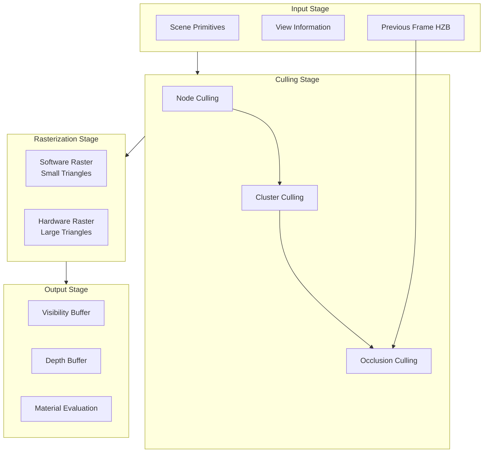
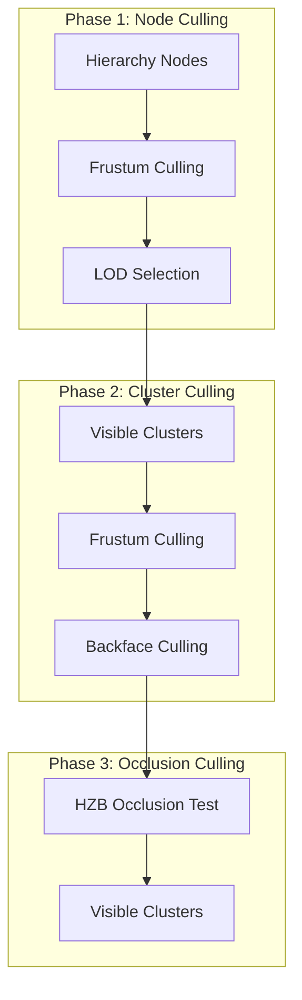
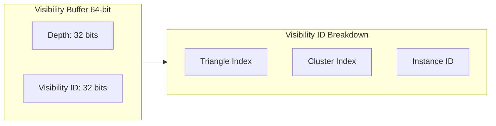
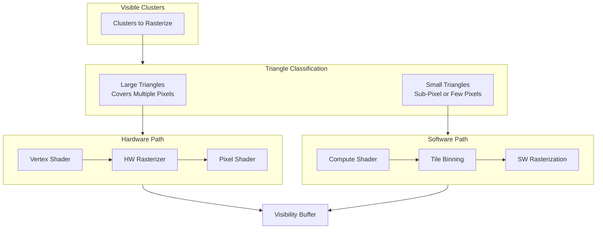

# Nanite Rendering Pipeline

## Overview

The Nanite rendering pipeline is a GPU-driven system that performs hierarchical culling and hybrid rasterization. This document explains the complete rendering flow from visibility determination to final pixel output.

## Pipeline Architecture



## Raster Context

### FRasterContext

The [`FRasterContext`](../Engine/Source/Runtime/Renderer/Private/Nanite/NaniteCullRaster.h#L65) structure holds all information needed for a Nanite rasterization pass.

```cpp
struct FRasterContext
{
    FVector2f         RcpViewSize;        // 1/ViewSize for coordinate conversion
    FIntPoint         TextureSize;        // Output texture dimensions
    EOutputBufferMode RasterMode;         // VisBuffer or DepthOnly
    ERasterScheduling RasterScheduling;   // HW/SW scheduling mode

    FRasterParameters Parameters;         // UAV bindings

    FRDGTextureRef    DepthBuffer;
    FRDGTextureRef    VisBuffer64;
    FRDGTextureRef    DbgBuffer64;
    FRDGTextureRef    DbgBuffer32;

    bool              VisualizeActive;
    bool              VisualizeModeOverdraw;
    bool              bCustomPass;
    bool              bEnableAssemblyMeta;
};
```

### Output Buffer Modes

Defined in [`EOutputBufferMode`](../Engine/Source/Runtime/Renderer/Private/Nanite/NaniteCullRaster.h#L40):

| Mode | Description |
|------|-------------|
| `VisBuffer` | Default mode outputting visibility ID and depth |
| `DepthOnly` | Rasterize only depth to 32-bit buffer |

### Raster Scheduling

Defined in [`ERasterScheduling`](../Engine/Source/Runtime/Renderer/Private/Nanite/NaniteCullRaster.h#L25):

| Mode | Description |
|------|-------------|
| `HardwareOnly` | Only use fixed-function hardware rasterization |
| `HardwareThenSoftware` | Large triangles with HW, small with SW sequentially |
| `HardwareAndSoftwareOverlap` | HW and SW rasterization overlapped |

## Culling System

### Hierarchical Culling Process



### Two-Pass Occlusion

The [`FConfiguration`](../Engine/Source/Runtime/Renderer/Private/Nanite/NaniteCullRaster.h#L143) structure controls culling behavior:

```cpp
struct FConfiguration
{
    uint32 bTwoPassOcclusion : 1;       // Enable two-pass occlusion
    uint32 bUpdateStreaming : 1;         // Update streaming priorities
    uint32 bDrawOnlyRayTracingFarField : 1;
    uint32 bSupportsMultiplePasses : 1;
    uint32 bForceHWRaster : 1;           // Force hardware rasterization
    uint32 bPrimaryContext : 1;          // Primary rendering context
    uint32 bDrawOnlyRootGeometry : 1;
    uint32 bIsShadowPass : 1;
    uint32 bIsSceneCapture : 1;
    uint32 bIsReflectionCapture : 1;
    uint32 bIsLumenCapture : 1;
    uint32 bIsMaterialCache : 1;
    EFilterFlags HiddenFilterFlags;
};
```

Two-pass occlusion works as follows:

1. **First Pass**: Render previously visible clusters to build initial HZB
2. **Second Pass**: Test newly visible clusters against updated HZB

## Visibility Buffer

### FRasterResults

The [`FRasterResults`](../Engine/Source/Runtime/Renderer/Private/Nanite/NaniteCullRaster.h#L85) structure captures all outputs from rasterization.

```cpp
struct FRasterResults
{
    FIntVector4   PageConstants;
    uint32        MaxVisibleClusters;
    uint32        MaxCandidatePatches;
    uint32        MaxNodes;
    uint32        MaxPatchesPerGroup;
    uint32        MeshPass;
    float         InvDiceRate;
    uint32        RenderFlags;
    uint32        DebugFlags;

    FRDGBufferRef   ViewsBuffer;
    FRDGBufferRef   VisibleClustersSWHW;
    FRDGBufferRef   AssemblyTransforms;
    FRDGBufferRef   AssemblyMeta;
    FRDGBufferRef   RasterBinMeta;

    FRDGTextureRef  VisBuffer64;         // 64-bit visibility buffer
    FRDGTextureRef  DbgBuffer64;         // Debug buffer
    FRDGTextureRef  DbgBuffer32;
    FRDGTextureRef  ShadingMask;         // Material shading mask

    FRDGBufferRef   ClearTileArgs;
    FRDGBufferRef   ClearTileBuffer;

    FNaniteVisibilityQuery* VisibilityQuery;
    TArray<FVisualizeResult> Visualizations;
};
```

### Visibility Buffer Format

The visibility buffer uses a 64-bit format encoding:



## IRenderer Interface

### IRenderer

The [`IRenderer`](../Engine/Source/Runtime/Renderer/Private/Nanite/NaniteCullRaster.h#L178) interface defines the main entry point for Nanite rendering.

```cpp
class IRenderer
{
public:
    static TUniquePtr<IRenderer> Create(
        FRDGBuilder&          GraphBuilder,
        const FScene&         Scene,
        const FViewInfo&      SceneView,
        FSceneUniformBuffer&  SceneUniformBuffer,
        const FSharedContext& SharedContext,
        const FRasterContext& RasterContext,
        const FConfiguration& Configuration,
        const FIntRect&       ViewRect,
        const FRDGTextureRef  PrevHZB,
        FVirtualShadowMapArray* VirtualShadowMapArray = nullptr
    );

    virtual void DrawGeometry(
        FNaniteRasterPipelines& RasterPipelines,
        const FNaniteVisibilityQuery* VisibilityQuery,
        FRDGBufferRef ViewsBuffer,
        FRDGBufferRef InViewDrawRanges,
        int32 NumViews,
        FSceneInstanceCullingQuery* OptionalSceneInstanceCullingQuery,
        const TConstArrayView<FInstanceDraw>* OptionalInstanceDraws,
        const FExplicitChunkDrawInfo* OptionalExplicitChunkDrawInfo
    ) = 0;

    virtual void ExtractResults(FRasterResults& RasterResults) = 0;
};
```

### Draw Modes

The renderer supports multiple draw modes:

1. **Brute-Force Culling**: Test all instances against view frustum
2. **Instance Draw List**: Explicit list of instance-view pairs
3. **Scene Instance Culling Query**: Pre-computed visibility from scene culling

## Packed View System

### FPackedView

The [`FPackedView`](../Engine/Source/Runtime/Renderer/Private/Nanite/NaniteShared.h#L34) structure contains all view information needed for GPU culling.

```cpp
struct FPackedView
{
    FMatrix44f SVPositionToTranslatedWorld;
    FMatrix44f ViewToTranslatedWorld;
    FMatrix44f TranslatedWorldToView;
    FMatrix44f TranslatedWorldToClip;
    FMatrix44f ViewToClip;
    FMatrix44f ClipToRelativeWorld;

    // Previous frame matrices for motion vectors
    FMatrix44f PrevTranslatedWorldToView;
    FMatrix44f PrevTranslatedWorldToClip;
    FMatrix44f PrevViewToClip;
    FMatrix44f PrevClipToRelativeWorld;

    FIntVector4 ViewRect;
    FVector4f   ViewSizeAndInvSize;
    FVector4f   ClipSpaceScaleOffset;

    FVector3f   PreViewTranslationHigh;
    FVector3f   ViewOriginLow;
    FVector3f   CullingViewOriginTranslatedWorld;
    FVector3f   ViewForward;

    float       NearPlane;
    float       RangeBasedCullingDistance;

    FVector2f   LODScales;
    uint32      InstanceOcclusionQueryMask;
    uint32      StreamingPriorityCategory_AndFlags;

    FIntVector4 HZBTestViewRect;

    void UpdateLODScales(float NaniteMaxPixelsPerEdge, float MinPixelsPerEdgeHW);
};
```

### View Array Management

```cpp
class FPackedViewArray
{
public:
    static FPackedViewArray* Create(FRDGBuilder& GraphBuilder, const FPackedView& View);
    static FPackedViewArray* Create(FRDGBuilder& GraphBuilder, uint32 NumViews, ArrayType&& Views);
    static FPackedViewArray* CreateWithSetupTask(
        FRDGBuilder& GraphBuilder,
        uint32 NumViews,
        TaskLambdaType&& TaskLambda,
        UE::Tasks::FPipe* Pipe = nullptr,
        bool bExecuteInTask = true
    );

    const ArrayType& GetViews() const;
    const uint32 NumViews;
};
```

## Rasterization Process

### Software vs Hardware Rasterization



### Raster Bin System

From [`FNaniteRasterPipeline`](../Engine/Source/Runtime/Renderer/Private/Nanite/NaniteShared.h#L538):

```cpp
struct FNaniteRasterPipeline
{
    const FMaterialRenderProxy* RasterMaterial;

    FDisplacementScaling DisplacementScaling;
    FDisplacementFadeRange DisplacementFadeRange;

    bool bIsTwoSided : 1;
    bool bWPOEnabled : 1;           // World Position Offset
    bool bDisplacementEnabled : 1;
    bool bPerPixelEval : 1;
    bool bSplineMesh : 1;
    bool bSkinnedMesh : 1;
    bool bVoxel : 1;
    bool bHasWPODistance : 1;
    bool bHasPixelDistance : 1;
    bool bCastShadow : 1;
    bool bVertexUVs : 1;
    bool bFirstPersonLerp : 1;
};
```

## Pipeline Integration

### Pipeline Types

Defined in [`EPipeline`](../Engine/Source/Runtime/Renderer/Private/Nanite/NaniteCullRaster.h#L49):

| Pipeline | Use Case |
|----------|----------|
| `Primary` | Main scene rendering |
| `Shadows` | Virtual shadow maps |
| `Lumen` | Lumen GI card capture |
| `HitProxy` | Editor hit detection |
| `MaterialCache` | Material caching |

### Shader Context

From [`FSharedContext`](../Engine/Source/Runtime/Renderer/Private/Nanite/NaniteCullRaster.h#L58):

```cpp
struct FSharedContext
{
    FGlobalShaderMap* ShaderMap;
    ERHIFeatureLevel::Type FeatureLevel;
    EPipeline Pipeline;
};
```

## Explicit Chunk Drawing

### FExplicitChunkDrawInfo

The [`FExplicitChunkDrawInfo`](../Engine/Source/Runtime/Renderer/Private/Nanite/NaniteCullRaster.h#L171) structure supports explicit draw lists for optimized rendering.

```cpp
struct FExplicitChunkDrawInfo
{
    uint32 NumChunks;
    FRDGBufferRef ExplicitChunkDraws;  // Buffer of FInstanceCullingGroupWork
    FRDGBufferRef InstanceIds;          // Buffer of instance IDs
};
```

## Performance Considerations

### Culling Efficiency

1. **Early Rejection**: Hierarchy traversal rejects large portions of scene early
2. **Batch Processing**: Clusters processed in batches for GPU efficiency
3. **Async Compute**: Culling can overlap with other GPU work

### Rasterization Efficiency

1. **Triangle Size Classification**: Optimal path selection per triangle
2. **Tile-Based Software Raster**: Efficient memory access patterns
3. **Hardware Acceleration**: Large triangles use native HW rasterizer

## Related Documents

- [Overview](01_Overview.md) - System introduction
- [Data Structures](02_DataStructures.md) - Cluster and hierarchy details
- [Streaming System](04_StreamingSystem.md) - Page streaming
- [Materials and Shading](05_MaterialsAndShading.md) - Material evaluation
