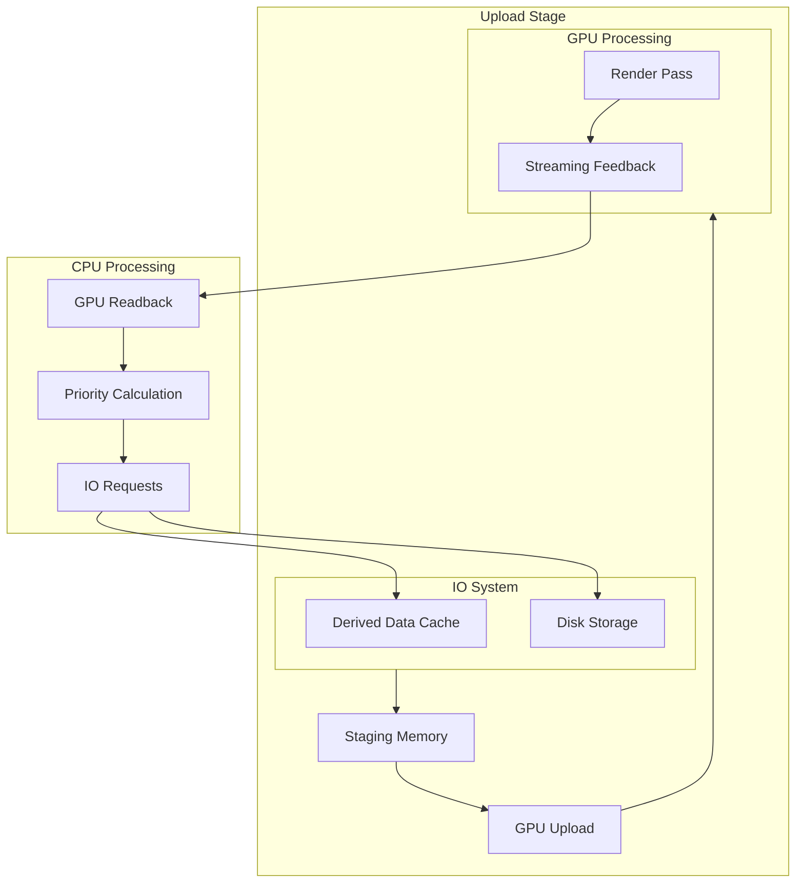
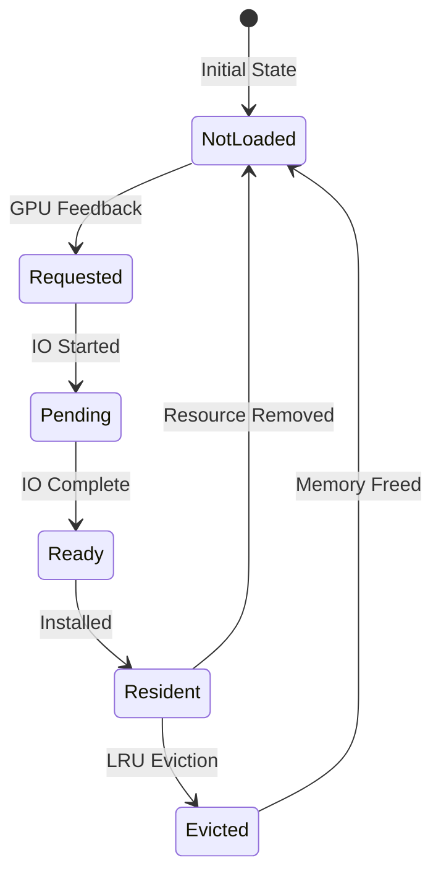
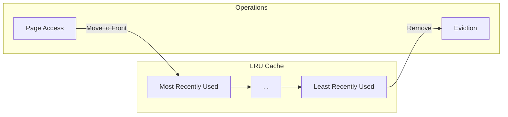
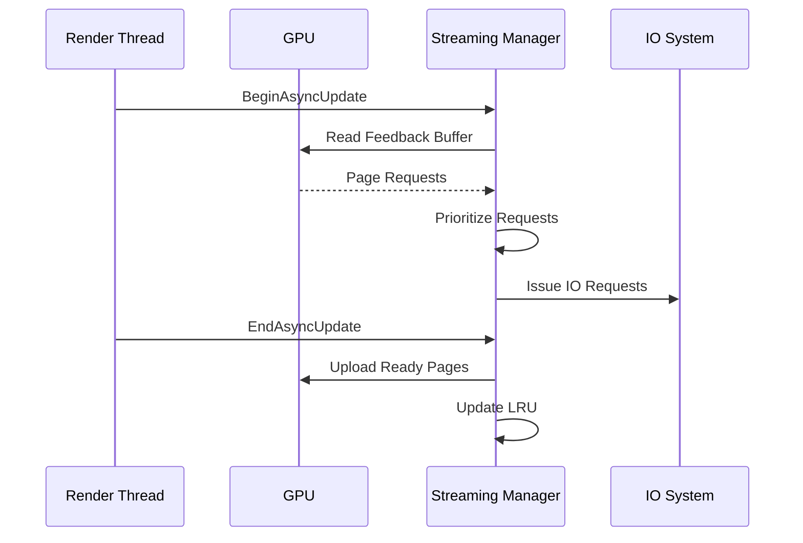
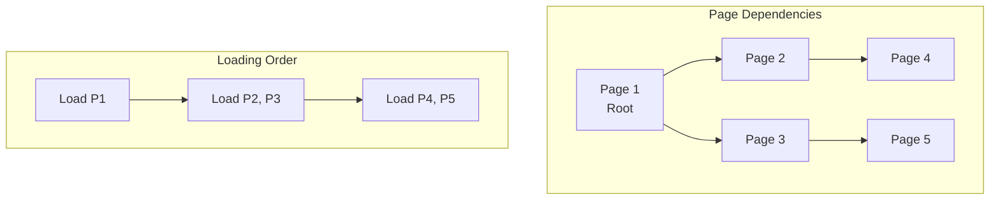
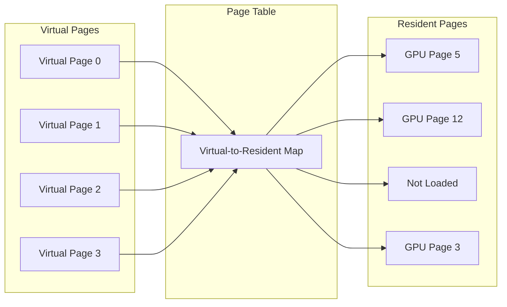

# Nanite Streaming System

## Overview

Nanite's streaming system is responsible for dynamically loading geometry data on demand based on visibility and screen coverage. This virtualized approach allows scenes with massive geometric complexity without requiring all data to be resident in memory simultaneously.

## Streaming Architecture



## FStreamingManager

The [`FStreamingManager`](../Engine/Source/Runtime/Engine/Public/Rendering/NaniteStreamingManager.h#L68) class is the central controller for all Nanite streaming operations.

```cpp
class FStreamingManager : public FRenderResource
{
public:
    FStreamingManager();
    
    virtual void InitRHI(FRHICommandListBase& RHICmdList) override;
    virtual void ReleaseRHI() override;

    void Add(FResources* Resources);
    void Remove(FResources* Resources);

    void BeginAsyncUpdate(FRDGBuilder& GraphBuilder);
    void EndAsyncUpdate(FRDGBuilder& GraphBuilder);
    bool IsAsyncUpdateInProgress();
    bool IsSafeForRendering() const;

    FRDGBuffer* GetStreamingRequestsBuffer(FRDGBuilder& GraphBuilder) const;
    FRDGBufferSRV* GetHierarchySRV(FRDGBuilder& GraphBuilder) const;
    FRDGBufferSRV* GetClusterPageDataSRV(FRDGBuilder& GraphBuilder) const;
    FRDGBufferSRV* GetImposterDataSRV(FRDGBuilder& GraphBuilder) const;

    uint32 GetStreamingRequestsBufferVersion() const;
    float GetQualityScaleFactor() const;
    uint32 GetMaxStreamingPages() const;
    uint32 GetMaxHierarchyLevels() const;

    void PrefetchResource(const FResources* Resource, uint32 NumFramesUntilRender);
    void RequestNanitePages(TArrayView<uint32> RequestData);
};
```

## Page Key System

### FPageKey

The [`FPageKey`](../Engine/Source/Runtime/Engine/Public/Rendering/NaniteStreamingManager.h#L28) uniquely identifies a page within a resource.

```cpp
struct FPageKey
{
    uint32 RuntimeResourceID = INDEX_NONE;
    uint32 PageIndex = INDEX_NONE;

    friend inline uint32 GetTypeHash(const FPageKey& Key)
    {
        return Key.RuntimeResourceID * 0xFC6014F9u + Key.PageIndex * 0x58399E77u;
    }

    bool operator==(const FPageKey& Other) const;
    bool operator!=(const FPageKey& Other) const;
    bool operator<(const FPageKey& Other) const;
};
```

### FStreamingRequest

The [`FStreamingRequest`](../Engine/Source/Runtime/Engine/Public/Rendering/NaniteStreamingManager.h#L54) pairs a page key with its streaming priority.

```cpp
struct FStreamingRequest
{
    FPageKey Key;
    uint32   Priority;  // Higher = more important
    
    bool operator<(const FStreamingRequest& Other) const;
};
```

## Page Management

### Page Lifecycle



### Internal Structures

#### FPendingPage

Tracks pages currently being loaded:

```cpp
struct FPendingPage
{
    FIoBuffer               RequestBuffer;
    FBulkDataBatchReadRequest Request;

    uint32      GPUPageIndex;
    FPageKey    InstallKey;
    uint32      RingBufferAllocationSize;
    uint32      BytesLeftToStream;
    uint32      RetryCount;
};
```

#### FResidentPage

Tracks pages currently in GPU memory:

```cpp
struct FResidentPage
{
    FPageKey    Key;
    uint8       MaxHierarchyDepth;
};
```

#### FRootPageInfo

Contains information about always-resident root pages:

```cpp
struct FRootPageInfo
{
    FFixupChunk*    FixupChunk;
    uint8           MaxHierarchyDepth;

    // Per-resource properties
    FResources*     Resources;
    uint32          RuntimeResourceID;
    uint32          VirtualPageRangeStart;
    uint32          NumRootPages;
    uint32          NumTotalPages;

    uint32          bInvalidResource : 1;
};
```

## Memory Management

### Heap Buffers

```cpp
struct FHeapBuffer
{
    int32                           TotalUpload;
    FSpanAllocator                  Allocator;
    FRDGScatterUploadBuffer         UploadBuffer;
    TRefCountPtr<FRDGPooledBuffer>  DataBuffer;
};
```

The streaming manager maintains three main heap buffers:

| Buffer | Description |
|--------|-------------|
| `ClusterPageData` | Cluster geometry and attributes |
| `Hierarchy` | BVH hierarchy nodes |
| `ImposterData` | Imposter atlas data |

### LRU Cache

The streaming manager implements an LRU (Least Recently Used) cache for page eviction:



## Streaming Flow

### Per-Frame Update



### Request Processing

```cpp
void FStreamingManager::AsyncUpdate()
{
    // 1. Process GPU feedback
    AddPendingGPURequests();
    
    // 2. Process explicit requests
    AddPendingExplicitRequests();
    
    // 3. Process prefetch requests
    AddPendingResourcePrefetchRequests();
    
    // 4. Add parent page requests
    AddParentRequests();
    
    // 5. Select highest priority pages
    SelectHighestPriorityPagesAndUpdateLRU(MaxSelectedPages);
    
    // 6. Install ready pages
    InstallReadyPages(NumReadyOrSkippedPages);
}
```

## Page Dependencies

### Dependency Resolution

Pages can depend on other pages for fixup references:



### Fixup System

When pages are installed, fixup operations update references:

```cpp
void ApplyFixups(
    const FFixupChunk& FixupChunk,
    const FResources& Resources,
    const TSet<uint32>* NoWriteGPUPages,
    uint32 NumStreamingPages,
    uint32 PageToExclude,
    uint32 VirtualPageRangeStart,
    bool bUninstall,
    bool bAllowReconsider,
    bool bAllowReinstall
);
```

## Quality Scaling

### Quality Scale Factor

The streaming manager maintains a quality scale factor based on available memory:

```cpp
float GetQualityScaleFactor() const
{
    return QualityScaleFactor;
}
```

This factor affects:
- LOD selection threshold
- Page streaming priority
- Memory budget allocation

## Streaming Statistics

The streaming manager tracks various statistics:

| Statistic | Description |
|-----------|-------------|
| `StatNumRootPages` | Current root page count |
| `StatPeakRootPages` | Peak root page count |
| `StatVisibleSetSize` | Size of visible page set |
| `StatPrevUpdateTime` | Last update duration |
| `StatNumAllocatedRootPages` | Allocated root pages |
| `StatNumHierarchyNodes` | Hierarchy node count |
| `StatPeakHierarchyNodes` | Peak hierarchy nodes |
| `StatStreamingPoolPercentage` | Pool utilization |

## Editor Integration

### Request Recording

For editor tools, the streaming manager supports request recording:

```cpp
#if WITH_EDITOR
uint64 GetRequestRecordBuffer(TArray<uint32>& OutRequestData);
void SetRequestRecordBuffer(uint64 Handle);
#endif
```

This enables:
- Debugging streaming behavior
- Capturing page request patterns
- Performance analysis

## Virtual Page System

### Virtual to Resident Mapping



### FRegisteredVirtualPage

```cpp
struct FRegisteredVirtualPage
{
    uint32 Priority;            // Priority != 0 means referenced this frame
    uint32 RegisteredPageIndex;
};
```

## Prefetching

### Resource Prefetch

The streaming manager supports prefetching for anticipated resource usage:

```cpp
void PrefetchResource(const FResources* Resource, uint32 NumFramesUntilRender);
```

This is useful for:
- Level streaming preparation
- Anticipated camera movement
- Cutscene preparation

## Global Access

The streaming manager is accessible globally:

```cpp
extern ENGINE_API TGlobalResource<FStreamingManager> GStreamingManager;
```

## Related Documents

- [Overview](01_Overview.md) - System introduction
- [Data Structures](02_DataStructures.md) - Page and resource structures
- [Rendering Pipeline](03_RenderingPipeline.md) - How streaming feeds rendering
- [Materials and Shading](05_MaterialsAndShading.md) - Material system
