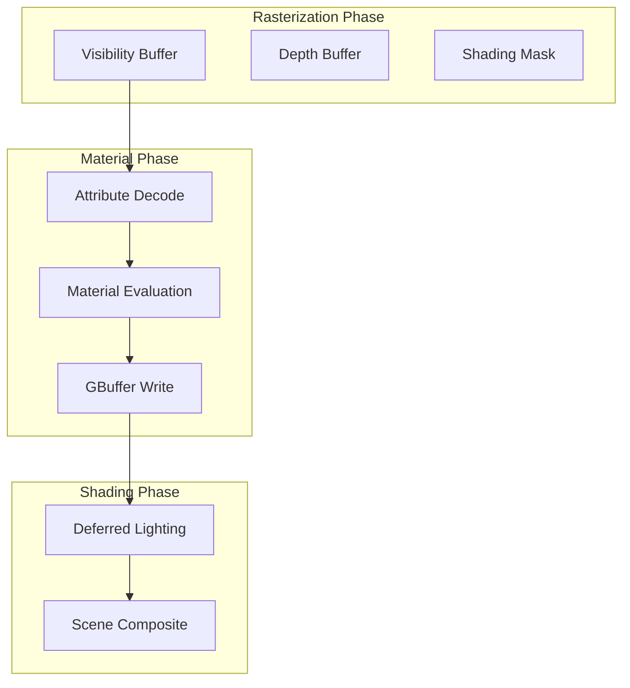
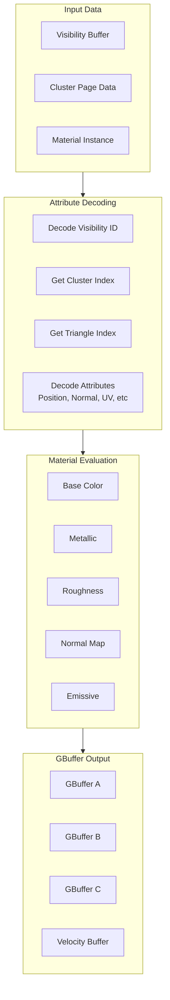

# Nanite Materials and Shading

## Overview

Nanite uses a deferred shading approach with visibility buffer rendering. This document explains how materials are handled, from rasterization to final shading.

## Material Architecture



## Raster Bin System

### FNaniteRasterBin

The [`FNaniteRasterBin`](../Engine/Source/Runtime/Renderer/Private/Nanite/NaniteShared.h#L571) identifies a unique rasterization configuration.

```cpp
struct FNaniteRasterBin
{
    int32  BinId = INDEX_NONE;
    uint16 BinIndex = 0xFFFFu;

    bool operator==(const FNaniteRasterBin& Other) const;
    bool operator!=(const FNaniteRasterBin& Other) const;
    bool IsValid() const;
};
```

### FNaniteRasterPipeline

The [`FNaniteRasterPipeline`](../Engine/Source/Runtime/Renderer/Private/Nanite/NaniteShared.h#L538) defines all parameters for a rasterization configuration.

```cpp
struct FNaniteRasterPipeline
{
    const FMaterialRenderProxy* RasterMaterial;

    FDisplacementScaling DisplacementScaling;
    FDisplacementFadeRange DisplacementFadeRange;

    // Feature flags
    bool bIsTwoSided : 1;
    bool bWPOEnabled : 1;             // World Position Offset
    bool bDisplacementEnabled : 1;
    bool bPerPixelEval : 1;           // Per-pixel material evaluation
    bool bSplineMesh : 1;
    bool bSkinnedMesh : 1;
    bool bVoxel : 1;
    bool bHasWPODistance : 1;
    bool bHasPixelDistance : 1;
    bool bHasDisplacementFadeOut : 1;
    bool bFixedDisplacementFallback : 1;
    bool bCastShadow : 1;
    bool bVertexUVs : 1;
    bool bFirstPersonLerp : 1;

    static FNaniteRasterPipeline GetFixedFunctionPipeline(uint8 BinMask);
    uint32 GetPipelineHash() const;
    bool GetFallbackPipeline(FNaniteRasterPipeline& OutFallback) const;
};
```

### Raster Pipeline Management

The [`FNaniteRasterPipelines`](../Engine/Source/Runtime/Renderer/Private/Nanite/NaniteShared.h#L716) class manages all registered raster pipelines.

```cpp
class FNaniteRasterPipelines
{
public:
    FNaniteRasterPipelines();
    ~FNaniteRasterPipelines();

    void AllocateFixedFunctionBins();
    void ReleaseFixedFunctionBins();
    void ReloadFixedFunctionBins();

    uint16 AllocateBin(bool bPerPixelEval);
    void ReleaseBin(uint16 BinIndex);

    bool IsBinAllocated(uint16 BinIndex) const;
    uint32 GetRegularBinCount() const;
    uint32 GetBinCount() const;

    FNaniteRasterBin Register(const FNaniteRasterPipeline& InRasterPipeline);
    void Unregister(const FNaniteRasterBin& InRasterBin);

    const FNaniteRasterPipelineMap& GetRasterPipelineMap() const;
    FNaniteRasterBinIndexTranslator GetBinIndexTranslator() const;

    // Custom pass support
    void RegisterBinForCustomPass(uint16 BinIndex);
    void UnregisterBinForCustomPass(uint16 BinIndex);
    bool ShouldBinRenderInCustomPass(uint16 BinIndex) const;
};
```

## Shading Bin System

### FNaniteShadingBin

The [`FNaniteShadingBin`](../Engine/Source/Runtime/Renderer/Private/Nanite/NaniteShared.h#L775) identifies a unique shading configuration.

```cpp
struct FNaniteShadingBin
{
    int32  BinId = INDEX_NONE;
    uint16 BinIndex = 0xFFFFu;

    bool operator==(const FNaniteShadingBin& Other) const;
    bool operator!=(const FNaniteShadingBin& Other) const;
    bool IsValid() const;
};
```

### FNaniteShadingPipeline

The [`FNaniteShadingPipeline`](../Engine/Source/Runtime/Renderer/Private/Nanite/NaniteShared.h#L801) contains all data for material shading.

```cpp
struct FNaniteShadingPipeline
{
    TPimplPtr<FNaniteBasePassData> BasePassData;
    TPimplPtr<FNaniteLumenCardData> LumenCardData;
    TPimplPtr<FNaniteMaterialCacheData> MaterialCacheData;
    TPimplPtr<FMeshDrawShaderBindings> ShaderBindings;

    const FMaterialRenderProxy* MaterialProxy;
    const FMaterial* Material;
    FRHIComputeShader* ComputeShader;
    FRHIWorkGraphShader* WorkGraphShader;

#if WITH_DEBUG_VIEW_MODES
    uint32 InstructionCount;
    uint32 LWCComplexity;
#endif

    uint32 BoundTargetMask;
    uint32 ShaderBindingsHash;
    uint32 MaterialBitFlags;

    // Shading flags
    uint16 bIsTwoSided : 1;
    uint16 bIsMasked : 1;
    uint16 bNoDerivativeOps : 1;
    uint16 bVoxel : 1;

    uint32 GetPipelineHash() const;
};
```

## Material Shader Classes

### FNaniteGlobalShader

The [`FNaniteGlobalShader`](../Engine/Source/Runtime/Renderer/Private/Nanite/NaniteShared.h#L358) is the base class for Nanite global shaders.

```cpp
class FNaniteGlobalShader : public FGlobalShader
{
public:
    FNaniteGlobalShader() = default;
    FNaniteGlobalShader(const ShaderMetaType::CompiledShaderInitializerType& Initializer);
    
    static bool ShouldCompilePermutation(const FGlobalShaderPermutationParameters& Parameters)
    {
        return DoesPlatformSupportNanite(Parameters.Platform);
    }

    static void ModifyCompilationEnvironment(
        const FGlobalShaderPermutationParameters& Parameters,
        FShaderCompilerEnvironment& OutEnvironment);
};
```

### FNaniteMaterialShader

The [`FNaniteMaterialShader`](../Engine/Source/Runtime/Renderer/Private/Nanite/NaniteShared.h#L388) handles material-specific compilation.

```cpp
class FNaniteMaterialShader : public FMaterialShader
{
public:
    // Determine if material requires programmable vertex processing
    static bool IsVertexProgrammable(const FMaterialShaderParameters& MaterialParameters, bool bHWRasterShader);
    static bool IsVertexProgrammable(uint32 MaterialBitFlags);

    // Determine if material requires programmable pixel processing
    static bool IsPixelProgrammable(const FMaterialShaderParameters& MaterialParameters);
    static bool IsPixelProgrammable(uint32 MaterialBitFlags);

    // Permutation compilation control
    static bool ShouldCompilePixelPermutation(const FMaterialShaderPermutationParameters& Parameters);
    static bool ShouldCompileVertexPermutation(const FMaterialShaderPermutationParameters& Parameters);
    static bool ShouldCompileComputePermutation(const FMaterialShaderPermutationParameters& Parameters);
};
```

### Programmable Material Detection

Materials are classified as programmable based on their features:

| Vertex Programmable | Pixel Programmable |
|--------------------|-------------------|
| World Position Offset | Masked opacity |
| Vertex Interpolators | Pixel Depth Offset |
| Custom UVs | |
| Tessellation (SW) | |
| Material Cache Output | |
| First Person Interpolation | |

## Shading Commands

### FNaniteShadingCommand

The [`FNaniteShadingCommand`](../Engine/Source/Runtime/Renderer/Private/Nanite/NaniteShared.h#L924) represents a single shading dispatch.

```cpp
struct FNaniteShadingCommand
{
    TSharedPtr<FNaniteShadingPipeline> Pipeline;
    FUint32Vector4 PassData;
    uint16 ShadingBin = 0xFFFFu;
    bool bVisible = true;

    // PSO precache state
    EPSOPrecacheResult PSOPrecacheState = EPSOPrecacheResult::Unknown;
};
```

### FNaniteShadingCommands

The [`FNaniteShadingCommands`](../Engine/Source/Runtime/Renderer/Private/Nanite/NaniteShared.h#L935) manages all shading commands for a pass.

```cpp
struct FNaniteShadingCommands
{
    using FMetaBufferArray = TArray<FUintVector4, SceneRenderingAllocator>;

    uint32 MaxShadingBin = 0u;
    uint32 NumCommands = 0u;
    uint32 BoundTargetMask = 0x0u;
    FShaderBundleRHIRef ShaderBundle;
    TArray<FNaniteShadingCommand> Commands;
    TArray<int32> CommandLookup;
    FMetaBufferArray MetaBufferData;

    UE::Tasks::FTask SetupTask;
    UE::Tasks::FTask BuildCommandsTask;
};
```

## Material Slot System

### FNaniteMaterialSlot

From [`NaniteMaterials.h`](../Engine/Source/Runtime/Renderer/Private/Nanite/NaniteMaterials.h#L15):

```cpp
struct FNaniteMaterialSlot
{
    uint16 TriangleShadingBin;
    uint16 VoxelShadingBin;
    uint16 RasterBin;
    uint16 FallbackRasterBin;

    FNaniteMaterialSlot()
        : TriangleShadingBin(0xFFFF)
        , VoxelShadingBin(0xFFFF)
        , RasterBin(0xFFFF)
        , FallbackRasterBin(0xFFFF)
    {}
};
```

## Uniform Buffer Structures

### FNaniteShadingUniformParameters

The shading uniform buffer provides access to Nanite resources:

```cpp
BEGIN_GLOBAL_SHADER_PARAMETER_STRUCT(FNaniteShadingUniformParameters, )
    SHADER_PARAMETER_RDG_BUFFER_SRV(ByteAddressBuffer, ClusterPageData)
    SHADER_PARAMETER_RDG_BUFFER_SRV(ByteAddressBuffer, VisibleClustersSWHW)
    SHADER_PARAMETER_RDG_BUFFER_SRV(ByteAddressBuffer, HierarchyBuffer)
    SHADER_PARAMETER_RDG_BUFFER_SRV(ByteAddressBuffer, AssemblyTransforms)
    SHADER_PARAMETER_RDG_TEXTURE(Texture2D<uint>, ShadingMask)
    SHADER_PARAMETER_RDG_TEXTURE(Texture2D<UlongType>, VisBuffer64)
    SHADER_PARAMETER_RDG_TEXTURE(Texture2D<UlongType>, DbgBuffer64)
    SHADER_PARAMETER_RDG_TEXTURE(Texture2D<uint>, DbgBuffer32)

    SHADER_PARAMETER_RDG_BUFFER_SRV(ByteAddressBuffer, ShadingBinData)

    // Multi-view support
    SHADER_PARAMETER(uint32, MultiViewEnabled)
    SHADER_PARAMETER_RDG_BUFFER_SRV(StructuredBuffer<uint>, MultiViewIndices)
    SHADER_PARAMETER_RDG_BUFFER_SRV(StructuredBuffer<float4>, MultiViewRectScaleOffsets)
    SHADER_PARAMETER_RDG_BUFFER_SRV(StructuredBuffer<FPackedNaniteView>, InViews)
END_SHADER_PARAMETER_STRUCT()
```

### FNaniteRasterUniformParameters

The raster uniform buffer provides rendering parameters:

```cpp
BEGIN_GLOBAL_SHADER_PARAMETER_STRUCT(FNaniteRasterUniformParameters, )
    SHADER_PARAMETER(FIntVector4, PageConstants)
    SHADER_PARAMETER(uint32, MaxNodes)
    SHADER_PARAMETER(uint32, MaxVisibleClusters)
    SHADER_PARAMETER(uint32, MaxCandidatePatches)
    SHADER_PARAMETER(uint32, MaxPatchesPerGroup)
    SHADER_PARAMETER(uint32, MeshPass)
    SHADER_PARAMETER(float, InvDiceRate)
    SHADER_PARAMETER(uint32, RenderFlags)
    SHADER_PARAMETER(uint32, DebugFlags)
END_SHADER_PARAMETER_STRUCT()
```

## Material Cache System

### FNaniteRasterMaterialCache

The [`FNaniteRasterMaterialCache`](../Engine/Source/Runtime/Renderer/Private/Nanite/NaniteShared.h#L645) caches compiled material shaders.

```cpp
struct FNaniteRasterMaterialCache
{
    const FMaterial* VertexMaterial;
    const FMaterial* PixelMaterial;
    const FMaterial* ComputeMaterial;
    const FMaterialRenderProxy* VertexMaterialProxy;
    const FMaterialRenderProxy* PixelMaterialProxy;
    const FMaterialRenderProxy* ComputeMaterialProxy;

    TShaderRef<FHWRasterizePS> RasterPixelShader;
    TShaderRef<FHWRasterizeVS> RasterVertexShader;
    TShaderRef<FHWRasterizeMS> RasterMeshShader;
    TShaderRef<FMicropolyRasterizeCS> ClusterComputeShader;
    TShaderRef<FMicropolyRasterizeCS> PatchComputeShader;

    TOptional<uint32> MaterialBitFlags;
    TOptional<FDisplacementScaling> DisplacementScaling;
    TOptional<FDisplacementFadeRange> DisplacementFadeRange;

    bool bFinalized = false;
};
```

### FNaniteRasterMaterialCacheKey

The [`FNaniteRasterMaterialCacheKey`](../Engine/Source/Runtime/Renderer/Private/Nanite/NaniteShared.h#L592) uniquely identifies cache entries.

```cpp
struct FNaniteRasterMaterialCacheKey
{
    union
    {
        struct
        {
            uint32 FeatureLevel                 : 3;
            uint32 bWPOEnabled                  : 1;
            uint32 bPerPixelEval                : 1;
            uint32 bUseMeshShader               : 1;
            uint32 bUsePrimitiveShader          : 1;
            uint32 bDisplacementEnabled         : 1;
            uint32 bVisualizeActive             : 1;
            uint32 bHasVirtualShadowMap         : 1;
            uint32 bIsDepthOnly                 : 1;
            uint32 bIsTwoSided                  : 1;
            uint32 bCastShadow                  : 1;
            uint32 bVoxel                       : 1;
            uint32 bSplineMesh                  : 1;
            uint32 bSkinnedMesh                 : 1;
            uint32 bFixedDisplacementFallback   : 1;
            uint32 bUseWorkGraphSW              : 1;
            uint32 bUseWorkGraphHW              : 1;
        };
        uint32 Packed = 0;
    };
};
```

## Visibility System

### FNaniteVisibilityResults

From [`NaniteVisibility.h`](../Engine/Source/Runtime/Renderer/Private/Nanite/NaniteVisibility.h#L10):

```cpp
class FNaniteVisibilityResults
{
public:
    void SetRasterBinIndexTranslator(const FNaniteRasterBinIndexTranslator InTranslator);

    bool IsRasterBinVisible(uint32 RasterBinIndex) const;
    bool IsShadingBinVisible(uint32 ShadingBinIndex) const;
    bool IsShadingDrawVisible(uint32 ShadingDrawId) const;

private:
    TSet<uint32> VisibleRasterBins;
    TSet<uint32> VisibleShadingBins;
    TSet<uint32> VisibleCustomDepthPrimitives;
    FNaniteRasterBinIndexTranslator BinIndexTranslator;
    uint32 TotalRasterBins;
    uint32 TotalShadingBins;
};
```

### FNaniteVisibility

The [`FNaniteVisibility`](../Engine/Source/Runtime/Renderer/Private/Nanite/NaniteVisibility.h#L81) class manages visibility queries.

```cpp
class FNaniteVisibility
{
public:
    FNaniteVisibility();

    FNaniteVisibilityQuery* BeginVisibilityQuery(
        FSceneRenderingBulkObjectAllocator& Allocator,
        const FScene* Scene,
        const TConstArrayView<FConvexVolume>& ViewList,
        const class FNaniteRasterPipelines* RasterPipelines,
        const class FNaniteShadingPipelines* ShadingPipelines,
        const UE::Tasks::FTask& PrerequisiteTask = {}
    );
};
```

## Material Evaluation Flow



## Mesh Pass Types

From [`PrimitiveSceneInfo.h`](../Engine/Source/Runtime/Renderer/Public/PrimitiveSceneInfo.h#L242):

```cpp
namespace ENaniteMeshPass
{
    enum Type : uint8
    {
        BasePass = 0,
        LumenCardCapture,
        // ... additional passes
        Num
    };
}
```

## Related Documents

- [Overview](01_Overview.md) - System introduction
- [Data Structures](02_DataStructures.md) - Cluster material info
- [Rendering Pipeline](03_RenderingPipeline.md) - Rasterization integration
- [Streaming System](04_StreamingSystem.md) - Material data streaming
