# Nanite Architecture and Underlying Principles

## Overview

This document provides detailed architectural structure diagrams, timing diagrams, and the underlying principles behind Unreal Engine 5's Nanite virtualized geometry system. It serves as a complement to the existing documentation by focusing on the theoretical foundations and complete system architecture.

## Table of Contents

1. [Complete System Architecture](#complete-system-architecture)
2. [Build-Time Pipeline Architecture](#build-time-pipeline-architecture)
3. [Runtime Pipeline Architecture](#runtime-pipeline-architecture)
4. [Frame Timing Diagrams](#frame-timing-diagrams)
5. [Underlying Principles](#underlying-principles)
6. [Mathematical Foundations](#mathematical-foundations)
7. [References](#references)

---

## Complete System Architecture

### High-Level System Overview

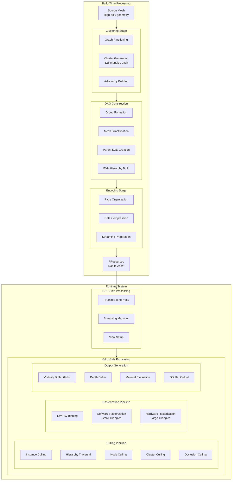

### Module Dependency Graph

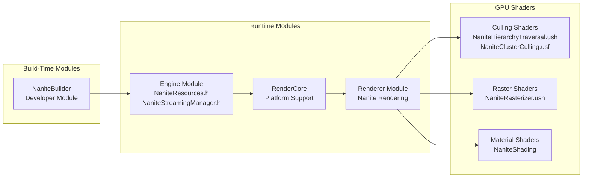

---

## Build-Time Pipeline Architecture

### Cluster DAG Construction

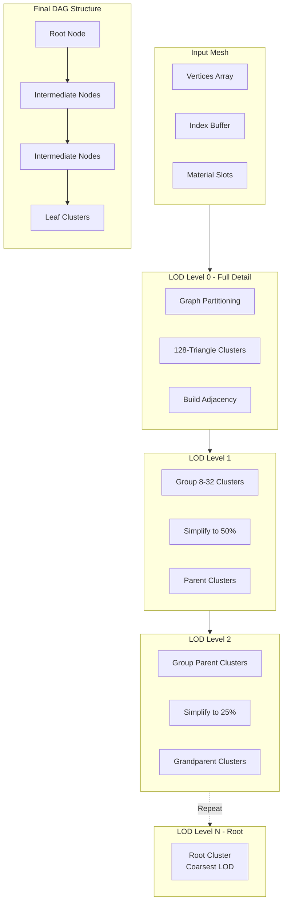

### Page Organization

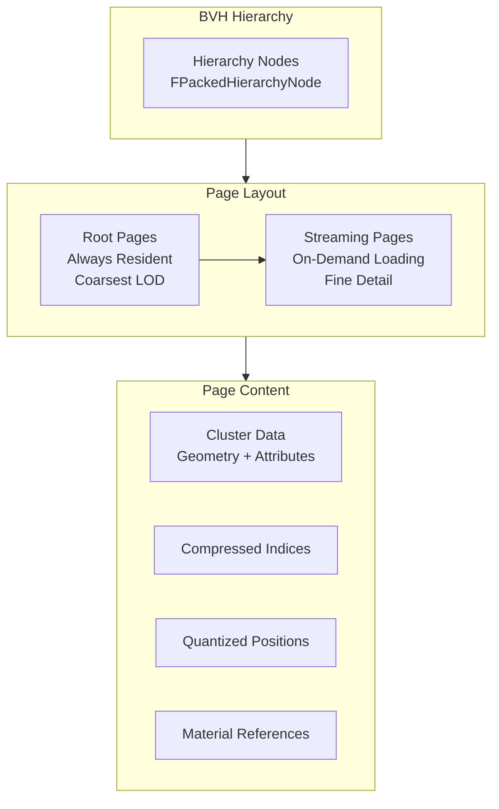

---

## Runtime Pipeline Architecture

### GPU Culling Pipeline

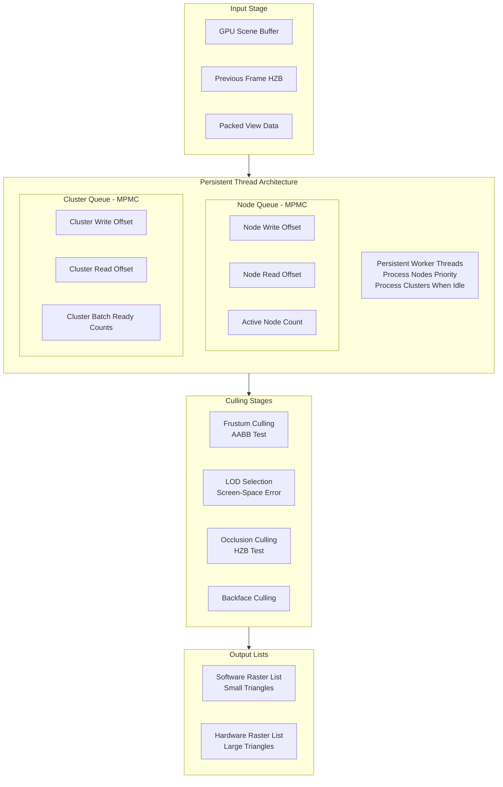

### Hybrid Rasterization

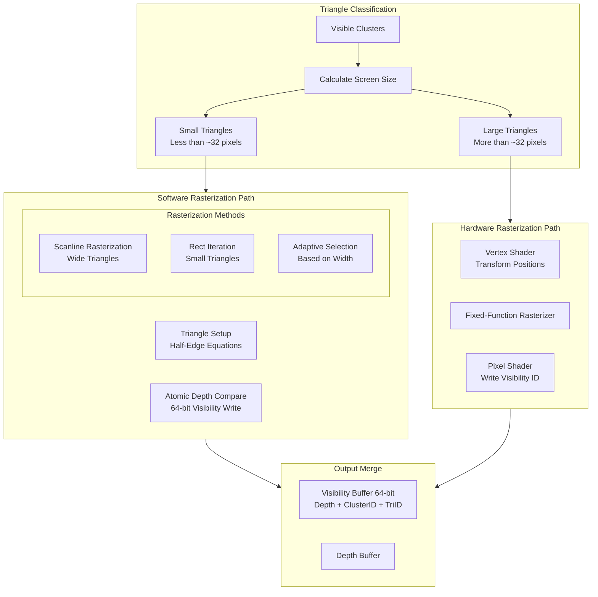

---

## Frame Timing Diagrams

### Single Frame Rendering Sequence

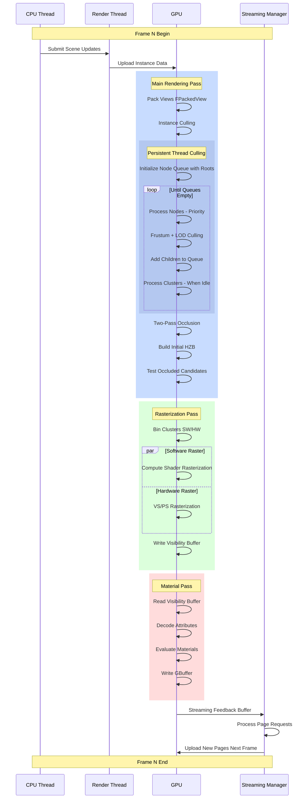

### Streaming System Timing

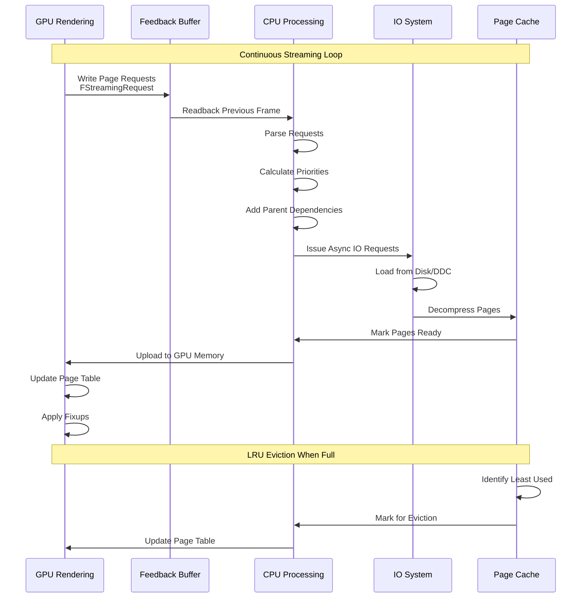

### Two-Pass Occlusion Culling

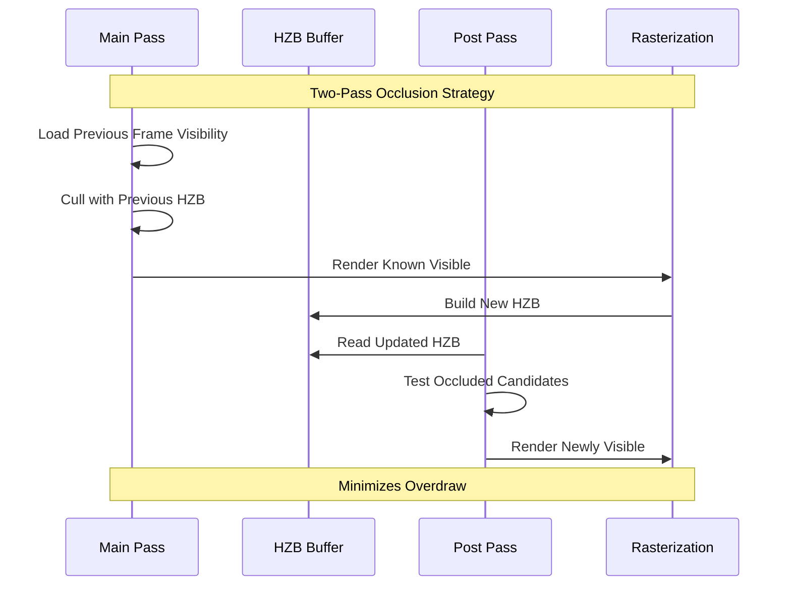

---

## Underlying Principles

### 1. Virtualized Geometry Principle

The fundamental principle behind Nanite is treating geometry similar to virtual texturing:

```
Traditional Rendering:
- All mesh LODs loaded into memory
- CPU selects discrete LOD level
- Entire mesh rendered at selected LOD

Nanite Virtualized Geometry:
- Only visible geometry regions loaded
- GPU selects continuous LOD per-cluster
- Fine-grained streaming based on visibility
```

**Key Insight**: Just as virtual texturing streams texture pages based on screen coverage, Nanite streams geometry pages based on visibility and screen-space error.

### 2. Cluster-Based Architecture Principle

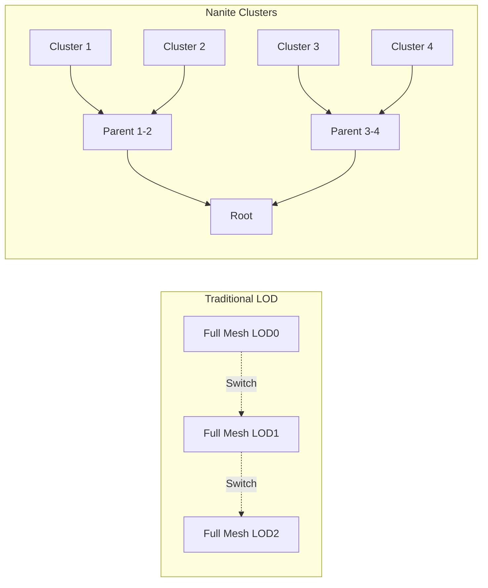

**Principle**: Decomposing meshes into small clusters enables:
- Independent LOD selection per cluster
- Fine-grained streaming
- Efficient GPU culling
- Smooth LOD transitions without popping

### 3. GPU-Driven Rendering Principle

```
CPU-Driven (Traditional):
1. CPU traverses scene graph
2. CPU performs culling
3. CPU issues draw calls
4. GPU executes draws

GPU-Driven (Nanite):
1. CPU uploads scene data once
2. GPU performs all culling
3. GPU determines what to render
4. GPU rasterizes directly
```

**Benefits**:
- Eliminates CPU bottleneck
- Scales with GPU parallelism
- Handles millions of instances
- No draw call overhead

### 4. Persistent Thread Architecture

The persistent thread model solves the problem of dynamic work distribution on GPUs:

```cpp
// Traditional GPU Model
// Fixed number of threads mapped to fixed work
// Cannot dynamically spawn new threads

// Persistent Thread Model
// Fixed pool of worker threads
// Threads continuously consume from work queues
// Work items can add new items to queues
```

**Key Algorithm** from [`NaniteHierarchyTraversal.ush`](../Engine/Shaders/Private/Nanite/NaniteHierarchyTraversal.ush#L251):

```
while (queues not empty):
    if (node queue has work):
        process nodes (high priority)
        add visible children to node queue
        add leaf clusters to cluster queue
    else:
        process clusters (fill GPU while waiting)
```

### 5. Hybrid Rasterization Principle

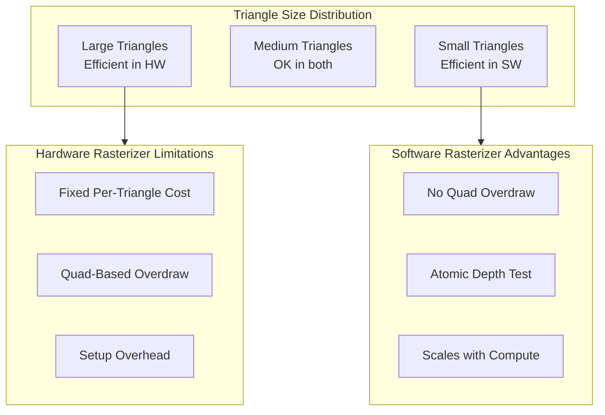

**Principle**: Hardware rasterizers have fixed per-triangle overhead that dominates for small triangles. Software rasterization using compute shaders can be more efficient for sub-pixel or few-pixel triangles.

---

## Mathematical Foundations

### 1. LOD Error Metric

The LOD selection is based on screen-space error:

```
ScreenError = ObjectSpaceError × ProjectedScale

Where:
- ObjectSpaceError = Simplification error from mesh reduction
- ProjectedScale = ObjectSize / Distance × ScreenWidth / FOV

Selection Rule:
- If ScreenError < MaxPixelsPerEdge: Use this LOD
- Else: Traverse to children for finer LOD
```

### 2. Software Rasterization Mathematics

From [`NaniteRasterizer.ush`](../Engine/Shaders/Private/Nanite/NaniteRasterizer.ush#L5):

**Half-Edge Function**:
```
Edge(P) = (V1 - V0) × (P - V0)
       = Edge.x × (P.y - V0.y) - Edge.y × (P.x - V0.x)

Point P is inside triangle if:
Edge01(P) ≥ 0 AND Edge12(P) ≥ 0 AND Edge20(P) ≥ 0
```

**Barycentric Coordinates**:
```
λ0 = Edge12(P) / (Edge01(P) + Edge12(P) + Edge20(P))
λ1 = Edge20(P) / (Edge01(P) + Edge12(P) + Edge20(P))
λ2 = Edge01(P) / (Edge01(P) + Edge12(P) + Edge20(P))

Attribute interpolation:
Attr(P) = λ0 × Attr0 + λ1 × Attr1 + λ2 × Attr2
```

**Depth Interpolation**:
```
Depth(P) = Z0 + (Z1 - Z0) × λ1 + (Z2 - Z0) × λ2
```

### 3. Cluster Grouping for Simplification

The DAG construction uses graph partitioning based on:

```
Cost(Cluster1, Cluster2) = SharedEdges / (Perimeter1 + Perimeter2)

Goal: Maximize internal edges, minimize boundary edges
This enables efficient simplification with minimal seams
```

### 4. BVH Node Structure

From [`NaniteResources.h`](../Engine/Source/Runtime/Engine/Public/Rendering/NaniteResources.h#L50):

```
Node contains up to NANITE_MAX_BVH_NODE_FANOUT children

For each child:
- LODBounds: Sphere for LOD selection
- BoxBounds: AABB for frustum culling
- MinLODError: Minimum error in subtree
- MaxParentLODError: Maximum error at parent level
- ChildStartReference: Index to children or cluster group
```

### 5. Visibility Buffer Format

```
64-bit Visibility Buffer Layout:
┌─────────────────────────────────────────────────────────────────┐
│ Bits 63-32: Depth (32-bit float)                                │
├─────────────────────────────────────────────────────────────────┤
│ Bits 31-7: Visible Cluster Index (25 bits)                      │
├─────────────────────────────────────────────────────────────────┤
│ Bits 6-0: Triangle Index (7 bits, max 128 per cluster)          │
└─────────────────────────────────────────────────────────────────┘
```

### 6. Streaming Priority Calculation

```
Priority = (PriorityCategory << 30) | (ScreenCoverage >> 2)

Where:
- PriorityCategory: 0-3 based on view importance
- ScreenCoverage: Estimated pixel coverage

Higher priority = Load first
LRU eviction when cache full
```

---

## References

### Academic Papers

1. **Cluster-Based Rendering**
   - Burley, B., & Lacewell, D. (2008). "Ptex: Per-Face Texture Mapping for Production Rendering"
   - Foundation for understanding cluster/page-based data organization

2. **GPU-Driven Rendering**
   - Wihlidal, G. (2015). "Optimizing the Graphics Pipeline with Compute"
   - GDC presentation on GPU-driven rendering techniques

3. **Software Rasterization**
   - Pineda, J. (1988). "A Parallel Algorithm for Polygon Rasterization"
   - Original half-edge rasterization algorithm used in Nanite

4. **Virtual Texturing**
   - Waveren, J. M. P. van (2009). "id Tech 5 Challenges: From Texture Virtualization to Massive Parallelization"
   - Conceptual foundation for virtualized geometry

5. **Mesh Simplification**
   - Garland, M., & Heckbert, P. S. (1997). "Surface Simplification Using Quadric Error Metrics"
   - Basis for LOD generation algorithms

6. **Hierarchical Occlusion Culling**
   - Greene, N., Kass, M., & Miller, G. (1993). "Hierarchical Z-Buffer Visibility"
   - Foundation for HZB-based occlusion culling

### Epic Games Resources

1. **GDC 2021: Nanite Deep Dive**
   - Karis, B., & Wihlidal, G. (2021)
   - Official presentation on Nanite architecture

2. **Unreal Engine Documentation**
   - [Nanite Virtualized Geometry](https://docs.unrealengine.com/5.0/en-US/nanite-virtualized-geometry-in-unreal-engine/)

3. **Unreal Engine Source Code**
   - [`Engine/Source/Runtime/Renderer/Private/Nanite/`](../Engine/Source/Runtime/Renderer/Private/Nanite/)
   - [`Engine/Shaders/Private/Nanite/`](../Engine/Shaders/Private/Nanite/)
   - [`Engine/Source/Developer/NaniteBuilder/`](../Engine/Source/Developer/NaniteBuilder/)

### Related Technologies

1. **Virtual Shadow Maps**
   - Closely integrated with Nanite for efficient shadow rendering
   - Uses same visibility buffer and culling infrastructure

2. **Lumen Global Illumination**
   - Uses Nanite for surface cache capture
   - Leverages Nanite's efficient geometry representation

3. **World Partition**
   - Streaming system works alongside Nanite page streaming
   - Level streaming integrated with geometry streaming

---

## Related Documents

- [01_Overview.md](01_Overview.md) - High-level introduction
- [02_DataStructures.md](02_DataStructures.md) - Detailed data structure documentation
- [03_RenderingPipeline.md](03_RenderingPipeline.md) - Rendering pipeline details
- [04_StreamingSystem.md](04_StreamingSystem.md) - Streaming system documentation
- [05_MaterialsAndShading.md](05_MaterialsAndShading.md) - Material handling
- [plans/nanite-deep-dive.md](plans/nanite-deep-dive.md) - Source code deep dive
