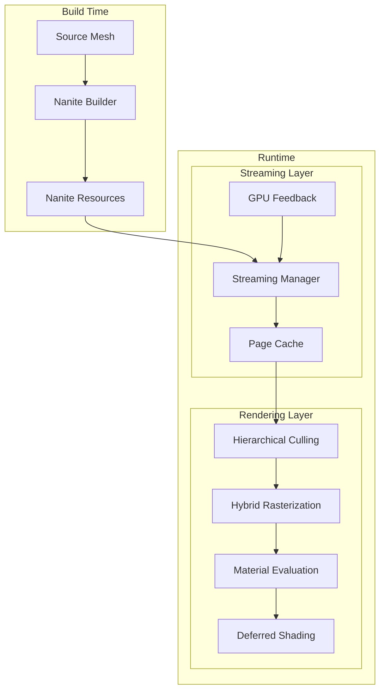

# Nanite Technical Documentation

## About This Documentation

This documentation provides a detailed technical explanation of Unreal Engine 5's Nanite virtualized geometry system. It is based on analysis of the UE5 engine source code and aims to help developers understand how Nanite works internally.

## Documentation Structure

| Document | Description |
|----------|-------------|
| [01_Overview.md](01_Overview.md) | High-level introduction to Nanite architecture and concepts |
| [02_DataStructures.md](02_DataStructures.md) | Detailed explanation of clusters, pages, hierarchy nodes, and resources |
| [03_RenderingPipeline.md](03_RenderingPipeline.md) | Culling, rasterization, and visibility buffer rendering |
| [04_StreamingSystem.md](04_StreamingSystem.md) | On-demand page streaming and memory management |
| [05_MaterialsAndShading.md](05_MaterialsAndShading.md) | Material evaluation, shading bins, and deferred shading |
| [06_Architecture_And_Principles.md](06_Architecture_And_Principles.md) | Complete system architecture diagrams, timing diagrams, and underlying principles |

## Quick Start

If you're new to Nanite, start with the [Overview](01_Overview.md) document which provides a high-level understanding of the system. Then proceed through the documents in order:

1. **Overview** - Understand what Nanite is and its key features
2. **Data Structures** - Learn how geometry data is organized
3. **Rendering Pipeline** - Understand the GPU-driven rendering process
4. **Streaming System** - Learn how data is streamed on demand
5. **Materials and Shading** - Understand material handling

## Source Code References

All documentation references source code from the Unreal Engine 5 repository. Key source locations:

### Renderer Module
[`Engine/Source/Runtime/Renderer/Private/Nanite/`](../Engine/Source/Runtime/Renderer/Private/Nanite/)

| File | Description |
|------|-------------|
| [`Nanite.h`](../Engine/Source/Runtime/Renderer/Private/Nanite/Nanite.h) | Main include header |
| [`NaniteShared.h`](../Engine/Source/Runtime/Renderer/Private/Nanite/NaniteShared.h) | Core definitions and structures |
| [`NaniteCullRaster.h`](../Engine/Source/Runtime/Renderer/Private/Nanite/NaniteCullRaster.h) | Culling and rasterization |
| [`NaniteVisibility.h`](../Engine/Source/Runtime/Renderer/Private/Nanite/NaniteVisibility.h) | Visibility system |
| [`NaniteMaterials.h`](../Engine/Source/Runtime/Renderer/Private/Nanite/NaniteMaterials.h) | Material handling |
| [`NaniteShading.h`](../Engine/Source/Runtime/Renderer/Private/Nanite/NaniteShading.h) | Shading commands |
| [`NaniteVisualize.h`](../Engine/Source/Runtime/Renderer/Private/Nanite/NaniteVisualize.h) | Debug visualization |
| [`NaniteComposition.h`](../Engine/Source/Runtime/Renderer/Private/Nanite/NaniteComposition.h) | Scene composition |
| [`NaniteRayTracing.h`](../Engine/Source/Runtime/Renderer/Private/Nanite/NaniteRayTracing.h) | Ray tracing integration |
| [`NaniteStreamOut.h`](../Engine/Source/Runtime/Renderer/Private/Nanite/NaniteStreamOut.h) | Geometry stream-out |
| [`NaniteFeedback.h`](../Engine/Source/Runtime/Renderer/Private/Nanite/NaniteFeedback.h) | GPU feedback |

### Engine Module
[`Engine/Source/Runtime/Engine/Public/Rendering/`](../Engine/Source/Runtime/Engine/Public/Rendering/)

| File | Description |
|------|-------------|
| [`NaniteResources.h`](../Engine/Source/Runtime/Engine/Public/Rendering/NaniteResources.h) | Resource structures |
| [`NaniteStreamingManager.h`](../Engine/Source/Runtime/Engine/Public/Rendering/NaniteStreamingManager.h) | Streaming manager |

### Scene Proxy
[`Engine/Source/Runtime/Engine/Public/`](../Engine/Source/Runtime/Engine/Public/)

| File | Description |
|------|-------------|
| [`NaniteSceneProxy.h`](../Engine/Source/Runtime/Engine/Public/NaniteSceneProxy.h) | Nanite scene proxy |

## System Architecture Diagram

## Key Concepts Summary

### Clusters
- Small groups of triangles (typically 64-128 triangles)
- Independently cullable and streamable
- Organized into pages for efficient streaming

### Hierarchy
- BVH-based structure for hierarchical culling
- Continuous LOD selection without discrete transitions
- GPU-driven traversal

### Pages
- Fixed-size memory chunks containing cluster data
- Root pages always resident
- Streaming pages loaded on demand

### Visibility Buffer
- 64-bit per-pixel visibility information
- Encodes instance, cluster, and triangle IDs
- Enables deferred material evaluation

### Streaming
- Priority-based page loading
- LRU cache for page management
- GPU feedback drives streaming decisions

## Platform Requirements

Nanite requires specific GPU capabilities:
- Shader Model 6.0 or higher
- 64-bit atomic operations
- Compute shader support
- Mesh shader support (optional, for enhanced performance)
- Work graph support (optional, for enhanced performance)

## Performance Considerations

### Best Practices
- Use Nanite for high-detail static geometry
- Avoid excessive masked materials
- Consider WPO impact on performance
- Monitor streaming budget usage

### Limitations
- Not suitable for skeletal meshes with many bones (limited support added in later versions)
- Transparency not supported
- Some material features have performance costs

## Version History

This documentation is based on Unreal Engine 5 source code. Nanite continues to evolve with new features being added in each engine version:

- **UE 5.0**: Initial Nanite release
- **UE 5.1**: Performance improvements, better masked material support
- **UE 5.2**: Tessellation support, improved streaming
- **UE 5.3**: World partition integration improvements
- **UE 5.4+**: Skeletal mesh support, work graph optimization

## Contributing

This documentation is generated from source code analysis. To suggest improvements or corrections, please refer to the official Unreal Engine documentation and source code.

## License

This documentation is for educational purposes and references Unreal Engine source code which is subject to the Unreal Engine End User License Agreement.
