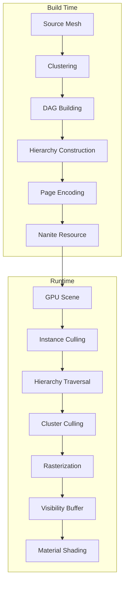
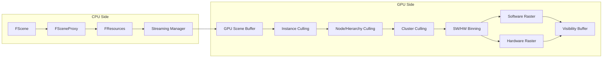
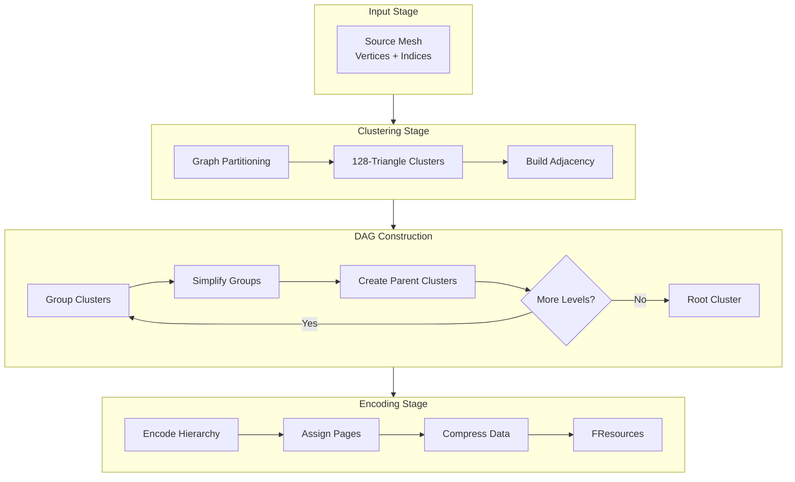
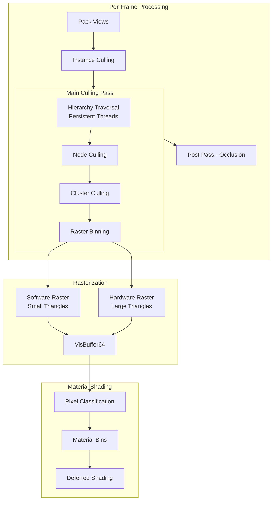
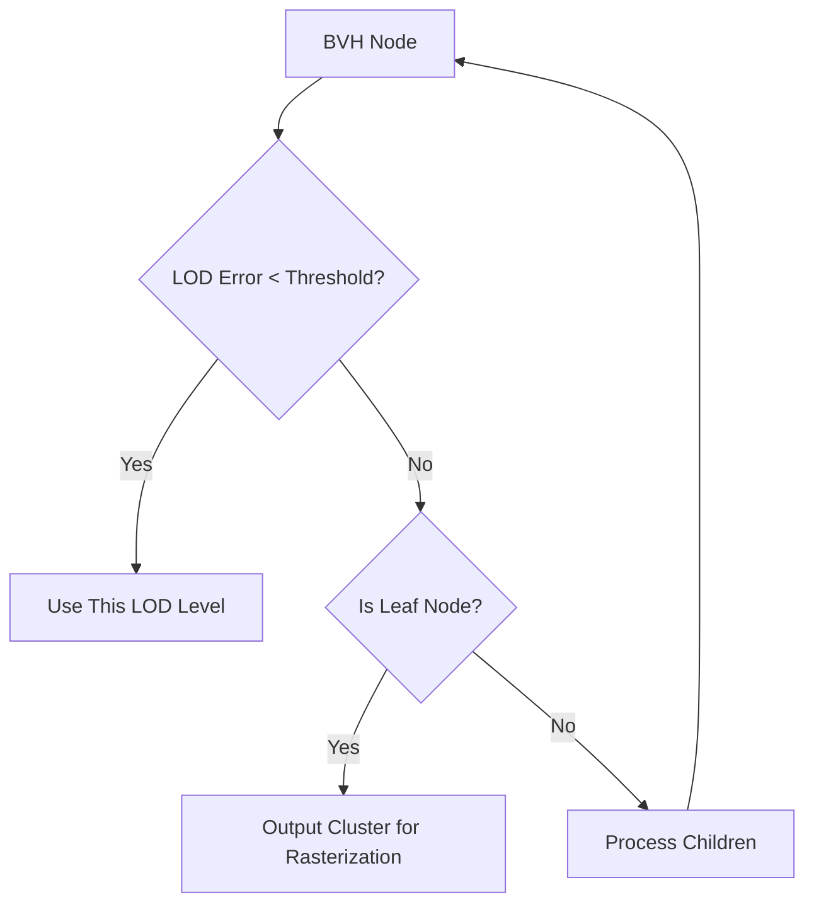
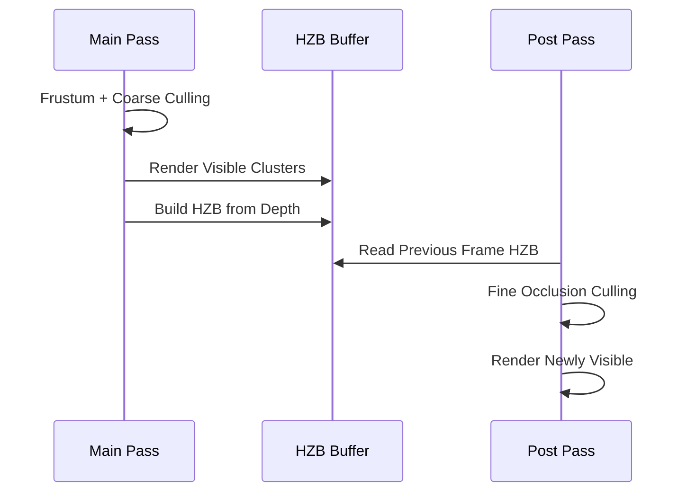
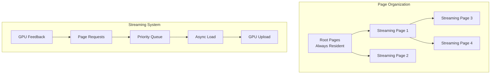

# Unreal Engine 5 Nanite Deep Dive - Source Code Analysis

## Table of Contents
1. [Overview](#overview)
2. [Source Code Structure](#source-code-structure)
3. [Core Architecture](#core-architecture)
4. [Build-Time Pipeline](#build-time-pipeline)
5. [Runtime Pipeline](#runtime-pipeline)
6. [Cluster Hierarchy & LOD System](#cluster-hierarchy--lod-system)
7. [GPU Culling System](#gpu-culling-system)
8. [Rasterization](#rasterization)
9. [Key Data Structures](#key-data-structures)
10. [Streaming System](#streaming-system)

---

## Overview

Nanite is Unreal Engine 5's virtualized geometry system that enables rendering of film-quality assets with billions of triangles in real-time. The key innovations include:

- **Virtualized Geometry**: Only visible detail is loaded and rendered
- **GPU-Driven Rendering**: Entire culling and LOD selection happens on the GPU
- **Software Rasterization**: Hybrid HW/SW rasterization for optimal performance
- **Streaming**: Geometry streamed on-demand based on visibility



---

## Source Code Structure

Based on the UE5 source code analysis, Nanite code is organized in three main locations:

### 1. NaniteBuilder (Build-Time Processing)
**Path:** [`Source/Developer/NaniteBuilder/`](../../Engine/Source/Developer/NaniteBuilder/)

| File | Purpose |
|------|---------|
| [`Private/Cluster.h`](../../Engine/Source/Developer/NaniteBuilder/Private/Cluster.h#L243) | Core cluster class - 128 triangles per cluster (`ClusterSize = 128`) |
| [`Private/ClusterDAG.h`](../../Engine/Source/Developer/NaniteBuilder/Private/ClusterDAG.h#L52) | Directed Acyclic Graph for cluster hierarchy |
| [`Private/GraphPartitioner.cpp`](../../Engine/Source/Developer/NaniteBuilder/Private/GraphPartitioner.cpp) | Mesh partitioning into clusters |
| [`Private/BVHCluster.cpp`](../../Engine/Source/Developer/NaniteBuilder/Private/BVHCluster.cpp) | BVH hierarchy construction |
| [`Private/Encode/`](../../Engine/Source/Developer/NaniteBuilder/Private/Encode/) | Various encoding stages |

### 2. Renderer (Runtime Rendering)
**Path:** [`Source/Runtime/Renderer/Private/Nanite/`](../../Engine/Source/Runtime/Renderer/Private/Nanite/)

| File | Purpose |
|------|---------|
| [`NaniteShared.h`](../../Engine/Source/Runtime/Renderer/Private/Nanite/NaniteShared.h#L34) | Core types: [`FPackedView`](../../Engine/Source/Runtime/Renderer/Private/Nanite/NaniteShared.h#L34), [`FGlobalResources`](../../Engine/Source/Runtime/Renderer/Private/Nanite/NaniteShared.h#L241) |
| [`NaniteCullRaster.h`](../../Engine/Source/Runtime/Renderer/Private/Nanite/NaniteCullRaster.h#L25) | [`ERasterScheduling`](../../Engine/Source/Runtime/Renderer/Private/Nanite/NaniteCullRaster.h#L25), [`FRasterContext`](../../Engine/Source/Runtime/Renderer/Private/Nanite/NaniteCullRaster.h#L65) |
| [`NaniteVisibility.cpp`](../../Engine/Source/Runtime/Renderer/Private/Nanite/NaniteVisibility.cpp) | Visibility determination |
| [`NaniteMaterials.cpp`](../../Engine/Source/Runtime/Renderer/Private/Nanite/NaniteMaterials.cpp) | Material binning and shading |
| [`NaniteStreamOut.cpp`](../../Engine/Source/Runtime/Renderer/Private/Nanite/NaniteStreamOut.cpp) | Geometry streaming output |

### 3. GPU Shaders
**Path:** [`Shaders/Private/Nanite/`](../../Engine/Shaders/Private/Nanite/)

| File | Purpose |
|------|---------|
| [`NaniteHierarchyTraversal.ush`](../../Engine/Shaders/Private/Nanite/NaniteHierarchyTraversal.ush#L251) | Persistent thread BVH traversal - [`PersistentNodeAndClusterCull()`](../../Engine/Shaders/Private/Nanite/NaniteHierarchyTraversal.ush#L251) |
| [`NaniteClusterCulling.usf`](../../Engine/Shaders/Private/Nanite/NaniteClusterCulling.usf) | Cluster-level culling |
| [`NaniteRasterizer.ush`](../../Engine/Shaders/Private/Nanite/NaniteRasterizer.ush#L5) | Software triangle rasterization - [`FRasterTri`](../../Engine/Shaders/Private/Nanite/NaniteRasterizer.ush#L5) |
| [`NaniteDataDecode.ush`](../../Engine/Shaders/Private/Nanite/NaniteDataDecode.ush#L47) | Cluster data decoding - [`FVisibleCluster`](../../Engine/Shaders/Private/Nanite/NaniteDataDecode.ush#L47), [`FCluster`](../../Engine/Shaders/Private/Nanite/NaniteDataDecode.ush#L67) |
| [`NaniteStreaming.ush`](../../Engine/Shaders/Private/Nanite/NaniteStreaming.ush#L9) | [`FStreamingRequest`](../../Engine/Shaders/Private/Nanite/NaniteStreaming.ush#L9) |

### 4. Core Resource Definitions
**Path:** [`Source/Runtime/Engine/Public/Rendering/`](../../Engine/Source/Runtime/Engine/Public/Rendering/)

| File | Purpose |
|------|---------|
| [`NaniteResources.h`](../../Engine/Source/Runtime/Engine/Public/Rendering/NaniteResources.h#L50) | [`FPackedHierarchyNode`](../../Engine/Source/Runtime/Engine/Public/Rendering/NaniteResources.h#L50), [`FPackedCluster`](../../Engine/Source/Runtime/Engine/Public/Rendering/NaniteResources.h#L92), [`FResources`](../../Engine/Source/Runtime/Engine/Public/Rendering/NaniteResources.h#L409) |
| [`NaniteDefinitions.h`](../../Engine/Source/Runtime/Engine/Public/Rendering/NaniteDefinitions.h) | Compile-time constants |

---

## Core Architecture

### High-Level System Architecture



### Key Classes and Their Relationships

From [`NaniteShared.h`](../../Engine/Source/Runtime/Renderer/Private/Nanite/NaniteShared.h):

```cpp
// Core runtime resource management (line 241)
class FGlobalResources : public FRenderResource {
    PassBuffers MainPassBuffers;
    PassBuffers PostPassBuffers;
    TRefCountPtr<FRDGPooledBuffer> CandidateNodesBuffer;
    TRefCountPtr<FRDGPooledBuffer> ClusterBatchesBuffer;
    // Statistics and debugging
};

// Packed view for GPU consumption (line 34)
struct FPackedView {
    FMatrix44f  SVPositionToTranslatedWorld;
    FMatrix44f  TranslatedWorldToClip;
    FVector2f   LODScales;
    // ... 40+ more fields for culling/rendering
};
```

---

## Build-Time Pipeline

The build-time pipeline converts source meshes into Nanite's hierarchical cluster format.



### Cluster Definition

From [`Cluster.h`](../../Engine/Source/Developer/NaniteBuilder/Private/Cluster.h#L202):

```cpp
class FCluster {
public:
    static const uint32 ClusterSize = 128;  // Max triangles per cluster (line 243)
    
    uint32 NumTris = 0;                     // (line 245)
    FVertexArray Verts;                     // (line 247)
    TArray<uint32> Indexes;                 // (line 248)
    TArray<int32> MaterialIndexes;          // (line 249)
    
    // Bounding information (line 272-285)
    FBounds3f Bounds;
    FSphere3f SphereBounds;
    FSphere3f LODBounds;
    
    // LOD data
    float LODError = 0.0f;                  // (line 281)
    int32 MipLevel = 0;                     // (line 274)
    
    // Hierarchy linkage (line 287-289)
    uint32 GroupIndex = MAX_uint32;
    uint32 GeneratingGroupIndex = MAX_uint32;
    
    // Methods (line 225-230)
    float Simplify(const FClusterDAG& DAG, uint32 TargetNumTris, float TargetError);
    FAdjacency BuildAdjacency() const;
    void Split(FGraphPartitioner& Partitioner, const FAdjacency& Adjacency) const;
};
```

### Cluster DAG (Directed Acyclic Graph)

From [`ClusterDAG.h`](../../Engine/Source/Developer/NaniteBuilder/Private/ClusterDAG.h#L20):

```cpp
struct FClusterGroup {
    FSphere3f   Bounds;                     // (line 22)
    FSphere3f   LODBounds;                  // (line 23)
    float       ParentLODError = 0.0f;      // (line 24)
    int32       MipLevel = 0;               // (line 25)
    TArray<FClusterRef> Children;           // (line 32)
};

class FClusterDAG {                         // (line 52)
public:
    TArray<FCluster>       Clusters;        // (line 75) - All clusters at all LOD levels
    TArray<FClusterGroup>  Groups;          // (line 76) - Grouping information
    
    void AddMesh(...);                      // (line 57) - Initial mesh input
    void ReduceMesh(uint32 MeshIndex);      // (line 66) - Build LOD hierarchy
    void ReduceGroup(...);                  // (line 120) - Simplify a group of clusters
};
```

### Build Process Flow

1. **Initial Clustering**: Source mesh is partitioned into ~128 triangle clusters using graph partitioning
2. **Adjacency Building**: Edge connectivity between clusters is computed
3. **Group Formation**: Adjacent clusters are grouped (typically 8-32 clusters)
4. **Simplification**: Each group is simplified to create parent LOD
5. **Recursion**: Process repeats until a single root cluster remains
6. **Encoding**: Final hierarchy is encoded into streaming-friendly pages

---

## Runtime Pipeline

The runtime pipeline is entirely GPU-driven, using persistent threads for efficient hierarchy traversal.



### Raster Scheduling Modes

From [`NaniteCullRaster.h`](../../Engine/Source/Runtime/Renderer/Private/Nanite/NaniteCullRaster.h#L25):

```cpp
enum class ERasterScheduling : uint8 {
    // Only rasterize using fixed function hardware
    HardwareOnly = 0,
    
    // Rasterize large triangles with hardware, small triangles with software (compute)
    HardwareThenSoftware = 1,
    
    // Rasterize large triangles with hardware, overlapped with small triangles in software
    HardwareAndSoftwareOverlap = 2,
};
```

### Renderer Interface

From [`NaniteCullRaster.h`](../../Engine/Source/Runtime/Renderer/Private/Nanite/NaniteCullRaster.h#L178):

```cpp
class IRenderer {
public:
    static TUniquePtr<IRenderer> Create(
        FRDGBuilder&            GraphBuilder,
        const FScene&           Scene,
        const FViewInfo&        SceneView,
        FSceneUniformBuffer&    SceneUniformBuffer,
        const FSharedContext&   SharedContext,
        const FRasterContext&   RasterContext,
        const FConfiguration&   Configuration,
        const FIntRect&         ViewRect,
        const FRDGTextureRef    PrevHZB,
        FVirtualShadowMapArray* VirtualShadowMapArray = nullptr
    );
    
    virtual void DrawGeometry(
        FNaniteRasterPipelines& RasterPipelines,
        const FNaniteVisibilityQuery* VisibilityQuery,
        const FPackedViewArray& ViewArray,
        ...
    ) = 0;
    
    virtual void ExtractResults(FRasterResults& RasterResults) = 0;
};
```

---

## Cluster Hierarchy & LOD System

### Hierarchy Node Structure

From [`NaniteResources.h`](../../Engine/Source/Runtime/Engine/Public/Rendering/NaniteResources.h#L50):

```cpp
struct FPackedHierarchyNode {
    // LOD bounds for each child - sphere for culling (NANITE_MAX_BVH_NODE_FANOUT = 8)
    FVector4f       LODBounds[NANITE_MAX_BVH_NODE_FANOUT];      // (line 52)
    
    struct {
        FVector3f   BoxBoundsCenter;
        uint32      MinLODError_MaxParentLODError;  // Packed LOD thresholds
    } Misc0[NANITE_MAX_BVH_NODE_FANOUT];                        // (line 54-57)
    
    struct {
        FVector3f   BoxBoundsExtent;
        uint32      ChildStartReference;            // Points to children or clusters
    } Misc1[NANITE_MAX_BVH_NODE_FANOUT];                        // (line 59-62)
    
    struct {
        uint32      ResourcePageRangeKey;           // For streaming
        uint32      GroupPartSize_AssemblyPartIndex;
    } Misc2[NANITE_MAX_BVH_NODE_FANOUT];                        // (line 64-67)
};
```

### Hierarchy Node Slice (GPU Representation)

From [`NaniteDataDecode.ush`](../../Engine/Shaders/Private/Nanite/NaniteDataDecode.ush#L157):

```cpp
struct FHierarchyNodeSlice {
    float4  LODBounds;              // (line 159)
    float3  BoxBoundsCenter;        // (line 160)
    float3  BoxBoundsExtent;        // (line 161)
    float   MinLODError;            // (line 162)
    float   MaxParentLODError;      // (line 163)
    uint    ChildStartReference;    // Can be node index or cluster page:cluster (line 164)
    uint    NumChildren;            // (line 165)
    uint    ResourcePageRangeKey;   // (line 166)
    uint    AssemblyTransformIndex; // (line 167)
    bool    bEnabled;               // (line 168)
    bool    bLoaded;                // (line 169)
    bool    bLeaf;                  // (line 170)
};
```

### LOD Selection Algorithm



From [`NaniteHierarchyTraversal.ush`](../../Engine/Shaders/Private/Nanite/NaniteHierarchyTraversal.ush#L88):

```cpp
// LOD error is compared against a threshold based on:
// - View distance
// - Screen resolution  
// - MaxPixelsPerEdge setting (default ~1 pixel)

// Line 88: bVisible = TraversalCallback.ShouldVisitChild(HierarchyNodeSlice, bVisible);
// The callback determines if children should be visited based on screen-space error
```

---

## GPU Culling System

### Persistent Thread Architecture

From [`NaniteHierarchyTraversal.ush`](../../Engine/Shaders/Private/Nanite/NaniteHierarchyTraversal.ush#L216):

The key insight is using **persistent threads** - a fixed number of GPU threads that continuously consume work from queues:

```cpp
// Comment from source (lines 216-247):
// Persistent threads culling shader
// This shader is responsible for the recursive culling and traversal of the per-mesh cluster hierarchies.
// It is also responsible for culling the triangle clusters found during this traversal and producing
// lists of visible clusters for rasterization. Clusters are binned for SW or HW rasterization based on
// screen-projected size.

// Mapping tree-culling to the GPU is awkward as the number of leaf nodes that need to be accepted
// is dynamic and can be anywhere from none to hundreds of thousands. Mapping threads 1:1 to trees can result in
// extremely long serial processing that severely underutilizes the GPU.

// What we really need is the ability to dynamically spawn threads for children as they are determined
// to be visible during the traversal. This is unfortunately not possible (yet), so instead we use
// persistent threads. We spawn just enough worker threads to fill the GPU, keep them running and manually
// distribute work to them.
```

### Persistent Node and Cluster Culling Implementation

From [`NaniteHierarchyTraversal.ush`](../../Engine/Shaders/Private/Nanite/NaniteHierarchyTraversal.ush#L251):

```cpp
template<typename FNaniteTraversalCallback>
void PersistentNodeAndClusterCull(uint GroupIndex, uint QueueStateIndex)
{
    FNaniteTraversalCallback TraversalCallback;

    bool bProcessNodes          = true;      // Should we still try to consume nodes?
    uint NodeBatchReadyOffset   = NANITE_MAX_BVH_NODES_PER_GROUP;
    uint NodeBatchStartIndex    = 0;
    uint ClusterBatchStartIndex = 0xFFFFFFFFu;
    
    while(true)
    {
        // ...
        
        // Try grabbing and processing nodes if they could be available (line 274)
        if (bProcessNodes)
        {
            if (NodeBatchReadyOffset == NANITE_MAX_BVH_NODES_PER_GROUP)
            {
                // No more data in current batch. Grab a new batch. (line 279)
                if (GroupIndex == 0)
                {
                    InterlockedAdd(QueueState[0].PassState[QueueStateIndex].NodeReadOffset, 
                                   NANITE_MAX_BVH_NODES_PER_GROUP, GroupNodeBatchStartIndex);
                }
                // ...
            }
            
            // Process nodes if at least the first one is ready (line 311)
            if (NodeReadyMask & 1u)
            {
                uint BatchSize = firstbitlow(~NodeReadyMask);
                ProcessNodeBatch<FNaniteTraversalCallback>(BatchSize, GroupIndex, QueueStateIndex);
                // ...
            }
        }

        // No nodes were ready. Process clusters instead. (line 326)
        // ...
        
        // Exit when both queues are empty (line 339-340)
        if (!bProcessNodes && GroupClusterBatchStartIndex >= GetMaxClusterBatches())
            break;
    }
}
```

### Queue State Management

From [`NaniteHierarchyTraversal.ush`](../../Engine/Shaders/Private/Nanite/NaniteHierarchyTraversal.ush#L43):

```cpp
RWCoherentStructuredBuffer(FQueueState) QueueState;  // For persistent culling

// Queue state structure (conceptual)
struct FQueueState {
    struct FPassState {
        uint NodeWriteOffset;        // Where to write new nodes
        uint NodeReadOffset;         // Where to read nodes from
        uint NodeCount;              // Current node count (atomic)
        uint ClusterWriteOffset;     // Where to write clusters
        uint ClusterBatchReadOffset;
    };
    FPassState PassState[2];  // Main pass + Post pass
    uint TotalClusters;
};
```

### Culling Types

From [`NaniteHierarchyTraversal.ush`](../../Engine/Shaders/Private/Nanite/NaniteHierarchyTraversal.ush#L12):

```cpp
// Three culling approaches supported (referenced via NANITE_HIERARCHY_TRAVERSAL_TYPE):
#define NANITE_CULLING_TYPE_NODES                           0  // Node-only culling
#define NANITE_CULLING_TYPE_CLUSTERS                        1  // Cluster-only culling  
#define NANITE_CULLING_TYPE_PERSISTENT_NODES_AND_CLUSTERS   2  // Combined (default)
```

### Two-Pass Occlusion Culling



---

## Rasterization

### Hybrid Software/Hardware Rasterization

Nanite uses a hybrid approach - small triangles are rasterized in compute shaders (software), while larger triangles use traditional hardware rasterization.

### Raster Triangle Setup

From [`NaniteRasterizer.ush`](../../Engine/Shaders/Private/Nanite/NaniteRasterizer.ush#L5):

```cpp
struct FRasterTri {
    int2    MinPixel;           // (line 7)
    int2    MaxPixel;           // (line 8)

    float2  Edge01;             // Edge equations (line 10-12)
    float2  Edge12;
    float2  Edge20;

    float   C0;                 // Half-edge constants (line 14-16)
    float   C1;
    float   C2;

    float3  DepthPlane;         // For depth interpolation (line 18)
    float3  InvW;               // Perspective correction (line 19)

    float3  Barycentrics_dx;    // Barycentric derivatives (line 21-22)
    float3  Barycentrics_dy;

    bool    bIsValid;           // (line 24)
    bool    bBackFace;          // (line 25)
};
```

### Triangle Setup Function

From [`NaniteRasterizer.ush`](../../Engine/Shaders/Private/Nanite/NaniteRasterizer.ush#L28):

```cpp
template< uint SubpixelSamples, bool bBackFaceCull >
FRasterTri SetupTriangle( int4 ScissorRect, float4 Verts[3] )
{
    FRasterTri Tri;
    Tri.bIsValid = true;
    Tri.InvW = float3( Verts[0].w, Verts[1].w, Verts[2].w );

    // 16.8 fixed point
    float2 Vert0 = Verts[0].xy;
    float2 Vert1 = Verts[1].xy;
    float2 Vert2 = Verts[2].xy;

    // 4.8 fixed point edge equations
    Tri.Edge01 = Vert0 - Vert1;
    Tri.Edge12 = Vert1 - Vert2;
    Tri.Edge20 = Vert2 - Vert0;

    float DetXY = Tri.Edge01.y * Tri.Edge20.x - Tri.Edge01.x * Tri.Edge20.y;
    Tri.bBackFace = (DetXY >= 0.0f);
    
    // ... bounding rect, scissoring, half-edge constants ...
    
    return Tri;
}
```

### Software Rasterization (Scanline)

From [`NaniteRasterizer.ush`](../../Engine/Shaders/Private/Nanite/NaniteRasterizer.ush#L229):

```cpp
template< typename FWritePixel >
void RasterizeTri_Scanline( FRasterTri Tri, FWritePixel WritePixel )
{
    float CY0 = Tri.C0;
    float CY1 = Tri.C1;
    float CY2 = Tri.C2;

    float3 Edge012 = { Tri.Edge12.y, Tri.Edge20.y, Tri.Edge01.y };
    bool3 bOpenEdge = Edge012 < 0;
    float3 InvEdge012 = select( Edge012 == 0, 1e8, rcp( Edge012 ) );

    int y = Tri.MinPixel.y;
    while( true )
    {
        // Calculate scanline x bounds using edge crossings (line 254)
        float3 CrossX = float3( CY0, CY1, CY2 ) * InvEdge012;

        float3 MinX = select( bOpenEdge, CrossX, 0.0 );
        float3 MaxX = select( bOpenEdge, Tri.MaxPixel.x - Tri.MinPixel.x, CrossX );

        float x0 = ceil( max3( MinX.x, MinX.y, MinX.z ) );
        float x1 = min3( MaxX.x, MaxX.y, MaxX.z );
        
        // Rasterize scanline (line 271)
        for (float x = x0; x <= x1; x++)
        {
            if (min3(CX0, CX1, CX2) >= 0)
                WritePixel(uint2(x, y), float3(CX0, CX1, CX2), Tri);

            CX0 -= Tri.Edge12.y;
            CX1 -= Tri.Edge20.y;
            CX2 -= Tri.Edge01.y;
        }

        if( y >= Tri.MaxPixel.y )
            break;

        CY0 += Tri.Edge12.x;
        CY1 += Tri.Edge20.x;
        CY2 += Tri.Edge01.x;
        y++;
    }
}
```

### Adaptive Rasterization Selection

From [`NaniteRasterizer.ush`](../../Engine/Shaders/Private/Nanite/NaniteRasterizer.ush#L291):

```cpp
template< typename FWritePixel >
void RasterizeTri_Adaptive( FRasterTri Tri, FWritePixel WritePixel )
{
    // Use scanline for wide triangles, rect iteration for small (line 294)
    bool bScanline = NANITE_PIXEL_PROGRAMMABLE || WaveActiveAnyTrue( Tri.MaxPixel.x - Tri.MinPixel.x > 4 );

    if( bScanline )
        RasterizeTri_Scanline( Tri, WritePixel );
    else
        RasterizeTri_Rect( Tri, WritePixel );
}
```

### Visibility Buffer Format

From [`NaniteDataDecode.ush`](../../Engine/Shaders/Private/Nanite/NaniteDataDecode.ush#L846):

```cpp
// 64-bit visibility buffer encodes:
void UnpackVisPixel(
    UlongType Pixel,
    out uint DepthInt,
    out uint VisibleClusterIndex, 
    out uint TriIndex
)
{
    const uint2 Unpacked = UnpackUlongType(Pixel);
    VisibleClusterIndex = Unpacked.x >> 7;          // Cluster ID in upper bits
    TriIndex = Unpacked.x & 0x7F;                   // Triangle index: 7 bits (max 128)
    DepthInt = Unpacked.y;                          // Depth: 32 bits
    VisibleClusterIndex--;
}

// VisBuffer64 layout:
// Bits [0-6]:   Triangle Index (7 bits, max 128)
// Bits [7-30]:  Cluster Index (24 bits)
// Bits [31]:    Imposter flag (optional)
// Bits [32-63]: Depth (32 bits)
```

---

## Key Data Structures

### FPackedCluster (GPU Cluster Representation)

From [`NaniteResources.h`](../../Engine/Source/Runtime/Engine/Public/Rendering/NaniteResources.h#L92):

```cpp
struct FPackedCluster {
    // Rasterization data (lines 97-100)
    uint32      NumVerts_PositionOffset;        // NumVerts:14, PositionOffset:18
    uint32      NumTris_IndexOffset;            // NumTris:8, IndexOffset:24
    uint32      ColorMin;
    uint32      ColorBits_GroupIndex;           // R:4, G:4, B:4, A:4

    FIntVector  PosStart;                       // (line 102)
    uint32      BitsPerIndex_PosPrecision_...;  // Quantization parameters (line 103)
    
    // Culling data (lines 106-112)
    FSphere3f   LODBounds;
    FVector3f   BoxBoundsCenter;
    uint32      LODErrorAndEdgeLength;
    FVector3f   BoxBoundsExtent;
    uint32      Flags_NumClusterBoneInfluences;
    
    // Material data (lines 115-119)
    uint32      AttributeOffset_BitsPerAttribute;
    uint32      DecodeInfoOffset_HasTangents_Skinning_NumUVs_ColorMode;
    uint32      UVBitOffsets;
    uint32      PackedMaterialInfo;
    
    // Helper methods (lines 128-132)
    uint32 GetNumVerts() const;
    uint32 GetNumTris() const;
    // ... more accessors
};
```

### FCluster (GPU Shader Representation)

From [`NaniteDataDecode.ush`](../../Engine/Shaders/Private/Nanite/NaniteDataDecode.ush#L67):

```cpp
struct FCluster {
    uint    PageBaseAddress;        // (line 69)

    uint    NumVerts;               // (line 71)
    uint    PositionOffset;         // (line 72)

    uint    NumTris;                // (line 74)
    uint    IndexOffset;            // (line 75)

    int3    PosStart;               // (line 77)
    uint    BitsPerIndex;           // (line 78)
    int     PosPrecision;           // (line 79)
    uint3   PosBits;                // (line 80)
    uint    NormalPrecision;        // (line 81)
    uint    TangentPrecision;       // (line 82)
    float   PosScale;               // (line 83)
    float   PosRcpScale;            // (line 84)

    float4  LODBounds;              // (line 86)

    float3  BoxBoundsCenter;        // (line 88)
    float   LODError;               // (line 89)
    float   EdgeLength;             // (line 90)

    float3  BoxBoundsExtent;        // (line 92)
    uint    Flags;                  // (line 93)

    // Material info (lines 95-126)
    uint    AttributeOffset;
    uint    BitsPerAttribute;
    bool    bHasTangents;
    bool    bSkinning;
    bool    bVoxel;
    uint    NumUVs;
    uint    ColorMode;
    
    // Material fast/slow path data
    uint    Material0Length;
    uint    Material0Index;
    // ...
};
```

### FResources (Complete Nanite Mesh Resource)

From [`NaniteResources.h`](../../Engine/Source/Runtime/Engine/Public/Rendering/NaniteResources.h#L409):

```cpp
struct FResources {
    // Streaming data (lines 412-413)
    TArray<uint8>               RootData;           // Root pages are always resident
    FByteBulkData               StreamablePages;    // Streamed on demand
    
    // Hierarchy (lines 415-416)
    TArray<FPackedHierarchyNode> HierarchyNodes;
    TArray<uint32>              HierarchyRootOffsets;
    
    // Page streaming state (lines 417-418)
    TArray<FPageStreamingState> PageStreamingStates;
    TArray<uint16>              PageDependencies;
    
    // Runtime IDs (lines 434-437)
    uint32  RuntimeResourceID   = MAX_uint32;
    uint32  HierarchyOffset     = MAX_uint32;
    int32   RootPageIndex       = INDEX_NONE;
    
    // Statistics (lines 427-429)
    uint32  NumInputTriangles   = 0;
    uint32  NumClusters         = 0;
};
```

### FRasterContext (Per-Frame Render Context)

From [`NaniteCullRaster.h`](../../Engine/Source/Runtime/Renderer/Private/Nanite/NaniteCullRaster.h#L65):

```cpp
struct FRasterContext {
    FVector2f           RcpViewSize;            // (line 67)
    FIntPoint           TextureSize;            // (line 68)
    EOutputBufferMode   RasterMode;             // VisBuffer or DepthOnly (line 69)
    ERasterScheduling   RasterScheduling;       // HW, SW, or Hybrid (line 70)
    
    FRasterParameters   Parameters;             // (line 72)
    
    // Render targets (lines 74-77)
    FRDGTextureRef      DepthBuffer;
    FRDGTextureRef      VisBuffer64;
    FRDGTextureRef      DbgBuffer64;
    FRDGTextureRef      DbgBuffer32;
    
    bool                VisualizeActive;        // (line 79)
    bool                VisualizeModeOverdraw;  // (line 80)
    bool                bCustomPass;            // (line 81)
};
```

---

## Streaming System

### Page-Based Streaming

Nanite uses a page-based streaming system where geometry is divided into fixed-size pages that can be loaded independently.



### Streaming Request Structure

From [`NaniteStreaming.ush`](../../Engine/Shaders/Private/Nanite/NaniteStreaming.ush#L9):

```cpp
struct FStreamingRequest {
    uint RuntimeResourceID_Magic;       // (line 11)
    uint ResourcePageRangeKey;          // (line 12)
    uint Priority_Magic;                // (line 13)
};
```

### Page Request Function

From [`NaniteStreaming.ush`](../../Engine/Shaders/Private/Nanite/NaniteStreaming.ush#L19):

```cpp
void RequestPageRange( 
    RWStructuredBuffer<FStreamingRequest> RequestsBuffer, 
    uint RuntimeResourceID, 
    uint ResourcePageRangeKey, 
    uint PriorityCategory, 
    float Priority )
{
    const uint NumPagesOrPageRanges = ResourcePageRangeKey & NANITE_PAGE_RANGE_KEY_COUNT_MASK;
    const bool bHasStreamingPages = (ResourcePageRangeKey & NANITE_PAGE_RANGE_KEY_FLAG_HAS_STREAMING_PAGES) != 0;
    
    if ((RenderFlags & NANITE_RENDER_FLAG_OUTPUT_STREAMING_REQUESTS) && 
        NumPagesOrPageRanges > 0 && bHasStreamingPages)
    {
        uint Index;
        WaveInterlockedAddScalar_(RequestsBuffer[0].RuntimeResourceID_Magic, 1, Index);

        if (Index < StreamingRequestsBufferSize - 1)
        {
            // Priority encoding (line 31)
            const uint MinPriority = NANITE_SANITY_CHECK_STREAMING_REQUESTS ? 
                                     (1u << NANITE_STREAMING_REQUEST_MAGIC_BITS) : 1u;
            const uint UIntPriority = clamp((PriorityCategory << 30) | (asuint(Priority) >> 2), 
                                            MinPriority, NANITE_MAX_PRIORITY_BEFORE_PARENTS);

            FStreamingRequest Request;
            Request.RuntimeResourceID_Magic = RuntimeResourceID;
            Request.ResourcePageRangeKey = ResourcePageRangeKey;
            Request.Priority_Magic = UIntPriority;
            RequestsBuffer[Index + 1] = Request;
        }
    }
}
```

### Page Streaming State

From [`NaniteResources.h`](../../Engine/Source/Runtime/Engine/Public/Rendering/NaniteResources.h#L205):

```cpp
struct FPageStreamingState {
    uint32      BulkOffset;         // Offset in bulk data (line 207)
    uint32      BulkSize;           // Compressed size (line 208)
    uint32      PageSize;           // Uncompressed size (line 209)
    uint32      DependenciesStart;  // (line 210)
    uint16      DependenciesNum;    // (line 211)
    uint8       MaxHierarchyDepth;  // (line 212)
    uint8       Flags;              // (line 213)
};
```

### Streaming Request Flow

1. **GPU Feedback**: Visibility pass records which pages are needed via [`RequestPageRange()`](../../Engine/Shaders/Private/Nanite/NaniteStreaming.ush#L19)
2. **Readback**: Feedback buffer read back to CPU
3. **Priority Calculation**: Based on screen-space error and view distance
4. **Async Loading**: Pages loaded from disk asynchronously
5. **GPU Upload**: Loaded pages uploaded to GPU memory
6. **Fixup**: Page references updated in hierarchy via [`StoreHierarchyNodeChildStartReference()`](../../Engine/Shaders/Private/Nanite/NaniteDataDecode.ush#L752)

---

## Performance Considerations

### Why Software Rasterization?

1. **Small Triangle Efficiency**: Hardware rasterizers have per-triangle overhead that dominates for sub-pixel triangles
2. **Atomic Operations**: Software raster can use atomics for depth testing - no overdraw
3. **Bandwidth**: No vertex attribute interpolation needed - just visibility IDs

### GPU Occupancy

The persistent thread architecture ensures:
- GPU stays fully occupied during hierarchy traversal
- No CPU-GPU synchronization during culling
- Dynamic work distribution without CPU intervention

### Memory Layout

From [`NaniteDataDecode.ush`](../../Engine/Shaders/Private/Nanite/NaniteDataDecode.ush#L893):

```cpp
// Cluster data is packed for efficient GPU access
// Positions are quantized with variable bit depth
uint3 GetClusterPosition(uint VertIndex, FCluster Cluster)
{
    const uint BitsPerVertex = Cluster.PosBits.x + Cluster.PosBits.y + Cluster.PosBits.z;
    const uint BitOffset = MulU24( VertIndex, BitsPerVertex );
    uint3 Data = ClusterPageData.Load3(Cluster.PageBaseAddress + Cluster.PositionOffset + ((BitOffset >> 5) << 2));
    // ... bit unpacking ...
    return Pos;
}

float3 DecodePosition(uint VertIndex, FCluster Cluster)
{
    const uint3 ClusterPos = GetClusterPosition(VertIndex, Cluster);
    return ((int3)ClusterPos + Cluster.PosStart) * Cluster.PosScale;
}
```

---

## Visualization and Debugging

From [`NaniteVisualize.cpp`](../../Engine/Source/Runtime/Renderer/Private/Nanite/NaniteVisualize.cpp):

Available visualization modes:
- **Triangles**: Color by triangle density
- **Clusters**: Color by cluster ID
- **Groups**: Color by group/LOD level
- **Pages**: Color by streaming page
- **Overdraw**: Show rasterization overlap
- **Hierarchy**: Show BVH traversal depth

---

## Summary

Nanite achieves its performance through several key innovations:

1. **Hierarchical Clustering**: Mesh divided into 128-triangle clusters with LOD hierarchy
   - See [`FCluster::ClusterSize`](../../Engine/Source/Developer/NaniteBuilder/Private/Cluster.h#L243)
   - DAG structure in [`FClusterDAG`](../../Engine/Source/Developer/NaniteBuilder/Private/ClusterDAG.h#L52)

2. **GPU-Driven Pipeline**: Entire culling/LOD selection on GPU with persistent threads
   - Implemented in [`PersistentNodeAndClusterCull()`](../../Engine/Shaders/Private/Nanite/NaniteHierarchyTraversal.ush#L251)
   - Queue-based work distribution

3. **Visibility Buffer**: Deferred rendering with per-pixel cluster/triangle IDs
   - 64-bit format: [`UnpackVisPixel()`](../../Engine/Shaders/Private/Nanite/NaniteDataDecode.ush#L846)
   - Enables efficient material shading

4. **Hybrid Rasterization**: Software raster for small triangles, hardware for large
   - [`RasterizeTri_Adaptive()`](../../Engine/Shaders/Private/Nanite/NaniteRasterizer.ush#L291)
   - Scheduling modes in [`ERasterScheduling`](../../Engine/Source/Runtime/Renderer/Private/Nanite/NaniteCullRaster.h#L25)

5. **Streaming**: Page-based geometry streaming based on visibility feedback
   - [`FStreamingRequest`](../../Engine/Shaders/Private/Nanite/NaniteStreaming.ush#L9)
   - [`FPageStreamingState`](../../Engine/Source/Runtime/Engine/Public/Rendering/NaniteResources.h#L205)

The system enables rendering of billions of triangles by:
- Only processing visible geometry at appropriate LOD
- Eliminating CPU bottlenecks through GPU-driven rendering
- Efficient small triangle handling via software rasterization
- On-demand geometry streaming
