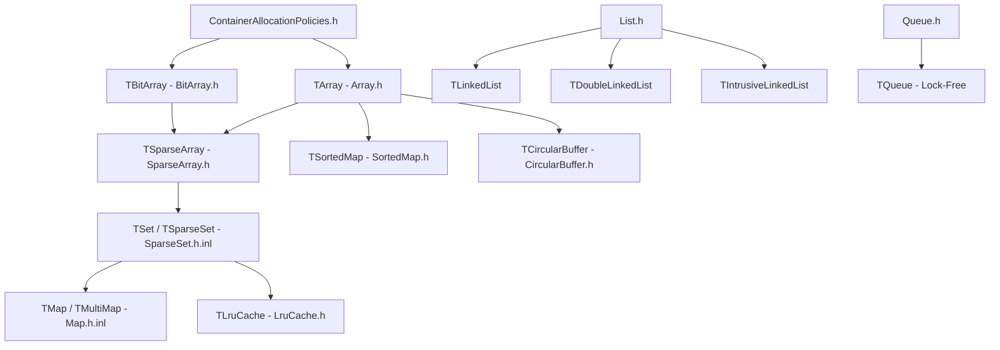
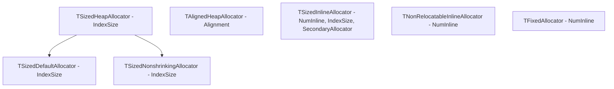
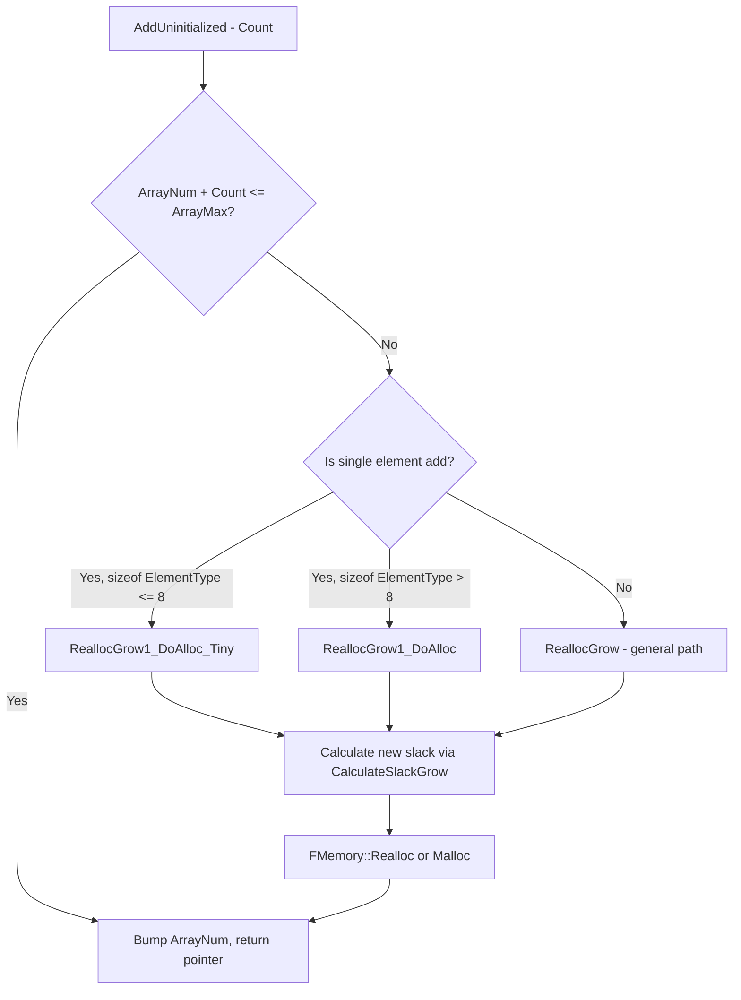
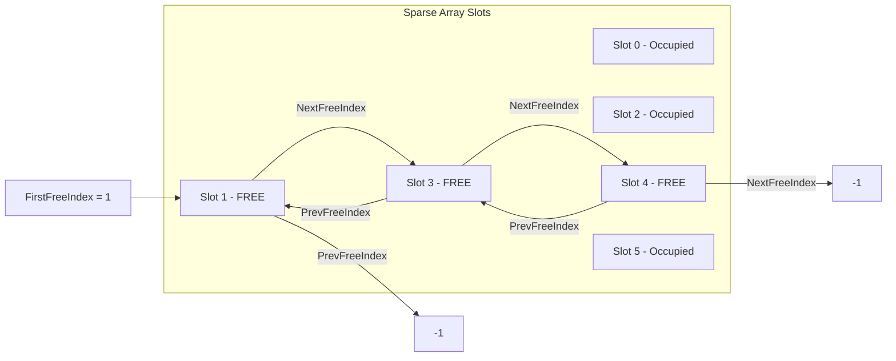
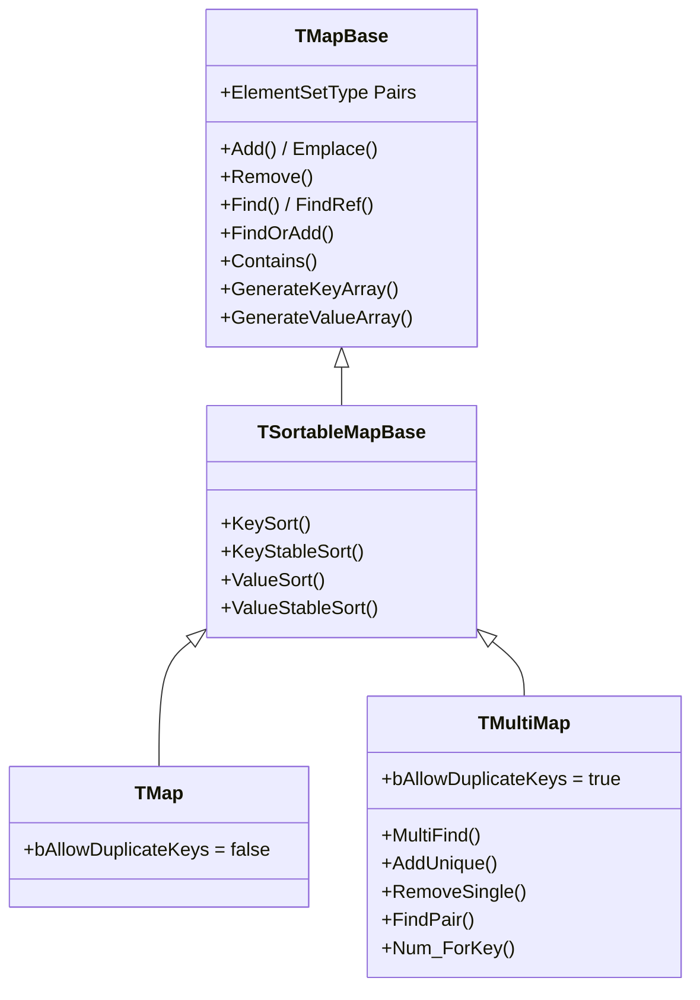
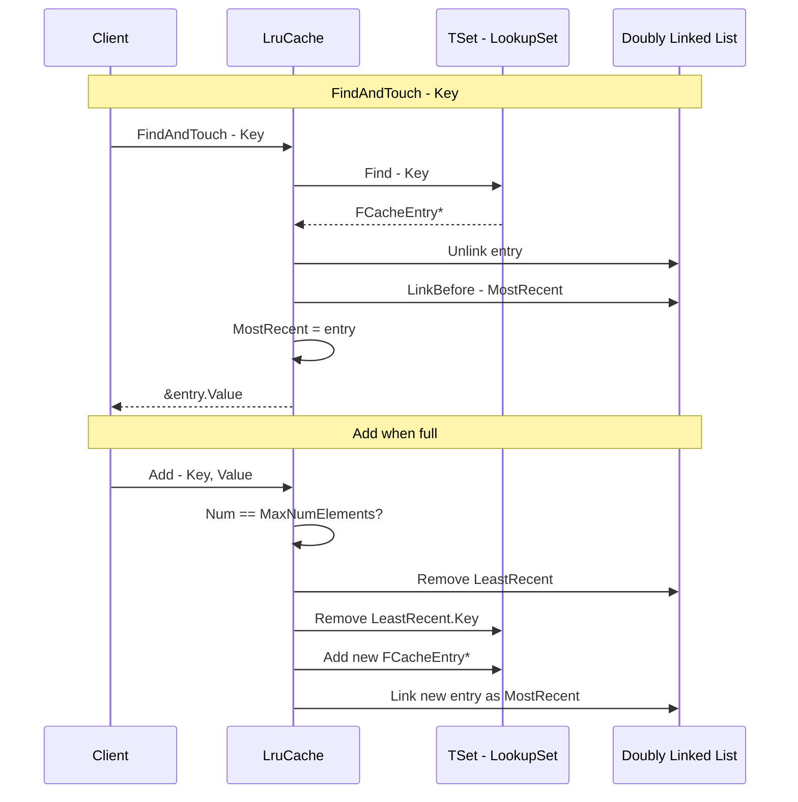

# Unreal Engine Container System — Implementation Mechanism & Principle Analysis

> Source path: `Engine/Source/Runtime/Core/Public/Containers/`

---

## Table of Contents

1. [Architecture Overview](#1-architecture-overview)
2. [Allocation Policy System](#2-allocation-policy-system)
3. [TArray — Dynamic Array](#3-tarray--dynamic-array)
4. [TSparseArray — Sparse Array](#4-tsparsearray--sparse-array)
5. [TSet / TSparseSet — Hash Set](#5-tset--tsparseSet--hash-set)
6. [TMap / TMultiMap — Hash Map](#6-tmap--tmultimap--hash-map)
7. [TSortedMap — Sorted Map](#7-tsortedmap--sorted-map)
8. [Linked Lists — TLinkedList / TDoubleLinkedList](#8-linked-lists)
9. [TQueue — Lock-Free Queue](#9-tqueue--lock-free-queue)
10. [TCircularBuffer — Circular Buffer](#10-tcircularbuffer--circular-buffer)
11. [TLruCache — LRU Cache](#11-tlrucache--lru-cache)
12. [Cross-Cutting Concerns](#12-cross-cutting-concerns)
13. [Container Variant Generation System](#13-container-variant-generation-system)
14. [Summary & Complexity Table](#14-summary--complexity-table)

---

## 1. Architecture Overview

The Unreal Engine container library is a **policy-based**, **template-heavy** collection framework that provides alternatives to `std::` containers optimized for game engine workloads. The design philosophy prioritizes:

- **Contiguous memory** for cache friendliness (TArray-backed structures dominate)
- **Trivial relocatability** — elements are moved via `FMemory::Memmove` rather than move constructors
- **Configurable allocation policies** — all containers are parameterized by allocator types
- **Memory image freezing** — serialization support for cooked content
- **Script/Blueprint interop** — untyped `TScript*` variants with identical memory layouts

### Container Dependency Graph



### Key Type Aliases (from [`ContainersFwd.h`](Engine/Source/Runtime/Core/Public/Containers/ContainersFwd.h))

| Alias | Expansion |
|-------|-----------|
| `FDefaultAllocator` | `TSizedDefaultAllocator<32>` |
| `FDefaultAllocator64` | `TSizedDefaultAllocator<64>` |
| `TArray64<T>` | `TArray<T, FDefaultAllocator64>` |
| `FDefaultSetAllocator` | `TInlineSetAllocator<1, FDefaultAllocator>` |
| `FDefaultBitArrayAllocator` | `TInlineAllocator<4>` |

---

## 2. Allocation Policy System

**File:** [`ContainerAllocationPolicies.h`](Engine/Source/Runtime/Core/Public/Containers/ContainerAllocationPolicies.h) (1686 lines)

The allocation policy system is the backbone of all containers. It decouples memory management strategy from data structure logic through a policy-based design pattern.

### 2.1 Core Allocator Hierarchy



### 2.2 TSizedHeapAllocator

The fundamental heap-backed allocator, parameterized by `IndexSize` (8/16/32/64 bits) which controls the maximum number of elements addressable:

```cpp
template <int IndexSize>
class TSizedHeapAllocator
{
    // Core state: single pointer to heap allocation
    UPTRINT Data;  // ForAnyElementType stores raw pointer as UPTRINT
    
    void ResizeAllocation(SizeType PreviousNum, SizeType Num, SIZE_T NumBytesPerElement, uint32 AlignmentOfElement);
    void MoveToEmpty(ForAnyElementType& Other);
    SizeType CalculateSlackReserve(SizeType NumElements, SIZE_T NumBytesPerElement, uint32 AlignmentOfElement) const;
    SizeType CalculateSlackShrink(SizeType NumElements, SizeType NumAllocatedElements, SIZE_T NumBytesPerElement, uint32 AlignmentOfElement) const;
    SizeType CalculateSlackGrow(SizeType NumElements, SizeType NumAllocatedElements, SIZE_T NumBytesPerElement, uint32 AlignmentOfElement) const;
};
```

**Key implementation detail:** The allocator uses `ForAnyElementType` (type-erased) and `ForElementType<ElementType>` (typed) inner classes. `ForAnyElementType` stores the raw pointer as `UPTRINT` and performs all reallocation; `ForElementType` adds typed `GetAllocation()` that casts to `ElementType*`.

### 2.3 Slack Management Strategy

Three functions control memory over/under-provisioning:

| Function | Algorithm | Purpose |
|----------|-----------|---------|
| [`DefaultCalculateSlackGrow()`](Engine/Source/Runtime/Core/Public/Containers/ContainerAllocationPolicies.h:40) | `NumElements + 3*NumElements/8 + 16` | Proportional growth with constant floor |
| [`DefaultCalculateSlackShrink()`](Engine/Source/Runtime/Core/Public/Containers/ContainerAllocationPolicies.h:80) | Shrink if slack > 16KB or slack > 2/3 capacity | Prevent excessive waste |
| [`DefaultCalculateSlackReserve()`](Engine/Source/Runtime/Core/Public/Containers/ContainerAllocationPolicies.h:120) | Platform-aligned quantize | Exact reservation aligned to platform granularity |

**Growth formula breakdown:**
```
NewCapacity = NumElements + (NumElements * NUMERATOR / DENOMINATOR) + CONSTANT
             = N + (N * 3 / 8) + 16      // default
             = N + (N * 1 / 4) + 16      // aggressive memory saving mode
```

Controlled by compile-time defines:
- `UE_CONTAINER_SLACK_GROWTH_FACTOR_NUMERATOR` (default 3)
- `UE_CONTAINER_SLACK_GROWTH_FACTOR_DENOMINATOR` (default 8)
- `CONTAINER_INITIAL_ALLOC_ZERO_SLACK` (default ON — first allocation has zero slack)

### 2.4 TSizedInlineAllocator

Stores `NumInlineElements` elements inline within the allocator object, falling back to a secondary heap allocator when capacity is exceeded:

```cpp
template <uint32 NumInlineElements, typename IndexType, typename SecondaryAllocator>
class TSizedInlineAllocator
{
    // ForAnyElementType inner class:
    TTypeCompatibleBytes<ElementType> InlineData[NumInlineElements]; // Inline storage
    SecondaryAllocator::ForAnyElementType SecondaryData;             // Heap fallback
    
    ElementType* GetAllocation() const
    {
        // Branch: return inline buffer or heap pointer
        if (SecondaryData.GetAllocation()) return SecondaryData.GetAllocation();
        return (ElementType*)&InlineData;
    }
};
```

**Optimization:** When `NumInlineElements == 0`, the implementation specializes to eliminate the inline storage entirely, reducing to a pure heap allocator.

### 2.5 TFixedAllocator

A constrained allocator that **never allocates from the heap** — it holds exactly `NumInlineElements` elements and asserts on overflow:

```cpp
template <uint32 NumInlineElements>
class TFixedAllocator
{
    // Similar to InlineAllocator but ResizeAllocation asserts if Num > NumInlineElements
};
```

### 2.6 Composite Allocators (for Sets/Maps)

Sets and maps require multiple sub-allocations. The engine composes these via:

| Composite Allocator | Contained Sub-Allocators |
|---------------------|--------------------------|
| `TSparseArrayAllocator<ElementAlloc, BitArrayAlloc>` | Element storage + allocation bitmap |
| `TSparseSetAllocator<SparseArrayAlloc, HashAlloc, MinHashTableSize, bSupportsFreezeImage>` | Sparse array allocator + hash table allocator |
| `TCompactSetAllocator<Alloc, MinHashTableSize, bSupportsFreezeImage>` | Simpler alternative for compact sets |

### 2.7 TAllocatorTraits

A trait system that queries allocator capabilities at compile time:

```cpp
template <typename AllocatorType>
struct TAllocatorTraits
{
    enum { IsZeroConstruct          = false }; // Can skip zero-init?
    enum { SupportsFreezeMemoryImage = false }; // Supports cook-time serialization?
    enum { SupportsElementAlignment  = false }; // Respects per-element alignment?
    enum { SupportsSlackTracking     = false }; // Supports debug slack tracking?
};
```

### 2.8 Array Slack Tracking (Debug)

When `UE_ENABLE_ARRAY_SLACK_TRACKING` is enabled, allocations prepend a [`FArraySlackTrackingHeader`](Engine/Source/Runtime/Core/Public/Containers/ContainerAllocationPolicies.h) before the actual data. This header tracks wasted bytes per TArray instance for memory profiling.

---

## 3. TArray — Dynamic Array

**File:** [`Array.h`](Engine/Source/Runtime/Core/Public/Containers/Array.h) (4166 lines)

### 3.1 Memory Layout

```
TArray<ElementType, AllocatorType>
┌─────────────────────────────────┐
│ AllocatorInstance                │  ← Contains pointer to heap data (or inline buffer)
│ ArrayNum  (int32)               │  ← Number of valid elements
│ ArrayMax  (int32)               │  ← Allocated capacity
└─────────────────────────────────┘
         │
         ▼ AllocatorInstance.GetAllocation()
┌─────────────────────────────────────────────────┐
│ Element[0] │ Element[1] │ ... │ Element[N-1] │ slack... │
└─────────────────────────────────────────────────┘
```

### 3.2 Core Operations & Complexity

| Operation | Complexity | Implementation Detail |
|-----------|------------|----------------------|
| `operator[]` | O(1) | Direct pointer arithmetic |
| `Add` / `Emplace` | Amortized O(1) | Growth via slack strategy |
| `Insert` | O(n) | `Memmove` to shift elements right |
| `RemoveAt` | O(n) | `Memmove` to shift elements left |
| `RemoveAtSwap` | O(1) | Swap with last element, then shrink |
| `Find` | O(n) | Linear scan |
| `Sort` | O(n log n) | IntroSort (default) |
| `HeapPush/Pop` | O(log n) | Binary heap operations |
| `BinarySearch` | O(log n) | Requires pre-sorted array |

### 3.3 Growth Strategy Deep Dive

The [`AddUninitialized()`](Engine/Source/Runtime/Core/Public/Containers/Array.h) function is the core growth path. When `ArrayNum + Count > ArrayMax`, it triggers reallocation:



**Tiny element optimization:** For elements ≤ 8 bytes (the common case: pointers, indices, small structs), a separate code path `ReallocGrow1_DoAlloc_Tiny` is used. This reduces generated code size by avoiding inlining the full general-purpose reallocation logic into every call site, since TArray is instantiated thousands of times across the engine.

### 3.4 Trivial Relocatability Assumption

**Critical design constraint:** TArray assumes all elements are **trivially relocatable** — they can be moved to a new memory location via `memcpy`/`memmove` without calling move constructors or updating internal pointers. This is enforced by:

```cpp
static_assert(TIsTriviallyCopyAssignable<ElementType>::Value || !TIsTriviallyDestructible<ElementType>::Value,
    "Types that are trivially copy-assignable but not trivially destructible cannot be used with TArray");
```

This allows `Insert`, `RemoveAt`, and reallocation to use `FMemory::Memmove` instead of element-by-element move construction, which is a significant performance win.

### 3.5 Heap Operations

TArray doubles as a **binary heap** through member functions:

- [`HeapPush()`](Engine/Source/Runtime/Core/Public/Containers/Array.h) — Add element and sift up
- [`HeapPop()`](Engine/Source/Runtime/Core/Public/Containers/Array.h) — Remove root, sift down
- [`Heapify()`](Engine/Source/Runtime/Core/Public/Containers/Array.h) — Build heap in O(n)
- [`HeapSort()`](Engine/Source/Runtime/Core/Public/Containers/Array.h) — In-place heap sort
- [`IsHeap()`](Engine/Source/Runtime/Core/Public/Containers/Array.h) — Validate heap property

This avoids the need for a separate priority queue container.

### 3.6 Intrusive TOptional State

TArray supports `bHasIntrusiveUnsetOptionalState = true`, allowing `TOptional<TArray>` to avoid an extra `bool` member:

```cpp
// Sentinel: ArrayMax == -1 means "unset optional"
TArray(FIntrusiveUnsetOptionalState) : ArrayNum(0), ArrayMax(-1) {}
bool operator==(FIntrusiveUnsetOptionalState) const { return ArrayMax == -1; }
```

This saves 4-8 bytes per `TOptional<TArray>` instance.

---

## 4. TSparseArray — Sparse Array

**File:** [`SparseArray.h`](Engine/Source/Runtime/Core/Public/Containers/SparseArray.h) (1780 lines)

### 4.1 Concept

TSparseArray is an array that supports **O(1) element removal without invalidating other elements' indices**. Unlike TArray where `RemoveAt` shifts subsequent elements (invalidating iterators and indices), TSparseArray marks slots as "free" and maintains a free list for reuse.

### 4.2 Memory Layout

```
TSparseArray<ElementType, Allocator>
┌──────────────────────────────────┐
│ Data: TArray<FElementOrFreeLink> │  ← Union of element data OR free list pointers
│ AllocationFlags: TBitArray       │  ← 1 bit per slot: 1 = occupied, 0 = free
│ FirstFreeIndex: int32            │  ← Head of free list (-1 if none)
│ NumFreeIndices: int32            │  ← Count of free slots
└──────────────────────────────────┘

FElementOrFreeLink (per slot):
┌─────────────────────────────────┐
│ Union:                          │
│   ElementData[sizeof(Element)]  │  ← When allocated: actual element
│   {PrevFreeIndex, NextFreeIndex}│  ← When free: doubly-linked free list
└─────────────────────────────────┘
```

### 4.3 Free List Mechanism



When an element is removed:
1. The element is destructed
2. The slot's `AllocationFlags` bit is cleared
3. The slot is inserted at the head of the free list (PrevFreeIndex/NextFreeIndex updated)
4. `NumFreeIndices` is incremented

When an element is added:
1. If free list is non-empty, pop from `FirstFreeIndex`
2. Otherwise, grow the underlying `Data` array
3. Construct element in-place, set `AllocationFlags` bit

### 4.4 Type-Erased Base Class

To reduce template instantiation bloat, TSparseArray uses a two-level class hierarchy:

```cpp
// Base class parameterized by SIZE and ALIGNMENT, not by TYPE
template <SIZE_T SizeOfElementType, uint32 AlignOfElementType, typename Allocator>
class TSparseArrayBase { ... };

// Derived class adds type information
template <typename InElementType, typename Allocator>
class TSparseArray : public TSparseArrayBase<sizeof(InElementType), alignof(InElementType), Allocator>
{
    // Thin typed wrapper around base class operations
};
```

This means that two different element types with the same `sizeof` and `alignof` (e.g., `int32` and `float`) share the same base class instantiation, reducing binary size.

### 4.5 Complexity

| Operation | Complexity |
|-----------|------------|
| Add (free slot available) | O(1) |
| Add (no free slot) | Amortized O(1) — grows underlying TArray |
| RemoveAt | O(1) |
| operator[] | O(1) — direct indexed access |
| IsAllocated check | O(1) — bit test in AllocationFlags |
| Iteration | O(n) where n = MaxIndex, skips unallocated slots |

---

## 5. TSet / TSparseSet — Hash Set

**Files:** [`Set.h`](Engine/Source/Runtime/Core/Public/Containers/Set.h), [`SparseSet.h.inl`](Engine/Source/Runtime/Core/Public/Containers/SparseSet.h.inl) (1795 lines)

### 5.1 Dispatch Mechanism

[`Set.h`](Engine/Source/Runtime/Core/Public/Containers/Set.h) is a 46-line dispatch header:

```cpp
#if UE_USE_COMPACT_SET_AS_DEFAULT
    #include "Containers/CompactSet.h.inl"    // TCompactSet as TSet
#else
    #include "Containers/SparseSet.h.inl"     // TSparseSet as TSet (default)
#endif
```

By default, `TSet` = `TSparseSet`.

### 5.2 Data Structure

TSparseSet is a **chained hash table** built on top of TSparseArray:

```
TSet<ElementType, KeyFuncs, Allocator>
┌──────────────────────────────────────┐
│ Elements: TSparseArray<SetElement>   │  ← Stores actual data + per-element hash chain
│ Hash: InlineAllocator::ForElement[]  │  ← Hash bucket array (array of FSetElementId)
│ HashSize: int32                      │  ← Always power-of-2
└──────────────────────────────────────┘

TSparseSetElement<ElementType> (per element):
┌───────────────────┐
│ Value: ElementType │  ← The actual stored value
│ HashNextId: int32  │  ← Next element in same hash bucket chain
│ HashIndex: int32   │  ← Which bucket this element belongs to
└───────────────────┘
```

### 5.3 Hash Table Design

```mermaid
graph TD
    subgraph Hash Buckets - size = 8, mask = 7
        B0[Bucket 0: -1]
        B1[Bucket 1: -1]
        B2[Bucket 2: ElementId 5]
        B3[Bucket 3: ElementId 0]
        B4[Bucket 4: -1]
        B5[Bucket 5: ElementId 2]
        B6[Bucket 6: -1]
        B7[Bucket 7: -1]
    end
    
    subgraph Elements - TSparseArray
        E0[Id 0: Key=foo, HashNext=3]
        E2[Id 2: Key=bar, HashNext=-1]
        E3[Id 3: Key=baz, HashNext=-1]
        E5[Id 5: Key=qux, HashNext=-1]
    end
    
    B2 --> E5
    B3 --> E0
    E0 --> E3
    B5 --> E2
```

**Key design decisions:**

1. **Hash size is always power-of-2** — bucket index computed as `Hash & (HashSize - 1)` (bitmask, not modulo)
2. **Separate chaining** — each bucket stores a `FSetElementId` (index into Elements sparse array), elements chain via `HashNextId`
3. **Hash stored per-element** — `HashIndex` cached on each element allows O(1) unlinking during removal
4. **Lazy rehash** — `HashSize` grows when `Elements.Num() + 1 > HashSize` (load factor ≈ 1.0)

### 5.4 Lookup Algorithm

```cpp
// Simplified FindIndexByHash
FSetElementId FindIndexByHash(uint32 KeyHash, Predicate Pred)
{
    if (HashSize == 0) return FSetElementId();
    
    FSetElementId ElementId = Hash[KeyHash & (HashSize - 1)];  // O(1) bucket lookup
    while (ElementId.IsValidId())
    {
        auto& Element = Elements[ElementId];
        if (Pred(Element.Value))           // Check if this is the right element
            return ElementId;
        ElementId = Element.HashNextId;    // Walk chain
    }
    return FSetElementId();                // Not found
}
```

### 5.5 Heterogeneous Lookup

TSet supports **heterogeneous lookup** via `ByHash()` functions. Instead of requiring the lookup key to be the same type as the stored element, you can provide a pre-computed hash and a custom predicate:

```cpp
// Look up by any type, not just ElementType
template <typename PredicateType>
FSetElementId FindIdByHash(uint32 Hash, PredicateType Pred) const;
```

This avoids constructing a temporary `ElementType` just for lookup.

### 5.6 UnhashElements Optimization

When clearing the hash table (`UnhashElements`), TSet uses an optimization:

```cpp
if (NumElements < HashSize / 4)
{
    // Few elements relative to hash size: clear only occupied buckets
    for (each occupied element)
        Hash[element.HashIndex] = FSetElementId();
}
else
{
    // Many elements: memset the entire hash table
    FMemory::Memset(Hash, 0xFF, HashSize * sizeof(FSetElementId));
}
```

### 5.7 KeyFuncs

TSet's behavior is customizable via `KeyFuncs`:

```cpp
template <typename ElementType, typename InKeyType, bool bInAllowDuplicateKeys>
struct BaseKeyFuncs
{
    static KeyType GetSetKey(const ElementType& Element);  // Extract key from element
    static bool Matches(KeyType A, KeyType B);              // Equality comparison
    static uint32 GetKeyHash(KeyType Key);                  // Hash function
    static constexpr bool bAllowDuplicateKeys = bInAllowDuplicateKeys;
};
```

### 5.8 Complexity

| Operation | Average | Worst Case |
|-----------|---------|------------|
| Add | O(1) amortized | O(n) — rehash |
| Remove | O(1) | O(n) — long chain |
| Find/Contains | O(1) | O(n) — long chain |
| Iteration | O(MaxIndex) | Skips empty sparse array slots |

---

## 6. TMap / TMultiMap — Hash Map

**Files:** [`Map.h`](Engine/Source/Runtime/Core/Public/Containers/Map.h), [`Map.h.inl`](Engine/Source/Runtime/Core/Public/Containers/Map.h.inl) (1896 lines)

### 6.1 Implementation: Map = Set of Pairs

**TMap is implemented as a TSet of key-value pairs:**

```cpp
template <typename KeyType, typename ValueType, typename SetAllocator, typename KeyFuncs>
class TMapBase
{
    typedef TSet<TPair<KeyType, ValueType>, KeyFuncs, SetAllocator> ElementSetType;
    ElementSetType Pairs;  // The entire map is stored as a set of pairs
};
```

This means TMap inherits all of TSet's hash table mechanics, with `KeyFuncs` configured to hash/compare only the `Key` portion of each `TPair`:

```cpp
template <typename KeyType, typename ValueType, bool bInAllowDuplicateKeys>
struct TDefaultMapKeyFuncs : BaseKeyFuncs<TPair<KeyType, ValueType>, KeyType, bInAllowDuplicateKeys>
{
    static const KeyType& GetSetKey(const TPair<KeyType, ValueType>& Element) { return Element.Key; }
    static bool Matches(KeyType A, KeyType B) { return A == B; }
    static uint32 GetKeyHash(KeyType Key) { return GetTypeHash(Key); }
};
```

### 6.2 Class Hierarchy



### 6.3 TPairInitializer — In-Place Pair Construction

To avoid copying key-value pairs during construction, TMap uses a special initializer:

```cpp
template <typename KeyInitType, typename ValueInitType>
struct TPairInitializer
{
    KeyInitType Key;
    ValueInitType Value;
    // Implicit conversion to TPair via move/forward semantics
};
```

This allows `Emplace(Key, Value)` to construct the pair directly in the set's storage without intermediate copies.

### 6.4 TMap vs TMultiMap

| Feature | TMap | TMultiMap |
|---------|------|-----------|
| Duplicate keys | ❌ Replaces existing | ✅ Allows multiple |
| `Find()` | Returns single value | Returns first found |
| `MultiFind()` | N/A | Returns all values for key |
| `AddUnique()` | N/A | Only adds if key-value pair is unique |
| `RemoveSingle()` | N/A | Removes one key-value pair |

### 6.5 Sorting Support

`TSortableMapBase` adds sorting capabilities while maintaining hash table validity:

```cpp
template <typename Predicate>
void KeySort(Predicate Pred)
{
    Pairs.Sort([&](const ElementType& A, const ElementType& B) {
        return Pred(A.Key, B.Key);
    });
    // Hash table is automatically rebuilt by TSet::Sort
}
```

### 6.6 TScriptMap — Blueprint Interop

For use from Blueprints/scripting, `TScriptMap` provides an **untyped** map with the same memory layout:

```cpp
class TScriptMap
{
    TScriptSet Pairs;  // Untyped set of key-value pairs
    // Verified at compile time:
    static_assert(sizeof(TScriptMap) == sizeof(TMap<int, int>));
    static_assert(alignof(TScriptMap) == alignof(TMap<int, int>));
};
```

---

## 7. TSortedMap — Sorted Map

**File:** [`SortedMap.h`](Engine/Source/Runtime/Core/Public/Containers/SortedMap.h) (946 lines)

### 7.1 Concept

TSortedMap is an alternative map implementation using a **sorted TArray of TPair** instead of a hash table. It provides:

- **Half the memory** of TMap (no hash table overhead)
- **O(log n) lookup** via binary search
- **O(n) insert/remove** due to array shifting
- **O(1) equality comparison** (sorted arrays can be compared directly)
- **Cache-friendly iteration** (contiguous memory)

### 7.2 Core Operations

```cpp
// Find: binary search
int32 FindIndex(KeyConstPointerType Key) const
{
    return Algo::BinarySearchBy(Pairs, Key, FKeyForward(), SortPredicate());
}

// Insert: find position via lower bound, then insert or replace
template <typename InitKeyType>
ElementType* AllocateMemoryForEmplace(InitKeyType&& InKey)
{
    int32 InsertIndex = Algo::LowerBoundBy(Pairs, InKey, FKeyForward(), SortPredicate());
    
    if (Pairs.IsValidIndex(InsertIndex) && !SortPredicate()(InKey, Pairs[InsertIndex].Key))
    {
        // Key exists: destroy old, reuse slot
        DestructItems(DataPtr, 1);
    }
    else
    {
        // New key: insert at sorted position (shifts all subsequent elements)
        Pairs.InsertUninitialized(InsertIndex, 1);
    }
    return Pairs.GetData() + InsertIndex;
}
```

### 7.3 When to Use TSortedMap vs TMap

| Criterion | TSortedMap | TMap |
|-----------|-----------|------|
| Memory | ~50% less | Higher (hash table overhead) |
| Lookup | O(log n) | O(1) average |
| Insert/Remove | O(n) | O(1) amortized |
| Iteration order | Sorted by key | Unordered |
| Equality check | O(n) — direct compare | O(n) — must sort first |
| Best for | Small collections, read-heavy, memory-constrained | Large collections, write-heavy |

### 7.4 Serialization

TSortedMap re-sorts after deserialization to handle potential sort predicate changes:

```cpp
static void Serialize(FArchive& Ar, TSortedMap& Map)
{
    Ar << Map.Pairs;
    if (Ar.IsLoading())
    {
        Algo::SortBy(Map.Pairs, FKeyForward(), SortPredicate());
    }
}
```

---

## 8. Linked Lists

**File:** [`List.h`](Engine/Source/Runtime/Core/Public/Containers/List.h) (837 lines)

### 8.1 TLinkedListBase — The Pointer-to-Pointer Trick

The most interesting design in the linked list implementation is the **pointer-to-pointer (`PrevLink`)** technique:

```cpp
template <typename ContainerType, typename ElementType>
class TLinkedListBase
{
    ContainerType*  NextLink;    // Pointer to next node
    ContainerType** PrevLink;    // Pointer to the POINTER that points to us
};
```

**Why `PrevLink` is a `ContainerType**` (not `ContainerType*`):**

```
Normal doubly-linked list:           TLinkedListBase:
                                     
Head ──→ [A] ←──→ [B] ←──→ [C]     Head ──→ [A] ──→ [B] ──→ [C]
                                              │        │        │
                                     PrevLink points to:        │
                                     &Head     &A.Next  &B.Next
```

`PrevLink` points to **the pointer that references this node** — which could be either:
- The `Head` pointer (if this is the first node)
- The previous node's `NextLink` member

This allows **O(1) unlink** without knowing whether we're the head:

```cpp
void Unlink()
{
    *PrevLink = NextLink;             // Update whoever points to us
    if (NextLink) 
        NextLink->PrevLink = PrevLink; // Update next node's back-pointer
    NextLink = nullptr;
    PrevLink = nullptr;
}
```

### 8.2 TLinkedList vs TIntrusiveLinkedList

| Feature | TLinkedList | TIntrusiveLinkedList |
|---------|-------------|---------------------|
| Element storage | Embedded copy in node | Element inherits from list base |
| Memory allocation | Allocated by list | Managed externally |
| Use case | General-purpose | When elements must be in multiple lists |

### 8.3 TDoubleLinkedList

A more traditional doubly-linked list with heap-allocated nodes:

```cpp
template <typename ElementType>
class TDoubleLinkedList
{
    struct TDoubleLinkedListNode
    {
        ElementType Value;
        TDoubleLinkedListNode* NextNode;
        TDoubleLinkedListNode* PrevNode;
    };
    
    TDoubleLinkedListNode* HeadNode;
    TDoubleLinkedListNode* TailNode;
    int32 ListSize;
};
```

Features:
- Standard O(1) insert/remove at head/tail
- `InsertNode(InValue, NodeAfter)` for mid-list insertion
- Non-copyable, move-only
- Virtual [`SetListSize()`](Engine/Source/Runtime/Core/Public/Containers/List.h) for subclass hooks

---

## 9. TQueue — Lock-Free Queue

**File:** [`Queue.h`](Engine/Source/Runtime/Core/Public/Containers/Queue.h) (318 lines)

### 9.1 Design

TQueue implements a **linked-list-based FIFO queue** with three concurrency modes:

```cpp
enum class EQueueMode { Mpsc, Spsc, SingleThreaded };

template <typename T, EQueueMode Mode = EQueueMode::Mpsc>
class TQueue
{
    struct TNode { TNode* Next; T Item; };
    
    TNode* volatile Head;  // Dequeue from here (consumer end)
    TNode* volatile Tail;  // Enqueue here (producer end)
};
```

### 9.2 Sentinel Node Pattern

The queue always maintains a **dummy/sentinel node at the tail**. The actual items are between Head and Tail:

```
Head ──→ [ItemA] ──→ [ItemB] ──→ [Sentinel]  ← Tail
```

On dequeue, `Head` advances and the old head's item is returned. The sentinel ensures the queue is never "empty" in terms of nodes, simplifying the enqueue/dequeue logic.

### 9.3 Concurrency Modes

| Mode | Enqueue | Dequeue | Mechanism |
|------|---------|---------|-----------|
| `Mpsc` | Multiple producers | Single consumer | `InterlockedExchangePtr` on Tail |
| `Spsc` | Single producer | Single consumer | Memory barriers only |
| `SingleThreaded` | No sync | No sync | Direct pointer writes |

**MPSC Enqueue (lock-free):**
```cpp
bool Enqueue(const T& Item)
{
    TNode* NewNode = new TNode(Item);
    TNode* OldTail = (TNode*)FPlatformAtomics::InterlockedExchangePtr((void**)&Tail, NewNode);
    // OldTail (previous sentinel) now links to NewNode
    FPlatformAtomics::InterlockedExchangePtr((void**)&OldTail->Next, NewNode);
    return true;
}
```

The `InterlockedExchangePtr` atomically swaps `Tail` to point to the new node and returns the old tail, which is then linked to the new node.

---

## 10. TCircularBuffer — Circular Buffer

**File:** [`CircularBuffer.h`](Engine/Source/Runtime/Core/Public/Containers/CircularBuffer.h) (113 lines)

### 10.1 Design

A fixed-capacity ring buffer backed by TArray:

```cpp
template <typename ElementType>
class TCircularBuffer
{
    TArray<ElementType> Elements;  // Backing storage
    uint32 IndexMask;              // = Capacity - 1 (for power-of-2 wrapping)
    
    ElementType& operator[](uint32 Index) 
    {
        return Elements[Index & IndexMask];  // Bitmask wrap instead of modulo
    }
};
```

### 10.2 Power-of-2 Optimization

The capacity is always rounded up to the next power of 2:

```cpp
TCircularBuffer(uint32 Capacity)
{
    uint32 RoundedCapacity = FMath::RoundUpToPowerOfTwo(Capacity);
    Elements.AddDefaulted(RoundedCapacity);
    IndexMask = RoundedCapacity - 1;
}
```

This allows index wrapping via **bitmask** (`Index & IndexMask`) instead of modulo (`Index % Capacity`), which is significantly faster on most architectures.

### 10.3 Complexity

All operations are O(1) — indexed access, no dynamic allocation after construction.

---

## 11. TLruCache — LRU Cache

**File:** [`LruCache.h`](Engine/Source/Runtime/Core/Public/Containers/LruCache.h) (851 lines)

### 11.1 Architecture

TLruCache combines two data structures for O(1) lookup and O(1) recency tracking:

```
TLruCache<KeyType, ValueType>
┌───────────────────────────────────────────────┐
│ LookupSet: TSet<FCacheEntry*>                 │  ← O(1) key lookup via hash
│ LeastRecent: FCacheEntry*                     │  ← Tail of recency list
│ MostRecent: FCacheEntry*                      │  ← Head of recency list
│ MaxNumElements: int32                         │  ← Capacity limit
└───────────────────────────────────────────────┘

FCacheEntry:
┌──────────────────────┐
│ Key: KeyType         │
│ Value: ValueType     │
│ LessRecent: Entry*   │  ← Doubly-linked list for recency
│ MoreRecent: Entry*   │
└──────────────────────┘
```

### 11.2 Operation Flow



### 11.3 Eviction Strategy

When the cache is full and a new entry must be added:
1. The `LeastRecent` entry is identified (tail of the doubly-linked list)
2. It is removed from the `LookupSet` (hash set)
3. It is unlinked from the recency list
4. The `FCacheEntry` is `delete`d (heap-freed)
5. The new entry is created and linked as `MostRecent`

### 11.4 Custom Key Comparison

The `KeyComp` template parameter allows custom key comparison:

```cpp
template<typename KeyType>
struct DefaultKeyComparer
{
    static bool Matches(KeyType A, KeyType B) { return A == B; }
    static uint32 GetKeyHash(KeyType Key) { return GetTypeHash(Key); }
};
```

### 11.5 Complexity

| Operation | Complexity |
|-----------|------------|
| Find / FindAndTouch | O(1) average |
| Add (with eviction) | O(1) average |
| Remove | O(1) average |
| Contains | O(1) average |

---

## 12. Cross-Cutting Concerns

### 12.1 Memory Image Freezing

All major containers support `WriteMemoryImage()` and `CopyUnfrozen()` for **frozen memory image serialization**. This is used in Unreal's cook pipeline to serialize container state into a flat memory layout that can be memory-mapped at runtime without reconstruction:

```cpp
void WriteMemoryImage(FMemoryImageWriter& Writer) const;
void CopyUnfrozen(const FMemoryUnfreezeContent& Context, void* Dst) const;
```

### 12.2 Intrusive TOptional State Pattern

All major containers (`TArray`, `TSparseArray`, `TSet`, `TMap`, `TSortedMap`) implement the intrusive optional pattern:

```cpp
constexpr static bool bHasIntrusiveUnsetOptionalState = true;
using IntrusiveUnsetOptionalStateType = TContainerType;

// Constructor for "unset" state
TContainerType(FIntrusiveUnsetOptionalState);

// Check for "unset" state
bool operator==(FIntrusiveUnsetOptionalState) const;
```

This allows `TOptional<TArray<int>>` to be exactly `sizeof(TArray<int>)` instead of `sizeof(TArray<int>) + sizeof(bool)`, saving memory especially in arrays of optionals.

### 12.3 Script/Blueprint Variants

Each major container has a `TScript*` variant for untyped access from Blueprints:

| Typed Container | Script Variant | Verified Properties |
|----------------|----------------|---------------------|
| `TArray` | `TScriptArray` | Size, alignment, member offsets |
| `TSparseArray` | `TScriptSparseArray` | Size, alignment |
| `TSet` | `TScriptSet` | Size, alignment, member offsets |
| `TMap` | `TScriptMap` | Size, alignment |

These are validated at compile time with `static_assert` to ensure binary compatibility.

### 12.4 Debug and Profiling

- **Array Slack Tracking**: `UE_ENABLE_ARRAY_SLACK_TRACKING` adds per-allocation headers to track wasted memory
- **Checked Iterators**: `TCheckedPointerIterator` validates bounds in debug builds
- **Range Checks**: `checkSlow()` assertions throughout for debug-only bounds checking

---

## 13. Container Variant Generation System

### 13.1 The #define Injection Pattern

TMap and TSet have three variants each (Sparse, Compact, default), generated by including the same `.h.inl` file multiple times with different macro definitions:

```cpp
// In Map.h:
#define UE_TMAP_PREFIX T
#include "Map.h.inl"           // Generates TMap, TMultiMap, TMapBase

#define UE_TMAP_PREFIX TSparse  
#include "Map.h.inl"           // Generates TSparseMap, TSparseMultiMap

#define UE_TMAP_PREFIX TCompact
#include "Map.h.inl"           // Generates TCompactMap, TCompactMultiMap
```

Inside `Map.h.inl`, macros expand names:

```cpp
#define UE_TMAP_CLASS_NAME       UE_TMAP_PASTE(UE_TMAP_PREFIX, Map)       // TMap / TSparseMap / TCompactMap
#define UE_TMULTIMAP_CLASS_NAME  UE_TMAP_PASTE(UE_TMAP_PREFIX, MultiMap)  // TMultiMap / TSparseMultiMap / ...
```

**Why not template aliases?** The comment in source states this is due to MSVC issues with deduction guides through template aliases. The macro approach generates fully independent class names that work correctly with CTAD (Class Template Argument Deduction).

### 13.2 Variant Differences

| Variant | Set Implementation | Hash Table | Memory Profile |
|---------|-------------------|------------|----------------|
| `TSet` / `TMap` | TSparseSet | Separate array + sparse array | Standard, most features |
| `TSparseSet` / `TSparseMap` | Always TSparseSet | Same as above | Explicit non-compact |
| `TCompactSet` / `TCompactMap` | TCompactSet | Compact hash table | Lower memory overhead |

---

## 14. Summary & Complexity Table

| Container | Backing Structure | Insert | Remove | Find | Memory Overhead | Thread Safety |
|-----------|-------------------|--------|--------|------|-----------------|---------------|
| **TArray** | Contiguous buffer | O(1)* / O(n)† | O(1)‡ / O(n)† | O(n) / O(log n)§ | Low (slack only) | None |
| **TSparseArray** | Contiguous + bitmap + free list | O(1) | O(1) | O(1) by index | Medium (bitmap + free list) | None |
| **TSet** | TSparseArray + hash table | O(1)* | O(1) | O(1) | High (hash table + per-element chain) | None |
| **TMap** | TSet of TPair | O(1)* | O(1) | O(1) | High | None |
| **TMultiMap** | TSet of TPair | O(1)* | O(1) | O(1) per key | High | None |
| **TSortedMap** | Sorted TArray of TPair | O(n) | O(n) | O(log n) | Low | None |
| **TLinkedList** | Singly-linked w/ PrevLink trick | O(1)¶ | O(1) | O(n) | High (2 ptrs/node) | None |
| **TDoubleLinkedList** | Doubly-linked, heap nodes | O(1)¶ | O(1) | O(n) | High (2 ptrs/node + alloc) | None |
| **TQueue** | Lock-free linked list | O(1) | O(1) | N/A | Medium (node per item) | MPSC/SPSC |
| **TCircularBuffer** | Fixed-size TArray | O(1) | O(1) | O(1) | None (fixed) | None |
| **TLruCache** | TSet + doubly-linked list | O(1) | O(1) | O(1) | High (set + list ptrs) | None |

\* Amortized  
† Indexed position insert/remove  
‡ `RemoveAtSwap` only  
§ Binary search on sorted array  
¶ At known position (head/tail)

---

## Appendix: Files Not Covered in Detail

The following files exist in the Containers directory but were not deeply analyzed in this document. They represent additional specialized containers:

| File | Purpose |
|------|---------|
| `BitArray.h` | TBitArray — dynamic bit array (used by TSparseArray) |
| `CompactSet.h.inl` / `CompactSetBase.h` / `CompactHashTable.h` | TCompactSet alternative implementation |
| `IndirectArray.h` | TIndirectArray — array of heap-allocated elements |
| `PagedArray.h` / `ChunkedArray.h` / `BasicArray.h` | Alternative array layouts |
| `ArrayView.h` / `StridedView.h` | Non-owning view types |
| `BinaryHeap.h` | Standalone binary heap |
| `Deque.h` / `RingBuffer.h` / `CircularQueue.h` | Double-ended queue and ring buffer variants |
| `LockFreeList.h` / `SpscQueue.h` / `MpscQueue.h` | Lock-free concurrent containers |
| `ConsumeAllMpmcQueue.h` / `DepletableMpmcQueue.h` | Multi-producer multi-consumer queues |
| `UnrealString.h` / `Utf8String.h` / `AnsiString.h` | String container implementations |
| `StaticArray.h` / `StaticBitArray.h` | Fixed-size compile-time containers |
| `MRUArray.h` / `TransArray.h` | Most-Recently-Used array and transactional array |
| `TripleBuffer.h` | Triple-buffering for producer-consumer |
| `AllocatorFixedSizeFreeList.h` | Pool allocator for fixed-size objects |
