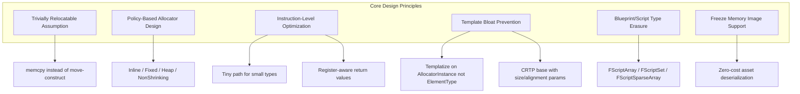

# UE5 Containers 基础类核心亮点分析

> 基于 `Engine/Source/Runtime/Core/Public/Containers/` 源码的深度分析

---

## 一、TArray — 极致内联优化的动态数组

### 1.1 Trivially Relocatable 假设（性能基石）

`TArray` 的**最核心设计决策**是假定所有元素类型都是 *trivially relocatable* 的：

```cpp
// Array.h:994
~TArray()
{
    UE_STATIC_ASSERT_WARN(TIsTriviallyRelocatable_V<InElementType>,
        "TArray can only be used with trivially relocatable types");
    DestructItems(GetData(), ArrayNum);
}
```

这意味着 `TArray` 在扩容、插入、删除时使用 **`RelocateConstructItems`（本质是 `memcpy`/`memmove`）** 而非逐元素调用移动构造函数。与 `std::vector` 必须调用 `std::move` 再析构旧对象相比，这在大量元素搬迁时节省了巨大的函数调用开销。

### 1.2 单元素添加的指令级优化

[`AddUninitialized()`](Engine/Source/Runtime/Core/Public/Containers/Array.h:1664) 是 UE 中被内联次数最多的热点函数之一。源码中有详细的注释说明每一条指令的意义：

```cpp
// Array.h:1683-1704 — "Begin sensitive code!"
if (ArrayNum == ArrayMax)  // 单次 cmp 指令
{
    if constexpr (sizeof(ElementType) <= 255 && alignof(ElementType) <= 255)
    {
        // 将 size 和 alignment 打包成单个 uint16 参数
        // 在 ARM 上只需一条指令加载
        ArrayNum = ReallocGrow1_DoAlloc_Tiny<...>(
            sizeof(ElementType) | (alignof(ElementType) << 8), ...);
    }
    else
    {
        ArrayNum = ReallocGrow1_DoAlloc<...>(...);
    }
}
```

**亮点**：
- **`ReallocGrow1_DoAlloc_Tiny`**：当元素 size 和 alignment 都 ≤ 255 时，将二者打包为单个 `uint16` 参数，ARM 上只需一条立即数加载指令
- 重分配函数 **仅按 AllocatorInstance 类型模板化**（而非按 ElementType），避免为每种元素类型生成重复的重分配代码，显著减少可执行文件大小
- 返回值写入 `ArrayNum` 而非独立变量，避免函数调用后寄存器重载

### 1.3 智能增长策略与 Slack 追踪

```cpp
// ContainerAllocationPolicies.h:120-134
#define UE_CONTAINER_SLACK_GROWTH_FACTOR_NUMERATOR 3
#define UE_CONTAINER_SLACK_GROWTH_FACTOR_DENOMINATOR 8
```

- 默认增长因子为 **3/8**（≈37.5%），比 `std::vector` 的典型 2x 增长更保守
- 首次分配时 `CONTAINER_INITIAL_ALLOC_ZERO_SLACK` 默认开启，即**首次分配零 slack**，后续才按比例增长
- 使用 `FMemory::QuantizeSize` 对齐到内存分配器的量化边界，减少内部碎片
- **Slack Tracking** 调试系统：为每个堆分配注入 `FArraySlackTrackingHeader`，追踪数组峰值使用量、重分配次数、当前浪费空间

### 1.4 ranged-for 安全检查

```cpp
// Array.h:276 — TCheckedPointerIterator
ensureMsgf(CurrentNum == InitialNum,
    TEXT("Array has changed during ranged-for iteration!"));
```

在非 Shipping 构建中，ranged-for 迭代器会在每次 `operator!=` 比较时验证数组大小是否发生变化，防止在遍历中修改数组导致的未定义行为。

### 1.5 内置隐式堆操作

`TArray` 直接内置了完整的 **隐式二叉堆** 接口：`Heapify()`、`HeapPush()`、`HeapPop()`、`HeapSort()`、`HeapRemoveAt()`。不需要额外的优先队列容器。

### 1.6 Intrusive TOptional State

```cpp
// Array.h:1005-1017
constexpr static bool bHasIntrusiveUnsetOptionalState = true;
// 使用 ArrayMax == -1 作为 unset 标志
TArray(FIntrusiveUnsetOptionalState Tag) : ArrayNum(0), ArrayMax(-1) {}
```

利用 `ArrayMax == -1` 作为侵入式可选状态标记，使 `TOptional<TArray>` 无需额外的 `bool` 标志，节省内存。

---

## 二、分配策略系统 — 容器与内存的解耦

### 2.1 策略层次结构

```
TSizedHeapAllocator<IndexSize>          — 堆分配，支持 8/16/32/64 位索引
  └─ TSizedDefaultAllocator<IndexSize>  — 默认别名
  └─ TSizedNonshrinkingAllocator        — 禁止自动缩小
TAlignedHeapAllocator<Alignment>        — 自定义对齐堆分配
TSizedInlineAllocator<N, IndexSize>     — 内联 + 溢出到堆
TFixedAllocator<N>                      — 纯栈分配，无堆溢出
TNonRelocatableInlineAllocator<N>       — 缓存数据指针的内联分配器
```

### 2.2 TInlineAllocator — 小对象优化

```cpp
// ContainerAllocationPolicies.h:1051
alignas(ElementType) uint8 InlineData[sizeof(ElementType) * NumInlineElements];
```

- 小于等于 `NumInlineElements` 个元素时在**对象内部**分配（零堆分配）
- 超出时转为堆分配，数据从内联区 `RelocateConstructItems` 到堆
- 缩小回内联范围时自动搬回内联区

### 2.3 Allocator Traits 系统

```cpp
template <typename AllocatorType>
struct TAllocatorTraits : TAllocatorTraitsBase<AllocatorType>
{
    enum { IsZeroConstruct           = false };
    enum { SupportsFreezeMemoryImage = false };
    enum { SupportsElementAlignment  = false };
    enum { SupportsSlackTracking     = false };
};
```

通过 traits 在编译期决定：
- 是否支持自定义元素对齐
- 是否支持 Freeze Memory Image（资产烘焙序列化）
- 是否追踪 slack 浪费

### 2.4 跨分配器 Move

```cpp
template <uint8 FromIndexSize, uint8 ToIndexSize>
struct TCanMoveBetweenAllocators<TSizedHeapAllocator<From>, TSizedHeapAllocator<To>>
{
    enum { Value = true }; // 允许不同位宽分配器之间直接转移指针
};
```

不同索引位宽的分配器之间可以直接 move 指针，无需逐元素拷贝。

---

## 三、TSparseArray — O(1) 删除的稀疏数组

### 3.1 Union Trick：元素与空闲链表共享内存

```cpp
// SparseArray.h:46-59
template<typename ElementType>
union TSparseArrayElementOrFreeListLink
{
    ElementType ElementData;    // 已分配时存储元素
    struct {
        int32 PrevFreeIndex;    // 未分配时存储双向空闲链表
        int32 NextFreeIndex;
    };
};
```

**亮点**：空闲槽位不浪费内存——它们的空间被复用来存储空闲链表的双向链接。

### 3.2 TBitArray 标记分配状态

```cpp
TBitArray<BitArrayAllocator> AllocationFlags; // 每个元素 1 bit 标记
```

- 遍历时通过 `TConstSetBitIterator` 跳过空洞，只访问已分配的元素
- 使用 CPU 的位扫描指令（BSF/BSR）高效查找下一个 set bit

### 3.3 CRTP Base 避免模板膨胀

```cpp
template<size_t SizeOfElementType, size_t AlignOfElementType, typename Allocator>
class TSparseArrayBase { ... };
```

底层实现按 **size/alignment** 而非具体 ElementType 参数化，`sizeof(int) == sizeof(float)` 的情况下共享同一份机器码。

---

## 四、TSet / TMap — 高性能哈希容器

### 4.1 基于 TSparseArray 的开放寻址

TSet 的存储结构：
- **元素存储**：`TSparseArray`（允许 O(1) 删除不移动其他元素）
- **哈希桶**：`TArray<FSetElementId>` — 每个桶存储链表头的 SparseArray 索引
- **碰撞处理**：每个元素内嵌 `HashNextId` 构成桶内链表

```
Bucket[hash % NumBuckets] -> ElementId[3] -> ElementId[7] -> INDEX_NONE
                               ↑                ↑
                         SparseArray[3]    SparseArray[7]
```

### 4.2 异构查找（ByHash）

TSet 支持通过 `FindByHash(HashValue, EqualPredicate)` 进行异构查找——不需要构造完整的 key 对象，只需提供哈希值和比较函数。

### 4.3 TCompactSet — 紧凑替代

通过宏 `UE_USE_COMPACT_SET_AS_DEFAULT` 可以全局切换 TSet 的底层实现：
- **TSparseSet**（默认）：基于 TSparseArray，有空洞但删除 O(1)
- **TCompactSet**：无空洞的紧凑布局，更好的缓存局部性，但删除需要搬迁数据

### 4.4 哈希桶动态调整

```cpp
// ContainerAllocationPolicies.h:1529
static uint32 GetNumberOfHashBuckets(uint32 NumHashedElements)
{
    if (NumHashedElements >= MinNumberOfHashedElements)
    {
        return RoundUpToPowerOfTwo(NumHashedElements / AverageNumberOfElementsPerHashBucket
                                   + BaseNumberOfHashBuckets);
    }
    return 1;
}
```

默认配置：每个桶平均 2 个元素，最少 4 个元素后才分配哈希桶，基础桶数为 8。

---

## 五、无锁并发容器 — 游戏引擎级高性能

### 5.1 LockFreeList — ABA-Safe 无锁链表

```cpp
// LockFreeList.h:134-221 — FIndexedPointer
struct FIndexedPointer
{
    std::atomic<uint64> Ptrs;
    // 低 26 位 = 链表节点索引（最多 64M 个节点）
    // 高 38 位 = ABA 计数器
};
```

**亮点**：
- 使用**索引而非指针**来引用节点，将 64 位指针压缩为 26 位索引
- 剩余 38 位用作 ABA 计数器，理论上可支持 2^38 ≈ 2740 亿次操作不重复
- 全局共享的 **page-based 节点分配器** `TLockFreeAllocOnceIndexedAllocator`，按 16384 节点/页分配，通过 CAS 保证线程安全

```cpp
// Push 操作 — 经典 CAS 循环
void Push(TLinkPtr Item)
{
    while (true)
    {
        TDoublePtr LocalHead;
        LocalHead.AtomicRead(Head);
        NewHead.AdvanceCounterAndState(LocalHead, TABAInc);
        NewHead.SetPtr(Item);
        DerefLink(Item)->SingleNext = LocalHead.GetPtr();
        if (Head.InterlockedCompareExchange(NewHead, LocalHead))
            break;
    }
}
```

### 5.2 多种并发队列设计

| 队列类 | 生产者 | 消费者 | 锁类型 | 特殊语义 |
|--------|--------|--------|--------|----------|
| `TCircularQueue` | Single | Single | 无锁 | 固定大小环形缓冲 |
| `TSpscQueue` | Single | Single | 无锁 | 无界，节点回收复用 |
| `TMpscQueue` | Multi | Single | 无锁 | 无界，原子入队 |
| `TClosableMpscQueue` | Multi | Single | 无锁 | 可关闭，拒绝后续入队 |
| `TConsumeAllMpmcQueue` | Multi | Multi | 无锁 | 批量消费所有元素 |
| `TDepletableMpmcQueue` | Multi | Multi | 无锁 | 可检测队列是否已耗尽 |

### 5.3 TTripleBuffer — 无锁生产者/消费者数据交换

三个缓冲区 + 原子交换，实现写入者和读取者完全不阻塞。

---

## 六、字符串系统 — 宏模板复用

### 6.1 FString = TArray\<TCHAR\>

```cpp
// 基于 TArray<TCHAR> 实现，继承了 TArray 的所有优化
```

### 6.2 三种编码共享同一实现

`FString`、`FAnsiString`、`FUtf8String` 通过**宏模板 `.h.inl`** 文件共享实现：

```
UnrealString.h.inl  ← 核心实现，通过宏参数化
  ├─ FString (TCHAR)
  ├─ FAnsiString (ANSICHAR)
  └─ FUtf8String (UTF8CHAR)
```

### 6.3 FStringView — 零拷贝视图

类似 `std::string_view`，支持 TCHAR、ANSI、UTF-8 三种字符类型。

---

## 七、内存冻结序列化（Freeze Memory Image）

几乎所有主要容器都支持 `WriteMemoryImage` / `CopyUnfrozen`：

```cpp
// Array.h:3579-3594
void WriteMemoryImage(FMemoryImageWriter& Writer) const
{
    if constexpr (TAllocatorTraits<AllocatorType>::SupportsFreezeMemoryImage
                  && THasTypeLayout<ElementType>::Value)
    {
        this->AllocatorInstance.WriteMemoryImage(Writer, ...);
    }
}
```

**亮点**：容器可以直接被"冻结"为内存镜像写入磁盘，加载时直接映射到内存无需逐元素反序列化，极大加速了资产加载。

---

## 八、设计哲学总结



### 关键亮点一览

| 亮点 | 涉及类 | 核心收益 |
|------|--------|----------|
| Trivially Relocatable 假设 | TArray, TSparseArray | 扩容/搬迁用 memcpy 替代 move 构造 |
| 单元素添加指令级优化 | TArray::AddUninitialized | 最小化热路径的指令数 |
| 零 slack 首次分配 | 所有容器 | 大幅减少内存浪费 |
| QuantizeSize 对齐 | 所有堆分配器 | 减少内存分配器碎片 |
| Union 复用空闲槽内存 | TSparseArray | 空洞不浪费内存 |
| 索引压缩 + ABA 计数 | LockFreeList | 64 位原子操作实现无锁数据结构 |
| 宏模板复用 | FString/FAnsiString/FUtf8String | 三种编码共享一份代码 |
| 跨分配器 Move | TSizedHeapAllocator | 不同位宽分配器之间零拷贝转移 |
| Intrusive Optional State | TArray, TSparseArray | TOptional 零额外内存开销 |
| Freeze Memory Image | 所有主要容器 | 资产加载零反序列化开销 |
| ranged-for 安全检查 | TArray, TSparseArray | Debug 构建检测遍历中修改 |
| Page-based 节点分配 | LockFreeList | 无锁节点分配，按页增长 |
