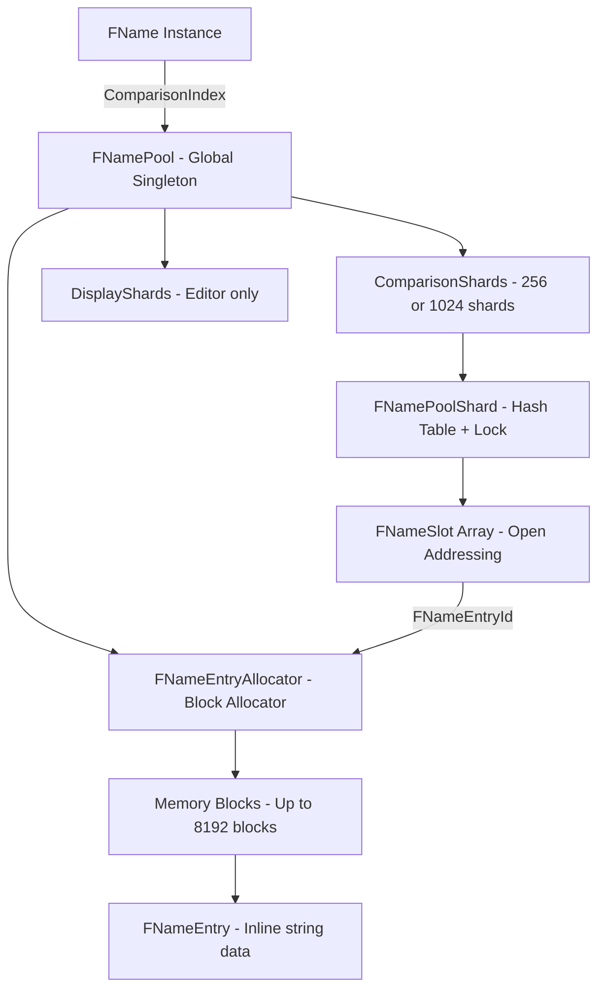
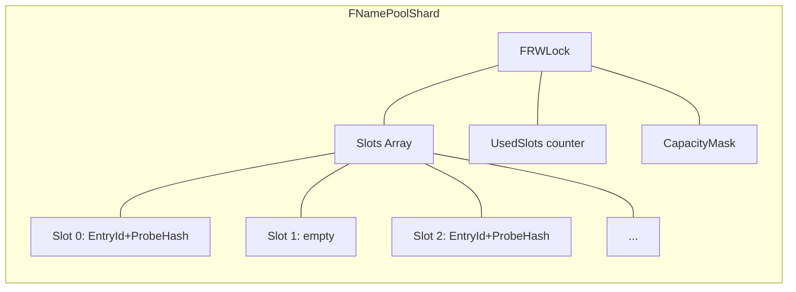
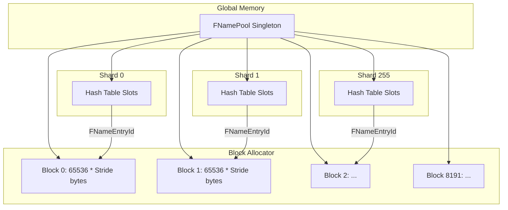
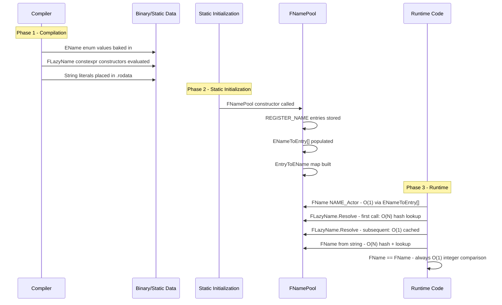

# FName System Deep Analysis

> Source: [`NameTypes.h`](Engine/Source/Runtime/Core/Public/UObject/NameTypes.h) and [`UnrealNames.cpp`](Engine/Source/Runtime/Core/Private/UObject/UnrealNames.cpp)

---

## Table of Contents

1. [Why FName Achieves O(1) Comparison](#1-why-fname-achieves-o1-comparison)
2. [NamePool Structure](#2-namepool-structure)
3. [Compile-time String → Runtime Mapping](#3-compile-time-string--runtime-mapping)
4. [Architecture Overview Diagram](#4-architecture-overview-diagram)

---


## 1. Why FName Achieves O(1) Comparison

### 1.1 Core Insight: Integer Comparison Instead of String Comparison

FName is fundamentally a **string interning** system. Instead of storing the string directly, each FName instance stores only **integer indices** that reference a shared global string pool. Two FNames are equal if and only if their integer indices are equal — no character-by-character comparison is needed.

### 1.2 FName's In-Memory Layout

From [`NameTypes.h:1233-1243`](Engine/Source/Runtime/Core/Public/UObject/NameTypes.h:1233):

```cpp
class FName
{
private:
    FNameEntryId  ComparisonIndex;  // uint32 — index into name pool
    uint32        Number;           // instance number (e.g., Actor_3 → Number=4 internally)
#if WITH_CASE_PRESERVING_NAME
    FNameEntryId  DisplayIndex;     // uint32 — editor only, preserves original casing
#endif
};
```

**Runtime (non-editor, 64-bit) layout:**
| Field | Size | Purpose |
|-------|------|---------|
| `ComparisonIndex` | 4 bytes | Unique ID for the case-insensitive string |
| `Number` | 4 bytes | Instance number suffix (internal = external + 1) |

Total: **8 bytes** on non-editor 64-bit builds.

### 1.3 The O(1) Equality Operator

From [`NameTypes.h:803-806`](Engine/Source/Runtime/Core/Public/UObject/NameTypes.h:803):

```cpp
[[nodiscard]] FORCEINLINE bool UEOpEquals(FName Other) const
{
    return ToUnstableInt() == Other.ToUnstableInt();
}
```

From [`NameTypes.h:1221-1230`](Engine/Source/Runtime/Core/Public/UObject/NameTypes.h:1221):

```cpp
[[nodiscard]] FORCEINLINE uint64 ToUnstableInt() const
{
    static_assert(STRUCT_OFFSET(FName, ComparisonIndex) == 0);
    static_assert(STRUCT_OFFSET(FName, Number) == 4);
    static_assert((STRUCT_OFFSET(FName, Number) + sizeof(Number)) == sizeof(uint64));

    uint64 Out = 0;
    FMemory::Memcpy(&Out, this, sizeof(uint64));  // reads 8 bytes at once
    return Out;
}
```

**Key insight**: [`ToUnstableInt()`](Engine/Source/Runtime/Core/Public/UObject/NameTypes.h:1221) packs both `ComparisonIndex` (4 bytes) and `Number` (4 bytes) into a single `uint64`, enabling equality check in **one CPU comparison instruction**.

### 1.4 Why This Works: String Deduplication Guarantees

When you create `FName("Actor")`, the system:

1. Lowercases the string to `"actor"` for comparison purposes
2. Hashes the lowercase string using CityHash64
3. Looks up the hash in the global name pool's sharded hash table
4. If found: returns the existing `FNameEntryId`
5. If not found: allocates a new entry, stores the string, returns the new `FNameEntryId`

**Invariant**: All FNames created from the same case-insensitive string share the **same** `ComparisonIndex`. Therefore, comparing `ComparisonIndex` values is equivalent to comparing the strings they represent.

### 1.5 IsNone() — Also O(1)

From [`NameTypes.h:827-834`](Engine/Source/Runtime/Core/Public/UObject/NameTypes.h:827):

```cpp
[[nodiscard]] FORCEINLINE bool IsNone() const
{
#if PLATFORM_64BITS && !WITH_CASE_PRESERVING_NAME
    return ToUnstableInt() == 0;  // Single 64-bit comparison
#else
    return ComparisonIndex.IsNone() && GetNumber() == NAME_NO_NUMBER_INTERNAL;
#endif
}
```

Since `NAME_None` has both `ComparisonIndex=0` and `Number=0`, checking `IsNone()` on 64-bit non-editor platforms is a single `uint64 == 0` comparison.

### 1.6 Hash Function — Also O(1)

From [`NameTypes.h:1367-1370`](Engine/Source/Runtime/Core/Public/UObject/NameTypes.h:1367):

```cpp
[[nodiscard]] friend FORCEINLINE uint32 GetTypeHash(FName Name)
{
    return GetTypeHash(Name.GetComparisonIndex()) + Name.GetNumber();
}
```

Hashing is a trivial integer operation — no string hashing at lookup time.

### 1.7 Summary

| Operation | Complexity | Mechanism |
|-----------|------------|-----------|
| `==` / `!=` | O(1) | Single `uint64` comparison |
| `GetTypeHash()` | O(1) | Integer hash of index + number |
| `IsNone()` | O(1) | `uint64 == 0` on 64-bit |
| `FastLess()` | O(1) | Integer comparison of indices |
| `LexicalLess()` | O(N) | Must resolve strings — slow path |
| Construction from string | O(N) | Hash + pool lookup + possible allocation |

---

## 2. NamePool Structure

### 2.1 High-Level Architecture



### 2.2 FNamePool — The Global Singleton

From `UnrealNames.cpp`:

```cpp
// Single global instance
alignas(FNamePool) static uint8 NamePoolData[sizeof(FNamePool)];

FNamePool& GetNamePool()
{
    // Constructed during static initialization or first use
    return *reinterpret_cast<FNamePool*>(NamePoolData);
}
```

**FNamePool contains:**

| Member | Type | Purpose |
|--------|------|---------|
| `Entries` | `FNameEntryAllocator` | Block allocator for all name entries |
| `ComparisonShards[N]` | `FNamePoolShard<IgnoreCase>` | Case-insensitive lookup hash tables |
| `DisplayShards[N]` | `FNamePoolShard<CaseSensitive>` | Case-sensitive lookup (editor only) |
| `ENameToEntry[MAX]` | `FNameEntryId[]` | Pre-registered EName → EntryId lookup |
| `EntryToEName` | `TMap<FNameEntryId, EName>` | Reverse mapping for `ToEName()` |
| `LargestEnameUnstableId` | `uint32` | Boundary for EName fast-path checks |

**Shard count** (`FNamePoolShards`):
- Non-editor: 256 shards (`FNamePoolShardBits = 8`)
- Editor / Case-Preserving: 1024 shards (`FNamePoolShardBits = 10`)

### 2.3 FNameEntryAllocator — Block Allocator

This is a **paged bump allocator** that stores all `FNameEntry` objects:

```
Constants:
- FNameMaxBlockBits   = 13     → Max 8192 blocks
- FNameBlockOffsetBits = 16    → 65536 entries per block
- Block size          = Stride * 65536  (Stride = alignof(FNameEntry))
- Total addressable   = 8192 * 65536 * Stride bytes
```

**FNameEntryId Encoding** (29 bits used):

```
  [31:29] unused (3 bits)
  [28:16] Block index (13 bits → 0..8191)
  [15:0]  Offset within block (16 bits → 0..65535)
```

Decoded by `FNameEntryHandle`:

```cpp
struct FNameEntryHandle
{
    uint32 Block = 0;   // bits [28:16]
    uint32 Offset = 0;  // bits [15:0]

    FNameEntryHandle(FNameEntryId Id)
        : Block(Id.ToUnstableInt() >> FNameBlockOffsetBits)
        , Offset(Id.ToUnstableInt() & (FNameBlockOffsets - 1))
    {}
};
```

**Resolving an entry** is simply:

```cpp
FNameEntry& Resolve(FNameEntryHandle Handle) const
{
    return *reinterpret_cast<FNameEntry*>(Blocks[Handle.Block] + Stride * Handle.Offset);
}
```

This is **O(1)** — a single array index + pointer arithmetic.

**Thread safety**: Protected by `FRWLock`. Reads (resolving existing entries) use shared locks; writes (allocating new entries) use exclusive locks. New blocks are allocated when the current block is full.

### 2.4 FNamePoolShard — Sharded Hash Table

Each shard is an independent hash table using **open addressing with linear probing**:



**FNameSlot** — 32-bit packed value:

```cpp
// 29 bits for FNameEntryId, 3 bits for ProbeHash
struct FNameSlot
{
    FNameEntryId GetId() const;     // Extract 29-bit entry id
    uint32 GetProbeHash() const;    // Extract 3-bit probe hash
    bool Used() const;              // Non-zero means occupied
};
```

**Hash computation** (`FNameHash`):

```cpp
// Uses CityHash64 on the lowercased string
uint64 Hash = CityHash64(LowercasedString, Length);

// Hash decomposition:
// High 32 bits → shard selection + probe hash
// Low 32 bits  → slot index within shard

uint32 ShardIndex    = Hash >> (64 - ShardBits);       // top N bits select shard
uint32 UnmaskedSlot  = static_cast<uint32>(Hash);       // low 32 bits for slot
uint32 ProbeHash     = (Hash >> FNameBlockOffsetBits);   // bits for collision avoidance
```

**Probing strategy**:

1. Compute initial slot = `Hash & CapacityMask`
2. Check if slot is empty → not found / insert here
3. Check if slot's `ProbeHash` matches AND entry header's `LowercaseProbeHash` matches → compare full string
4. If no match → linear probe to next slot
5. **Grow** when load factor exceeds 90%

**Additional probing optimization** (non-editor only): `FNameEntryHeader` stores a 5-bit `LowercaseProbeHash` that acts as a bloom-filter-like early rejection during probing. Only if both the 3-bit slot probe hash AND the 5-bit entry probe hash match does the system do a full string comparison.

### 2.5 FNameEntry — The String Storage

From [`NameTypes.h:278-381`](Engine/Source/Runtime/Core/Public/UObject/NameTypes.h:278):

```cpp
struct alignas(UE_FNAME_ENTRY_ALIGNMENT) FNameEntry
{
#if WITH_CASE_PRESERVING_NAME
    FNameEntryId ComparisonId;       // 4 bytes — back-pointer to comparison entry
#endif
    FNameEntryHeader Header;         // 2 bytes
    union {
        ANSICHAR  AnsiName[NAME_SIZE]; // Inline string data (unterminated)
        WIDECHAR  WideName[NAME_SIZE];
    };
};
```

**FNameEntryHeader** — 2 bytes:

| Config | Bits Layout |
|--------|-------------|
| Editor (`WITH_CASE_PRESERVING_NAME`) | `bIsWide:1`, `Len:15` |
| Runtime | `bIsWide:1`, `LowercaseProbeHash:5`, `Len:10` |

- `bIsWide`: 0 = ANSICHAR, 1 = WIDECHAR
- `Len`: String length (max 1023 in runtime, 32767 in editor)
- `LowercaseProbeHash`: 5-bit hash for probe optimization (runtime only)

**Total entry size** = Header (2B) + string data (Len × char_size), aligned to `UE_FNAME_ENTRY_ALIGNMENT`.

**Memory layout example** for `"Actor"` (ANSI, non-editor):

```
[Header: 2 bytes]  bIsWide=0, ProbeHash=xxx, Len=5
[Data: 5 bytes]    A c t o r
Total: 7 bytes → aligned up to Stride boundary
```

### 2.6 Memory Architecture Summary



---

## 3. Compile-time String → Runtime Mapping

There are **three mechanisms** for compile-time to runtime FName mapping:

### 3.1 Mechanism 1: EName + REGISTER_NAME (Hardcoded Names)

#### Definition

In [`UnrealNames.inl`](Engine/Source/Runtime/Core/Public/UObject/UnrealNames.inl):

```cpp
REGISTER_NAME(0,   None)
REGISTER_NAME(1,   ByteProperty)
REGISTER_NAME(100, Object)
REGISTER_NAME(102, Actor)
// ... ~200+ entries
```

The `REGISTER_NAME` macro generates:
1. An `EName` enum value: `NAME_None = 0`, `NAME_Actor = 102`, etc.
2. A registration call during `FNamePool` construction

#### Registration at Pool Construction

In `FNamePool::FNamePool()`:

```cpp
FNamePool::FNamePool()
{
    // For each REGISTER_NAME(num, name):
    // 1. Store "name" string into the name table
    // 2. Save the resulting FNameEntryId into ENameToEntry[num]
    // 3. Build reverse map: EntryToEName[id] = EName(num)
    
    #define REGISTER_NAME(num, name) \
        ENameToEntry[num] = Store(FNameStringView(#name, FCStringAnsi::Strlen(#name))); \
        EntryToEName.Add(ENameToEntry[num], EName(num));
    #include "UObject/UnrealNames.inl"
    #undef REGISTER_NAME
}
```

#### Fast Lookup: EName → FNameEntryId

From [`NameTypes.h:121-124`](Engine/Source/Runtime/Core/Public/UObject/NameTypes.h:121):

```cpp
FORCEINLINE static FNameEntryId FromEName(EName Ename)
{
    return Ename == NAME_None ? FNameEntryId() : FromValidEName(Ename);
}
```

`FromValidEName` reads from the pre-built `ENameToEntry[]` array — **O(1) lookup**.

#### Usage

```cpp
FName Name(NAME_Actor);  // Instant — no string hashing, no pool lookup
// Internally: ComparisonIndex = ENameToEntry[102], Number = 0
```

### 3.2 Mechanism 2: FLazyName (Deferred Resolution)

#### Problem Solved

During **static initialization** (before `main()`), the FNamePool may not yet be constructed. Creating FNames from string literals at static init time is unsafe. `FLazyName` solves this by deferring pool lookup until first use.

#### Compile-Time Construction

From [`NameTypes.h:1694-1709`](Engine/Source/Runtime/Core/Public/UObject/NameTypes.h:1694):

```cpp
template <int N>
constexpr FLazyName(const ANSICHAR (&Literal)[N])
    : Either{.AnsiLiteral = Literal}             // Store pointer to string literal
    , Number(ParseNumber(Literal, N - 1))         // Parse _N suffix at compile time
    , LiteralType(ELiteralType::AnsiLiteral)
{
}
```

**Key**: The template parameter `N` captures the string literal length at compile time. The `constexpr` constructor can be evaluated entirely at compile time by the compiler:

1. **Stores the literal pointer** — no copying, just a pointer to the read-only data segment
2. **Parses the number suffix at compile time** using `constexpr ParseNumberFromName()`

#### Compile-Time Number Parsing

From [`NameTypes.h:1786-1796`](Engine/Source/Runtime/Core/Public/UObject/NameTypes.h:1786):

```cpp
template <typename CharType>
static constexpr uint32 ParseNumber(const CharType* Literal, int32 Len)
{
    UE_IF_CONSTEVAL   // if evaluated at compile time
    {
        return UE::Core::Private::ParseNumberFromName(Literal, Len);
    }
    else              // if evaluated at runtime (fallback)
    {
        return CallParseNumber(Literal, Len);
    }
}
```

[`ParseNumberFromName()`](Engine/Source/Runtime/Core/Public/UObject/NameTypes.h:229) is a `constexpr` function that scans from the end of the string looking for `_<digits>`:

```cpp
// Example: "Actor_3" → Len becomes 5 ("Actor"), returns 4 (internal = external + 1)
// Example: "NoNumber" → returns NAME_NO_NUMBER_INTERNAL (0)
```

#### Lazy Resolution at Runtime

From `UnrealNames.cpp`:

```cpp
FName FLazyName::Resolve() const
{
    if (Either.IsName())
    {
        // Already resolved — return cached result
        return FName(Either.GetComparisonId(), Either.GetDisplayId(), Number);
    }
    
    // First-time resolution: look up string in the name pool
    FName Resolved;
    switch (LiteralType)
    {
        case ELiteralType::AnsiLiteral:
            Resolved = FName(Either.AnsiLiteral);  // Pool lookup
            break;
        // ... similar for UTF8 and Wide
    }
    
    // Cache the result atomically (safe without synchronization because
    // multiple threads will compute the same value)
    Either.PackedName = FLiteralOrName::PackName(
        Resolved.GetComparisonIndex(), 
        Resolved.GetDisplayIndex()
    );
    
    return Resolved;
}
```

#### The Union Trick

`FLiteralOrName` is a union that stores either:
- A **pointer** to a string literal (before resolution)
- A **packed uint64** with the resolved `FNameEntryId` values (after resolution)

```cpp
union FLiteralOrName
{
    static constexpr uint64 IsNameFlag = uint64(1) << 63;  // High bit flag
    
    const ANSICHAR* AnsiLiteral;   // Before resolution
    const UTF8CHAR* Utf8Literal;
    const WIDECHAR* WideLiteral;
    mutable uint64 PackedName = 0; // After resolution: IsNameFlag | ComparisonId | DisplayId
};
```

**Discrimination**: The high bit (`IsNameFlag`) distinguishes resolved vs. unresolved state. On modern 64-bit platforms, valid user-space pointers never have the high bit set, so a pointer value will always have `IsNameFlag = 0`, while a resolved packed name will always have `IsNameFlag = 1`.

#### Thread Safety of Lazy Resolution

The resolution is **intentionally unsynchronized**:
- Multiple threads may resolve the same `FLazyName` concurrently
- All will compute the **same result** (same string → same FNameEntryId)
- The `uint64` write to `PackedName` is atomic on 64-bit platforms (aligned word-sized write)
- Worst case: redundant pool lookups, but no data corruption

#### Usage Example

```cpp
// Global scope — evaluated at compile time, no FNamePool dependency
static FLazyName GMyName("SomeProperty_42");
// At this point: Either.AnsiLiteral = "SomeProperty_42", Number = 43, LiteralType = Ansi

void SomeFunction()
{
    FName Name = GMyName.Resolve();  // First call: pool lookup + cache
    // Subsequent calls: instant return from cached PackedName
}
```

### 3.3 Mechanism 3: FName String Constructor (Runtime)

The standard constructor performs full string → FNameEntryId mapping:

```cpp
FName("MyActor_5");
```

**Steps**:
1. Call `ParseNumberFromName("MyActor_5", 10)` → base string = `"MyActor"`, number = `6` (internal)
2. Lowercase `"MyActor"` → `"myactor"` for comparison
3. Compute `CityHash64("myactor", 7)` 
4. Select shard: `Hash >> (64 - ShardBits)`
5. Lock shard's `FRWLock` (shared for read, exclusive if insert needed)
6. Probe hash table slots for existing entry
7. If found: return existing `FNameEntryId`
8. If not found: allocate `FNameEntry` in block allocator, insert into hash table, return new `FNameEntryId`
9. Set `ComparisonIndex = id`, `Number = 6`

### 3.4 Comparison of Mechanisms

| Mechanism | Construction Cost | First Use Cost | Subsequent Use | Static Init Safe |
|-----------|-------------------|----------------|----------------|-------------------|
| `FName(EName)` | O(1) — array lookup | N/A | O(1) | No — pool must exist |
| `FLazyName(literal)` | O(1) — constexpr | O(N) — pool lookup | O(1) — cached | Yes |
| `FName("string")` | O(N) — hash + lookup | N/A | O(1) — already resolved | No — pool must exist |

### 3.5 Compile-Time to Runtime Flow



---

## 4. Architecture Overview Diagram

```mermaid
graph TB
    subgraph FName Instance - 8 bytes
        CI[ComparisonIndex: uint32]
        NUM[Number: uint32]
    end

    subgraph FNamePool - Global Singleton
        EA[FNameEntryAllocator]
        CS[ComparisonShards x256]
        EN[ENameToEntry Array]
    end

    subgraph FNameEntryAllocator
        BLK0[Block 0]
        BLK1[Block 1]
        BLKN[Block N...]
    end

    subgraph Block 0
        E0[FNameEntry: none]
        E1[FNameEntry: byteproperty]
        E2[FNameEntry: actor]
        E3[FNameEntry: ...]
    end

    subgraph FNamePoolShard
        LCK[FRWLock]
        SLT[Slot Array - open addressing]
        UC[UsedSlots / CapacityMask]
    end

    subgraph FNameEntry
        HDR[Header: bIsWide + Len + ProbeHash]
        STR[Inline String Data]
    end

    subgraph Compile-Time Sources
        ENUM[EName enum]
        LAZY[FLazyName constexpr]
        CTOR[FName string constructor]
    end

    CI -->|Resolves to| EA
    CS --> SLT
    SLT -->|FNameEntryId| EA
    EA --> BLK0
    EA --> BLK1
    EA --> BLKN
    BLK0 --> E0
    BLK0 --> E1
    BLK0 --> E2
    BLK0 --> E3

    ENUM -->|ENameToEntry[]| EN
    EN -->|FNameEntryId| EA
    LAZY -->|Resolve -> Pool Lookup| CS
    CTOR -->|Hash -> Shard -> Probe| CS
```

---

## Summary

| Question | Answer |
|----------|--------|
| **Why O(1) comparison?** | FName stores integer indices, not strings. `operator==` compares a single `uint64` packing `ComparisonIndex + Number`. String deduplication in the pool guarantees equal strings produce equal indices. |
| **NamePool structure?** | Single global `FNamePool` containing: (1) `FNameEntryAllocator` — paged block allocator with 8192 blocks × 65536 offsets; (2) 256+ sharded hash tables (`FNamePoolShard`) using open addressing with linear probing, CityHash64, and multi-level probe hash optimization; (3) `FNameEntry` — compact inline string storage with 2-byte header. |
| **Compile-time → Runtime?** | Three paths: (1) `EName` enum + `REGISTER_NAME` pre-registers ~200 names at pool construction with O(1) array lookup; (2) `FLazyName` stores string literal pointers with `constexpr` number parsing, lazily resolves to FNameEntryId on first use with lock-free caching; (3) Standard `FName(string)` constructor performs runtime hash-based pool lookup. |
