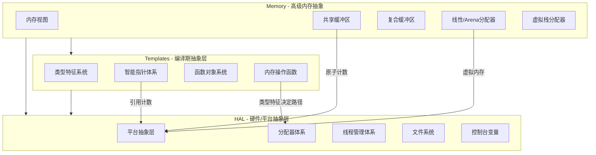
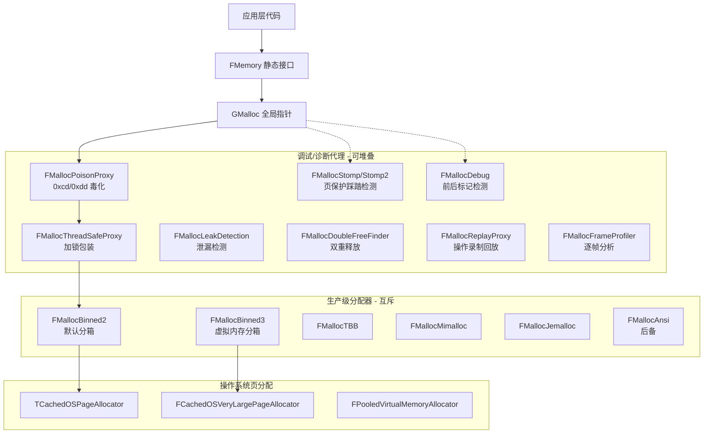
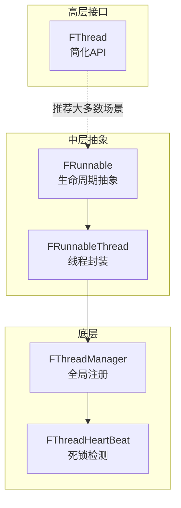
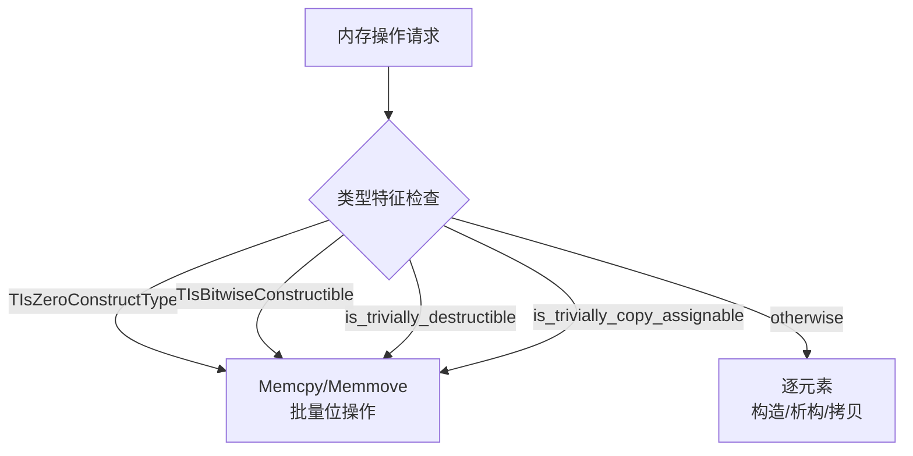

# UE5 基础类核心亮点分析

> 基于 Memory、HAL、Templates 三大模块的类参考文档与源码深度分析

---

## 总览：三大模块的定位与协作关系



---

## 一、Memory 模块核心亮点

### 1.1 原子位打包引用计数 — FBufferOwner 的精巧设计

**核心亮点：将共享计数 + 弱计数 + 标志位打包进单个 `std::atomic<uint64>` 中**

源码（[`SharedBuffer.h`](Engine/Source/Runtime/Core/Public/Memory/SharedBuffer.h:101)）揭示了一个极为精巧的内存布局设计：

```
bit 位分布（共64位）:
  [0..29]  — 共享引用计数 (30 bits, 最大约 10 亿)
  [30..59] — 弱引用计数   (30 bits)
  [60..63] — 标志位 (Owned / Immutable / Materialized)
```

**关键设计要点：**

- **单原子操作保证一致性**：所有引用计数增减和标志位读写都在同一个 `uint64` 上操作，避免了多变量原子操作的 ABA 问题
- **共享计数自动管理弱计数**：[`AddSharedReference()`](Engine/Source/Runtime/Core/Public/Memory/SharedBuffer.h:690) 中，当共享计数从 0 变为 1 时自动增加弱引用，反之 [`ReleaseSharedReference()`](Engine/Source/Runtime/Core/Public/Memory/SharedBuffer.h:700) 在最后一个共享引用释放时自动减弱引用——这确保了 `FBufferOwner` 对象在仍有弱引用时不被 `delete`
- **`IsUniqueOwnedMutable()` 的一次性检查**：[line 683](Engine/Source/Runtime/Core/Public/Memory/SharedBuffer.h:683) 通过一次原子 load 同时检查总引用数为 1、拥有所有权、且非不可变——这是 `MoveToUnique()` 能否零拷贝转换的关键判断

### 1.2 延迟物化机制 — Lazy Materialization

[`FBufferOwner::Materialize()`](Engine/Source/Runtime/Core/Public/Memory/SharedBuffer.h:651) 实现了**延迟求值**模式：

- 缓冲区的数据可在首次访问 `GetData()`/`GetSize()` 时才真正生成
- 使用 `memory_order_acquire` / `memory_order_release` 保证物化状态的可见性
- 子类覆盖 [`MaterializeBuffer()`](Engine/Source/Runtime/Core/Public/Memory/SharedBuffer.h:73) 即可实现自定义的延迟加载逻辑（如从磁盘/网络按需加载）

**应用场景**：资产延迟加载、流式数据按需解压等。

### 1.3 所有权语义的完整表达

`FUniqueBuffer` / `FSharedBuffer` / `FWeakSharedBuffer` 构成了一个**完整的所有权语义三角**：


- **Unique → Shared**：转换后原缓冲区变为不可变，实现写时共享
- **Shared → Unique**：当只有一个共享引用时直接转移所有权（零拷贝）；否则克隆
- **`TakeOwnership()`** 支持自定义删除函数，通过模板 [`TBufferOwnerDeleteFunction`](Engine/Source/Runtime/Core/Public/Memory/SharedBuffer.h:520) 在释放时回调

### 1.4 零拷贝分段缓冲区 — FCompositeBuffer

[`FCompositeBuffer`](Engine/Source/Runtime/Core/Public/Memory/CompositeBuffer.h:26) 的核心价值在于**避免不必要的内存合并**：

- 内部使用 `TArray<FSharedBuffer, TInlineAllocator<1>>`——**单段场景零堆分配**
- [`ToShared()`](Engine/Source/Runtime/Core/Public/Memory/CompositeBuffer.h:78) 智能判断：单段直接返回，多段才合并
- [`ViewOrCopyRange()`](Engine/Source/Runtime/Core/Public/Memory/CompositeBuffer.h:94) 优先返回视图，跨段时才拷贝——最小化数据移动
- [`IterateRange()`](Engine/Source/Runtime/Core/Public/Memory/CompositeBuffer.h:119) 支持带段所有权信息的访问器模式

**典型场景**：网络分包接收、流式 I/O、分块序列化数据处理。

### 1.5 虚拟内存驱动的分配器

**FLinearAllocator** 展现了平台自适应策略：

- 在支持虚拟内存的平台（[`UE_ENABLE_LINEAR_VIRTUAL_ALLOCATOR`](Engine/Source/Runtime/Core/Public/Memory/LinearAllocator.h:10)），使用 `FPlatformVirtualMemoryBlock` 预留虚拟地址空间，按需提交物理页面
- 在不支持的平台，退化为传统的链表式块分配器 [`FLinearBlockAllocator`](Engine/Source/Runtime/Core/Public/Memory/LinearAllocator.h:44)
- 全局持久实例 [`GetPersistentLinearAllocator()`](Engine/Source/Runtime/Core/Public/Memory/LinearAllocator.h:79) 用于引擎永久对象的快速分配

**FVirtualStackAllocator** 的创新点：

- **RAII 书签机制**：[`FScopedStackAllocatorBookmark`](Engine/Source/Runtime/Core/Public/Memory/VirtualStackAllocator.h:46) 在析构时批量释放书签之后的所有分配
- **智能解提交策略**：三种 [`EVirtualStackAllocatorDecommitMode`](Engine/Source/Runtime/Core/Public/Memory/VirtualStackAllocator.h:33)——析构时全部解提交、栈空时全部解提交、基于高水位线启发式解提交
- **ASAN 集成**：[`Free()`](Engine/Source/Runtime/Core/Public/Memory/VirtualStackAllocator.h:109) 中使用 `ASAN_POISON_MEMORY_REGION` 标记已释放内存，与地址消毒器协作检测错误
- **AutoRTFM 兼容**：ASAN 毒化在事务内存模式下被禁用，因为毒化操作不可安全回滚

---

## 二、HAL 模块核心亮点

### 2.1 分层分配器架构 — 代理与装饰器模式的极致运用

HAL 的内存分配器体系堪称**装饰器模式教科书级应用**：



**关键设计洞察：**

- **零侵入切换**：所有分配器继承同一基类 `FMalloc`，通过 `GMalloc` 全局指针实现运行时切换
- **代理链可组合**：`FMallocPoisonProxy` 默认开启（Debug/Development），`FMallocStomp` 通过命令行 `-stompmalloc` 启用
- **三代分箱进化**：Binned → Binned2（fork 支持、更好碎片控制）→ Binned3（纯虚拟内存、仅 64 位平台）

### 2.2 AutoRTFM 事务内存 — FMemory.inl 的创新性

[`FMemory.inl`](Engine/Source/Runtime/Core/Public/HAL/FMemory.inl) 中的 AutoRTFM（自动事务内存）支持是一个**极具前瞻性**的设计：

**核心思想：让内存操作具有事务语义，支持回滚**

- **Malloc 在 open 模式调用**：避免追踪分配器内部数据结构的写入（[line 25](Engine/Source/Runtime/Core/Public/HAL/FMemory.inl:25)）
- **Malloc 失败时自动清理**：`AutoRTFM::OnAbort` 在事务中止时自动释放已分配内存（[line 46](Engine/Source/Runtime/Core/Public/HAL/FMemory.inl:46)）
- **Realloc 被分解**：事务中 realloc 变为 malloc + memcpy + free（[line 58](Engine/Source/Runtime/Core/Public/HAL/FMemory.inl:58)），因为真正的 realloc 可能释放旧内存导致回滚时旧指针悬空
- **Free 延迟执行**：`UE_AUTORTFM_ONCOMMIT` 将 free 推迟到事务提交时（[line 150](Engine/Source/Runtime/Core/Public/HAL/FMemory.inl:150)），保证回滚时内存仍然有效

### 2.3 `COMPILED_PLATFORM_HEADER` 宏 — 平台抽象的核心机制

整个 HAL 模块的平台重定向基于 `PreprocessorHelpers.h` 中定义的 `COMPILED_PLATFORM_HEADER` 宏：

```cpp
// 将 PlatformMemory.h 在 Windows 上展开为
// "Windows/WindowsPlatformMemory.h"
#include COMPILED_PLATFORM_HEADER(PlatformMemory.h)
```

这个宏是 **UE 跨平台编译的基石**，覆盖了：
- 内存管理（PlatformMemory）
- 原子操作（PlatformAtomics）
- 文件系统（PlatformFile）
- 线程原语（CriticalSection/Semaphore）
- 数学/字符串/时间函数

### 2.4 全局 operator new/delete 重定向

[`PerModuleInline.inl`](Engine/Source/Runtime/Core/Public/HAL/PerModuleInline.inl) 中的 `REPLACEMENT_OPERATOR_NEW_AND_DELETE` 宏：

- **每个 UE 模块**的 operator new/delete 都被重载为调用 `FMemory::Malloc`/`FMemory::Free`
- 这确保了**所有内存分配**（包括第三方库）都经过统一的分配器
- 使得 LLM（低级内存追踪器）能够精确追踪每个子系统的内存使用

### 2.5 线程管理的层次化设计



**亮点：**
- `FThread` 提供 `std::thread` 风格的简洁 API
- `FThreadHeartBeat` 实现**无侵入式死锁检测**：各线程定期发送心跳，超时判定挂起并触发崩溃报告
- `FGameThreadHitchHeartBeatThreaded` 专门检测主线程卡顿
- 池化同步事件 `FPooledSyncEvent` 避免频繁创建/销毁系统事件对象

### 2.6 文件系统的装饰器链


`FFileHandleRegistry` 解决了一个实际问题：**操作系统文件句柄有限**，自动关闭/重新打开对上层透明。

---

## 三、Templates 模块核心亮点

### 3.1 非空共享引用 — TSharedRef 的独创设计

[`TSharedRef`](Engine/Source/Runtime/Core/Public/Templates/SharedPointer.h:152) 是 UE 对标准智能指针最重要的扩展：

**核心理念：在类型系统中编码非空约束**

- **没有默认构造函数**（公共的）——强制在构造时就提供有效对象
- **移动构造不置空源**：[line 352](Engine/Source/Runtime/Core/Public/Templates/SharedPointer.h:352) 明确注释"我们有意不移动，因为不想让源处于空状态"
- **与 TSharedPtr 的隐式转换**：TSharedRef → TSharedPtr 是安全的隐式转换；TSharedPtr → TSharedRef 需要显式调用 `ToSharedRef()`
- **别名构造函数**：[line 337](Engine/Source/Runtime/Core/Public/Templates/SharedPointer.h:337) 支持子对象共享引用，共享父对象的引用计数

**API 设计意义**：在函数签名中使用 `TSharedRef` 替代 `TSharedPtr` 可以**在编译时消除空检查**，减少运行时错误。

### 3.2 可选线程安全模式 — ESPMode

```cpp
ESPMode::NotThreadSafe  // 默认，非原子引用计数，更快
ESPMode::ThreadSafe     // 原子引用计数，线程安全
```

这是 UE 相对 `std::shared_ptr` 的重要优化：**std::shared_ptr 总是线程安全的**，而 UE 让开发者选择。在游戏循环等单线程场景中，非线程安全版本省去了原子操作的开销。

### 3.3 TSharedFromThis — 从 this 获取共享引用

[`TSharedFromThis`](Engine/Source/Runtime/Core/Public/Templates/SharedPointer.h:1638) 实现了一个重要能力：

- 内部存储 `mutable TWeakPtr`，在首次创建共享指针时通过 [`EnableSharedFromThis()`](Engine/Source/Runtime/Core/Public/Templates/SharedPointer.h:1806) 初始化
- [`AsShared()`](Engine/Source/Runtime/Core/Public/Templates/SharedPointer.h:1650) 返回 `TSharedRef`（注意：不是 TSharedPtr）
- [`AsSharedSubobject()`](Engine/Source/Runtime/Core/Public/Templates/SharedPointer.h:1706) 支持子对象的共享引用
- **编译期防 UObject 误用**：[line 1852](Engine/Source/Runtime/Core/Public/Templates/SharedPointer.h:1852) 通过重载决议检测，若 ObjectType 是 UObject 则产生编译错误

### 3.4 三级函数对象系统

[`Function.h`](Engine/Source/Runtime/Core/Public/Templates/Function.h) 实现了一个设计层次分明的函数对象体系：

| 类型 | 所有权 | 可拷贝 | 内联存储 | 典型场景 |
|------|--------|--------|----------|----------|
| `TFunctionRef` | 非拥有（引用） | 轻量拷贝 | 无（仅指针） | 同步回调参数 |
| `TFunction` | 拥有 | 是 | 可选 SBO | 一般回调/存储 |
| `TUniqueFunction` | 拥有 | 否 | 可选 SBO | move-only lambda |

**内部实现亮点：**

- **策略模式存储**：`FFunctionRefStoragePolicy`（仅存指针）vs `TFunctionStorage<bUnique>`（堆/内联存储）
- **小对象优化 (SBO)**：当 `NUM_TFUNCTION_INLINE_BYTES` 宏定义时，小型可调用对象直接存储在内联缓冲区，避免堆分配（[line 222](Engine/Source/Runtime/Core/Public/Templates/Function.h:222)）
- **类型擦除**：通过虚函数接口 [`IFunction_OwnedObject`](Engine/Source/Runtime/Core/Public/Templates/Function.h:49) 擦除具体可调用对象的类型
- **函数指针优化**：[`TFuncPtrTypeIfPossible_T`](Engine/Source/Runtime/Core/Public/Templates/Function.h:500) 将无状态 lambda 转换为函数指针，避免不必要的包装
- **AutoRTFM 集成**：所有核心类型都标记了 `AUTORTFM_INFER`

### 3.5 编译期路径选择的内存操作

[`MemoryOps.h`](Engine/Source/Runtime/Core/Public/Templates/MemoryOps.h) 展示了 **类型特征驱动的编译期优化** 的最佳实践：



**每个操作都有两个 `requires` 约束的重载版本**：

- `DefaultConstructItems<T>()`：零可构造类型 → `Memset(0)`，否则逐个 placement new
- `RelocateConstructItems<T>()`：可位拷贝 + 可平凡析构 → `Memmove`，否则逐个移动构造 + 析构
- `DestructItems<T>()`：平凡析构 → 空操作（完全优化掉），否则逐个析构
- `CompareItems<T>()`：字节可比较 → `Memcmp`，否则逐个 `operator==`

这种模式确保了容器操作（TArray 的 resize、insert、erase 等）在处理 POD 类型时达到**接近手写 memcpy 的性能**。

### 3.6 侵入式 TOptional 状态

源码中 `TSharedRef`、`TSharedPtr`、`TWeakPtr`、`TFunctionRef` 都实现了 **侵入式 TOptional 状态**：

```cpp
constexpr static bool bHasIntrusiveUnsetOptionalState = true;
explicit TSharedRef(FIntrusiveUnsetOptionalState) : Object(nullptr) {}
bool UEOpEquals(FIntrusiveUnsetOptionalState) const { return !IsValid(); }
```

这允许 `TOptional<TSharedRef>` **无额外存储开销**表达可选状态——利用了 TSharedRef 正常情况下永远非空的不变量，将 `Object == nullptr` 作为"未设置"的标记值。

---

## 四、跨模块设计模式总结

### 4.1 一致的所有权语义

| 概念 | Memory 模块 | Templates 模块 |
|------|-------------|----------------|
| 独占所有权 | `FUniqueBuffer` | `TUniquePtr` |
| 共享所有权 | `FSharedBuffer` | `TSharedPtr` |
| 非空共享 | — | `TSharedRef` |
| 弱引用 | `FWeakSharedBuffer` | `TWeakPtr` |
| 非拥有视图 | `FMemoryView` | `TFunctionRef` |

### 4.2 重复出现的设计模式

1. **Policy-Based Design**：`TMemoryView<DataType>`、`TBufferOwnerPtr<FOps>`、`TFunctionRefBase<StorageType, FuncType>` 都通过模板参数注入策略
2. **装饰器/代理链**：内存分配器代理链、文件系统包装链
3. **RAII 无处不在**：`FScopedStackAllocatorBookmark`、`TGuardValue`、`FScopedNamedEvent`、`FPooledSyncEvent`
4. **编译期分派**：`if constexpr` + 类型特征在容器操作、智能指针、函数对象中广泛使用
5. **AutoRTFM 贯穿全栈**：从最底层的 `FMemory` 到 `TFunction`，事务内存支持是一等公民

### 4.3 性能导向的关键决策

| 决策 | 原因 |
|------|------|
| 可选线程安全（ESPMode） | 避免单线程场景的原子操作开销 |
| 原子位打包引用计数 | 一次 CAS 操作完成全部状态更新 |
| 内联缓冲区 (SBO) | TFunction、FCompositeBuffer 避免小对象堆分配 |
| 虚拟内存延迟提交 | 预留大地址空间不消耗物理内存 |
| 类型特征驱动路径选择 | POD 类型操作降级为 memcpy/memmove |
| FORCEINLINE + constexpr | 关键路径零开销抽象 |

---

## 五、总结

UE5 的 Memory、HAL、Templates 三大基础模块展现了以下核心工程理念：

1. **零开销抽象**：通过模板元编程、编译期分派、策略模式确保抽象不引入运行时开销
2. **所有权明确化**：从智能指针到缓冲区管理，在类型系统中精确表达所有权语义
3. **可组合性**：代理/装饰器模式使调试工具、性能剖析、平台适配层可以自由组合
4. **平台透明性**：`COMPILED_PLATFORM_HEADER` 宏 + HAL 层统一接口让上层代码无需关心平台差异
5. **前瞻性设计**：AutoRTFM 事务内存支持贯穿全栈，为未来并发编程模型做好准备
