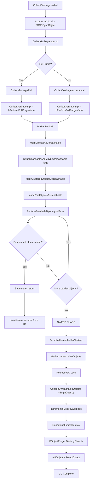
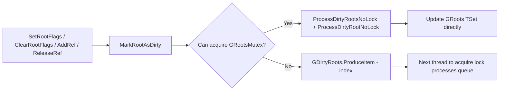
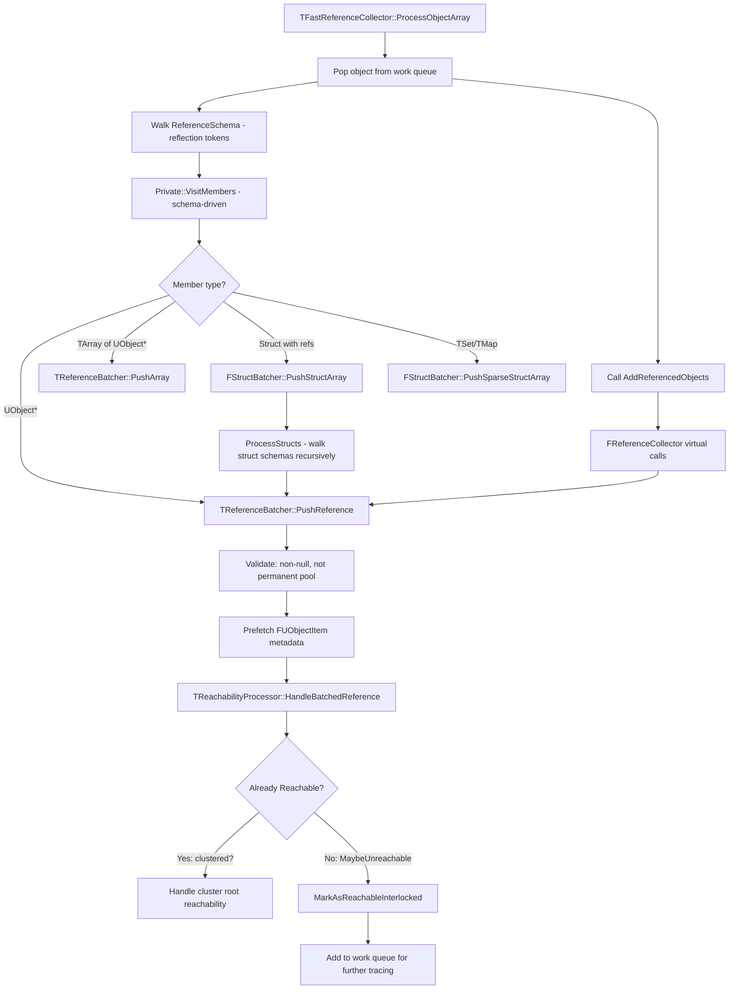
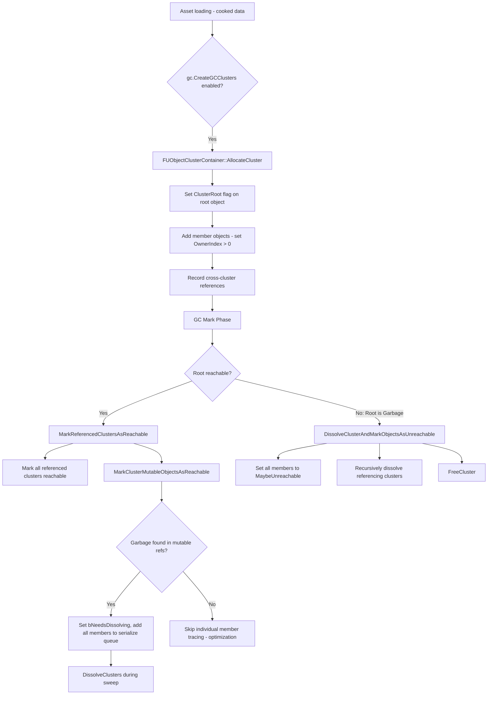
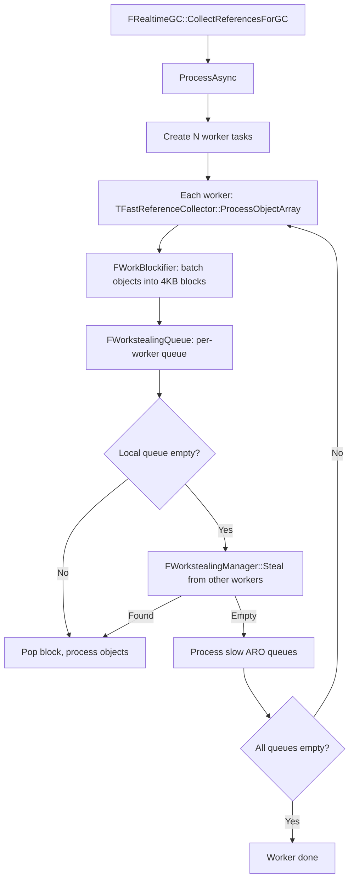

# Unreal Engine Garbage Collection System — Deep Analysis

> **Source files analyzed:**
> - [`GarbageCollection.cpp`](../Engine/Source/Runtime/CoreUObject/Private/UObject/GarbageCollection.cpp) — Main GC implementation (~6800+ lines)
> - [`UObjectHash.cpp`](../Engine/Source/Runtime/CoreUObject/Private/UObject/UObjectHash.cpp) — UObject hash table management
> - [`UObjectClusters.cpp`](../Engine/Source/Runtime/CoreUObject/Private/UObject/UObjectClusters.cpp) — UObject cluster lifecycle

---

## 1. Core Principle: Reflection-Driven GC, NOT Smart Pointers

**UE's garbage collection is fundamentally different from C++ smart pointer (shared_ptr/weak_ptr) reference counting.** Understanding this distinction is critical.

| Feature | Smart Pointer GC (e.g. shared_ptr) | UE Reflection-Driven GC |
|---|---|---|
| **Reference tracking** | Each pointer increments/decrements refcount | No per-reference counting; GC walks all references at collection time |
| **Reference discovery** | Implicit via constructor/destructor | Explicit via UPROPERTY reflection metadata + `AddReferencedObjects` |
| **Cycle handling** | Cannot handle cycles (memory leak) | Full cycle detection via Mark & Sweep |
| **Cost model** | Per-assignment cost (atomic inc/dec) | Zero assignment cost; periodic batch collection cost |
| **Thread safety** | Atomic refcount per pointer | Global GC lock; parallel mark phase |
| **Determinism** | Deterministic destruction at last ref release | Non-deterministic; GC decides when to collect |

### How References Are Discovered

UE discovers object references through two mechanisms, both driven by the **reflection system**:

#### 1.1 Schema-Based Reference Walking (Primary Mechanism)

Each [`UClass`](../Engine/Source/Runtime/CoreUObject/Private/UObject/GarbageCollection.cpp:6848) has a `ReferenceSchema` — a compiled token stream that encodes the byte offsets and types of all `UPROPERTY`-tagged UObject* fields. This is assembled via [`UClass::AssembleReferenceTokenStream()`](../Engine/Source/Runtime/CoreUObject/Private/UObject/GarbageCollection.cpp:6848):

```
UClass
  └── ReferenceSchema (FSchemaView)
        └── Compiled token stream of UPROPERTY offsets
              ├── Direct UObject* references
              ├── TArray<UObject*> references  
              ├── TSet<UObject*> references
              ├── Struct members (recursive schema)
              └── TMap/TSet of structs containing UObject*
```

The GC walks these schemas via [`Private::VisitMembers()`](../Engine/Source/Runtime/CoreUObject/Private/UObject/GarbageCollection.cpp:3841) which dispatches to the appropriate batcher based on member type. This is the fast path — no virtual calls, fully data-driven.

#### 1.2 AddReferencedObjects (Secondary Mechanism)

For references that **cannot** be expressed as `UPROPERTY` (e.g., raw UObject* in native containers, dynamically computed references), classes override the virtual [`UObject::AddReferencedObjects()`](../Engine/Source/Runtime/CoreUObject/Private/UObject/GarbageCollection.cpp:3897) function. This is called via [`FReferenceCollector`](../Engine/Source/Runtime/CoreUObject/Private/UObject/GarbageCollection.cpp:3397) during the mark phase.

**Key insight:** Even `AddReferencedObjects` uses the reflection collector infrastructure — it calls into the same `FReferenceCollector` that schema-based walking uses. The GC system is unified.

---

## 2. Mark & Sweep Flow

UE implements a **tri-state mark-and-sweep** garbage collector with support for parallel execution, incremental collection, and object clustering.

### 2.1 High-Level Flow Diagram



### 2.2 Tri-State Reachability Model

Instead of clearing flags on all objects each GC cycle (expensive), UE uses a **flag-swapping** technique with three reachability states:

| State | Meaning | Flag Value |
|---|---|---|
| **Reachable** | Known alive | `ReachabilityFlag0` (swaps each cycle) |
| **MaybeUnreachable** | Potentially garbage | `ReachabilityFlag1` or `ReachabilityFlag2` (swaps) |
| **Unreachable** | Confirmed garbage | `EInternalObjectFlags::Unreachable` |

The swap is performed in [`FGCFlags::SwapReachableAndMaybeUnreachable()`](../Engine/Source/Runtime/CoreUObject/Private/UObject/GarbageCollection.cpp:4386) at the start of each mark phase. This effectively sets ALL objects to MaybeUnreachable by reinterpreting the previous cycle's Reachable flag as the new MaybeUnreachable flag — **without touching any object's memory**.

```cpp
// Conceptual: what SwapReachableAndMaybeUnreachable does
// Cycle N:   Reachable = Flag0, MaybeUnreachable = Flag1
// Cycle N+1: Reachable = Flag1, MaybeUnreachable = Flag0
// Objects from Cycle N with Flag0 (was Reachable) now read as MaybeUnreachable
```

### 2.3 Mark Phase Detail

The mark phase is orchestrated by [`FRealtimeGC::PerformReachabilityAnalysis()`](../Engine/Source/Runtime/CoreUObject/Private/UObject/GarbageCollection.cpp:4528):

#### Step 1: Mark Objects As Unreachable
[`MarkObjectsAsUnreachable()`](../Engine/Source/Runtime/CoreUObject/Private/UObject/GarbageCollection.cpp:4375) — Swap reachability flags, then mark clusters and roots:

#### Step 2: Mark Clustered Objects As Reachable
[`MarkClusteredObjectsAsReachable()`](../Engine/Source/Runtime/CoreUObject/Private/UObject/GarbageCollection.cpp:4175) iterates all cluster roots in parallel:
- If root has root flags or refcount > 0 → mark cluster as reachable
- If root is Garbage → dissolve cluster, mark all members as MaybeUnreachable
- For reachable clusters → [`MarkReferencedClustersAsReachable()`](../Engine/Source/Runtime/CoreUObject/Private/UObject/GarbageCollection.cpp:1142) transitively marks cross-cluster references

#### Step 3: Mark Root Objects As Reachable
[`MarkRootObjectsAsReachable()`](../Engine/Source/Runtime/CoreUObject/Private/UObject/GarbageCollection.cpp:4262):
1. Lock `GRootsMutex`, process dirty roots, snapshot `GRoots` to array
2. Parallel iterate all root indices → mark as Reachable, add to initial objects list
3. If `KeepFlags != RF_NoFlags` → slow path: iterate ALL objects checking for KeepFlags (e.g. `RF_Standalone`)

#### Step 4: Reachability Analysis Pass
[`PerformReachabilityAnalysisPass()`](../Engine/Source/Runtime/CoreUObject/Private/UObject/GarbageCollection.cpp:4452):
1. Allocate `FWorkerContext` from pool
2. Collect GC barrier objects from `GReachableObjects` (for incremental GC)
3. Set initial objects and initial native references
4. Call [`PerformReachabilityAnalysisOnObjects()`](../Engine/Source/Runtime/CoreUObject/Private/UObject/GarbageCollection.cpp:4590) which dispatches to template-instantiated functions based on `EGCOptions`
5. The core work is done by [`TFastReferenceCollector::ProcessObjectArray()`](../Engine/Source/Runtime/CoreUObject/Private/UObject/GarbageCollection.cpp:3805) which:
   - Pops objects from the work queue
   - Walks each object's `ReferenceSchema` (reflection-driven)
   - Calls `AddReferencedObjects` for non-schema references
   - For each discovered reference: check reachability → if MaybeUnreachable, mark Reachable and add to work queue

### 2.4 Sweep Phase Detail

After the mark phase completes:

#### Step 1: Dissolve Unreachable Clusters
Clusters flagged with `bNeedsDissolving` are dissolved — member objects detached from cluster root.

#### Step 2: Gather Unreachable Objects
[`GatherUnreachableObjects()`](../Engine/Source/Runtime/CoreUObject/Private/UObject/GarbageCollection.cpp:5229) iterates all objects in parallel:
- Objects still in MaybeUnreachable state → confirmed unreachable
- Sets `EInternalObjectFlags::Unreachable` flag
- Adds to `GUnreachableObjects` array

#### Step 3: Unhash Unreachable Objects
[`UnhashUnreachableObjects()`](../Engine/Source/Runtime/CoreUObject/Private/UObject/GarbageCollection.cpp:6095):
- Calls `BeginDestroy()` on each unreachable object
- Removes objects from UObject hash tables
- Can be time-sliced (incremental)

#### Step 4: Incremental Destroy Garbage
[`IncrementalDestroyGarbage()`](../Engine/Source/Runtime/CoreUObject/Private/UObject/GarbageCollection.cpp:4782):
- Calls `ConditionalFinishDestroy()` — waits for async cleanup (e.g., GPU resources)
- [`FObjectPurge::DestroyObjects()`](../Engine/Source/Runtime/CoreUObject/Private/UObject/GarbageCollection.cpp:859):
  1. First loop: Free UObject indices from `GUObjectArray` (locked)
  2. Second loop: Call `~UObject()` destructor and `GUObjectAllocator.FreeUObject()` to reclaim memory
- Time-sliced to avoid frame hitches

---

## 3. Root Set Management

### 3.1 Data Structures

```cpp
// GarbageCollection.cpp:637-639
static TConsumeAllMpmcQueue<int32> GDirtyRoots;  // Lock-free MPMC queue for pending root changes
static TSet<int32> GRoots;                        // Authoritative set of root object indices
static UE::FMutex GRootsMutex;                    // Protects GRoots
```

### 3.2 What Makes an Object a Root?

An object is considered a root if it has ANY of:
- **`EInternalObjectFlags::RootSet`** — explicitly added via `UObject::AddToRoot()`
- **Other root flags** in `EInternalObjectFlags_RootFlags`
- **Non-zero reference count** — `FUObjectItem::GetRefCount() != 0` (external ref counting for specific use cases)
- **KeepFlags match** — objects with `RF_Standalone` or other KeepFlags during mark phase (slower path)

### 3.3 Incremental Root Maintenance

Root set changes are propagated incrementally via a **dirty queue pattern**:



[`ProcessDirtyRootNoLock()`](../Engine/Source/Runtime/CoreUObject/Private/UObject/GarbageCollection.cpp:652) checks if the object still qualifies as a root and either adds or removes it from `GRoots`:

```cpp
void ProcessDirtyRootNoLock(int32 Index)
{
    const FUObjectItem* ObjectItem = GUObjectArray.IndexToObjectUnsafeForGC(Index);
    if (ObjectItem->HasAnyFlags(EInternalObjectFlags_RootFlags) || ObjectItem->GetRefCount() != 0)
    {
        if (!GUObjectArray.IsIndexDisregardForGC(Index))
            GRoots.Add(Index);
    }
    else
    {
        GRoots.Remove(Index);
    }
}
```

### 3.4 Disregard-for-GC Set

Objects in the **permanent object pool** (CDOs, engine singletons, etc.) are placed in the "disregard for GC" set. These objects:
- Have NO reachability flags set (never become MaybeUnreachable)
- Are NEVER added to `GRoots`
- Are completely skipped by the GC mark phase
- References TO them are filtered out during validation via `FPermanentObjectPoolExtents::Contains()`

This is a critical optimization — permanent objects avoid all GC overhead.

### 3.5 GC Barrier (Incremental GC)

During incremental reachability analysis, the GC barrier ensures newly-rooted objects are not collected:

```cpp
// FUObjectItem::SetRootFlags() — GarbageCollection.cpp:734
if (bIChangedIt & GIsIncrementalReachabilityPending)
{
    GetObject()->MarkAsReachable();  // Adds to GReachableObjects list
}
```

`GReachableObjects` is consumed at the start of each incremental pass in [`PerformReachabilityAnalysisPass()`](../Engine/Source/Runtime/CoreUObject/Private/UObject/GarbageCollection.cpp:4480).

---

## 4. AddReferencedObjects and Reference Collection

### 4.1 The Reference Collection Architecture



### 4.2 Batched Reference Processing

The GC uses a sophisticated **multi-stage batching pipeline** via [`TReferenceBatcher`](../Engine/Source/Runtime/CoreUObject/Private/UObject/GarbageCollection.cpp:1514) to minimize cache misses:

| Stage | Queue | Purpose |
|---|---|---|
| **Arrays** | `UnvalidatedArrays` (32 entries) | Prefetch array data pointers |
| **Unvalidated** | `UnvalidatedReferences` (32 entries) | Filter null, permanent pool, unresolved handles |
| **Validated** | `ValidatedReferences` (1024 entries + 64 prefetch) | Prefetch UObject metadata, process reachability |

Each stage prefetches data for the NEXT batch while processing the current one. The validated stage uses **bitmask filtering** (`FValidatedBitmask`) to branchlessly compact valid references.

### 4.3 Slow ARO Manager

Some `AddReferencedObjects` implementations are expensive (e.g., `UGCObjectReferencer`). These are registered as "slow AROs" via [`FSlowAROManager`](../Engine/Source/Runtime/CoreUObject/Private/UObject/GarbageCollection.cpp:2652):

- Slow ARO calls are **queued** into per-worker [`FAROQueue`](../Engine/Source/Runtime/CoreUObject/Private/UObject/GarbageCollection.cpp:2450) lock-free queues
- Other workers can **steal** queued ARO calls for load balancing
- `EAROFlags::Unbalanced` — drain locally before stealing
- `EAROFlags::ExtraSlow` — steal fewer items at a time to avoid stalling

### 4.4 Garbage Elimination

When `EInternalObjectFlags::Garbage` is set on an object (replacing the deprecated `PendingKill`):

```cpp
// TReachabilityProcessor::HandleBatchedReference — GarbageCollection.cpp:2998
if (Metadata.Has(KillFlag))
{
    KillReference(*Reference.Mutable);  // Sets pointer to nullptr
}
```

- **Killable references** (Blueprint, or `bAllowReferenceElimination=true`) are nulled out during GC
- **Immutable references** cannot be killed — only an [`EKillable::Yes`](../Engine/Source/Runtime/CoreUObject/Private/UObject/GarbageCollection.cpp:1194) reference can be nulled
- Cluster references to garbage objects cause cluster dissolution

---

## 5. UObject Clusters

### 5.1 Purpose

UObject clusters group related objects (typically loaded from a single asset package) so the GC can treat them as a **single unit**. If the cluster root is reachable, ALL cluster members are reachable — no individual member tracing needed.

### 5.2 Cluster Structure

```cpp
struct FUObjectCluster
{
    int32 RootIndex;                    // Index of the cluster root in GUObjectArray
    TArray<int32> Objects;              // Indices of member objects
    TArray<int32> MutableObjects;       // Non-clusterable objects referenced by cluster
    TArray<int32> ReferencedClusters;   // Other cluster root indices this cluster references
    TArray<int32> ReferencedByClusters; // Cluster roots that reference this cluster
    bool bNeedsDissolving;              // Set when garbage found in cluster
};
```

### 5.3 Cluster Lifecycle



### 5.4 Key Flags

| Flag | Location | Meaning |
|---|---|---|
| `EInternalObjectFlags::ClusterRoot` | Root object | This object is a cluster root |
| `OwnerIndex < 0` | `FUObjectItem` | Object is a cluster root (negative = cluster index) |
| `OwnerIndex > 0` | `FUObjectItem` | Object is a cluster member (value = root's object index) |
| `EInternalObjectFlags::ReachableInCluster` | Member objects | Cluster member has been processed this cycle |

### 5.5 Cluster Optimization Impact

From [`MarkClusteredObjectsAsReachable()`](../Engine/Source/Runtime/CoreUObject/Private/UObject/GarbageCollection.cpp:4175):
- Cluster members are marked Reachable in bulk (parallel loop)
- Their `ReachableInCluster` flag is cleared each cycle
- Cross-cluster references are resolved at the cluster level, not individual object level
- This can reduce the number of objects in the mark queue by orders of magnitude for large worlds

---

## 6. Parallel and Incremental GC

### 6.1 Parallel GC Architecture

When `EGCOptions::Parallel` is set, the mark phase uses work-stealing:



Key parallel primitives:
- [`FWorkBlockifier`](../Engine/Source/Runtime/CoreUObject/Private/UObject/GarbageCollection.cpp:2357) — Batches objects into fixed 4KB [`FWorkBlock`](../Engine/Source/Runtime/CoreUObject/Private/UObject/GarbageCollection.cpp:2359) pages
- [`FWorkstealingQueue`](../Engine/Source/Runtime/CoreUObject/Private/UObject/GarbageCollection.cpp:2272) — Bounded SPMC work-stealing queue per worker
- [`FWorkstealingManager`](../Engine/Source/Runtime/CoreUObject/Private/UObject/GarbageCollection.cpp:2318) — Coordinates stealing between workers
- [`FPageAllocator`](../Engine/Source/Runtime/CoreUObject/Private/UObject/GarbageCollection.cpp:1256) — 4KB page-based allocator with per-worker caches for scratch memory

### 6.2 Incremental GC

When `EGCOptions::IncrementalReachability` is set:
- [`GReachabilityState`](../Engine/Source/Runtime/CoreUObject/Private/UObject/GarbageCollection.cpp:2915) tracks suspension/resumption state
- Time limit checked via [`IsTimeLimitExceeded()`](../Engine/Source/Runtime/CoreUObject/Private/UObject/GarbageCollection.cpp:2936)
- Worker context is preserved between frames (not returned to pool)
- **GC Barrier**: Any root flag changes during incremental GC trigger `MarkAsReachable()` which adds to `GReachableObjects` list — consumed in next incremental pass

---

## 7. UObject Hash Tables (UObjectHash.cpp)

### 7.1 Hash Bucket Design

[`UObjectHash.cpp`](../Engine/Source/Runtime/CoreUObject/Private/UObject/UObjectHash.cpp) implements space-efficient hash buckets with two variants:

**FSetHashBucket** — Uses a clever union for 0-2 elements, upgrading to TSet for 3+:
```
Elements[0] = null, Elements[1] = null       → Empty bucket
Elements[0] = obj,  Elements[1] = null       → 1 element
Elements[0] = obj1, Elements[1] = obj2       → 2 elements  
Elements[0] = null, Elements[1] = TSet ptr   → 3+ elements (heap allocated)
```

**FArrayHashBucket** — Similar pattern but uses TArray for overflow.

### 7.2 Hash Table Locking During GC

The [`FGCHashTableScopeLock`](../Engine/Source/Runtime/CoreUObject/Private/UObject/GarbageCollection.cpp:138) locks all UObject hash tables during reachability analysis:
```cpp
class FGCHashTableScopeLock {
    FGCHashTableScopeLock() {
        GIsGarbageCollectingAndLockingUObjectHashTables = true;
        LockUObjectHashTables();
    }
    ~FGCHashTableScopeLock() {
        UnlockUObjectHashTables();
        GIsGarbageCollectingAndLockingUObjectHashTables = false;
    }
};
```

Objects are removed from hash tables during [`UnhashUnreachableObjects()`](../Engine/Source/Runtime/CoreUObject/Private/UObject/GarbageCollection.cpp:6095) after the mark phase completes.

---

## 8. GC Synchronization

### 8.1 FGCCSyncObject

The singleton [`FGCCSyncObject`](../Engine/Source/Runtime/CoreUObject/Private/UObject/GarbageCollection.cpp:159) manages GC locking:

| Operation | Used By | Purpose |
|---|---|---|
| `GCLock()` / `GCUnlock()` | `CollectGarbage()` | Game thread acquires GC execution permission |
| `LockAsync()` / `UnlockAsync()` | `FGCScopeGuard` | Async code prevents GC from running |
| `TryLockAsync()` | `FGCScopeTryGuard` | Non-blocking async GC prevention attempt |

### 8.2 Global State Flags

| Flag | Type | Purpose |
|---|---|---|
| [`GIsGarbageCollecting`](../Engine/Source/Runtime/CoreUObject/Private/UObject/GarbageCollection.cpp:125) | `TSAN_ATOMIC(bool)` | True during entire GC cycle |
| [`GIsGarbageCollectingAndLockingUObjectHashTables`](../Engine/Source/Runtime/CoreUObject/Private/UObject/GarbageCollection.cpp:89) | `std::atomic<bool>` | True during mark phase when hash tables are locked |
| [`GObjIncrementalPurgeIsInProgress`](../Engine/Source/Runtime/CoreUObject/Private/UObject/GarbageCollection.cpp:91) | `std::atomic<bool>` | True during incremental purge |
| [`GObjUnhashUnreachableIsInProgress`](../Engine/Source/Runtime/CoreUObject/Private/UObject/GarbageCollection.cpp:93) | `std::atomic<bool>` | True during BeginDestroy routing |
| [`GIsIncrementalReachabilityPending`](../Engine/Source/Runtime/CoreUObject/Private/UObject/GarbageCollection.cpp:620) | `bool` | True when incremental reachability is paused between frames |

---

## 9. Complete GC Entry Point Flow

The public API entry point is [`CollectGarbage()`](../Engine/Source/Runtime/CoreUObject/Private/UObject/GarbageCollection.cpp:6203):

```cpp
void CollectGarbage(EObjectFlags KeepFlags, bool bPerformFullPurge)
{
    AcquireGCLock();  // FGCCSyncObject::GCLock()
    CollectGarbageInternal(KeepFlags, bPerformFullPurge);
    // GC lock released inside CollectGarbageInternal after reachability analysis
}
```

[`CollectGarbageInternal()`](../Engine/Source/Runtime/CoreUObject/Private/UObject/GarbageCollection.cpp:5521) → [`CollectGarbageImpl()`](../Engine/Source/Runtime/CoreUObject/Private/UObject/GarbageCollection.cpp:5679) performs:

1. **Pre-GC**: Flush async loading, broadcast `PreGarbageCollect` delegate
2. **Mark**: `FRealtimeGC::PerformReachabilityAnalysis()` with hash table lock
3. **Dissolve**: `DissolveUnreachableClusters()` — break apart unreachable clusters  
4. **Gather**: `GatherUnreachableObjects()` — collect all still-MaybeUnreachable objects
5. **Release GC lock** — other threads can resume object creation/destruction
6. **Unhash**: `UnhashUnreachableObjects()` — call `BeginDestroy()`, remove from hash tables
7. **Destroy**: `IncrementalDestroyGarbage()` — `ConditionalFinishDestroy()` + actual deallocation
8. **Post-GC**: Broadcast `PostGarbageCollect` delegate, update stats

---

## 10. Key Console Variables

| CVar | Default | Purpose |
|---|---|---|
| `gc.AllowParallelGC` | 1 | Enable/disable parallel mark phase |
| `gc.AllowIncrementalReachability` | 0 | Enable incremental (time-sliced) mark phase |
| `gc.IncrementalReachabilityTimeLimit` | 0.005s | Time budget per incremental mark pass |
| `gc.AllowIncrementalGather` | 0 | Enable incremental gathering of unreachable objects |
| `gc.IncrementalBeginDestroyEnabled` | 1 | Enable time-sliced `BeginDestroy` routing |
| `gc.CreateGCClusters` | 1 | Enable UObject clustering |
| `gc.MinGCClusterSize` | 2 | Minimum objects to form a cluster |
| `gc.GarbageReferenceTrackingEnabled` | 0 | Track and log unreleased garbage references (debug) |
| `gc.ForceEnableGCProcessor` | 0 | Force debug GC processor for crash diagnostics |

---

## 11. Summary: Why Reflection-Driven GC?

1. **Zero per-assignment cost** — No atomic increment/decrement when assigning UObject pointers. In a game engine processing millions of pointer assignments per frame, this is a massive performance win.

2. **Cycle collection** — Smart pointers fundamentally cannot collect reference cycles. Games create complex object graphs with frequent cycles (Actor → Component → Actor).

3. **Batch processing efficiency** — The GC can prefetch, batch, and parallelize reference processing. The [`TReferenceBatcher`](../Engine/Source/Runtime/CoreUObject/Private/UObject/GarbageCollection.cpp:1514) pipeline achieves near-optimal cache utilization.

4. **Schema-driven optimization** — Because UPROPERTY metadata encodes exact offsets, the GC walks memory directly without virtual calls for the common case. [`Private::VisitMembers()`](../Engine/Source/Runtime/CoreUObject/Private/UObject/GarbageCollection.cpp:3841) is a tight data-driven loop.

5. **Clustering** — Entire asset packages can be treated as atomic units, reducing mark phase work by orders of magnitude.

6. **Incremental collection** — The tri-state flag model and GC barrier support time-sliced collection that smart pointers cannot provide.

7. **Unified with serialization** — The same reflection schema used for GC also drives serialization, networking, and editor tooling — a single source of truth for object references.

The trade-off is **non-deterministic destruction timing** and the requirement that all UObject references must be either `UPROPERTY`-tagged or manually declared via `AddReferencedObjects`. This is enforced by convention and verified by the GC in debug/development builds.


The comprehensive analysis document has been created at plans/ue_gc_system_analysis.md.

The comprehensive analysis document has been created at [`plans/ue_gc_system_analysis.md`](plans/ue_gc_system_analysis.md).

The document covers all requested topics based on deep analysis of [`GarbageCollection.cpp`](Engine/Source/Runtime/CoreUObject/Private/UObject/GarbageCollection.cpp), [`UObjectHash.cpp`](Engine/Source/Runtime/CoreUObject/Private/UObject/UObjectHash.cpp), and [`UObjectClusters.cpp`](Engine/Source/Runtime/CoreUObject/Private/UObject/UObjectClusters.cpp):

**Key sections:**

1. **Core Principle: Reflection-Driven GC, NOT Smart Pointers** — Detailed comparison table showing why UE chose reflection-driven GC over shared_ptr. Two reference discovery mechanisms: schema-based UPROPERTY walking and `AddReferencedObjects`.

2. **Mark & Sweep Flow** — Complete flow with Mermaid diagram. Tri-state reachability model (Reachable/MaybeUnreachable/Unreachable) using flag-swapping to avoid clearing all objects. Four mark steps: `MarkObjectsAsUnreachable` → `MarkClusteredObjectsAsReachable` → `MarkRootObjectsAsReachable` → `PerformReachabilityAnalysisPass`. Four sweep steps: dissolve clusters → gather unreachable → unhash (BeginDestroy) → incremental destroy.

3. **Root Set** — `GRoots` TSet with cooperative lock-free dirty tracking via `GDirtyRoots` MPMC queue. Root qualification: `EInternalObjectFlags::RootSet`, refcount > 0, KeepFlags. Disregard-for-GC permanent object pool optimization. GC barrier for incremental collection.

4. **AddReferencedObjects** — Multi-stage batched reference pipeline via `TReferenceBatcher` (Arrays → Unvalidated → Validated with prefetching). Slow ARO work-stealing via `FSlowAROManager`/`FAROQueue`. Garbage elimination replacing PendingKill.

5. **UObject Clusters** — Structure (root/members/cross-refs/back-refs), lifecycle with Mermaid diagram, dissolution mechanics, and optimization impact analysis.

6. **Parallel & Incremental GC** — Work-stealing with `FWorkstealingManager`, 4KB `FWorkBlock` pages, `FPageAllocator`. Incremental time-slicing with `GReachabilityState` and GC barrier writes.

7. **Supporting systems** — UObject hash table bucket design, GC synchronization (`FGCCSyncObject`), global state flags, CVar configuration, and the complete `CollectGarbage()` entry point flow.