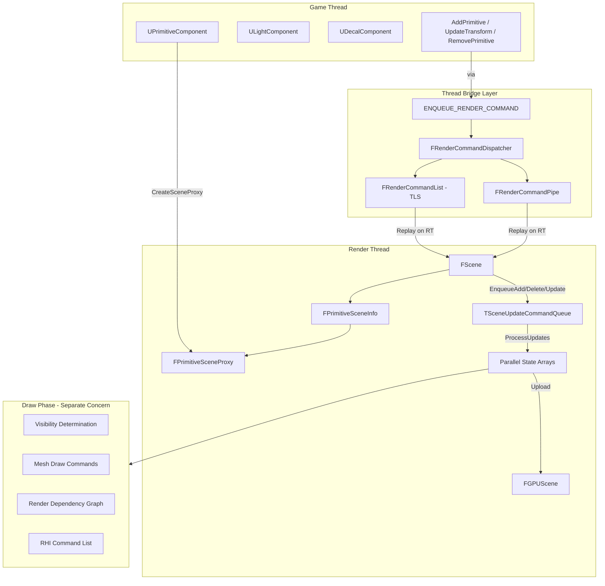
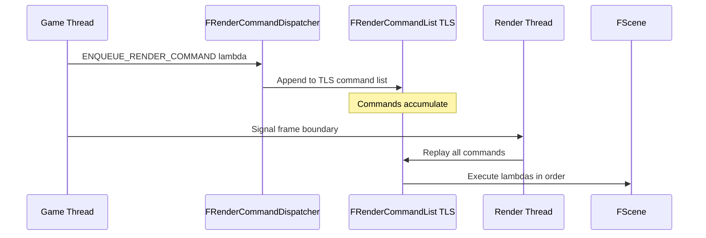
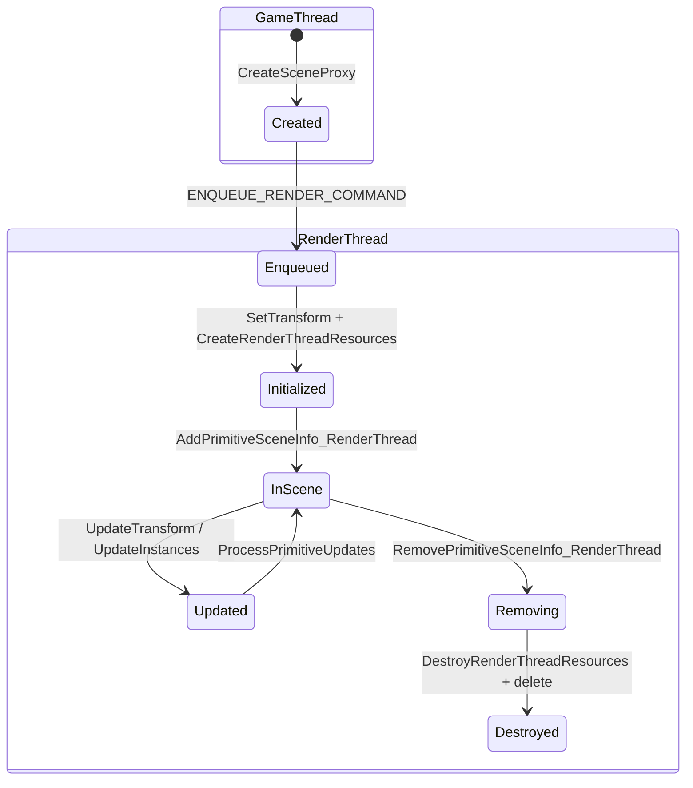
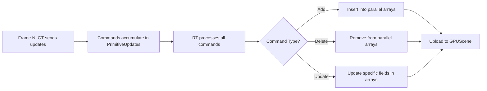
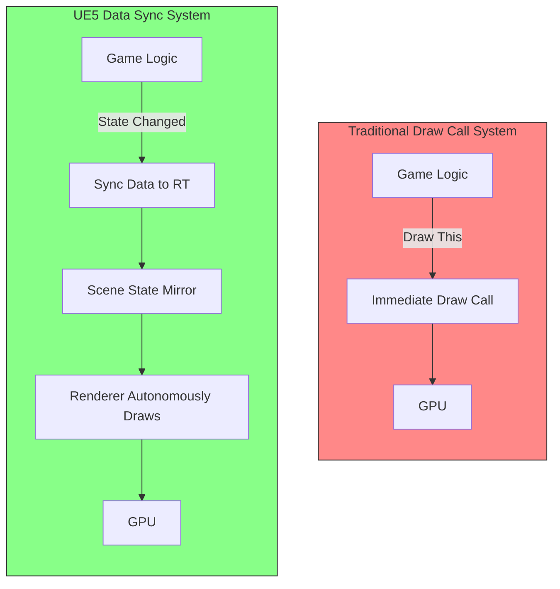
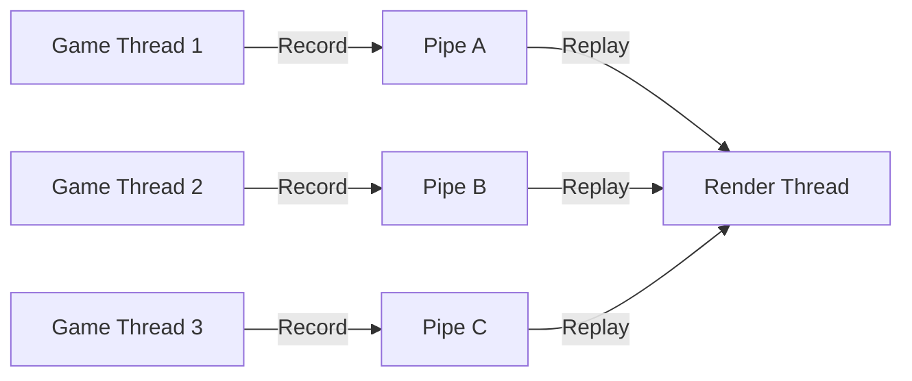

# UE5 Rendering Architecture: A Data Synchronization System

## Core Thesis

**UE5's rendering architecture is fundamentally a data synchronization system, not a draw call system.** The Game Thread describes *what exists and where*; the Render Thread maintains its own mirror of scene state and autonomously decides *how and when to draw*. The entire rendering pipeline is built around safely copying, queuing, and deduplicating scene state changes across thread boundaries.

---

## 1. Architecture Overview



### Key Source Directories

| Directory | Role |
|-----------|------|
| `Engine/Source/Runtime/RenderCore/` | Core rendering infrastructure: thread management, render resources, shader framework, RDG |
| `Engine/Source/Runtime/Renderer/Private/` | Scene management, visibility, mesh draw commands, lighting, shadows |
| `Engine/Source/Runtime/Engine/Public/` | `PrimitiveSceneProxy.h` and component interfaces |

---

## 2. Game Thread → Render Thread: The Command Bridge

### 2.1 ENQUEUE_RENDER_COMMAND Macro

Defined in [`RenderingThread.h`](Engine/Source/Runtime/RenderCore/Public/RenderingThread.h:1167):

```cpp
#define ENQUEUE_RENDER_COMMAND(Type) \
    DECLARE_RENDER_COMMAND_TAG(...) \
    FRenderCommandDispatcher::Enqueue<...>
```

This macro is the **primary mechanism** for Game Thread → Render Thread communication. It accepts a lambda with `FRHICommandListBase&` parameter and schedules it for execution on the render thread.

**Usage pattern** (from [`RendererScene.cpp`](Engine/Source/Runtime/Renderer/Private/RendererScene.cpp:1462)):
```cpp
ENQUEUE_RENDER_COMMAND(AddPrimitiveCommand)(
    [this, CreateCommands = MoveTemp(CreateCommands)](FRHICommandListBase& RHICmdList)
    {
        for (const FCreateCommand& Command : CreateCommands)
        {
            Command.PrimitiveSceneProxy->SetTransform(RHICmdList, ...);
            Command.PrimitiveSceneProxy->CreateRenderThreadResources(RHICmdList);
            AddPrimitiveSceneInfo_RenderThread(Command.PrimitiveSceneInfo, ...);
        }
    });
```

### 2.2 FRenderCommandDispatcher

Defined in [`RenderingThread.h`](Engine/Source/Runtime/RenderCore/Public/RenderingThread.h:1067), this dispatcher routes commands through two paths:

1. **`FRenderCommandList`** — Thread-Local Storage (TLS) bound command lists that can be recorded in parallel by multiple game threads, then replayed on the render thread.
2. **`FRenderCommandPipe`** — Async render command pipes for higher throughput parallel recording/replaying.

The dispatcher checks `ERenderCommandPipeMode` to determine the routing strategy:
- `None` — Standard TLS command list
- `RenderThread` — Route through render thread pipe
- `All` — Use all available pipes

### 2.3 Command Flow



**Critical insight**: Commands capture data *by value* (via lambda captures), ensuring thread-safe transfer. The Game Thread never shares mutable state with the Render Thread - only copies are transferred.

---

## 3. The SceneProxy Pattern: Data Mirroring

### 3.1 FPrimitiveSceneProxy

Defined in [`PrimitiveSceneProxy.h`](Engine/Source/Runtime/Engine/Public/PrimitiveSceneProxy.h:295):

> *"Encapsulates the data which is mirrored to render a UPrimitiveComponent parallel to the game thread."*

This is **the** central design pattern of UE5's rendering data sync. The proxy is:

1. **Created on the Game Thread** by `UPrimitiveComponent::CreateSceneProxy()`
2. **Owned by the Render Thread** after creation
3. **Contains a complete copy** of all rendering-relevant state from the component

### 3.2 Thread Safety Convention

`FPrimitiveSceneProxy` uses a naming convention to enforce thread boundaries:

| Suffix | Thread | Example |
|--------|--------|---------|
| `_GameThread` | Game Thread only | `SetDrawnInGame_GameThread()` |
| `_RenderThread` | Render Thread only | `SetDrawnInGame_RenderThread()` |
| No suffix | Either thread, or immutable | `IsAlwaysVisible()` |

### 3.3 Cached State in FPrimitiveSceneProxy

The proxy caches an extensive set of properties - **each one is a mirror of a UPrimitiveComponent property**, copied at creation time. Key cached fields include:

```
// Transform data (updated via SetTransform on RT)
- LocalToWorld, LocalToWorldDeterminantSign
- WorldBounds, LocalBounds
- ActorPosition

// Rendering flags (set at creation, some updatable)
- bCastDynamicShadow, bCastStaticShadow
- bIsNaniteMesh, bSupportsGPUScene
- bAlwaysVisible, bDrawnInGame
- bCastHiddenShadow, bAffectsDistanceFieldLighting
- bReceivesDecals, bWillEverBeLit
- bSupportsWorldPositionOffset

// Material & visual
- MaterialRelevance
- CustomPrimitiveData
- LightMapType, IndirectLightingCacheQuality
```

### 3.4 The Proxy Lifecycle



**Key code flow** in [`RendererScene.cpp`](Engine/Source/Runtime/Renderer/Private/RendererScene.cpp:1342):

```
Game Thread:                              Render Thread:
BatchAddPrimitivesInternal()
  ├─ CreateSceneProxy()                   
  ├─ new FPrimitiveSceneInfo()            
  ├─ ENQUEUE_RENDER_COMMAND ─────────────→ SetTransform()
                                           CreateRenderThreadResources()
                                           AddPrimitiveSceneInfo_RenderThread()
                                             └─ PrimitiveUpdates.EnqueueAdd()
```

---

## 4. TSceneUpdateCommandQueue: The Heart of Data Sync

### 4.1 Design

Defined in [`SceneUpdateCommandQueue.h`](Engine/Source/Runtime/Renderer/Private/SceneUpdateCommandQueue.h), this is a **typed, deduplicating, unordered command queue** for scene object updates.

```cpp
template <typename SceneInfoType, typename DirtyFlagsType, typename IdType>
class TSceneUpdateCommandQueue
```

Each scene object gets a single `FUpdateCommand` entry with:
- **Add** flag — object is new to the scene
- **Delete** flag — object should be removed
- **Update** flag — object state has changed
- **Typed payload slots** — each update type gets its own slot

### 4.2 Deduplication

This is the key innovation: if the Game Thread sends 10 transform updates for the same primitive in one frame, **only the last one takes effect**:

```cpp
// From RendererScene.cpp:1532
PrimitiveUpdates.Enqueue(PrimitiveSceneInfo, FUpdateTransformCommand { 
    .WorldBounds = WorldBounds, 
    .LocalBounds = LocalBounds, 
    .LocalToWorld = LocalToWorld, 
    .AttachmentRootPosition = AttachmentRootPosition 
});
```

Each `Enqueue<PayloadType>()` replaces the previous payload of the same type for that object. This means:
- **No wasted work** — the render thread only processes the final state
- **No ordering issues** — the latest state always wins
- **Efficient batching** — all updates for a frame are collected before processing

### 4.3 Update Payload Types

The queue supports multiple typed update payloads per object:

| Payload Type | Purpose | Source |
|-------------|---------|--------|
| `FUpdateTransformCommand` | Transform/bounds sync | [`RendererScene.cpp:1532`](Engine/Source/Runtime/Renderer/Private/RendererScene.cpp:1532) |
| `FUpdateOverridePreviousTransformData` | Motion vector previous transform | [`RendererScene.cpp:1045`](Engine/Source/Runtime/Renderer/Private/RendererScene.cpp:1045) |
| `FUpdateInstanceCommand` | Instance data updates | [`RendererScene.cpp:1879`](Engine/Source/Runtime/Renderer/Private/RendererScene.cpp:1879) |
| `FUpdateInstanceFromComputeCommand` | GPU compute-driven instances | [`RendererScene.cpp:1792`](Engine/Source/Runtime/Renderer/Private/RendererScene.cpp:1792) |
| `FUpdateOcclusionBoundsSlacksData` | Occlusion bounds slack | [`RendererScene.cpp:1743`](Engine/Source/Runtime/Renderer/Private/RendererScene.cpp:1743) |
| `FUpdateDrawDistanceData` | Draw distance | [`RendererScene.cpp:1748`](Engine/Source/Runtime/Renderer/Private/RendererScene.cpp:1748) |
| `FUpdateCustomPrimitiveData` | Custom primitive data | [`RendererScene.cpp:1950`](Engine/Source/Runtime/Renderer/Private/RendererScene.cpp:1950) |
| `FUpdateAttachmentRootData` | Lighting attachment root | [`RendererScene.cpp:1909`](Engine/Source/Runtime/Renderer/Private/RendererScene.cpp:1909) |
| `FUpdateDistanceFieldSceneData` | Distance field data | [`RendererScene.cpp:1958`](Engine/Source/Runtime/Renderer/Private/RendererScene.cpp:1958) |

### 4.4 Queue Processing



---

## 5. FScene: The Render Thread's World Mirror

### 5.1 Parallel State Arrays

[`FScene`](Engine/Source/Runtime/Renderer/Private/RendererScene.cpp:808) maintains **parallel arrays** indexed by primitive index. Each array stores one aspect of the primitive state:

```cpp
void FScene::CheckPrimitiveArrays(int MaxTypeOffsetIndex)
{
    check(Primitives.Num() == PrimitiveTransforms.Num());
    check(Primitives.Num() == PrimitiveSceneProxies.Num());
    check(Primitives.Num() == PrimitiveBounds.Num());
    check(Primitives.Num() == PrimitiveFlagsCompact.Num());
    check(Primitives.Num() == PrimitiveVisibilityIds.Num());
    check(Primitives.Num() == PrimitiveOctreeIndex.Num());
    check(Primitives.Num() == PrimitiveOcclusionFlags.Num());
    check(Primitives.Num() == PrimitiveComponentIds.Num());
    check(Primitives.Num() == PrimitiveOcclusionBounds.Num());
    // ... plus editor, ray tracing, static mesh update arrays
}
```

This Struct-of-Arrays (SoA) layout is a deliberate choice for:
- **Cache efficiency** — visibility checks iterate `PrimitiveBounds` without touching proxy objects
- **SIMD-friendly** — contiguous arrays of transforms/bounds enable vectorized operations
- **GPU upload** — arrays map directly to GPU scene buffers

### 5.2 Scene State Categories

| Array | Content | Purpose |
|-------|---------|---------|
| `Primitives` | `FPrimitiveSceneInfo*` | Master list |
| `PrimitiveTransforms` | `FMatrix` | LocalToWorld matrices |
| `PrimitiveSceneProxies` | `FPrimitiveSceneProxy*` | Proxy pointers |
| `PrimitiveBounds` | `FBoxSphereBounds` | World-space bounds |
| `PrimitiveFlagsCompact` | Packed flags | Fast flag queries |
| `PrimitiveVisibilityIds` | Visibility IDs | Precomputed visibility |
| `PrimitiveOctreeIndex` | Octree indices | Spatial indexing |
| `PrimitiveOcclusionFlags` | Occlusion flags | HW occlusion queries |
| `PrimitiveComponentIds` | Component IDs | Back-reference to GT |

### 5.3 Data Flow: Complete Add Primitive Path

```
Game Thread                              Render Thread
===========                              =============

FScene::AddPrimitive(UPC)
  │
  ├─ CreateSceneProxy()                  
  │   → Copies all GT state into proxy   
  │
  ├─ new FPrimitiveSceneInfo(Prim, Scene)
  │   → Links proxy to scene info        
  │
  ├─ ENQUEUE_RENDER_COMMAND ──────────→  SetTransform(Matrix, Bounds, ...)
  │                                        → Caches transform in proxy
  │                                      
  │                                      CreateRenderThreadResources()
  │                                        → Allocates RT-only resources
  │                                      
  │                                      AddPrimitiveSceneInfo_RenderThread()
  │                                        → PrimitiveUpdates.EnqueueAdd()
  │                                      
  │                                      [Later: ProcessPrimitiveUpdates]
  │                                        → Insert into parallel arrays
  │                                        → Insert into spatial structures
  │                                        → Register with GPUScene
  │                                        → Build mesh draw commands
  │                                        → Setup DF/Lumen data
```

---

## 6. Why It's a Data Sync System, Not a Draw Call System

### 6.1 Evidence from the Code

**1. No draw calls in the Game Thread → Render Thread bridge**

Every `ENQUEUE_RENDER_COMMAND` in [`RendererScene.cpp`](Engine/Source/Runtime/Renderer/Private/RendererScene.cpp) transfers *data*, never issues draw calls:
- `SetTransform()` — copies transform data
- `CreateRenderThreadResources()` — allocates buffers
- `AddPrimitiveSceneInfo_RenderThread()` — registers in queues
- `UpdatePrimitiveTransform_RenderThread()` — enqueues data update
- `RemovePrimitiveSceneInfo_RenderThread()` — enqueues deletion

**2. The proxy is a data snapshot, not a drawing interface**

[`FPrimitiveSceneProxy`](Engine/Source/Runtime/Engine/Public/PrimitiveSceneProxy.h:295) stores ~100+ cached boolean flags, transforms, bounds, and material data. It's a **data container** that the renderer queries when it decides to draw — the proxy never initiates drawing.

**3. TSceneUpdateCommandQueue operates on data, not draw commands**

The queue's operations are `EnqueueAdd`, `EnqueueDelete`, and `Enqueue<PayloadType>` — these are pure data operations with deduplication. The queue doesn't know about rendering; it only knows about scene state changes.

**4. Drawing is a separate, downstream concern**

Drawing happens in `FDeferredShadingSceneRenderer::Render()` which:
1. Reads the synchronized scene state from parallel arrays
2. Performs visibility determination (`SceneVisibility.cpp`)
3. Builds mesh draw commands (`MeshDrawCommands.cpp`)
4. Issues actual draw calls via RDG/RHI

The draw phase is entirely **decoupled** from the data synchronization phase.

**5. Redundant update skipping proves data semantics**

From [`RendererScene.cpp:1600`](Engine/Source/Runtime/Renderer/Private/RendererScene.cpp:1600):
```cpp
const bool bAllowSkip = GSkipRedundantTransformUpdate 
    && Primitive->GetSceneProxy()->CanSkipRedundantTransformUpdates();
if (bAllowSkip) {
    if (Proxy->WouldSetTransformBeRedundant_AnyThread(...)) {
        bPerformUpdate = false;  // Skip - data hasn't changed!
    }
}
```

The system explicitly compares old vs new data to skip redundant syncs. A draw call system wouldn't need this — it would just re-issue the same draw call.

### 6.2 Conceptual Model



### 6.3 Design Benefits

| Aspect | Draw Call System | Data Sync System - UE5 |
|--------|-----------------|----------------------|
| **Thread safety** | Caller must synchronize | Data copied by value, no sharing |
| **Redundancy** | Every call issues work | Deduplication via command queue |
| **Latency hiding** | Blocks on GT/RT sync | GT runs ahead, RT catches up |
| **Batching** | Manual batching needed | Automatic via queue processing |
| **State coherency** | Must track what changed | Full state snapshot per proxy |
| **GPU scene** | N/A | Parallel arrays → GPU buffers |

---

## 7. Additional Sync Patterns

### 7.1 Light Synchronization

Lights follow the same proxy pattern (from [`RendererScene.cpp:2295`](Engine/Source/Runtime/Renderer/Private/RendererScene.cpp:2295)):

```cpp
void FScene::AddLight(ULightComponent* Light)
{
    FLightSceneProxy* Proxy = Light->CreateSceneProxy();
    Proxy->SetTransform(Light->GetComponentTransform()...);
    Proxy->LightSceneInfo = new FLightSceneInfo(Proxy, true);
    
    ENQUEUE_RENDER_COMMAND(FAddLightCommand)(
        [this, LightSceneInfo](FRHICommandListBase&) {
            SceneLightInfoUpdates->EnqueueAdd(LightSceneInfo);
        });
}
```

Lights have their own update queue (`FSceneLightInfoUpdates`), separate from primitives.

### 7.2 Decal, SkyLight, Physics Field Sync

Every scene object type follows the same pattern:
- **Create proxy on GT** → **ENQUEUE_RENDER_COMMAND** → **Register on RT**
- Decals: [`AddDecal()`](Engine/Source/Runtime/Renderer/Private/RendererScene.cpp:2493) → `ENQUEUE_RENDER_COMMAND(FAddDecalCommand)`
- SkyLight: [`SetSkyLight()`](Engine/Source/Runtime/Renderer/Private/RendererScene.cpp:2362) → `ENQUEUE_RENDER_COMMAND(FSetSkyLightCommand)`
- PhysicsField: [`SetPhysicsField()`](Engine/Source/Runtime/Renderer/Private/RendererScene.cpp:2446) → `ENQUEUE_RENDER_COMMAND(FSetPhysicsFieldCommand)`

### 7.3 Scene Settings Sync

Even scalar settings are synchronized via the command pattern (from [`RendererScene.cpp:693`](Engine/Source/Runtime/Renderer/Private/RendererScene.cpp:693)):

```cpp
void FScene::UpdateSceneSettings(AWorldSettings* WorldSettings)
{
    float InDefaultMaxDistanceFieldOcclusionDistance = WorldSettings->DefaultMaxDistanceFieldOcclusionDistance;
    float InGlobalDistanceFieldViewDistance = WorldSettings->GlobalDistanceFieldViewDistance;
    
    ENQUEUE_RENDER_COMMAND(UpdateSceneSettings)(
        [Scene, InDefaultMaxDFOD, InGlobalDFVD, ...](FRHICommandListBase&) {
            Scene->DefaultMaxDistanceFieldOcclusionDistance = InDefaultMaxDFOD;
            Scene->GlobalDistanceFieldViewDistance = InGlobalDFVD;
        });
}
```

Values are captured by value in the lambda — no shared mutable state.

---

## 8. Render Command Pipe System

### 8.1 Parallel Recording

[`FRenderCommandPipe`](Engine/Source/Runtime/RenderCore/Public/RenderingThread.h) enables higher-throughput parallel command recording:



Each pipe is independent, allowing lock-free recording from multiple game threads. The render thread replays all pipes in a deterministic order.

### 8.2 TRenderThreadStruct

Defined in [`RenderingThread.h`](Engine/Source/Runtime/RenderCore/Public/RenderingThread.h), this template provides scoped render thread lifetime management — ensuring objects are created on GT but destroyed on RT:

```cpp
template<typename T>
class TRenderThreadStruct
{
    // Destructor enqueues a render command to delete the object
    ~TRenderThreadStruct() {
        ENQUEUE_RENDER_COMMAND(DeleteOnRT)([Ptr = Release()](FRHICommandListBase&) {
            delete Ptr;
        });
    }
};
```

---

## 9. Key Classes Reference

| Class | File | Role |
|-------|------|------|
| `ENQUEUE_RENDER_COMMAND` | [`RenderingThread.h:1167`](Engine/Source/Runtime/RenderCore/Public/RenderingThread.h:1167) | Macro to dispatch work to render thread |
| `FRenderCommandDispatcher` | [`RenderingThread.h:1067`](Engine/Source/Runtime/RenderCore/Public/RenderingThread.h:1067) | Routes commands to TLS list or pipe |
| `FRenderCommandPipe` | [`RenderingThread.h`](Engine/Source/Runtime/RenderCore/Public/RenderingThread.h) | Async parallel command recording pipe |
| `FPrimitiveSceneProxy` | [`PrimitiveSceneProxy.h:295`](Engine/Source/Runtime/Engine/Public/PrimitiveSceneProxy.h:295) | Render thread mirror of UPrimitiveComponent |
| `FPrimitiveSceneInfo` | [`PrimitiveSceneInfo.h`](Engine/Source/Runtime/Renderer/Private/PrimitiveSceneInfo.h) | Scene registration info for a primitive |
| `TSceneUpdateCommandQueue` | [`SceneUpdateCommandQueue.h`](Engine/Source/Runtime/Renderer/Private/SceneUpdateCommandQueue.h) | Typed, deduplicating update queue |
| `FScene` | [`ScenePrivate.h`](Engine/Source/Runtime/Renderer/Private/ScenePrivate.h) | Render thread scene state |
| `FGPUScene` | [`GPUScene.h`](Engine/Source/Runtime/Renderer/Private/GPUScene.h) | GPU-side scene buffer management |
| `FLightSceneProxy` | [`LightSceneProxy.h`](Engine/Source/Runtime/Engine/Public/LightSceneProxy.h) | Render thread mirror of ULightComponent |

---

## 10. Summary

UE5's rendering system is architecturally a **data synchronization pipeline**:

1. **Game Thread** creates lightweight **proxy objects** that snapshot component state
2. **`ENQUEUE_RENDER_COMMAND`** safely transfers data copies across the thread boundary  
3. **`TSceneUpdateCommandQueue`** collects and deduplicates state changes per object per frame
4. **`FScene`** maintains **parallel arrays** (SoA layout) as the render thread's authoritative world state
5. **Drawing** is a separate downstream phase that reads the synchronized state

The Game Thread never says "draw this triangle." It says "this object exists, here is its data." The Render Thread autonomously determines what, when, and how to draw based on its mirror of the world state.

This architecture enables:
- **Lock-free parallel GT/RT operation** (1-2 frames of latency hiding)
- **Automatic deduplication** of redundant updates
- **Cache-efficient SoA iteration** over scene state
- **GPU scene buffers** that directly mirror CPU arrays
- **Complete decoupling** of game logic from rendering decisions

Analysis complete. The comprehensive document has been written to [`plans/ue_rendering_data_sync_system_analysis.md`](plans/ue_rendering_data_sync_system_analysis.md).


### Document Covers:

1. **Architecture Overview** — Mermaid diagram showing GT → RT data flow through `ENQUEUE_RENDER_COMMAND`, `FRenderCommandDispatcher`, and into `FScene`

2. **ENQUEUE_RENDER_COMMAND** — The macro defined in [`RenderingThread.h:1167`](Engine/Source/Runtime/RenderCore/Public/RenderingThread.h:1167) that dispatches lambdas capturing data by value to the render thread via `FRenderCommandDispatcher`

3. **FPrimitiveSceneProxy** — The render-thread data mirror of `UPrimitiveComponent` defined at [`PrimitiveSceneProxy.h:295`](Engine/Source/Runtime/Engine/Public/PrimitiveSceneProxy.h:295), with ~100+ cached flags, transforms, bounds, and material state

4. **TSceneUpdateCommandQueue** — The typed, deduplicating command queue in [`SceneUpdateCommandQueue.h`](Engine/Source/Runtime/Renderer/Private/SceneUpdateCommandQueue.h) that collects Add/Delete/Update operations with 9+ payload types

5. **FScene Parallel Arrays** — The SoA layout in [`RendererScene.cpp:808`](Engine/Source/Runtime/Renderer/Private/RendererScene.cpp:808) maintaining `Primitives`, `PrimitiveTransforms`, `PrimitiveSceneProxies`, `PrimitiveBounds`, `PrimitiveFlagsCompact`, etc.

6. **Core Thesis: Rendering = Data Synchronization** — Five concrete code-level proofs that UE5's rendering is a data sync system:
   - No draw calls cross the GT→RT boundary
   - Proxies are data containers, not drawing interfaces
   - `TSceneUpdateCommandQueue` operates on data with deduplication
   - Drawing is a separate downstream phase
   - Redundant update skipping at [`RendererScene.cpp:1600`](Engine/Source/Runtime/Renderer/Private/RendererScene.cpp:1600) proves data semantics

7. **Additional patterns** — Light/Decal/SkyLight sync, Render Command Pipes for parallel recording, `TRenderThreadStruct` for scoped RT lifetime management
