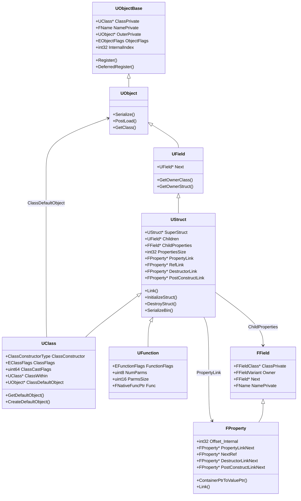
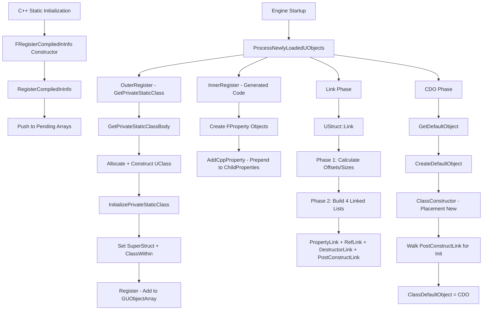
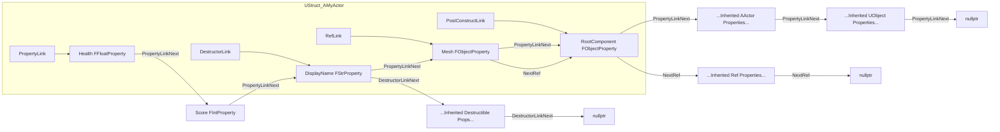

# UObject Reflection System Deep Dive

## CoreUObject Source Code Analysis: Runtime/CoreUObject

> **Scope**: Analysis of UCLASS, UPROPERTY, UFUNCTION, GENERATED_BODY macros, UClass construction, static registration, CDO generation, property chain linking, and why UE can traverse class members at runtime.

---

## Table of Contents

1. [Macro System Overview](#1-macro-system-overview)
2. [UClass Construction Pipeline](#2-uclass-construction-pipeline)
3. [Static Registration Process](#3-static-registration-process)
4. [CDO Generation](#4-cdo-generation)
5. [Property Chain Construction](#5-property-chain-construction)
6. [Key Question: Why Can UE Traverse Class Members at Runtime?](#6-key-question-why-can-ue-traverse-class-members-at-runtime)
7. [Architecture Diagrams](#7-architecture-diagrams)
8. [Source File Reference](#8-source-file-reference)

---

## 1. Macro System Overview

### 1.1 UPROPERTY / UFUNCTION / USTRUCT / UENUM — Empty Markers

These macros are defined in [`ObjectMacros.h`](Engine/Source/Runtime/CoreUObject/Public/UObject/ObjectMacros.h:744) as **completely empty macros**:

```cpp
// ObjectMacros.h:744-749
#define UPROPERTY(...)
#define UFUNCTION(...)
#define USTRUCT(...)
#define UMETA(...)
#define UPARAM(...)
#define UENUM(...)
```

**Key Insight**: The C++ compiler **completely ignores** these macros. They exist solely as markers for **Unreal Header Tool (UHT)** — a separate code generation tool that runs before compilation. UHT parses these markers and their specifiers to generate reflection metadata code in `.generated.h` and `.gen.cpp` files.

### 1.2 UCLASS — Expands to a PROLOG Hook

Unlike the others, [`UCLASS`](Engine/Source/Runtime/CoreUObject/Public/UObject/ObjectMacros.h:773) actually produces code:

```cpp
// ObjectMacros.h:773-778
#define UCLASS(...)   BODY_MACRO_COMBINE(CURRENT_FILE_ID,_,__LINE__,_PROLOG)
```

[`BODY_MACRO_COMBINE`](Engine/Source/Runtime/CoreUObject/Public/UObject/ObjectMacros.h:759) is a token-pasting utility that produces a unique symbol like `FID_MyProject_Source_MyClass_h_15_PROLOG`. UHT defines this symbol in the `.generated.h` file to inject prolog code before the class declaration opens.

### 1.3 GENERATED_BODY — The Heart of Reflection Code Injection

[`GENERATED_BODY`](Engine/Source/Runtime/CoreUObject/Public/UObject/ObjectMacros.h:769) expands similarly:

```cpp
// ObjectMacros.h:769
#define GENERATED_BODY(...) BODY_MACRO_COMBINE(CURRENT_FILE_ID,_,__LINE__,_GENERATED_BODY)
```

This produces a token like `FID_MyProject_Source_MyClass_h_20_GENERATED_BODY` which UHT defines to include:

- **`StaticClass()`** declaration — returns the singleton `UClass*` for this type
- **`Super` typedef** — the parent class
- **`ThisClass` typedef** — the current class
- **Constructor declarations** and **`__DefaultConstructor`** static method
- **Serialization helpers**
- **Custom `operator new`** for UObject allocation
- **Friend declarations** for generated code to access private members

### 1.4 DECLARE_CLASS Macro

[`DECLARE_CLASS`](Engine/Source/Runtime/CoreUObject/Public/UObject/ObjectMacros.h:1833) is called within the generated code to establish the class identity:

```cpp
// ObjectMacros.h:1833-1882
#define DECLARE_CLASS(TClass, TSuperClass, TStaticFlags, TStaticCastFlags, TPackage, TRequiredAPI) \
private: \
    TClass& operator=(TClass&&);   \
    TClass& operator=(const TClass&);   \
public: \
    typedef TSuperClass Super; \
    typedef TClass ThisClass; \
    ... \
    DECLARE_SERIALIZER(TClass) \
    ...
```

Key members it declares:
- `Super` / `ThisClass` typedefs
- [`StaticClass()`](Engine/Source/Runtime/CoreUObject/Public/UObject/ObjectMacros.h:1854) — calls `GetPrivateStaticClass()`
- [`StaticPackage()`](Engine/Source/Runtime/CoreUObject/Public/UObject/ObjectMacros.h:1856) — returns the package name as TCHAR*
- [`StaticClassCastFlags()`](Engine/Source/Runtime/CoreUObject/Public/UObject/ObjectMacros.h:1861) — returns bitmask for fast casting
- Custom `operator new` that routes through UObject allocator

### 1.5 IMPLEMENT_CLASS Macro

[`IMPLEMENT_CLASS`](Engine/Source/Runtime/CoreUObject/Public/UObject/ObjectMacros.h:2168) has two variants:

```cpp
// ObjectMacros.h:2168-2201
#define IMPLEMENT_CLASS_NO_AUTO_REGISTRATION(TClass) \
    FClassRegistrationInfo Z_Registration_Info_UClass_##TClass; \
    UClass* TClass::GetPrivateStaticClass() \
    { \
        ... \
        GetPrivateStaticClassBody( \
            StaticPackage(),                 /* Package name */ \
            (TCHAR*)TEXT(#TClass) + 1,       /* Class name without prefix */ \
            ... sizeof(TClass),              /* Size */ \
            alignof(TClass),                 /* Alignment */ \
            (EClassFlags)TClass::StaticClassFlags, \
            TClass::StaticClassCastFlags(),  /* Cast flags for fast IsA */ \
            TClass::StaticConfigName(),      /* Config file name */ \
            &TClass::InternalConstructor,    /* Constructor wrapper */ \
            ... /* VTable helper, super class, within class, etc. */ \
        ); \
    }

#define IMPLEMENT_CLASS(TClass, TClassCrc) \
    IMPLEMENT_CLASS_NO_AUTO_REGISTRATION(TClass) \
    static FRegisterCompiledInInfo Z_CompiledInDeferFile_FID_##TClass(...)
```

The `IMPLEMENT_CLASS` version adds a **`FRegisterCompiledInInfo`** static variable — this is the registration trigger.

### 1.6 DEFINE_DEFAULT_OBJECT_INITIALIZER_CONSTRUCTOR_CALL

[`DEFINE_DEFAULT_OBJECT_INITIALIZER_CONSTRUCTOR_CALL`](Engine/Source/Runtime/CoreUObject/Public/UObject/ObjectMacros.h:1887) creates a static function that UClass uses to construct objects:

```cpp
// ObjectMacros.h:1887-1905
#define DEFINE_DEFAULT_OBJECT_INITIALIZER_CONSTRUCTOR_CALL(TClass) \
    static void __DefaultConstructor(const FObjectInitializer& X) { new((EInternal*)X.GetObj())TClass(X); }
```

This uses **placement new** to construct a `TClass` instance at a pre-allocated memory location, passing the `FObjectInitializer` to the constructor.

---

## 2. UClass Construction Pipeline

### 2.1 Class Hierarchy

```
UObjectBase
  └─ UObjectBaseUtility
       └─ UObject
            └─ UField          (has Next pointer for linked list)
                 └─ UStruct    (has SuperStruct, Children, ChildProperties, PropertyLink)
                      ├─ UScriptStruct  (for USTRUCT types)
                      ├─ UFunction      (for UFUNCTION methods)
                      └─ UClass         (for UCLASS types — the central reflection object)
```

### 2.2 UClass Key Members

From [`Class.h:3791+`](Engine/Source/Runtime/CoreUObject/Public/UObject/Class.h:3791):

| Member | Type | Purpose |
|--------|------|---------|
| `ClassConstructor` | `ClassConstructorType` | Function pointer to construct instances |
| `ClassVTableHelperCtorCaller` | Function pointer | VTable setup during construction |
| `ClassFlags` | `EClassFlags` | Abstract, Config, Transient, etc. |
| `ClassCastFlags` | `uint64` | Bitmask for O(1) `IsA()` checks |
| `ClassWithin` | `UClass*` | Required outer class |
| `ClassConfigName` | `FName` | Config file name |
| `ClassDefaultObject` | `UObject*` | **The CDO — Class Default Object** |
| `Interfaces` | `TArray<FImplementedInterface>` | Interface implementations |
| `NativeFunctionLookupTable` | `TArray<FNativeFunctionLookup>` | Maps function names to native pointers |

### 2.3 GetPrivateStaticClassBody — The UClass Factory

Called from [`IMPLEMENT_CLASS_NO_AUTO_REGISTRATION`](Engine/Source/Runtime/CoreUObject/Public/UObject/ObjectMacros.h:2168), this function at [`Class.cpp:7458`](Engine/Source/Runtime/CoreUObject/Private/UObject/Class.cpp) creates the singleton UClass instance for each C++ class:

1. **Allocates memory** for the UClass using the UObject allocator
2. **Placement-new** constructs a `UClass` with `EC_StaticConstructor`
3. **Stores** the class constructor, VTable helper, size, alignment, flags, cast flags
4. **Calls** `InitializePrivateStaticClass()` to set up parent chain

### 2.4 InitializePrivateStaticClass

From [`Class.cpp:127-173`](Engine/Source/Runtime/CoreUObject/Private/UObject/Class.cpp:127):

```cpp
void InitializePrivateStaticClass(
    UClass* TClass_Super_StaticClass,
    UClass* TClass_PrivateStaticClass,
    UClass* TClass_WithinClass_StaticClass,
    const TCHAR* PackageName,
    const TCHAR* Name)
{
    // Set the SuperStruct (parent class)
    if (TClass_Super_StaticClass != TClass_PrivateStaticClass)
        TClass_PrivateStaticClass->SetSuperStruct(TClass_Super_StaticClass);
    else
        TClass_PrivateStaticClass->SetSuperStruct(NULL);  // UObject has no super

    // Set the required outer class
    TClass_PrivateStaticClass->ClassWithin = TClass_WithinClass_StaticClass;

    // Register dependencies first, then register self
    TClass_PrivateStaticClass->RegisterDependencies();
    TClass_PrivateStaticClass->Register(PackageName, Name);
}
```

### 2.5 FUObjectCppClassStaticFunctions

From [`ObjectMacros.h:2058-2163`](Engine/Source/Runtime/CoreUObject/Public/UObject/ObjectMacros.h:2058), this struct acts as a **manual vtable** for class-level static functions:

```cpp
struct FUObjectCppClassStaticFunctions
{
    // Compressed function pointer array (null entries omitted)
    using AddReferencedObjectsType = void(*)(UObject*, FReferenceCollector&);
    using DeclareCustomVersionsType = void(*)(FArchive&, const UClass*);
    // ... more function pointer types ...
};
```

This avoids virtual dispatch overhead by storing function pointers per class in a compressed array.

---

## 3. Static Registration Process

### 3.1 Overview

UE uses C++ **static initialization** to register all UObject types before `main()` even starts. This is the registration pipeline:

```
C++ Static Initializers (before main)
    │
    ▼
FRegisterCompiledInInfo constructor
    │
    ▼
RegisterCompiledInInfo() — stores info in pending arrays
    │
    ▼
[... engine startup ...]
    │
    ▼
ProcessNewlyLoadedUObjects() — processes all pending registrations
    │
    ▼
UObjectBase::Register() → DeferredRegister()
    │
    ▼
UClass singleton created and linked
    │
    ▼
Link() called → Property chains built
    │
    ▼
CreateDefaultObject() → CDO constructed
```

### 3.2 FRegisterCompiledInInfo — The Static Trigger

From [`UObjectBase.h:483-648`](Engine/Source/Runtime/CoreUObject/Public/UObject/UObjectBase.h:483):

```cpp
struct FRegisterCompiledInInfo
{
    FRegisterCompiledInInfo(const TCHAR* PackageName,
        const FClassRegisterCompiledInInfo* ClassInfo, size_t NumClassInfo,
        const FStructRegisterCompiledInInfo* StructInfo, size_t NumStructInfo,
        const FEnumRegisterCompiledInInfo* EnumInfo, size_t NumEnumInfo)
    {
        RegisterCompiledInInfo(PackageName, ClassInfo, NumClassInfo,
                               StructInfo, NumStructInfo,
                               EnumInfo, NumEnumInfo);
    }
};
```

**Each module** gets a static `FRegisterCompiledInInfo` variable from `IMPLEMENT_CLASS`. When C++ initializes statics, this constructor runs and pushes the class/struct/enum info into pending lists.

### 3.3 FClassRegisterCompiledInInfo

```cpp
struct FClassRegisterCompiledInInfo
{
    class UClass* (*OuterRegister)();  // GetPrivateStaticClass
    class UClass* (*InnerRegister)();  // Generated registration function
    const TCHAR* Name;
    FClassRegistrationInfo* Info;
    FClassReloadVersionInfo VersionInfo;
};
```

- **`OuterRegister`** — calls `GetPrivateStaticClass()` which calls `GetPrivateStaticClassBody()` to create the UClass singleton
- **`InnerRegister`** — generated function that registers properties, functions, metadata

### 3.4 ProcessNewlyLoadedUObjects

At [`UObjectBase.cpp:1027`](Engine/Source/Runtime/CoreUObject/Private/UObject/UObjectBase.cpp), this function:

1. Iterates all pending class registration info
2. Calls `OuterRegister()` to create UClass singletons
3. Calls `InnerRegister()` to register properties and functions
4. Calls `Link()` on each struct/class to build property chains
5. Creates CDOs for classes that need them

### 3.5 Two Registration Paths

From [`UObjectBase.h`](Engine/Source/Runtime/CoreUObject/Public/UObject/UObjectBase.h):

- **`UE_WITH_CONSTINIT_UOBJECT`** (newer): UClass objects are allocated in the **binary's static data segment** using `constinit`, avoiding heap allocation during static init. The objects exist in memory before any C++ constructors run.

- **Traditional** (older): UClass objects are heap-allocated at runtime during static initialization. Uses `GetPrivateStaticClassBody()` with placement new.

### 3.6 UObjectBase::Register

From [`UObjectBase.h:150-157`](Engine/Source/Runtime/CoreUObject/Public/UObject/UObjectBase.h:150):

```cpp
void Register(const TCHAR* PackageName, const TCHAR* Name) const;
```

This enqueues the UObject for deferred registration. It:
1. Sets the object's `NamePrivate` (FName)
2. Finds or creates the package UObject
3. Adds the object to the global UObject array (`GUObjectArray`)
4. Calls `DeferredRegister()` to convert bootstrap objects to real ones

---

## 4. CDO Generation

### 4.1 What is a CDO?

The **Class Default Object (CDO)** is a singleton instance of each class that serves as the template for:
- Default property values
- Comparison baseline for delta serialization
- Template for new object construction
- Runtime introspection of default values

### 4.2 GetDefaultObject — Lazy CDO Creation

From [`Class.h`](Engine/Source/Runtime/CoreUObject/Public/UObject/Class.h):

```cpp
UObject* UClass::GetDefaultObject(bool bCreateIfNeeded) const
{
    if (ClassDefaultObject == nullptr && bCreateIfNeeded)
    {
        const_cast<UClass*>(this)->CreateDefaultObject();
    }
    return ClassDefaultObject;
}
```

The CDO is **lazily created** on first access.

### 4.3 CreateDefaultObject — The CDO Factory

At [`Class.cpp:5055`](Engine/Source/Runtime/CoreUObject/Private/UObject/Class.cpp), `UClass::CreateDefaultObject()` performs:

1. **Ensures parent CDO exists first** — recursively creates parent class CDOs
2. **Allocates memory** — via `StaticAllocateObject()` using the class's `PropertiesSize`
3. **Constructs the object** — calls `ClassConstructor` (the `__DefaultConstructor` from GENERATED_BODY)
4. **Sets `RF_ClassDefaultObject` flag** — marks it as a CDO
5. **Initializes properties** — walks `PostConstructLink` to initialize properties that need post-construction setup
6. **Instances subobject templates** — creates default subobjects
7. **Stores the pointer** — `ClassDefaultObject = NewCDO`

### 4.4 CDO Lifecycle

```
UClass::GetDefaultObject(true)
    │
    ├─ ClassDefaultObject != nullptr? → Return it
    │
    └─ ClassDefaultObject == nullptr
         │
         ▼
    CreateDefaultObject()
         │
         ├─ 1. Ensure parent CDO exists (recursive)
         ├─ 2. StaticAllocateObject() — allocate memory
         ├─ 3. ClassConstructor(FObjectInitializer) — placement new
         ├─ 4. Set RF_ClassDefaultObject flag
         ├─ 5. Walk PostConstructLink — init properties
         ├─ 6. Instance subobject templates
         └─ 7. ClassDefaultObject = NewCDO
```

---

## 5. Property Chain Construction

### 5.1 The Four Property Linked Lists

[`UStruct`](Engine/Source/Runtime/CoreUObject/Public/UObject/Class.h:476) maintains four specialized linked lists, all built during `Link()`:

| List | Head Pointer | Next Pointer on FProperty | Purpose |
|------|-------------|--------------------------|---------|
| **PropertyLink** | `UStruct::PropertyLink` | `FProperty::PropertyLinkNext` | ALL properties (most-derived to base) |
| **RefLink** | `UStruct::RefLink` | `FProperty::NextRef` | Properties containing object references |
| **DestructorLink** | `UStruct::DestructorLink` | `FProperty::DestructorLinkNext` | Properties requiring destruction |
| **PostConstructLink** | `UStruct::PostConstructLink` | `FProperty::PostConstructLinkNext` | Properties needing post-construction init |

### 5.2 How Properties Are Added: AddCppProperty

From [`Class.cpp:738-742`](Engine/Source/Runtime/CoreUObject/Private/UObject/Class.cpp:738):

```cpp
void UStruct::AddCppProperty(FProperty* Property)
{
    Property->Next = ChildProperties;
    ChildProperties = Property;  // Prepend — LIFO order
}
```

UHT-generated code calls `AddCppProperty()` during module initialization to register each property. Properties are **prepended** (newest first), so the raw `ChildProperties` list is in reverse declaration order.

### 5.3 UStruct::Link — The Chain Builder

The critical function at [`Class.cpp:875-1184`](Engine/Source/Runtime/CoreUObject/Private/UObject/Class.cpp:875):

#### Phase 1: Size Calculation (lines 884-989)

```cpp
void UStruct::Link(FArchive& Ar, bool bRelinkExistingProperties)
{
    UStruct* InheritanceSuper = GetInheritanceSuper();

    // Inherit base class size and alignment
    PropertiesSize = InheritanceSuper->GetPropertiesSize();
    MinAlignment = InheritanceSuper->GetMinAlignment();

    // Iterate ChildProperties — compute offsets and sizes
    for (FField* Field = ChildProperties; Field; Field = Field->Next)
    {
        if (FProperty* Property = CastField<FProperty>(Field))
        {
            PropertiesSize = Property->Link(Ar);  // Computes offset, returns new total size
            MinAlignment = FMath::Max(MinAlignment, Property->GetMinAlignment());
        }
    }
}
```

Each `Property->Link(Ar)` call:
- Calculates the property's **byte offset** within the struct layout
- Accounts for alignment requirements
- Returns the new `PropertiesSize`

#### Phase 2: Chain Building (lines 1072-1141)

```cpp
// Create builders for all four linked lists
UEProperty_Private::FPropertyListBuilderPropertyLink    PropertyLinkBuilder(&PropertyLink);
UEProperty_Private::FPropertyListBuilderDestructorLink  DestructorLinkBuilder(&DestructorLink);
UEProperty_Private::FPropertyListBuilderRefLink         RefLinkBuilder(&RefLink);
UEProperty_Private::FPropertyListBuilderPostConstructLink PostConstructLinkBuilder(&PostConstructLink);

// Iterate ALL properties including inherited ones
for (TFieldIterator<FProperty> It(this); It; ++It)
{
    FProperty* Property = *It;

    // Always add to PropertyLink
    PropertyLinkBuilder.AppendNoTerminate(*Property);

    // Add to RefLink if contains object references
    if (Property->ContainsObjectReference(EncounteredStructProps, EPropertyObjectReferenceType::Any))
        RefLinkBuilder.AppendNoTerminate(*Property);

    // Add to DestructorLink if needs destruction
    if (EnumHasAnyFlags(PropertyLinkFlags, EStructPropertyLinkFlags::LinkDestructor))
        DestructorLinkBuilder.AppendNoTerminate(*Property);

    // Add to PostConstructLink if needs post-construction init
    if (EnumHasAnyFlags(PropertyLinkFlags, EStructPropertyLinkFlags::LinkPostConstruct))
        PostConstructLinkBuilder.AppendNoTerminate(*Property);
}

// Null-terminate all lists
PropertyLinkBuilder.NullTerminate();
DestructorLinkBuilder.NullTerminate();
RefLinkBuilder.NullTerminate();
PostConstructLinkBuilder.NullTerminate();

// Mark property data as available
StructStateFlags.fetch_or(PropertyDataAvailable);
```

**Critical Detail**: [`TFieldIterator<FProperty>(this)`](Engine/Source/Runtime/CoreUObject/Public/UObject/Class.h) traverses the **entire inheritance chain** — from this struct's own properties through all parent structs. This means `PropertyLink` contains ALL properties from most-derived to base, not just the ones declared in the current class.

### 5.4 How Properties Are Used at Runtime

The four lists enable **specialized traversals** without touching irrelevant properties:

| Operation | List Used | Method |
|-----------|-----------|--------|
| **Initialize all values** | `PropertyLink` | [`UStruct::InitializeStruct()`](Engine/Source/Runtime/CoreUObject/Private/UObject/Class.cpp:1186) |
| **Destroy all values** | `DestructorLink` | [`UStruct::DestroyStruct()`](Engine/Source/Runtime/CoreUObject/Private/UObject/Class.cpp:1212) |
| **Serialize all properties** | `PropertyLink` | [`UStruct::SerializeBin()`](Engine/Source/Runtime/CoreUObject/Private/UObject/Class.cpp:1250) |
| **Collect object references (GC)** | `RefLink` | [`UStruct::SerializeBin()`](Engine/Source/Runtime/CoreUObject/Private/UObject/Class.cpp:1277) with `IsObjectReferenceCollector` |
| **Instance subobjects** | `RefLink` | [`UStruct::InstanceSubobjectTemplates()`](Engine/Source/Runtime/CoreUObject/Private/UObject/Class.cpp:2739) |
| **Post-construction init** | `PostConstructLink` | CDO initialization |
| **Property visitor pattern** | `PropertyLink` or `RefLink` | [`UStruct::Visit()`](Engine/Source/Runtime/CoreUObject/Private/UObject/Class.cpp:820) |

### 5.5 FField — The Modern Non-UObject Property

From [`Field.h:555-938`](Engine/Source/Runtime/CoreUObject/Public/UObject/Field.h:555):

```cpp
class FField
{
    FFieldClass* ClassPrivate;  // Type descriptor (like UClass for FField)
    FFieldVariant Owner;        // Owning UStruct or FField
    FField* Next;               // Linked list for ChildProperties
    FName NamePrivate;          // Property name
    EObjectFlags FlagsPrivate;  // Object flags
};
```

**Why FField instead of UObject?** Properties were moved from UObject-derived (`UProperty`) to lightweight `FField`-derived (`FProperty`) to:
- Reduce GC pressure (FFields are not garbage collected)
- Reduce memory overhead (no UObject header per property)
- Improve cache locality during property traversal

[`FFieldClass`](Engine/Source/Runtime/CoreUObject/Public/UObject/Field.h:65) provides type identity for FField, similar to how UClass identifies UObjects:
- `Name`, `Id`, `CastFlags` for fast type checks
- `SuperClass` for inheritance
- `ConstructFn` for creating instances

---

## 6. Key Question: Why Can UE Traverse Class Members at Runtime?

### 6.1 The Complete Answer

Unreal Engine can traverse class members at runtime because it builds a **parallel metadata system** alongside the C++ type system. This works through six coordinated mechanisms:

#### Mechanism 1: UHT Code Generation (Compile Time)

UHT parses `UPROPERTY()`, `UFUNCTION()`, `UCLASS()` markers and generates:
- **Registration functions** that create `FProperty` objects for each marked member
- Each `FProperty` knows its **name**, **type**, **byte offset**, **flags**, and **owner struct**
- The byte offset is computed by `sizeof` / `offsetof` in generated code

#### Mechanism 2: Static Auto-Registration (Before main)

C++ static initialization creates `FRegisterCompiledInInfo` objects that call `RegisterCompiledInInfo()`, pushing class/struct/enum info into pending arrays. This happens **before `main()` starts**.

#### Mechanism 3: UClass Singleton Construction (Engine Init)

`ProcessNewlyLoadedUObjects()` processes pending registrations:
- Creates `UClass` singleton for each class via `GetPrivateStaticClassBody()`
- Sets up inheritance chain (`SuperStruct`)
- Registers properties and functions via generated inner registration functions

#### Mechanism 4: Property Chain Linking (Link Phase)

[`UStruct::Link()`](Engine/Source/Runtime/CoreUObject/Private/UObject/Class.cpp:875) builds four optimized linked lists:
- `PropertyLink` — complete property chain for iteration
- `RefLink` — only object-referencing properties (for GC)
- `DestructorLink` — only destructible properties
- `PostConstructLink` — only properties needing post-construction init

#### Mechanism 5: Offset-Based Memory Access

Each `FProperty` stores a **byte offset** from the start of the owning struct. To read/write any property value on any instance:

```cpp
// FProperty::ContainerPtrToValuePtr<T>(ObjectPtr)
// returns: (T*)((uint8*)ObjectPtr + Offset_Internal)
```

This is **type-erased pointer arithmetic** — the reflection system knows where every property lives in memory without needing the C++ type.

#### Mechanism 6: CDO as Default Value Template

The Class Default Object provides a **runtime-accessible baseline** for all property values. Any instance can be compared against its CDO to find modified properties, enabling delta serialization and property diffing.

### 6.2 Summary Diagram

```
┌─────────────────────────────────────────────────────────┐
│                    SOURCE CODE                          │
│                                                         │
│  UCLASS()                                               │
│  class AMyActor : public AActor                         │
│  {                                                      │
│      GENERATED_BODY()                                   │
│      UPROPERTY() float Health;                          │
│      UPROPERTY() int32 Score;                           │
│      UFUNCTION() void TakeDamage(float);                │
│  };                                                     │
└──────────────┬──────────────────────────────────────────┘
               │
               │ UHT parses markers
               ▼
┌──────────────────────────────────────────────────────────┐
│                  GENERATED CODE                          │
│                                                          │
│  MyActor.generated.h:                                    │
│    - StaticClass() declaration                           │
│    - __DefaultConstructor static method                  │
│    - Super/ThisClass typedefs                            │
│                                                          │
│  MyActor.gen.cpp:                                        │
│    - FProperty creation for Health (offset=X, type=float)│
│    - FProperty creation for Score  (offset=Y, type=int32)│
│    - UFunction creation for TakeDamage                   │
│    - IMPLEMENT_CLASS(AMyActor) → FRegisterCompiledInInfo │
└──────────────┬───────────────────────────────────────────┘
               │
               │ C++ Static Init (before main)
               ▼
┌──────────────────────────────────────────────────────────┐
│              STATIC REGISTRATION                         │
│                                                          │
│  FRegisterCompiledInInfo constructor fires               │
│  → RegisterCompiledInInfo() pushes to pending list       │
└──────────────┬───────────────────────────────────────────┘
               │
               │ Engine Init calls ProcessNewlyLoadedUObjects
               ▼
┌──────────────────────────────────────────────────────────┐
│              UCLASS CONSTRUCTION                         │
│                                                          │
│  GetPrivateStaticClassBody():                            │
│    1. Allocate UClass memory                             │
│    2. Placement-new UClass with EC_StaticConstructor     │
│    3. Set ClassConstructor, CastFlags, Size, etc.        │
│                                                          │
│  InitializePrivateStaticClass():                         │
│    4. Set SuperStruct → AActor::StaticClass()            │
│    5. Set ClassWithin                                    │
│    6. Register() → add to GUObjectArray                  │
│                                                          │
│  Inner Registration:                                     │
│    7. Create FFloatProperty(Health, offset=X)            │
│    8. Create FIntProperty(Score, offset=Y)               │
│    9. Create UFunction(TakeDamage)                       │
│   10. AddCppProperty() → prepend to ChildProperties      │
└──────────────┬───────────────────────────────────────────┘
               │
               │ Link phase
               ▼
┌──────────────────────────────────────────────────────────┐
│              PROPERTY CHAIN LINKING                       │
│                                                          │
│  UStruct::Link():                                        │
│    Phase 1: Calculate offsets and sizes                   │
│    Phase 2: Build 4 linked lists via TFieldIterator      │
│                                                          │
│  PropertyLink:  Health → Score → [inherited props...]    │
│  RefLink:       [only object-ref properties]             │
│  DestructorLink: [only destructible properties]          │
│  PostConstructLink: [only post-init properties]          │
└──────────────┬───────────────────────────────────────────┘
               │
               │ First GetDefaultObject() call
               ▼
┌──────────────────────────────────────────────────────────┐
│              CDO CREATION                                │
│                                                          │
│  CreateDefaultObject():                                  │
│    1. Ensure parent CDO exists                           │
│    2. Allocate memory (PropertiesSize bytes)             │
│    3. Call ClassConstructor (__DefaultConstructor)        │
│    4. Set RF_ClassDefaultObject flag                     │
│    5. Walk PostConstructLink for init                    │
│    6. Instance subobject templates                       │
│    7. Store in ClassDefaultObject                        │
└──────────────────────────────────────────────────────────┘
```

### 6.3 Runtime Traversal Example

When code calls `TFieldIterator<FProperty>(MyClass)`, it:

1. Starts at `MyClass->PropertyLink` (first property in the chain)
2. Follows `PropertyLinkNext` pointers through all properties
3. Since `PropertyLink` was built by `TFieldIterator` during `Link()`, it includes **all inherited properties**
4. For each `FProperty`, the code can:
   - Get the name: `Property->GetFName()`
   - Get the type: `Property->GetClass()` or `Property->GetCPPType()`
   - Read value: `Property->ContainerPtrToValuePtr<T>(ObjectInstance)`
   - Write value: Same pointer, just write to it
   - Compare to default: Compare against CDO value at same offset
   - Serialize: `Property->SerializeBinProperty()`

This is why UE can:
- **Serialize** objects without knowing their concrete types
- **Replicate** properties over the network
- **Display** properties in the editor Details panel
- **Garbage collect** by finding all object references
- **Blueprint** access C++ properties and functions
- **Hot reload** by comparing old vs new property layouts

---

## 7. Architecture Diagrams

### 7.1 Reflection Type Hierarchy



### 7.2 Static Registration Flow



### 7.3 Property Chain Data Structure



---

## 8. Source File Reference

### Headers (Public API)

| File | Key Contents | Lines of Interest |
|------|-------------|-------------------|
| [`ObjectMacros.h`](Engine/Source/Runtime/CoreUObject/Public/UObject/ObjectMacros.h) | All macro definitions | 744-749: Empty macros, 759-778: GENERATED_BODY/UCLASS, 1833-1882: DECLARE_CLASS, 2168-2201: IMPLEMENT_CLASS |
| [`UObjectBase.h`](Engine/Source/Runtime/CoreUObject/Public/UObject/UObjectBase.h) | UObjectBase class, registration infra | 58-464: UObjectBase, 483-648: FRegisterCompiledInInfo |
| [`Class.h`](Engine/Source/Runtime/CoreUObject/Public/UObject/Class.h) | UField/UStruct/UFunction/UClass | 179-396: UField, 476-1006: UStruct, 2474-2674: UFunction, 3791+: UClass |
| [`Field.h`](Engine/Source/Runtime/CoreUObject/Public/UObject/Field.h) | FField/FFieldClass/FFieldVariant | 65-217: FFieldClass, 352-548: FFieldVariant, 555-938: FField |

### Implementation (Private)

| File | Key Contents | Lines of Interest |
|------|-------------|-------------------|
| [`Class.cpp`](Engine/Source/Runtime/CoreUObject/Private/UObject/Class.cpp) | All implementations | 127-173: InitializePrivateStaticClass, 738-742: AddCppProperty, 875-1184: UStruct::Link, 1186-1235: InitializeStruct/DestroyStruct, 5055: CreateDefaultObject, 7458: GetPrivateStaticClassBody |
| [`UObjectBase.cpp`](Engine/Source/Runtime/CoreUObject/Private/UObject/UObjectBase.cpp) | Registration impl | 538: Register(), 1027: ProcessNewlyLoadedUObjects |

---

## Key Takeaways

1. **UPROPERTY/UFUNCTION are invisible to C++** — they're empty macros parsed only by UHT
2. **GENERATED_BODY injects an entire boilerplate** — StaticClass, constructors, serialization
3. **UClass is built in stages**: allocation → construction → super chain setup → registration → property linking → CDO creation
4. **Static registration uses C++ static init** — `FRegisterCompiledInInfo` constructors fire before `main()`
5. **CDOs are lazily created** on first `GetDefaultObject()` call
6. **Four specialized linked lists** optimize different traversal patterns (all props, refs only, destructors, post-construct)
7. **Offset-based memory access** (`ContainerPtrToValuePtr`) is the fundamental primitive enabling type-erased property manipulation
8. **The entire system exists as a parallel metadata layer** — every piece of runtime-accessible information is explicitly registered, not derived from C++ RTTI
