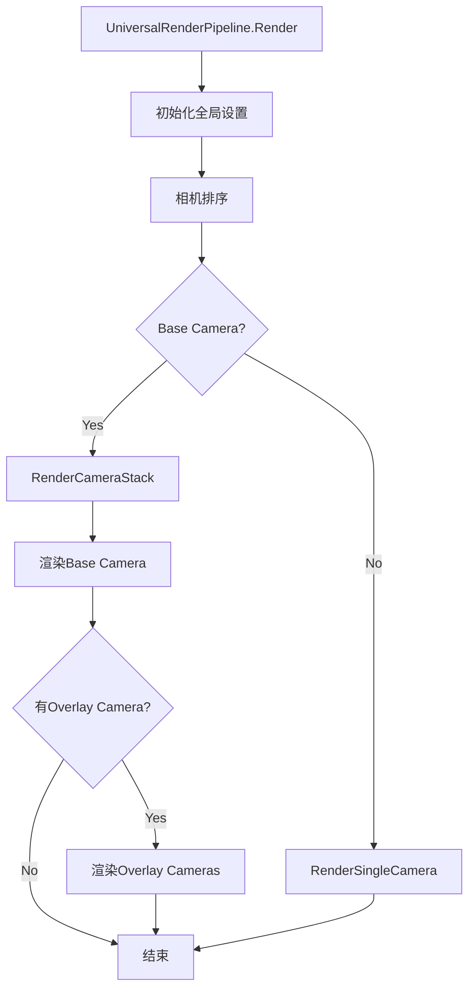

# Unity Universal Render Pipeline (URP) 架构分析

## 目录
1. [整体架构概述](#1-整体架构概述)
2. [核心渲染流程](#2-核心渲染流程)
3. [Forward和Deferred渲染路径](#3-forward和deferred渲染路径)
4. [渲染Pass系统](#4-渲染pass系统)
5. [光照系统](#5-光照系统)
6. [后处理系统](#6-后处理系统)
7. [设计模式与扩展点](#7-设计模式与扩展点)

---

## 1. 整体架构概述

### 1.1 核心类层次结构

```
RenderPipeline (Unity引擎基类)
    └── UniversalRenderPipeline
            ├── UniversalRenderPipelineAsset (配置资产)
            ├── ScriptableRenderer (渲染器基类)
            │   ├── UniversalRenderer (前向/延迟渲染器)
            │   └── Renderer2D (2D渲染器)
            ├── ScriptableRenderPass (渲染Pass基类)
            └── ScriptableRendererFeature (功能扩展基类)
```

### 1.2 架构设计原则

**分层架构**:
- **管线层** ([`UniversalRenderPipeline`](./UniversalRenderPipeline.cs:15)): 负责管线初始化、相机排序、渲染调度
- **渲染器层** ([`ScriptableRenderer`](./ScriptableRenderer.cs:24)): 实现具体的渲染策略(Forward/Deferred)
- **Pass层** ([`ScriptableRenderPass`](./Passes/ScriptableRenderPass.cs)): 执行具体的渲染操作
- **Feature层** ([`ScriptableRendererFeature`](./ScriptableRendererFeature.cs)): 提供可插拔的功能扩展

**关键设计特点**:
- 支持相机堆栈 (Base Camera + Overlay Cameras)
- 基于事件驱动的Pass调度系统
- 灵活的渲染特性扩展机制
- 统一的前向和延迟渲染路径

---

## 2. 核心渲染流程

### 2.1 渲染流程概览



### 2.2 关键渲染步骤

#### 主入口点 - [`UniversalRenderPipeline.Render`](./UniversalRenderPipeline.cs:229)

```
1. BeginContextRendering
2. SetupPerFrameShaderConstants (设置全局Shader常量)
3. 相机排序 (SortCameras)
4. 遍历每个相机:
   - 判断相机类型 (Base/Overlay)
   - 调用 RenderCameraStack 或 RenderSingleCamera
5. EndContextRendering
```

#### 单相机渲染流程 - [`RenderSingleCamera`](./UniversalRenderPipeline.cs:322)

```
1. 初始化相机数据 (InitializeCameraData)
2. 设置剔除参数 (SetupCullingParameters)
3. 执行场景剔除 (context.Cull)
4. 初始化渲染数据 (InitializeRenderingData)
5. 渲染器Setup (renderer.Setup)
6. 渲染器Execute (renderer.Execute)
7. 提交渲染命令 (context.Submit)
```

### 2.3 渲染器执行流程 - [`ScriptableRenderer.Execute`](./ScriptableRenderer.cs:642)

```
1. InternalStartRendering
   - 所有Pass调用 OnCameraSetup
2. ClearRenderingState (清理渲染状态)
3. 设置Shader时间变量
4. 排序渲染Pass队列
5. SetupLights (光照设置)
6. BeforeRendering Block (阴影等预处理)
7. SetupCameraProperties (相机属性设置)
8. MainRenderingOpaque Block (不透明渲染)
9. MainRenderingTransparent Block (透明渲染)
10. AfterRendering Block (后处理等)
11. InternalFinishRendering
```

---

## 3. Forward和Deferred渲染路径

### 3.1 渲染模式选择 - [`UniversalRenderer`](./UniversalRenderer.cs:35)

URP支持两种渲染模式，在 [`RenderingMode`](./UniversalRenderer.cs:9) 中定义:

```csharp
public enum RenderingMode
{
    Forward,   // 前向渲染
    Deferred   // 延迟渲染
}
```

实际渲染模式根据运行时条件动态确定 ([`actualRenderingMode`](./UniversalRenderer.cs:68)):
- 线框模式强制使用Forward
- 调试模式可能不支持Deferred
- 硬件不支持时回退到Forward

### 3.2 Forward渲染路径

**核心特点**:
- 单Pass完成所有光照计算
- 支持MSAA
- 支持相机堆栈
- 每个物体的光照数量有限制

**主要Pass序列**:
```
1. MainLightShadowCasterPass (主光源阴影)
2. AdditionalLightsShadowCasterPass (额外光源阴影)
3. DepthPrepass (可选，深度预渲染)
4. DrawOpaqueObjects (不透明物体)
   - 使用 UniversalForward shader pass
5. DrawSkybox
6. CopyDepthPass (可选)
7. CopyColorPass (可选，不透明纹理)
8. DrawTransparentObjects (透明物体)
9. PostProcessing
10. FinalBlit
```

**光照计算方式**:
- 主光源: PerPixel
- 额外光源: PerPixel 或 PerVertex ([`LightRenderingMode`](./Data/UniversalRenderPipelineAsset.cs:77))
- 支持最多8个PerObject光源

### 3.3 Deferred渲染路径

**核心特点**:
- 两Pass渲染：GBuffer Pass + Lighting Pass
- 不支持MSAA
- 不支持相机堆栈 (仅Base Camera)
- 支持大量光源

**主要Pass序列**:
```
1. MainLightShadowCasterPass
2. AdditionalLightsShadowCasterPass
3. GBufferPass (写入GBuffer)
   - 使用 UniversalGBuffer shader pass
   - 输出: Albedo + Metallic + Normal + Smoothness + Occlusion + Emission
4. GBufferCopyDepthPass
5. TileDepthRangePass (可选，Tile-based lighting)
6. DeferredPass (延迟光照计算)
   - 读取GBuffer
   - 计算所有光照
7. DrawOpaqueForwardOnlyPass (前向only材质)
   - 使用 UniversalForwardOnly shader pass
8. DrawSkybox
9. DrawTransparentObjects
10. PostProcessing
11. FinalBlit
```

**GBuffer布局** ([`DeferredLights.GbufferAttachments`](./DeferredLights.cs)):
```
RT0: Albedo (RGB) + MaterialFlags (A)
RT1: Specular (RGB) + Occlusion (A)
RT2: Normal (RGB) + Smoothness (A)
RT3: GI/Emission (RGB) + 保留 (A)
Depth: Camera Depth
```

---

## 4. 渲染Pass系统

### 4.1 ScriptableRenderPass基类

[`ScriptableRenderPass`](./Passes/ScriptableRenderPass.cs) 是所有渲染Pass的基类，提供:

**核心接口**:
```csharp
- Configure(CommandBuffer, RenderTextureDescriptor)  // 配置渲染目标
- Execute(ScriptableRenderContext, RenderingData)    // 执行渲染
- OnCameraSetup(CommandBuffer, RenderingData)        // 相机设置
- FrameCleanup(CommandBuffer)                        // 帧清理
```

**关键属性**:
- [`renderPassEvent`](./Passes/ScriptableRenderPass.cs): 控制Pass执行顺序
- [`colorAttachments`](./Passes/ScriptableRenderPass.cs): 颜色附件
- [`depthAttachment`](./Passes/ScriptableRenderPass.cs): 深度附件
- [`clearFlag`](./Passes/ScriptableRenderPass.cs): 清除标志
- [`input`](./Passes/ScriptableRenderPass.cs): 输入需求 (Depth/Normal/Color/Motion)

### 4.2 RenderPassEvent调度系统

Pass执行顺序由 [`RenderPassEvent`](./Passes/ScriptableRenderPass.cs) 枚举控制:

```
BeforeRendering (< 0)
    └── BeforeRenderingShadows
    └── BeforeRenderingPrePasses
    
MainRenderingOpaque (0 - 150)
    └── BeforeRenderingGbuffer
    └── BeforeRenderingDeferredLights
    └── AfterRenderingGbuffer
    └── BeforeRenderingOpaques
    └── AfterRenderingOpaques
    
MainRenderingTransparent (150 - 250)
    └── BeforeRenderingSkybox
    └── AfterRenderingSkybox
    └── BeforeRenderingTransparents
    └── AfterRenderingTransparents
    
AfterRendering (> 250)
    └── BeforeRenderingPostProcessing
    └── AfterRenderingPostProcessing
```

Pass队列在 [`SortStable`](./ScriptableRenderer.cs:1452) 中排序，使用插入排序保证稳定性。

### 4.3 核心内置Pass

**阴影Pass**:
- [`MainLightShadowCasterPass`](./Passes/MainLightShadowCasterPass.cs): 主光源级联阴影
- [`AdditionalLightsShadowCasterPass`](./Passes/AdditionalLightsShadowCasterPass.cs): 额外光源阴影图集

**几何Pass**:
- [`DepthOnlyPass`](./Passes/DepthOnlyPass.cs): 深度预渲染
- [`DepthNormalOnlyPass`](./Passes/DepthNormalOnlyPass.cs): 深度法线预渲染
- [`GBufferPass`](./Passes/GBufferPass.cs): GBuffer写入
- [`DrawObjectsPass`](./Passes/DrawObjectsPass.cs): 通用物体绘制Pass

**光照Pass**:
- [`DeferredPass`](./Passes/DeferredPass.cs): 延迟光照计算

**后处理Pass**:
- [`ColorGradingLutPass`](./Passes/ColorGradingLutPass.cs): 颜色分级LUT生成
- [`PostProcessPass`](./Passes/PostProcessPass.cs): 后处理效果
- [`FinalBlitPass`](./Passes/FinalBlitPass.cs): 最终Blit到屏幕

**工具Pass**:
- [`CopyDepthPass`](./Passes/CopyDepthPass.cs): 深度拷贝
- [`CopyColorPass`](./Passes/CopyColorPass.cs): 颜色拷贝

### 4.4 Pass扩展机制 - ScriptableRendererFeature

[`ScriptableRendererFeature`](./ScriptableRendererFeature.cs) 提供插件式功能扩展:

```csharp
public abstract class ScriptableRendererFeature : ScriptableObject
{
    public abstract void Create();
    public abstract void AddRenderPasses(ScriptableRenderer renderer, 
                                         ref RenderingData renderingData);
}
```

**扩展流程**:
1. Create(): 初始化，创建Pass实例
2. AddRenderPasses(): 将Pass加入渲染队列
3. Pass.Execute(): 执行具体渲染

**内置Feature示例**:
- Screen Space Ambient Occlusion
- Decal Renderer Feature
- Render Objects Feature

---

## 5. 光照系统

### 5.1 光照架构

```
LightData (光照数据)
    ├── MainLight (主光源)
    └── AdditionalLights (额外光源)
        ├── ForwardLights (前向渲染光照)
        │   ├── PerPixel
        │   └── PerVertex
        └── DeferredLights (延迟渲染光照)
            ├── TiledDeferred
            └── StencilDeferred
```

### 5.2 前向光照 - [`ForwardLights`](./ForwardLights.cs)

**职责**:
- 光源剔除和排序
- 光照数据打包到Uniform Buffer
- 支持Clustered Rendering (可选)

**光照模式**:
1. **PerPixel** - 每像素光照
   - 主光源 + 最多MaxAdditionalLights个额外光源
   - Shader关键字: `_ADDITIONAL_LIGHTS`

2. **PerVertex** - 每顶点光照
   - 主光源PerPixel + 额外光源PerVertex
   - Shader关键字: `_ADDITIONAL_LIGHTS_VERTEX`

**Clustered Rendering** ([`ForwardLights.clusteredRendering`](./ForwardLights.cs)):
- 将屏幕空间划分为Tile
- 每个Tile计算相交的光源列表
- 减少光照计算overdraw

### 5.3 延迟光照 - [`DeferredLights`](./DeferredLights.cs)

**渲染策略**:
1. **Stencil Deferred** (默认)
   - 使用Stencil标记光照区域
   - 每个光源绘制一个Quad/Sphere
   - 适合光源数量中等的场景

2. **Tiled Deferred** (实验性)
   - 基于Compute Shader的Tile光照
   - 每个Tile计算所有相交光源
   - 适合大量光源

**光照流程**:
```
1. TileDepthRangePass
   - 计算每个Tile的深度范围
   - 生成Depth Bounds Texture
   
2. DeferredPass
   - For each light:
       a. 计算光源影响范围 (Sphere/Cone)
       b. 使用Stencil测试标记像素
       c. 读取GBuffer
       d. 计算光照
       e. 累加到LightingBuffer
```

### 5.4 阴影系统

**主光源阴影** ([`MainLightShadowCasterPass`](./Passes/MainLightShadowCasterPass.cs)):
- 级联阴影贴图 (CSM: 1-4级)
- 分辨率: 256-4096
- 支持SoftShadows (PCF)

**额外光源阴影** ([`AdditionalLightsShadowCasterPass`](./Passes/AdditionalLightsShadowCasterPass.cs)):
- 单张Shadow Atlas
- 支持Spot Light和Point Light
- 动态分辨率 (Low/Medium/High tier)

**阴影设置** ([`ShadowData`](./UniversalRenderPipelineCore.cs:251)):
```csharp
- shadowDistance: 阴影距离
- shadowCascadeCount: 级联数量
- cascadeSplit: 级联分割比例
- shadowDepthBias: 深度偏移
- shadowNormalBias: 法线偏移
- supportsSoftShadows: 软阴影支持
```

---

## 6. 后处理系统

### 6.1 后处理架构

```
PostProcessData (配置)
    └── PostProcessPasses
        ├── ColorGradingLutPass (LUT生成)
        ├── PostProcessPass (主后处理)
        └── FinalPostProcessPass (最终处理)
```

### 6.2 后处理流程

**ColorGradingLutPass** ([`ColorGradingLutPass`](./Passes/ColorGradingLutPass.cs)):
```
输入: Volume Stack Settings
处理:
  - Color Grading
  - Tonemapping
  - Split Toning
  - Channel Mixer
  - Shadows/Midtones/Highlights
输出: LUT Texture (32x32x32 or 16x16x16)
```

**PostProcessPass** ([`PostProcessPass`](./Passes/PostProcessPass.cs)):
```
UberPost Shader执行:
1. Bloom
2. Chromatic Aberration
3. Lens Distortion
4. Vignette
5. Film Grain
6. Color Grading (应用LUT)
7. Tonemapping
8. Dithering
```

**FinalPostProcessPass**:
```
1. FXAA (Fast Approximate Anti-Aliasing)
2. Upscaling (FSR/Point/Linear)
```

### 6.3 后处理设置

**ColorGradingMode** ([`ColorGradingMode`](./Data/UniversalRenderPipelineAsset.cs:109)):
- LowDynamicRange: LDR管线
- HighDynamicRange: HDR管线

**AntialiasingMode**:
- None
- FXAA
- SMAA (Subpixel Morphological AA)

**ImageScalingMode** ([`ImageScalingMode`](./UniversalRenderPipelineCore.cs:21)):
- None: 不缩放
- Upscaling: 提升分辨率
- Downscaling: 降低分辨率

---

## 7. 设计模式与扩展点

### 7.1 核心设计模式

**1. Strategy模式 - 渲染策略**
- [`ScriptableRenderer`](./ScriptableRenderer.cs:24) 作为策略接口
- [`UniversalRenderer`](./UniversalRenderer.cs:35) 实现Forward/Deferred策略
- [`Renderer2D`](./2D/Renderer2D.cs) 实现2D渲染策略

**2. Command模式 - 渲染Pass**
- 每个 [`ScriptableRenderPass`](./Passes/ScriptableRenderPass.cs) 是一个Command
- Pass队列是Command队列
- Execute方法执行命令

**3. Builder模式 - 渲染管线构建**
- [`UniversalRenderer.Setup`](./UniversalRenderer.cs:431) 动态构建Pass队列
- 根据配置和运行时条件添加Pass
- EnqueuePass添加Pass到队列

**4. Observer模式 - 渲染事件**
```csharp
BeginCameraRendering(context, camera)
BeginContextRendering(context, cameras)
EndCameraRendering(context, camera)
EndContextRendering(context, cameras)
```

**5. Template Method模式 - Pass执行**
```csharp
ScriptableRenderPass:
    OnCameraSetup()    // 可选重写
    Configure()        // 可选重写
    Execute()          // 必须重写
    FrameCleanup()     // 可选重写
```

### 7.2 主要扩展点

**1. ScriptableRendererFeature**
- 最推荐的扩展方式
- 可以添加自定义Pass
- 示例: SSAO, Screen Space Shadows, Decals

**2. ScriptableRenderPass**
- 自定义渲染逻辑
- 可以访问相机和渲染数据
- 可以配置渲染目标

**3. ScriptableRenderer**
- 完全自定义渲染器
- 需要实现Setup方法
- 适合完全不同的渲染策略

**4. Volume Component**
- 扩展后处理效果
- 支持空间混合
- 示例: 自定义后处理

**5. Shader Graph**
- 可视化Shader创建
- 支持URP Shader Pass
- 兼容Forward和Deferred

### 7.3 关键扩展API

**添加渲染Pass**:
```csharp
public class CustomRendererFeature : ScriptableRendererFeature
{
    CustomRenderPass m_Pass;
    
    public override void Create()
    {
        m_Pass = new CustomRenderPass();
        m_Pass.renderPassEvent = RenderPassEvent.AfterRenderingOpaques;
    }
    
    public override void AddRenderPasses(ScriptableRenderer renderer, 
                                         ref RenderingData renderingData)
    {
        renderer.EnqueuePass(m_Pass);
    }
}
```

**访问渲染数据**:
```csharp
public class CustomRenderPass : ScriptableRenderPass
{
    public override void Execute(ScriptableRenderContext context, 
                                  ref RenderingData renderingData)
    {
        var camera = renderingData.cameraData.camera;
        var cullResults = renderingData.cullResults;
        var lightData = renderingData.lightData;
        
        // 自定义渲染逻辑
    }
}
```

**配置输入需求**:
```csharp
public override void Configure(CommandBuffer cmd, 
                                RenderTextureDescriptor cameraTextureDescriptor)
{
    ConfigureInput(ScriptableRenderPassInput.Depth | 
                   ScriptableRenderPassInput.Normal);
}
```

### 7.4 性能优化建议

**1. 使用SRP Batcher**
- 统一Shader变量声明
- 使用CBUFFER宏包裹材质属性
- 减少SetPass Call

**2. 合理配置渲染设置**
- 根据平台调整MSAA
- 使用合适的阴影分辨率
- 启用Depth Priming (Forward)

**3. 优化Pass数量**
- 合并相似的Pass
- 避免不必要的Copy Pass
- 使用Native RenderPass (Tile-based GPU)

**4. 光照优化**
- 限制Per-Object光源数量
- 使用Light Layers进行分层
- Deferred路径适合大量光源

**5. 后处理优化**
- 降低LUT分辨率
- 使用Fast SRGB转换
- 根据平台选择抗锯齿方案

---

## 总结

URP采用了高度模块化和可扩展的架构设计:

**核心优势**:
1. **统一的渲染抽象**: 前向和延迟渲染使用相同的框架
2. **灵活的扩展机制**: RendererFeature和RenderPass系统
3. **事件驱动的Pass调度**: 精确控制渲染顺序
4. **跨平台兼容性**: 支持移动到桌面全平台

**适用场景**:
- 移动游戏 (Forward + MSAA)
- PC/Console (Forward或Deferred)
- VR/XR (Forward + Native RenderPass)
- 2D游戏 (Renderer2D)

**扩展建议**:
- 简单效果: 使用ScriptableRendererFeature
- 复杂渲染: 自定义ScriptableRenderer
- 后处理: 扩展Volume Component
- 材质: 使用Shader Graph

URP的架构设计体现了Unity在渲染管线现代化方面的努力，提供了在性能和灵活性之间的良好平衡。
