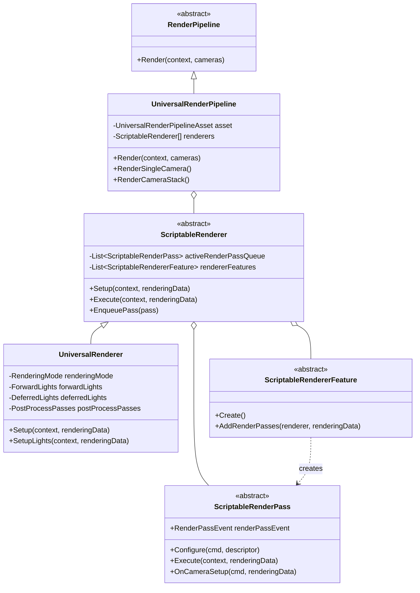
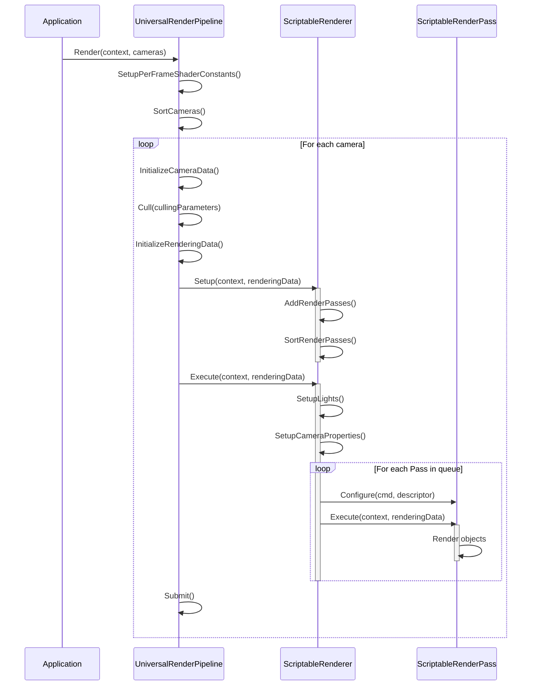
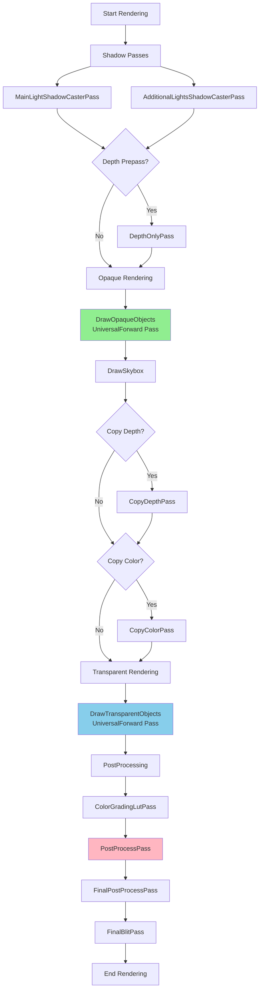
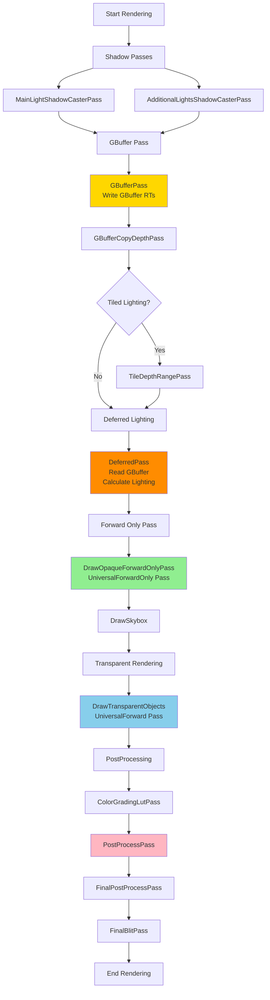
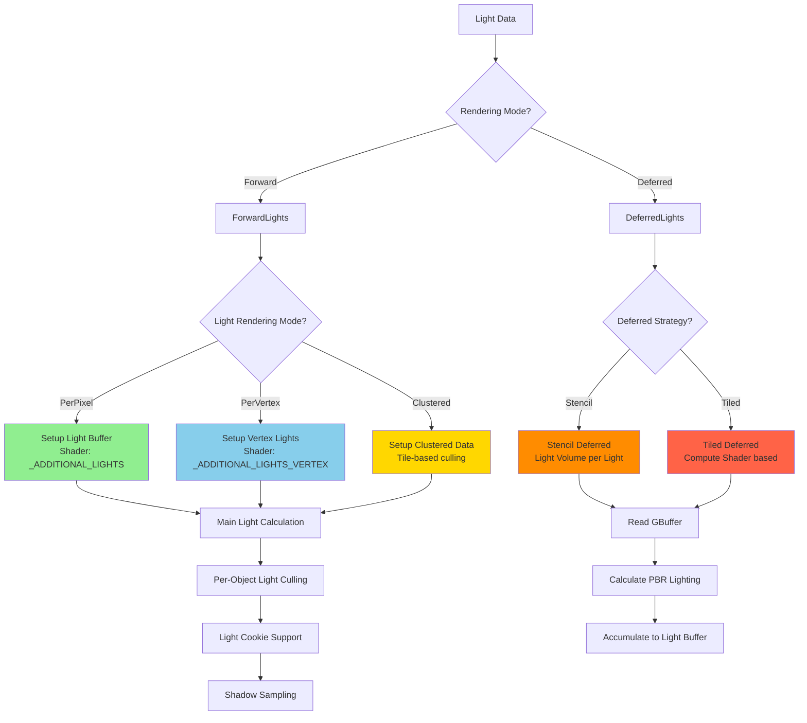
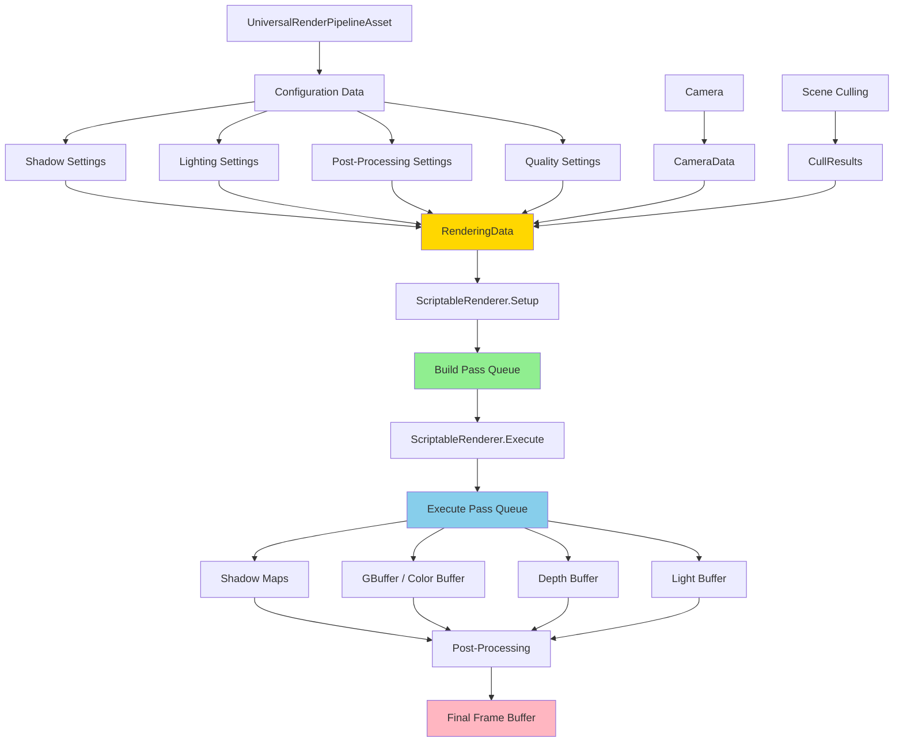

# URP架构图表总结

## 核心类图



## 渲染流程时序图



## Forward渲染路径流程



## Deferred渲染路径流程



## 光照系统架构



## Pass扩展机制

```mermaid
graph LR
    A[ScriptableRendererFeature] --> B{Create Phase}
    B --> C[Instantiate Custom Pass]
    C --> D[Configure Pass Properties]
    D --> E[Set RenderPassEvent]
    
    E --> F{AddRenderPasses Phase}
    F --> G{Should Add Pass?}
    G -->|Yes| H[renderer.EnqueuePass]
    G -->|No| I[Skip]
    
    H --> J[Pass added to Queue]
    J --> K{Execute Phase}
    K --> L[ScriptableRenderer.Execute]
    L --> M[Sort Pass Queue]
    M --> N[For each Pass]
    N --> O[Pass.Configure]
    O --> P[Pass.Execute]
    P --> Q[Pass.FrameCleanup]
    
    style A fill:#FFD700
    style C fill:#90EE90
    style H fill:#87CEEB
    style P fill:#FFB6C1
```



## 数据流向图



## Pass事件时间轴

```
Timeline: RenderPassEvent
│
├─── < 0 ───────────────────────────────────────────────────────
│    BeforeRendering Block
│    ├── BeforeRenderingShadows (-50)
│    │   └── MainLightShadowCasterPass
│    │   └── AdditionalLightsShadowCasterPass
│    └── BeforeRenderingPrePasses (0)
│        └── DepthPrepass / DepthNormalPrepass
│
├─── 0 - 150 ───────────────────────────────────────────────────
│    MainRenderingOpaque Block
│    ├── BeforeRenderingGbuffer (50)
│    │   └── GBufferPass (Deferred)
│    ├── BeforeRenderingDeferredLights (75)
│    │   └── TileDepthRangePass (Deferred)
│    ├── AfterRenderingGbuffer (85)
│    │   └── DeferredPass
│    │   └── DrawOpaqueForwardOnlyPass (Deferred)
│    ├── BeforeRenderingOpaques (100)
│    │   └── DrawOpaqueObjectsPass (Forward)
│    └── AfterRenderingOpaques (150)
│        └── CopyDepthPass
│
├─── 150 - 250 ─────────────────────────────────────────────────
│    MainRenderingTransparent Block
│    ├── BeforeRenderingSkybox (200)
│    │   └── DrawSkyboxPass
│    ├── AfterRenderingSkybox (210)
│    │   └── CopyColorPass (Opaque Texture)
│    ├── BeforeRenderingTransparents (250)
│    │   └── DrawTransparentObjectsPass
│    └── AfterRenderingTransparents (300)
│
├─── > 250 ─────────────────────────────────────────────────────
│    AfterRendering Block
│    ├── BeforeRenderingPostProcessing (400)
│    │   └── ColorGradingLutPass
│    │   └── PostProcessPass
│    ├── AfterRenderingPostProcessing (500)
│    │   └── FinalPostProcessPass (FXAA/FSR)
│    └── AfterRendering (600)
│        └── FinalBlitPass
│        └── CapturePass
└────────────────────────────────────────────────────────────────
```

## GBuffer布局

```
Deferred Rendering GBuffer Layout:
┌────────────────────────────────────────┐
│ RT0: Albedo + MaterialFlags            │
│  - RGB: Base Color (sRGB)              │
│  - A: Material Flags (Unlit/Metallic)  │
├────────────────────────────────────────┤
│ RT1: Specular + Occlusion              │
│  - RGB: Specular Color                 │
│  - A: Occlusion                        │
├────────────────────────────────────────┤
│ RT2: Normal + Smoothness               │
│  - RGB: World Space Normal (Oct or XYZ)│
│  - A: Smoothness                       │
├────────────────────────────────────────┤
│ RT3: Emission + Lightmap               │
│  - RGB: Emission + Baked GI            │
│  - A: Reserved                         │
├────────────────────────────────────────┤
│ Depth Buffer                           │
│  - D32 or D24S8                        │
│  - Camera Depth + Stencil              │
└────────────────────────────────────────┘

Notes:
- RT Format: R8G8B8A8_UNorm or higher
- Normal可选择Oct编码节省带宽
- Stencil用于标记材质类型和光照区域
```

## 关键性能指标

```
Performance Metrics by Rendering Path:

Forward Rendering:
├── Advantages:
│   ├── MSAA support (移动端重要)
│   ├── Lower memory bandwidth
│   ├── Simpler pipeline
│   └── Better for few lights
└── Limitations:
    ├── Light count per object limited (8)
    ├── Multiple shading per pixel
    └── No light accumulation

Deferred Rendering:
├── Advantages:
│   ├── Unlimited light count
│   ├── Single shading per pixel
│   ├── Better for many lights
│   └── Light accumulation
└── Limitations:
    ├── No MSAA (need resolve)
    ├── Higher memory bandwidth
    ├── No transparency in GBuffer
    └── More complex pipeline

Recommended Usage:
├── Mobile: Forward + MSAA
├── PC/Console (Few Lights): Forward
├── PC/Console (Many Lights): Deferred
└── VR/XR: Forward + Native RenderPass
```
