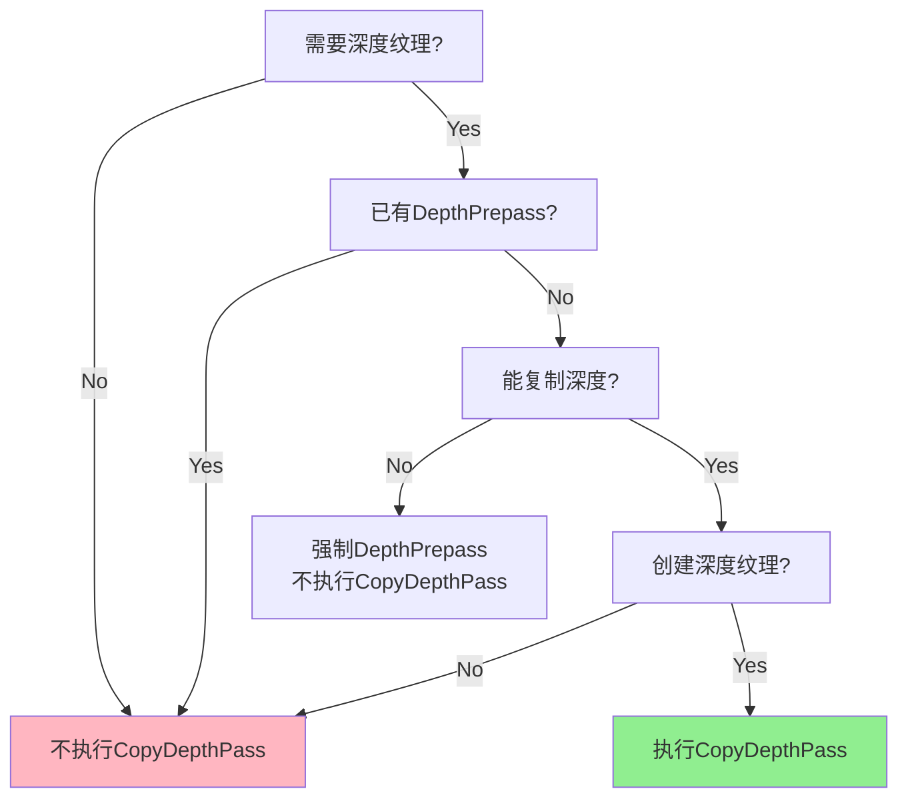
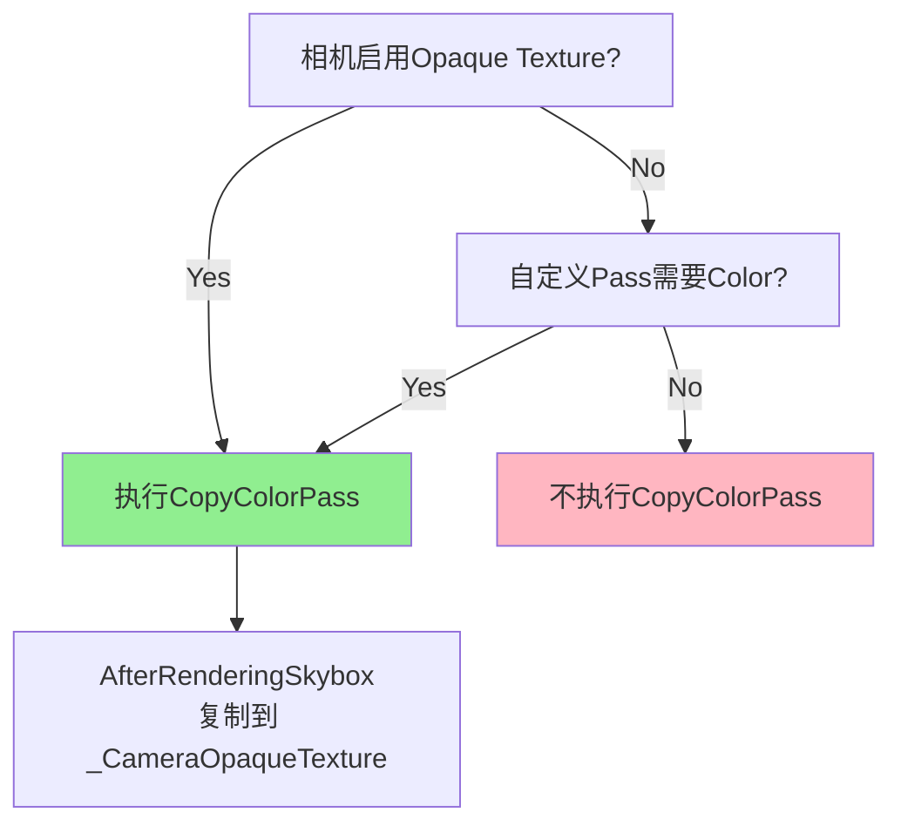
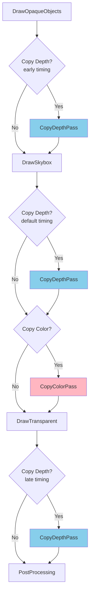

# URP Forward渲染路径中CopyDepth和CopyColor Pass的决策逻辑

## 问题概述

在URP的Forward渲染路径流程图中，有两个关键的决策分支：
```
DrawSkybox --> {Copy Depth?}
    |Yes --> CopyDepthPass
    |No  --> {Copy Color?}
        |Yes --> CopyColorPass
        |No  --> Transparent Rendering
```

本文档详细分析这两个Pass的触发条件和决策逻辑。

---

## 1. Copy Depth Pass 决策逻辑

### 1.1 触发条件汇总

CopyDepthPass在以下情况下会被**添加到渲染队列**：

```
requiresDepthCopyPass = !requiresDepthPrepass 
                        AND (requiresDepthTexture OR cameraHasPostProcessingWithDepth)
                        AND createDepthTexture
```

### 1.2 详细条件分析

#### 条件1: `!requiresDepthPrepass` (没有深度预渲染)

**必须为false时才复制深度**，因为：
- 如果已经执行了DepthPrepass，深度数据已经在 `_CameraDepthTexture` 中
- 不需要再次复制深度

**`requiresDepthPrepass`为true的情况**：
```csharp
// Line 518-523 in UniversalRenderer.cs
bool requiresDepthPrepass = 
    (requiresDepthTexture || cameraHasPostProcessingWithDepth) 
    && (!CanCopyDepth(ref renderingData.cameraData) || forcePrepass);

requiresDepthPrepass |= isSceneViewOrPreviewCamera;
requiresDepthPrepass |= isGizmosEnabled;
requiresDepthPrepass |= isPreviewCamera;
requiresDepthPrepass |= renderPassInputs.requiresDepthPrepass;
requiresDepthPrepass |= renderPassInputs.requiresNormalsTexture;
```

#### 条件2: `requiresDepthTexture` (需要深度纹理)

**为true的情况**：
```csharp
// Line 501
bool requiresDepthTexture = 
    cameraData.requiresDepthTexture  // 相机设置中启用深度纹理
    || renderPassInputs.requiresDepthTexture  // 自定义Pass需要深度输入
    || useDepthPriming;  // 启用深度预处理
```

- **相机设置**：Inspector中勾选 "Depth Texture"
- **自定义Pass需求**：如SSAO、Screen Space Shadows等需要读取深度
- **Depth Priming**：优化技术，减少overdraw

#### 条件3: `cameraHasPostProcessingWithDepth` (后处理需要深度)

**为true的情况**：
```csharp
// Line 494
bool cameraHasPostProcessingWithDepth = 
    applyPostProcessing  // 启用后处理
    && cameraData.postProcessingRequiresDepthTexture;  // 特定效果需要深度
```

**需要深度的后处理效果**：
- Depth of Field (景深)
- Motion Blur (运动模糊)

#### 条件4: `createDepthTexture` (创建深度纹理)

**为true的情况**：
```csharp
// Lines 568-573
bool createDepthTexture = 
    (requiresDepthTexture || cameraHasPostProcessingWithDepth) && !requiresDepthPrepass;

createDepthTexture |= !cameraData.resolveFinalTarget;
createDepthTexture |= (this.actualRenderingMode == RenderingMode.Deferred && !useRenderPassEnabled);
createDepthTexture |= useDepthPriming;
```

#### 条件5: `CanCopyDepth()` (支持深度复制)

**关键判断逻辑**：
```csharp
// Lines 1229-1242 in UniversalRenderer.cs
bool CanCopyDepth(ref CameraData cameraData)
{
    bool msaaEnabledForCamera = cameraData.cameraTargetDescriptor.msaaSamples > 1;
    bool supportsTextureCopy = SystemInfo.copyTextureSupport != CopyTextureSupport.None;
    bool supportsDepthTarget = RenderingUtils.SupportsRenderTextureFormat(RenderTextureFormat.Depth);
    bool supportsDepthCopy = !msaaEnabledForCamera && (supportsDepthTarget || supportsTextureCopy);
    
    bool msaaDepthResolve = msaaEnabledForCamera && SystemInfo.supportsMultisampledTextures != 0;
    
    // GLES3 MSAA depth有bug
    if (IsGLESDevice() && msaaDepthResolve)
        return false;
    
    return supportsDepthCopy || msaaDepthResolve;
}
```

**不能复制深度的情况**：
- GLES3 + MSAA启用
- 硬件不支持深度纹理格式且不支持纹理复制

### 1.3 CopyDepthPass的执行时机

CopyDepthPass的执行时机是**动态调整**的：

```csharp
// Lines 540-555 in UniversalRenderer.cs
if (requiresDepthTexture)
{
    RenderPassEvent copyDepthPassEvent = RenderPassEvent.AfterRenderingOpaques;
    
    // 如果自定义Pass需要深度纹理
    if (renderPassInputs.requiresDepthTexture)
    {
        // 在需要深度的Pass之前执行
        copyDepthPassEvent = (RenderPassEvent)Mathf.Min(
            (int)RenderPassEvent.AfterRenderingTransparents, 
            ((int)renderPassInputs.requiresDepthTextureEarliestEvent) - 1
        );
    }
    m_CopyDepthPass.renderPassEvent = copyDepthPassEvent;
}
else if (cameraHasPostProcessingWithDepth || isSceneViewOrPreviewCamera || isGizmosEnabled)
{
    // 仅后处理需要深度，在透明物体后执行
    m_CopyDepthPass.renderPassEvent = RenderPassEvent.AfterRenderingTransparents;
}
```

**可能的执行时机**：
1. **`AfterRenderingOpaques`** (默认): 不透明物体渲染后，天空盒前
2. **`AfterRenderingSkybox`**: 天空盒渲染后（流程图中的位置）
3. **`AfterRenderingTransparents`**: 透明物体渲染后
4. **自定义时机**: 根据自定义Pass的需求动态确定

### 1.4 决策流程图



### 1.5 实际案例

#### 案例1: 标准Forward渲染 + 无后处理
```
requiresDepthTexture = false
requiresDepthPrepass = false
=> 不执行CopyDepthPass
```

#### 案例2: 启用Depth Texture + 无MSAA
```
cameraData.requiresDepthTexture = true
CanCopyDepth = true
requiresDepthPrepass = false  // 可以复制，不需要prepass
createDepthTexture = true
=> 执行CopyDepthPass (AfterRenderingOpaques)
```

#### 案例3: 启用Depth Texture + MSAA + GLES3
```
cameraData.requiresDepthTexture = true
CanCopyDepth = false  // GLES3不支持MSAA depth copy
requiresDepthPrepass = true  // 强制prepass
=> 不执行CopyDepthPass (使用DepthPrepass代替)
```

#### 案例4: Depth of Field后处理
```
cameraHasPostProcessingWithDepth = true
requiresDepthPrepass = false
createDepthTexture = true
=> 执行CopyDepthPass (AfterRenderingTransparents)
```

---

## 2. Copy Color Pass 决策逻辑

### 2.1 触发条件汇总

CopyColorPass在以下情况下会被**添加到渲染队列**：

```
copyColorPass = cameraData.requiresOpaqueTexture 
                OR renderPassInputs.requiresColorTexture
```

### 2.2 详细条件分析

#### 条件1: `cameraData.requiresOpaqueTexture` (相机需要不透明纹理)

**来源**: 
```csharp
// UniversalAdditionalCameraData组件中的设置
public bool requiresOpaqueTexture = false;
```

**用途**：
- Grab Pass效果（透明物体扭曲、折射）
- 透明物体需要访问已渲染的不透明物体颜色
- 类似于Built-in管线的GrabPass

**启用方式**：
1. 在Camera组件上添加 `Universal Additional Camera Data`
2. 勾选 "Opaque Texture"
3. 或通过代码：`camera.GetUniversalAdditionalCameraData().requiresOpaqueTexture = true`

#### 条件2: `renderPassInputs.requiresColorTexture` (自定义Pass需要颜色纹理)

**来源**：
```csharp
// 自定义ScriptableRenderPass中声明
public override void Configure(CommandBuffer cmd, RenderTextureDescriptor cameraTextureDescriptor)
{
    ConfigureInput(ScriptableRenderPassInput.Color);
}
```

**使用场景**：
- 自定义RendererFeature需要读取当前颜色缓冲
- 屏幕空间效果（如Screen Space Decals）
- 自定义后处理

### 2.3 CopyColorPass的执行时机

CopyColorPass的执行时机是**固定**的：

```csharp
// Line 297 in UniversalRenderer.cs
m_CopyColorPass = new CopyColorPass(
    RenderPassEvent.AfterRenderingSkybox,  // 固定在天空盒后
    m_SamplingMaterial, 
    m_BlitMaterial
);
```

**执行时机**: `AfterRenderingSkybox` (天空盒渲染后)

**为什么在这个时机**：
1. **包含不透明物体和天空盒**：此时颜色缓冲包含所有不透明内容
2. **在透明物体前**：透明物体渲染时可以采样这个纹理实现折射/扭曲
3. **最小化性能开销**：只复制一次，避免多次复制

### 2.4 CopyColorPass的配置

```csharp
// Lines 814-821 in UniversalRenderer.cs
if (copyColorPass)
{
    Downsampling downsamplingMethod = UniversalRenderPipeline.asset.opaqueDownsampling;
    m_CopyColorPass.Setup(
        m_ActiveCameraColorAttachment.Identifier(), 
        m_OpaqueColor,  // 输出到 _CameraOpaqueTexture
        downsamplingMethod
    );
    EnqueuePass(m_CopyColorPass);
}
```

**降采样选项** (`UniversalRenderPipelineAsset`中设置):
- `None`: 全分辨率复制
- `_2xBilinear`: 1/2分辨率
- `_4xBox`: 1/4分辨率，Box滤波
- `_4xBilinear`: 1/4分辨率，双线性滤波

### 2.5 输出纹理

CopyColorPass将颜色复制到全局纹理：
```csharp
// 在shader中可以访问
sampler2D _CameraOpaqueTexture;
```

### 2.6 决策流程图



### 2.7 实际案例

#### 案例1: 标准Forward渲染
```
requiresOpaqueTexture = false
renderPassInputs.requiresColorTexture = false
=> 不执行CopyColorPass
```

#### 案例2: 透明材质折射效果
```
requiresOpaqueTexture = true  // 在相机上勾选
=> 执行CopyColorPass (AfterRenderingSkybox)
=> 透明物体shader中可以采样_CameraOpaqueTexture实现折射
```

#### 案例3: 自定义屏幕空间Decal
```csharp
// 自定义RenderPass
public override void Configure(...)
{
    ConfigureInput(ScriptableRenderPassInput.Color);
}
renderPassInputs.requiresColorTexture = true
=> 执行CopyColorPass
```

#### 案例4: 使用降采样优化性能
```
requiresOpaqueTexture = true
opaqueDownsampling = _4xBilinear  // 在URP Asset中设置
=> 执行CopyColorPass，输出1/4分辨率纹理
=> 降低带宽消耗，适合低端设备
```

---

## 3. Debug模式的特殊处理

调试模式会影响Pass的执行：

```csharp
// Lines 643-668 in UniversalRenderer.cs
if ((DebugHandler != null) && DebugHandler.IsActiveForCamera(ref cameraData))
{
    // Debug显示深度时，强制DepthPrepass
    if (fullScreenMode == DebugFullScreenMode.Depth)
    {
        requiresDepthPrepass = true;
    }
    
    // 禁用光照调试时
    if (!DebugHandler.IsLightingActive)
    {
        if (!isSceneViewOrPreviewCamera)
        {
            requiresDepthPrepass = false;
            useDepthPriming = false;
            generateColorGradingLUT = false;
            copyColorPass = false;         // 禁用CopyColorPass
            requiresDepthCopyPass = false; // 禁用CopyDepthPass
        }
    }
}
```

---

## 4. 总结对比

### Copy Depth Pass

| 特性 | 说明 |
|------|------|
| **主要用途** | 生成可采样的深度纹理 `_CameraDepthTexture` |
| **触发条件** | 需要深度纹理 + 没有深度预渲染 + 支持深度复制 |
| **执行时机** | 动态调整（AfterRenderingOpaques/Skybox/Transparents） |
| **替代方案** | DepthPrepass (当不支持深度复制时) |
| **性能影响** | 中等（取决于分辨率和MSAA） |
| **常见场景** | SSAO, 软粒子, Depth of Field, 自定义深度效果 |

### Copy Color Pass

| 特性 | 说明 |
|------|------|
| **主要用途** | 生成不透明纹理 `_CameraOpaqueTexture` |
| **触发条件** | 相机启用Opaque Texture OR 自定义Pass需要 |
| **执行时机** | 固定在 `AfterRenderingSkybox` |
| **替代方案** | 无（必须通过复制获得） |
| **性能影响** | 高（完整颜色缓冲复制，支持降采样优化） |
| **常见场景** | 透明物体折射/扭曲, Grab Pass效果, 屏幕空间Decals |

### 关键区别

1. **Copy Depth是可选优化路径**
   - 如果不支持复制，使用DepthPrepass
   - 如果已有Prepass，跳过Copy

2. **Copy Color是必需操作**
   - 一旦需要Opaque Texture，必须复制
   - 没有其他方式获得不透明颜色缓冲的快照

3. **执行时机不同**
   - Copy Depth: 动态调整，尽可能晚执行
   - Copy Color: 固定在天空盒后，透明物体前

4. **性能考虑**
   - Copy Depth: 单通道，相对轻量
   - Copy Color: 多通道（RGB/RGBA），开销更大

---

## 5. 流程图补充说明

原始流程图：
```
F [DrawSkybox] --> G{Copy Depth?}
    G -->|Yes| H[CopyDepthPass]
    G -->|No| I
    H --> I{Copy Color?}
```

**需要澄清的点**：

1. **Copy Depth的时机可能不在这里**
   - 图中显示在天空盒后
   - 实际可能在不透明物体后、天空盒后或透明物体后
   - 取决于具体需求

2. **Copy Color固定在这个位置**
   - 总是在天空盒后执行
   - 顺序正确

3. **两个Pass可能都执行**
   - 不是互斥关系
   - 可以同时执行两个Pass

### 更准确的流程图



---

## 6. 实战建议

### 6.1 性能优化

1. **避免不必要的Copy Pass**
   ```csharp
   // 只在需要时启用
   camera.GetUniversalAdditionalCameraData().requiresOpaqueTexture = false;
   ```

2. **使用降采样**
   ```csharp
   // 在URP Asset中设置
   asset.opaqueDownsampling = Downsampling._2xBilinear;
   ```

3. **优先使用Depth Prepass而非Copy**
   ```csharp
   // 在UniversalRendererData中设置
   rendererData.copyDepthMode = CopyDepthMode.ForcePrepass;
   ```

### 6.2 常见问题排查

**问题1**: 透明物体折射不工作
```
检查: requiresOpaqueTexture是否启用
解决: 在相机上勾选"Opaque Texture"
```

**问题2**: SSAO效果不显示
```
检查: 深度纹理是否可用
解决: 启用相机的"Depth Texture"或检查CanCopyDepth条件
```

**问题3**: 性能问题
```
检查: 是否同时启用了Depth和Color复制
解决: 只启用必需的纹理，使用降采样
```

### 6.3 自定义Pass最佳实践

```csharp
public class CustomRenderPass : ScriptableRenderPass
{
    public override void Configure(CommandBuffer cmd, RenderTextureDescriptor descriptor)
    {
        // 明确声明需要的输入
        ConfigureInput(ScriptableRenderPassInput.Depth | ScriptableRenderPassInput.Color);
        
        // 设置合适的执行时机
        renderPassEvent = RenderPassEvent.BeforeRenderingTransparents;
    }
    
    public override void Execute(ScriptableRenderContext context, ref RenderingData renderingData)
    {
        // 访问深度纹理
        // _CameraDepthTexture 会自动可用
        
        // 访问颜色纹理
        // _CameraOpaqueTexture 会自动可用（如果Copy Color执行了）
    }
}
```

---

## 7. 参考资料

### 源码位置

1. **主要决策逻辑**: [`UniversalRenderer.cs:Setup()`](../UniversalRenderer.cs:431)
   - 行 638-641: `requiresDepthCopyPass` 判断
   - 行 641: `copyColorPass` 判断
   - 行 798-806: CopyDepthPass 入队
   - 行 814-821: CopyColorPass 入队

2. **深度复制能力检查**: [`UniversalRenderer.cs:CanCopyDepth()`](../UniversalRenderer.cs:1229)

3. **Pass实现**:
   - [`CopyDepthPass.cs`](../Passes/CopyDepthPass.cs)
   - [`CopyColorPass.cs`](../Passes/CopyColorPass.cs)

### 关键概念

- **Depth Texture**: 存储场景深度的纹理，用于深度相关效果
- **Opaque Texture**: 不透明物体渲染结果的快照，用于透明物体采样
- **Depth Prepass**: 提前渲染深度，而非事后复制
- **MSAA Resolve**: 多重采样抗锯齿的降采样操作
- **Downsampling**: 降低分辨率以节省带宽和存储

---

## 附录：完整决策代码

```csharp
// UniversalRenderer.cs Line 638-641
bool requiresDepthCopyPass = !requiresDepthPrepass
    && (requiresDepthTexture || cameraHasPostProcessingWithDepth)
    && createDepthTexture;

bool copyColorPass = renderingData.cameraData.requiresOpaqueTexture 
    || renderPassInputs.requiresColorTexture;

// Lines 798-821
if (requiresDepthCopyPass)
{
    m_CopyDepthPass.Setup(m_ActiveCameraDepthAttachment, m_DepthTexture);
    
    if (this.actualRenderingMode == RenderingMode.Deferred && !useRenderPassEnabled)
        m_CopyDepthPass.AllocateRT = false;
    
    EnqueuePass(m_CopyDepthPass);
}

if (copyColorPass)
{
    Downsampling downsamplingMethod = UniversalRenderPipeline.asset.opaqueDownsampling;
    m_CopyColorPass.Setup(
        m_ActiveCameraColorAttachment.Identifier(), 
        m_OpaqueColor, 
        downsamplingMethod
    );
    EnqueuePass(m_CopyColorPass);
}
```
