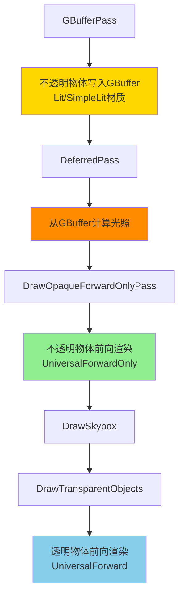
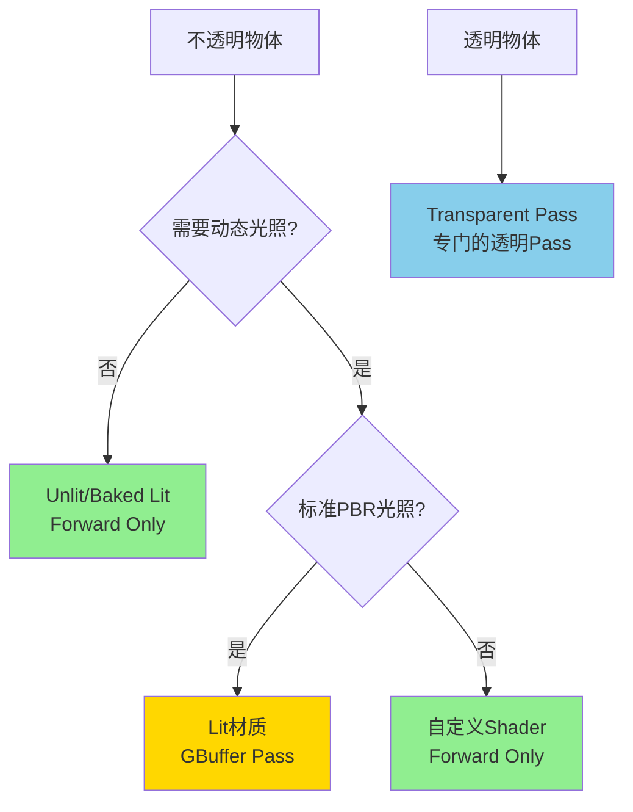

# URP延迟渲染中的Forward Only Pass详解

## 目录
1. [Forward Only Pass概述](#1-forward-only-pass概述)
2. [为什么需要Forward Only Pass](#2-为什么需要forward-only-pass)
3. [哪些材质使用Forward Only](#3-哪些材质使用forward-only)
4. [实现细节](#4-实现细节)
5. [性能影响](#5-性能影响)

---

## 1. Forward Only Pass概述

### 1.1 基本概念

**Forward Only Pass** (`DrawOpaqueForwardOnlyPass`) 是URP延迟渲染中的一个**不透明物体**渲染Pass，**不是**专门为透明物体设计的。

**关键误解澄清**：
```
❌ 错误理解：
    Deferred渲染中，只有透明物体使用Forward渲染
    
✓ 正确理解：
    Deferred渲染中，有两类不透明物体：
    1. 可以延迟渲染的物体 -> GBuffer Pass
    2. 必须前向渲染的物体 -> Forward Only Pass
    
    透明物体始终使用Forward Pass（无论Forward还是Deferred模式）
```

### 1.2 渲染流程中的位置



**关键时间点**：
- **GBuffer Pass**: 大部分不透明物体
- **Deferred Pass**: 光照计算
- **Forward Only Pass**: 特殊不透明物体（在光照计算**之后**）
- **Transparent Pass**: 透明物体（在**所有不透明物体**之后）

---

## 2. 为什么需要Forward Only Pass

### 2.1 延迟渲染的局限性

延迟渲染虽然高效，但有一些物理和技术限制：

#### 限制1：材质复杂度受限

**GBuffer存储限制**：
```
URP的GBuffer只有4个RT（+ depth）：
RT0: Albedo + Material Flags
RT1: Specular + Occlusion
RT2: Normal + Smoothness
RT3: Emission + GI

问题：
- 无法存储所有可能的材质数据
- 复杂材质（如毛发、皮肤、次表面散射）需要更多数据
- 自定义光照模型需要额外信息
```

#### 限制2：透明度/Alpha Test

**GBuffer无法处理透明**：
```
延迟渲染只能处理完全不透明的物体
- Alpha Blend（透明混合）：需要深度排序，无法写入GBuffer
- Alpha Test（Alpha剪切）：技术上可行，但引擎设计选择
```

#### 限制3：特殊材质效果

**某些效果不适合延迟**：
```
- Unlit材质：不需要光照，写入GBuffer浪费
- Baked Lit材质：只使用烘焙光照，不需要动态光
- 粒子系统：通常使用简化光照
- 自定义Shader：可能不兼容GBuffer布局
```

### 2.2 Forward Only的解决方案

```
Forward Only Pass提供了"逃生通道"：
- 允许特定材质绕过GBuffer
- 使用传统前向渲染
- 在延迟光照计算后绘制
- 受益于已计算的深度和光照
```

---

## 3. 哪些材质使用Forward Only

### 3.1 Shader Pass标记

URP通过**Shader Pass名称**区分渲染路径：

```hlsl
// 标准Lit材质 - 同时支持Forward和Deferred
Shader "Universal Render Pipeline/Lit"
{
    SubShader
    {
        // Forward渲染使用
        Pass
        {
            Name "UniversalForward"
            Tags { "LightMode" = "UniversalForward" }
            // ... forward rendering code
        }
        
        // Deferred渲染使用
        Pass
        {
            Name "UniversalGBuffer"
            Tags { "LightMode" = "UniversalGBuffer" }
            // ... write to GBuffer
        }
    }
}
```

```hlsl
// Unlit材质 - 只能Forward Only
Shader "Universal Render Pipeline/Unlit"
{
    SubShader
    {
        Pass
        {
            Name "UniversalForwardOnly"  // <-- 关键
            Tags { "LightMode" = "UniversalForwardOnly" }
            // ... no lighting
        }
        
        // 没有UniversalGBuffer Pass
    }
}
```

### 3.2 自动判断规则

URP在Setup阶段根据以下规则判断：

```csharp
// UniversalRenderer.cs Lines 270-289
if (this.renderingMode == RenderingMode.Deferred)
{
    // Forward-only pass只在Deferred模式下运行
    // 它允许特定材质在前向模式渲染
    
    // 收集的Shader Pass名称：
    ShaderTagId[] forwardOnlyShaderTagIds = new ShaderTagId[]
    {
        new ShaderTagId("UniversalForwardOnly"),  // 显式标记为Forward Only
        new ShaderTagId("SRPDefaultUnlit"),       // 旧版Unlit（向后兼容）
        new ShaderTagId("LightweightForward")     // 旧版LWRP（向后兼容）
    };
    
    // 创建Forward Only Pass
    m_RenderOpaqueForwardOnlyPass = new DrawObjectsPass(
        "Render Opaques Forward Only",
        forwardOnlyShaderTagIds,
        true, // opaque
        RenderPassEvent.BeforeRenderingOpaques, // 在不透明物体阶段
        RenderQueueRange.opaque,
        data.opaqueLayerMask,
        forwardOnlyStencilState,
        forwardOnlyStencilRef
    );
}
```

### 3.3 常见Forward Only材质

#### 3.3.1 Unlit材质

**特点**：不受光照影响
```
为什么Forward Only：
- 不需要光照计算
- 写入GBuffer浪费带宽和存储
- 直接输出Emission颜色即可

典型用途：
- UI元素（世界空间UI）
- 发光物体（霓虹灯、屏幕）
- 天空穹顶
- 粒子特效
```

#### 3.3.2 Baked Lit材质

**特点**：只使用烘焙光照
```
为什么Forward Only：
- 不需要实时动态光照
- GBuffer只为动态光服务
- 烘焙光照在Lightmap中

典型用途：
- 静态场景几何（墙壁、地面）
- 烘焙了所有光照的物体
- 性能优化场景
```

#### 3.3.3 SimpleLit材质（可选）

**特点**：简化光照模型
```
为什么可能Forward Only：
- 简化的BRDF，不需要完整GBuffer
- 可以选择性支持Forward Only Pass

注意：
SimpleLit通常同时有GBuffer和ForwardOnly Pass
具体取决于配置
```

#### 3.3.4 自定义Shader

**特点**：特殊需求
```
为什么Forward Only：
- 自定义光照模型（毛发、皮肤、布料）
- 需要的数据无法存入GBuffer
- 特殊效果（如Toon Shading）
- 透明度相关（Alpha Test物体可选）

示例：
- 头发Shader（各向异性高光）
- 皮肤Shader（次表面散射）
- 卡通Shader（自定义着色）
```

#### 3.3.5 旧版/遗留Shader

**特点**：兼容性
```
为什么Forward Only：
- 旧版Unity Shader没有GBuffer Pass
- SRPDefaultUnlit（旧标准Unlit）
- LightweightForward（LWRP遗留）

目的：
确保旧项目升级到URP后依然可用
```

### 3.4 判断示例

```csharp
// 材质是否会走Forward Only Pass？
bool IsForwardOnly(Material mat)
{
    // 检查Shader是否有对应Pass
    bool hasUniversalForwardOnly = mat.shader.FindPassIndex("UniversalForwardOnly") >= 0;
    bool hasSRPDefaultUnlit = mat.shader.FindPassIndex("SRPDefaultUnlit") >= 0;
    bool hasLightweightForward = mat.shader.FindPassIndex("LightweightForward") >= 0;
    
    // 没有GBuffer Pass，但有上述任一Pass
    bool hasGBuffer = mat.shader.FindPassIndex("UniversalGBuffer") >= 0;
    
    return (hasUniversalForwardOnly || hasSRPDefaultUnlit || hasLightweightForward) 
           && !hasGBuffer;
}
```

---

## 4. 实现细节

### 4.1 Stencil标记

Forward Only Pass使用Stencil Buffer标记像素类型：

```csharp
// UniversalRenderer.cs Lines 277-284
StencilState forwardOnlyStencilState = DeferredLights.OverwriteStencil(
    m_DefaultStencilState,
    (int)StencilUsage.MaterialMask
);

int forwardOnlyStencilRef = stencilData.stencilReference 
                            | (int)StencilUsage.MaterialUnlit;
```

**Stencil用途**：
```
GBuffer Pass标记：      StencilUsage.MaterialLit      (Bit 4 = 0)
Forward Only Pass标记： StencilUsage.MaterialUnlit    (Bit 4 = 1)

目的：
- 区分哪些像素来自GBuffer
- 哪些像素是Forward Only
- 后续Pass（如Fog）可以根据Stencil判断
```

### 4.2 深度测试

**关键设计**：Forward Only Pass在DeferredPass之后执行

```
好处：
1. 可以利用已有深度信息（Early Z）
2. 避免与GBuffer物体重复绘制
3. 正确的深度排序

实现：
ZTest LEqual  // 测试深度
ZWrite On     // 写入深度（覆盖GBuffer深度）
```

### 4.3 光照计算

Forward Only Pass如何计算光照？

```hlsl
// UniversalForwardOnly Pass中
// 使用Forward Lighting路径

// 1. 主光源（Directional Light）
float3 mainLightColor = _MainLightColor.rgb;
float3 mainLightDir = _MainLightPosition.xyz;
float3 mainLight = mainLightColor * saturate(dot(normal, mainLightDir));

// 2. 额外光源（Point/Spot Lights）
for (int i = 0; i < min(_AdditionalLightsCount.x, MAX_VISIBLE_LIGHTS); ++i)
{
    Light light = GetAdditionalLight(i, worldPos);
    mainLight += light.color * light.distanceAttenuation * saturate(dot(normal, light.direction));
}

// 3. 环境光和GI
float3 ambient = SampleSH(normal) * albedo;

// 4. 最终光照
float3 finalColor = albedo * mainLight + emission + ambient;
```

**区别于GBuffer路径**：
```
GBuffer路径：
1. GBuffer Pass: 写入材质数据
2. Deferred Pass: 读取GBuffer，计算所有光照

Forward Only路径：
1. 直接在Pixel Shader中计算所有光照
2. 类似传统Forward渲染
3. 每个物体都执行完整光照计算
```

### 4.4 执行时机优化

```csharp
// UniversalRenderer.cs Lines 1060-1062
// Forward Only Pass在DeferredPass之后
EnqueuePass(m_DeferredPass);         // 延迟光照
EnqueuePass(m_RenderOpaqueForwardOnlyPass); // Forward Only
```

**为什么这个顺序**：
```
优势1：共享深度
- DeferredPass已经设置了深度
- Forward Only可以Early Z剔除

优势2：受益于光照
- 如果Forward Only材质需要访问光照结果
- 可以采样LightingBuffer（虽然URP当前实现不这样做）

优势3：正确排序
- 确保Forward Only物体正确覆盖Deferred物体
- 视觉上正确的深度关系
```

---

## 5. 性能影响

### 5.1 Forward Only的开销

**相比GBuffer+Deferred**：
```
优势：
✓ 节省GBuffer写入带宽
✓ 不参与DeferredPass采样
✓ 简化Shader（如Unlit）

劣势：
✗ 每个物体都计算光照（无光照累积）
✗ 光源数量受限（与Forward模式相同）
✗ 额外的Draw Call
```

**性能对比**：
```
假设场景：100个Unlit物体

方案A（如果强制写入GBuffer）：
- GBuffer Pass: 写入100个物体数据（浪费）
- Deferred Pass: 计算100个物体光照（不需要）
- 总开销：高

方案B（Forward Only）：
- Forward Only Pass: 绘制100个物体，无光照计算
- 总开销：低

结论：Forward Only对Unlit材质是优化
```

### 5.2 混合场景的最佳实践

#### 场景1：大量静态+少量动态

```
设置：
- 静态几何：Baked Lit（Forward Only）
- 动态物体：Lit（GBuffer + Deferred）

结果：
- 静态物体快速渲染，无动态光计算
- 动态物体享受延迟渲染的光源数量优势
```

#### 场景2：复杂光照 + 特效

```
设置：
- 主场景：Lit材质（GBuffer + Deferred）
- 特效/UI：Unlit材质（Forward Only）

结果：
- 主场景高效处理大量光源
- 特效不浪费带宽
```

#### 场景3：多种光照模型

```
设置：
- 标准物体：Lit（GBuffer）
- 头发：Custom Hair Shader（Forward Only）
- 皮肤：Custom SSS Shader（Forward Only）

结果：
- 大部分物体延迟渲染
- 特殊材质保持灵活性
```

### 5.3 优化建议

#### 1. 合理选择材质类型

```
问自己：
- 这个物体需要动态光照吗？
  ✓ 需要 -> Lit (GBuffer)
  ✗ 不需要 -> Baked Lit (Forward Only)

- 这个物体需要复杂BRDF吗？
  ✓ 需要 -> Custom Shader (可能Forward Only)
  ✗ 不需要 -> SimpleLit (GBuffer)
```

#### 2. 避免过度使用Forward Only

```
❌ 错误做法：
    所有物体都用Forward Only
    -> 失去延迟渲染的优势
    -> 不如直接用Forward模式

✓ 正确做法：
    大部分物体用GBuffer
    少数特殊情况用Forward Only
```

#### 3. 性能Profiler检查

```
关注指标：
- Draw Calls数量（Forward Only增加Draw Call）
- GBuffer写入带宽
- Deferred Pass采样开销
- Forward Only Pass的光照计算

工具：
- Unity Profiler
- Frame Debugger（查看Pass执行顺序）
- RenderDoc（分析GPU时间）
```

---

## 6. 常见问题

### Q1: 为什么透明物体不在Forward Only Pass？

**答**：
```
透明物体有自己的专门Pass：DrawTransparentObjects

原因：
1. 透明物体需要深度排序
2. 需要访问_CameraOpaqueTexture（不透明纹理）
3. 必须在所有不透明物体之后渲染

执行顺序：
GBuffer -> Deferred -> ForwardOnly -> Skybox -> Transparent
```

### Q2: 能否让Lit材质也走Forward Only？

**答**：
```
不建议，但技术上可行：

方法1：修改Shader，只保留UniversalForwardOnly Pass
方法2：使用Shader变体控制

后果：
- 失去延迟渲染的光源数量优势
- 不如直接用Forward渲染模式
```

### Q3: Forward Only Pass是否支持阴影？

**答**：
```
是的，完全支持：

- 主光源阴影：通过_MainLightShadowmapTexture
- 额外光源阴影：通过_AdditionalLightsShadowmapTexture

实现：
与Forward Pass相同，在Pixel Shader中采样Shadow Map
```

### Q4: 能否在Forward Only Pass中访问GBuffer？

**答**：
```
技术上可以，但URP默认实现不这样做：

可能的用途：
- 读取Normal用于边缘检测
- 读取Depth用于深度感知效果

实现：
需要自定义Shader，手动采样GBuffer纹理
```

---

## 7. 总结

### Forward Only Pass的角色

```
Forward Only Pass不是"透明物体专用Pass"
而是"不适合延迟渲染的不透明物体"的渲染路径

核心理念：
延迟渲染是主要路径（大部分不透明物体）
Forward Only是补充路径（特殊不透明物体）
```

### 使用决策树



### 关键要点

1. **Forward Only ≠ 透明**：Forward Only是为**不透明物体**设计的
2. **选择性渲染**：只有特定材质（Unlit、Baked Lit、自定义）使用
3. **性能优化**：对不需要动态光的物体是优化，不是性能负担
4. **灵活性**：为复杂材质和特殊效果提供"逃生通道"

Forward Only Pass是URP延迟渲染灵活性和性能的关键设计。
