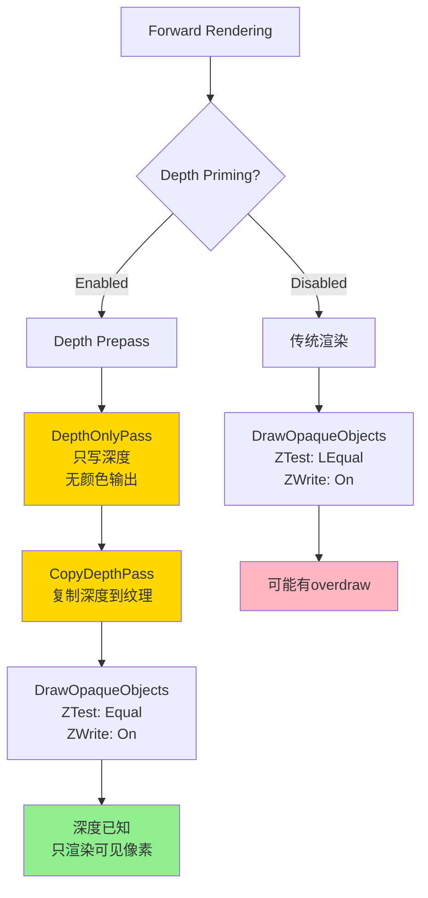
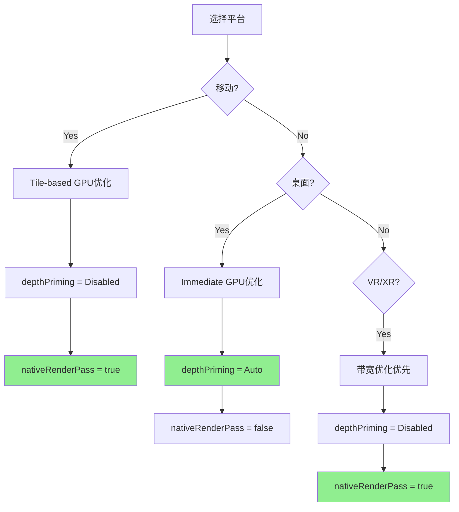

# URP性能优化：Depth Priming 和 Native RenderPass 详解

## 目录
1. [Depth Priming详解](#1-depth-priming详解)
2. [Native RenderPass详解](#2-native-renderpass详解)
3. [两者的关系](#3-两者的关系)
4. [实战优化建议](#4-实战优化建议)

---

## 1. Depth Priming详解

### 1.1 什么是Depth Priming

**Depth Priming** (深度预处理) 是一种**前向渲染**优化技术，通过提前写入深度缓冲来减少后续渲染的overdraw。

#### 基本概念

**传统Forward渲染问题**：
```
不透明物体渲染流程：
1. 绘制第一个物体
   - 执行复杂的Pixel Shader
   - 写入Color Buffer
   - 写入Depth Buffer

2. 绘制第二个物体
   - 深度测试（可能被遮挡）
   - 如果通过：执行Pixel Shader <- 浪费！
   - 如果失败：Early Z剔除

问题：
- 远处物体先绘制，复杂Shader执行完
- 近处物体后绘制，遮挡了远处
- 远处物体的Shader计算被浪费（overdraw）
```

**Depth Priming的解决方案**：
```
两遍渲染流程：
1. Depth Prepass (深度预渲染)
   - 只写深度，不计算光照
   - 使用简单的Vertex Shader
   - 快速填充Depth Buffer

2. Opaque Pass (不透明渲染)
   - 深度测试设为Equal（相等通过）
   - 只渲染可见的像素
   - 避免overdraw浪费

优势：
- 消除overdraw带来的Shader计算浪费
- 特别适合复杂光照的场景
```

### 1.2 Depth Priming的实现

#### 配置选项

```csharp
// UniversalRendererData设置
public enum DepthPrimingMode
{
    Disabled,  // 禁用
    Auto,      // 自动判断（推荐）
    Forced     // 强制启用
}
```

#### 启用条件

```csharp
// UniversalRenderer.cs Lines 415-428
bool IsDepthPrimingEnabled(ref CameraData cameraData)
{
    // 1. 硬件必须支持深度复制
    if (!CanCopyDepth(ref cameraData))
        return false;

    // 2. 判断是否请求了Depth Priming
    bool depthPrimingRequested = 
        (m_DepthPrimingRecommended && m_DepthPrimingMode == DepthPrimingMode.Auto)
        || m_DepthPrimingMode == DepthPrimingMode.Forced;

    // 3. 必须是Forward渲染模式
    bool isForwardRenderingMode = m_RenderingMode == RenderingMode.Forward;

    // 4. 必须是第一个写深度的相机
    bool isFirstCameraToWriteDepth = 
        cameraData.renderType == CameraRenderType.Base 
        || cameraData.clearDepth;

    // 5. 不是反射相机（避免UUM-12397的artifact）
    bool isNotReflectionCamera = cameraData.cameraType != CameraType.Reflection;

    return depthPrimingRequested 
           && isForwardRenderingMode 
           && isFirstCameraToWriteDepth 
           && isNotReflectionCamera 
           && !GL.wireframe;
}
```

#### 平台推荐

```csharp
// UniversalRenderer.cs Lines 231-235
#if UNITY_ANDROID || UNITY_IOS || UNITY_TVOS
    this.m_DepthPrimingRecommended = false;  // 移动平台不推荐
#else
    this.m_DepthPrimingRecommended = true;   // PC/Console推荐
#endif
```

**原因分析**：
```
移动平台（Tile-based GPU）：
- GPU使用On-chip Tile Memory
- Depth Prepass破坏了Tile内存优化
- 额外的Pass增加带宽消耗
- 总体性能可能下降

桌面平台（Immediate Mode GPU）：
- 传统的Framebuffer架构
- Overdraw是主要瓶颈
- Depth Priming显著减少浪费
- 总体性能提升
```

### 1.3 Depth Priming的渲染流程



#### 关键Pass

**1. DepthOnlyPass (深度预渲染)**
```csharp
// UniversalRenderer.cs Line 247
m_DepthPrepass = new DepthOnlyPass(
    RenderPassEvent.BeforeRenderingPrePasses,
    RenderQueueRange.opaque,
    data.opaqueLayerMask
);

// Shader: DepthOnly pass
Pass
{
    Name "DepthOnly"
    ZWrite On
    ColorMask 0  // 不写颜色
    
    HLSLPROGRAM
    #pragma vertex DepthOnlyVertex
    #pragma fragment DepthOnlyFragment
    
    float4 DepthOnlyVertex(Attributes input) : SV_POSITION
    {
        return TransformObjectToHClip(input.positionOS);
    }
    
    half4 DepthOnlyFragment() : SV_TARGET
    {
        return 0; // 不输出颜色
    }
    ENDHLSL
}
```

**2. CopyDepthPass (深度复制)**
```csharp
// UniversalRenderer.cs Lines 738-743
if (useDepthPriming)
{
    m_PrimedDepthCopyPass.Setup(
        m_ActiveCameraDepthAttachment,
        m_DepthTexture
    );
    m_PrimedDepthCopyPass.AllocateRT = false;
    EnqueuePass(m_PrimedDepthCopyPass);
}
```

**为什么需要Copy**：
```
问题：
- DepthPrepass写入到MSAA深度缓冲
- 但Shader需要采样可读的深度纹理
- MSAA深度缓冲无法直接采样

解决：
- 复制MSAA深度到可采样纹理
- 生成_CameraDepthTexture
- 后续Pass（如SSAO）可以读取
```

**3. Opaque Pass (不透明渲染)**
```hlsl
// 主渲染Pass设置
Pass
{
    Name "UniversalForward"
    ZTest Equal  // 只渲染深度相等的像素
    ZWrite On    // 仍然写深度（防止精度问题）
    
    // 只有深度测试通过的像素才执行光照计算
    // 消除了overdraw
}
```

### 1.4 性能影响分析

#### 优势

**场景A：复杂光照 + 高overdraw**
```
配置：
- 10个Realtime光源
- 复杂PBR材质
- 场景深度复杂度：平均3层overdraw

无Depth Priming：
- Overdraw: 3x
- 每像素光照计算：10个光源
- 浪费：2x的光照计算

有Depth Priming：
- Depth Prepass: 轻量级顶点变换
- Opaque Pass: 1x光照计算（无overdraw）
- 性能提升：~40%（减少了2x的复杂计算）
```

#### 劣势

**场景B：简单光照 + 低overdraw**
```
配置：
- 1个Directional光源
- 简单材质
- 场景深度复杂度：平均1.2层overdraw

无Depth Priming：
- Overdraw: 1.2x
- 浪费：0.2x简单计算

有Depth Priming：
- Depth Prepass: 额外Pass开销
- Copy Depth Pass: 额外带宽
- 性能影响：~-5%（额外Pass超过overdraw节省）
```

#### 决策建议

```
启用Depth Priming（推荐）：
✓ PC/Console平台
✓ 复杂光照（多个光源）
✓ 复杂材质（PBR、次表面散射）
✓ 场景overdraw > 2x

禁用Depth Priming：
✗ 移动平台（Tile-based GPU）
✗ 简单光照（单光源）
✗ 简单材质
✗ 场景overdraw < 1.5x
```

### 1.5 与Depth Prepass的区别

```
Depth Prepass：
- 目的：生成可采样的深度纹理
- 原因：某些功能需要读取深度（SSAO、软粒子）
- 结果：创建_CameraDepthTexture
- 副作用：可以减少overdraw（如果启用）

Depth Priming：
- 目的：减少overdraw，优化性能
- 原因：复杂光照浪费严重
- 结果：减少Pixel Shader执行次数
- 需要：Depth Prepass + Copy Depth Pass

关系：
- Depth Priming包含Depth Prepass
- 但Depth Prepass不一定用于Priming
- Priming强调性能优化目的
```

---

## 2. Native RenderPass详解

### 2.1 什么是Native RenderPass

**Native RenderPass** (原生渲染通道) 是一种利用**Tile-based GPU**架构特性的优化技术，主要用于移动平台。

#### Tile-based GPU架构

**传统Immediate Mode GPU** (桌面)：
```
渲染流程：
1. Draw Call 1 -> Framebuffer (VRAM)
2. Draw Call 2 -> Read Framebuffer -> Modify -> Write Back
3. Draw Call 3 -> Read Framebuffer -> Modify -> Write Back

问题：
- 每次访问Framebuffer都需要访问VRAM
- 高带宽消耗
- 功耗高
```

**Tile-based GPU** (移动)：
```
渲染流程：
1. 将屏幕划分为小Tile（如16x16或32x32像素）
2. 对每个Tile：
   a. Load Tile到On-chip Memory（快速）
   b. 执行所有Draw Call（在芯片上）
   c. Resolve/Store Tile到VRAM（如果需要）

优势：
- On-chip Memory极快（数百倍于VRAM）
- 减少带宽消耗
- 降低功耗
- 完美适合移动设备
```

#### Native RenderPass API

**传统渲染方式**：
```csharp
// 传统方式：每个Pass独立
cmd.SetRenderTarget(RT1);
cmd.DrawRenderer(...);

cmd.SetRenderTarget(RT2);  // Load RT1 from VRAM
cmd.Blit(RT1, RT2);        // Store RT2 to VRAM

cmd.SetRenderTarget(RT3);  // Load RT2 from VRAM
cmd.Blit(RT2, RT3);
```

**Native RenderPass方式**：
```csharp
// 现代方式：声明整个RenderPass
cmd.BeginRenderPass(
    colorAttachments: [RT1, RT2, RT3],
    depthAttachment: Depth,
    subpasses: [
        Subpass0: Write RT1
        Subpass1: Read RT1, Write RT2
        Subpass2: Read RT2, Write RT3
    ]
);

// GPU知道整个流程，优化数据流
// 中间RT可以保留在On-chip Memory
// 避免Load/Store VRAM
```

### 2.2 URP中的Native RenderPass

#### 启用条件

```csharp
// UniversalRendererData设置
public bool useNativeRenderPass = true; // 启用

// UniversalRenderer.cs Lines 228-229
useRenderPassEnabled = data.useNativeRenderPass 
                       && SystemInfo.graphicsDeviceType != GraphicsDeviceType.OpenGLES2
                       && !SystemInfo.graphicsDeviceName.Contains("Apple M");
```

**平台限制**：
```
支持：
✓ Vulkan（移动和桌面）
✓ Metal（iOS，但Unity 2021.3不支持Apple Silicon）
✓ D3D12（桌面）

不支持：
✗ OpenGL ES 2.0
✗ OpenGL Core（桌面）
✗ Apple Silicon（2021.3版本的已知问题）
```

#### URP的应用场景

**场景1：Deferred Rendering**
```
传统Deferred（无Native RenderPass）：
1. GBuffer Pass:
   - Store RT0 (Albedo)
   - Store RT1 (Specular)
   - Store RT2 (Normal)
   - Store RT3 (Emission)
   - Store Depth

2. Deferred Pass:
   - Load RT0, RT1, RT2, RT3, Depth
   - 计算光照
   - Store Light Buffer

3. Forward Only Pass:
   - Load Light Buffer, Depth
   - 混合Forward物体
   - Store Final Color

带宽消耗：巨大（多次Load/Store GBuffer）
```

**优化Deferred（Native RenderPass）**：
```
使用Framebuffer Fetch / Subpass Input：
1. GBuffer Pass:
   - Write RT0-3, Depth

2. Deferred Pass (Subpass):
   - Input Attachments: RT0-3（从On-chip读取）
   - 计算光照，直接写Light Buffer
   - 不需要Load/Store GBuffer到VRAM

3. Forward Only Pass (Subpass):
   - Input: Light Buffer, Depth
   - 输出Final Color

带宽消耗：显著降低（GBuffer保留在On-chip）
```

### 2.3 实现细节

#### Deferred Rendering优化

```csharp
// DeferredLights.cs Lines 761-767
if (useRenderPassEnabled && m_DeferredLights.UseRenderPass)
{
    m_DeferredLights.DisableFramebufferFetchInput();
}

// DeferredLights.cs Lines 821-832
if (this.DeferredInputAttachments == null && this.UseRenderPass)
{
    // 配置Input Attachments（Framebuffer Fetch）
    this.DeferredInputAttachments = new RenderTargetIdentifier[4]
    {
        this.GbufferAttachmentIdentifiers[0], // Albedo
        this.GbufferAttachmentIdentifiers[1], // Specular
        this.GbufferAttachmentIdentifiers[2], // Normal
        this.GbufferAttachmentIdentifiers[4]  // Depth Copy
    };
}
```

#### Shader中的使用

```hlsl
// DeferredLighting.shader
#if defined(UNITY_USE_NATIVE_HDR) && defined(USE_FRAMEBUFFER_FETCH)
    // Framebuffer Fetch模式（Native RenderPass）
    FRAMEBUFFER_INPUT_FLOAT(0) half4 gbuffer0;  // Albedo
    FRAMEBUFFER_INPUT_FLOAT(1) half4 gbuffer1;  // Specular
    FRAMEBUFFER_INPUT_FLOAT(2) half4 gbuffer2;  // Normal
    FRAMEBUFFER_INPUT_FLOAT(3) float depth;     // Depth
    
    half4 FragDeferred(Varyings input) : SV_Target
    {
        // 直接从Input Attachment读取（On-chip Memory）
        GBufferData gbuffer;
        gbuffer.albedo = LOAD_FRAMEBUFFER_INPUT(0, input);
        gbuffer.specular = LOAD_FRAMEBUFFER_INPUT(1, input);
        gbuffer.normal = LOAD_FRAMEBUFFER_INPUT(2, input);
        float depthValue = LOAD_FRAMEBUFFER_INPUT(3, input);
        
        // 计算光照...
        return lighting;
    }
#else
    // 传统采样模式（无Native RenderPass）
    TEXTURE2D(_GBuffer0);
    TEXTURE2D(_GBuffer1);
    TEXTURE2D(_GBuffer2);
    TEXTURE2D_X_FLOAT(_CameraDepthTexture);
    
    half4 FragDeferred(Varyings input) : SV_Target
    {
        // 从纹理采样（可能需要Load from VRAM）
        GBufferData gbuffer;
        gbuffer.albedo = SAMPLE_TEXTURE2D(_GBuffer0, sampler_point, uv);
        gbuffer.specular = SAMPLE_TEXTURE2D(_GBuffer1, sampler_point, uv);
        gbuffer.normal = SAMPLE_TEXTURE2D(_GBuffer2, sampler_point, uv);
        float depthValue = SAMPLE_DEPTH_TEXTURE(_CameraDepthTexture, uv);
        
        // 计算光照...
        return lighting;
    }
#endif
```

### 2.4 性能影响

#### 移动平台（Tile-based GPU）

**测试场景：1920x1080, Deferred渲染**

```
传统方式（无Native RenderPass）：
- GBuffer Pass: 4 RTs + Depth = 5个Store操作
- Deferred Pass: 5个Load + 1个Store = 6个内存操作
- Forward Only: 2个Load + 1个Store = 3个内存操作
- 总带宽：5 + 6 + 3 = 14个Framebuffer操作

Native RenderPass方式：
- Declare RenderPass: 整个流程在Tile内
- 只有最终Color Buffer需要Store
- GBuffer和Depth保留在On-chip
- 总带宽：1个Store操作

带宽节省：~93% (14 -> 1)
性能提升：20-40% (根据GPU型号)
功耗降低：15-30%
```

#### 桌面平台（Immediate Mode GPU）

```
传统方式 vs Native RenderPass：
- 差异不大（架构不同）
- 可能有轻微提升（驱动优化）
- 主要受益是移动平台
```

### 2.5 限制和注意事项

#### 限制1：Transient Attachments

```csharp
// DeferredLights.cs Lines 828-831
this.DeferredInputIsTransient = new bool[4]
{
    true,  // GBuffer0: Transient（不需要Store）
    true,  // GBuffer1: Transient
    true,  // GBuffer2: Transient
    false  // Depth: 需要后续Pass使用，必须Store
};
```

**Transient含义**：
```
- 标记为Transient的RT只存在于RenderPass内
- 不会Store到VRAM
- 极大节省带宽
- 但后续Pass无法访问

使用场景：
- GBuffer只用于DeferredPass，之后不需要
- 临时中间结果
- 不需要保留的数据
```

#### 限制2：RenderPass中断

```csharp
// UniversalRenderer.cs Lines 761-762
if (m_DeferredLights.UseRenderPass && 
    (RenderPassEvent.AfterRenderingGbuffer == renderPassInputs.requiresDepthNormalAtEvent))
{
    m_DeferredLights.DisableFramebufferFetchInput();
}
```

**原因**：
```
如果在GBuffer和Deferred之间有自定义Pass：
- 需要结束当前RenderPass
- 执行自定义Pass
- 重新开始RenderPass
- 破坏了On-chip优化

解决：
- 禁用Native RenderPass
- 回退到传统方式
```

#### 限制3：MSAA支持

```
Native RenderPass + MSAA：
- 支持，但复杂度增加
- MSAA Resolve可以在RenderPass内
- 需要硬件支持
- 移动设备常见

Deferred + MSAA：
- URP Deferred不支持MSAA
- 因此这个组合不存在
```

---

## 3. 两者的关系

### 3.1 Depth Priming vs Native RenderPass

| 特性 | Depth Priming | Native RenderPass |
|------|---------------|-------------------|
| **目标平台** | 桌面（Immediate GPU） | 移动（Tile-based GPU） |
| **优化目标** | 减少overdraw | 减少内存带宽 |
| **渲染模式** | Forward Only | Forward + Deferred |
| **额外Pass** | 需要Depth Prepass | 不需要额外Pass |
| **性能提升** | 20-40%（复杂场景） | 20-40%（移动平台） |
| **副作用** | 增加Pass开销 | 可能增加GPU等待 |

### 3.2 能否同时使用

```csharp
// 理论上冲突

Depth Priming：
- 需要Depth Prepass（额外Pass）
- 在Tile-based GPU上破坏On-chip优化
- 移动平台不推荐

Native RenderPass：
- 避免额外Pass
- 优化Tile内存流
- 桌面平台收益小

实际配置：
- 桌面：Depth Priming + 禁用Native RenderPass
- 移动：禁用Depth Priming + 启用Native RenderPass
```

### 3.3 配置建议

```csharp
// UniversalRendererData配置

// 移动平台（最佳）
depthPrimingMode = DepthPrimingMode.Disabled;
useNativeRenderPass = true;

// 桌面平台（最佳）
depthPrimingMode = DepthPrimingMode.Auto;
useNativeRenderPass = false; // 或true（影响小）

// VR/XR（特殊）
depthPrimingMode = DepthPrimingMode.Disabled;
useNativeRenderPass = true;  // 降低带宽至关重要
```

---

## 4. 实战优化建议

### 4.1 桌面平台优化

#### 场景类型1：大型开放世界

```
特点：
- 高度复杂场景
- 大量光源
- 高overdraw（平均3-5x）

推荐配置：
renderingMode = Forward
depthPrimingMode = Auto
useNativeRenderPass = false
```

#### 场景类型2：室内场景

```
特点：
- 中等复杂度
- 少量光源
- 低overdraw（平均1.5-2x）

推荐配置：
renderingMode = Forward
depthPrimingMode = Disabled  // overdraw不严重
useNativeRenderPass = false
```

#### 场景类型3：大量光源

```
特点：
- 10+个实时光源
- 复杂PBR材质

推荐配置：
renderingMode = Deferred
depthPrimingMode = Disabled  // Deferred不需要
useNativeRenderPass = false  // 桌面收益小
```

### 4.2 移动平台优化

#### 配置1：高端移动设备

```
特点：
- Mali G78, Adreno 650+
- 支持Vulkan

推荐配置：
renderingMode = Forward
depthPrimingMode = Disabled  // Tile-based不需要
useNativeRenderPass = true   // 关键优化
msaaSampleCount = 4          // 硬件支持良好
```

#### 配置2：中端移动设备

```
特点：
- Mali G52, Adreno 600系列
- 支持Vulkan

推荐配置：
renderingMode = Forward
depthPrimingMode = Disabled
useNativeRenderPass = true
msaaSampleCount = 2          // 平衡性能
```

#### 配置3：低端移动设备

```
特点：
- 旧GPU，OpenGL ES 3.0

推荐配置：
renderingMode = Forward
depthPrimingMode = Disabled
useNativeRenderPass = false  // 硬件不支持
msaaSampleCount = 1          // 禁用MSAA
```

### 4.3 VR/XR优化

```
特点：
- 双眼渲染（2x像素）
- 高分辨率需求
- 带宽是关键瓶颈

推荐配置：
renderingMode = Forward
depthPrimingMode = Disabled
useNativeRenderPass = true   // 至关重要
foveatedRenderingMode = Enabled  // 眼动追踪设备
```

### 4.4 性能Profiling

#### 检查Depth Priming效果

```
工具：Unity Profiler + Frame Debugger

观察指标：
1. GPU Time
   - 比较Depth Prepass vs Opaque Pass时间
   - 如果Opaque Pass时间显著减少 -> 有效

2. Overdraw
   - Scene View -> Overdraw模式
   - 查看overdraw热力图
   - Overdraw > 2x -> 考虑Depth Priming

3. SetPass Calls
   - Depth Prepass会增加1个SetPass
   - 确保总体性能提升
```

#### 检查Native RenderPass效果

```
工具：Android GPU Inspector / Xcode Metal Debugger

观察指标：
1. Memory Bandwidth
   - 比较Load/Store操作数量
   - Native RenderPass应显著减少

2. On-chip Memory使用
   - 查看Tile Memory使用率
   - 理想状态：GBuffer保留在Tile

3. Power Consumption
   - Native RenderPass应降低功耗
   - 测试设备温度和电池消耗
```

### 4.5 常见问题

#### Q1: Depth Priming在移动平台性能反而下降？

**答**：
```
原因：
- Tile-based GPU优化被破坏
- Depth Prepass强制Tile Flush
- 额外的Load/Store操作

解决：
- 移动平台禁用Depth Priming
- 使用Native RenderPass代替
```

#### Q2: Native RenderPass导致黑屏/渲染错误？

**答**：
```
可能原因：
1. 硬件不支持
   - 检查SystemInfo.supportsRenderPass
   - 某些旧设备/驱动有bug

2. 中断RenderPass
   - 检查是否有自定义Pass在GBuffer和Deferred之间
   - URP会自动禁用，但可能不完全

3. Apple Silicon已知问题
   - Unity 2021.3不支持M1/M2
   - 升级Unity版本或禁用

解决：
- 尝试禁用useNativeRenderPass
- 更新GPU驱动
- 检查自定义RendererFeature
```

#### Q3: 如何选择Depth Priming模式？

**答**：
```
Disabled：
✓ 移动平台
✓ 简单场景（低overdraw）
✓ VR/XR（带宽优先）

Auto：
✓ 桌面平台（推荐）
✓ 让URP根据场景复杂度自动决定

Forced：
✓ 调试目的
✓ 确认场景从Depth Priming受益
✗ 不推荐生产环境（灵活性差）
```

---

## 5. 总结

### Depth Priming要点

**核心价值**：
- 减少Forward渲染的overdraw浪费
- 适合复杂光照 + 高overdraw场景
- 桌面平台显著提升

**使用建议**：
```
启用（Auto）：
- PC/Console
- 复杂PBR材质
- 多光源场景
- Overdraw > 2x

禁用：
- 移动平台（Tile-based GPU）
- 简单材质
- 少光源
- VR（带宽优先）
```

### Native RenderPass要点

**核心价值**：
- 利用Tile-based GPU的On-chip Memory
- 减少内存带宽消耗
- 移动平台显著提升

**使用建议**：
```
启用：
- 移动平台（Vulkan/Metal）
- Deferred渲染
- VR/XR（带宽瓶颈）
- 支持的桌面平台（Vulkan/D3D12）

禁用：
- 旧设备（OpenGL ES 2.0）
- 有自定义Pass中断RenderPass
- 已知兼容性问题
```

### 配置决策树



两种技术都是URP性能优化的关键，但针对不同平台和场景。理解它们的原理和适用场景，可以显著提升渲染性能。
