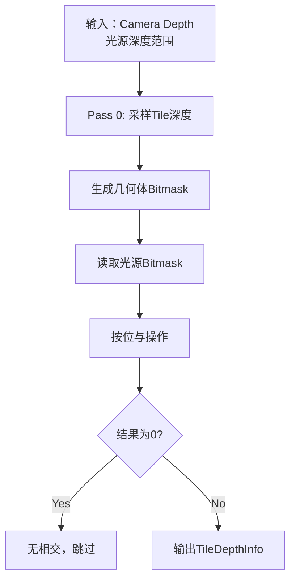

# URP架构分析对话记录

## 对话总结

本文档记录了关于Unity Universal Render Pipeline (URP) 架构的深度技术讨论，涵盖了Copy Pass决策、Tiled Deferred Lighting、Forward Only Pass等核心主题。

---

## 问题 1: Copy Depth 和 Copy Color 的选择分支

### 原始问题

```
在Forward渲染路径流程图中：
F [DrawSkybox] --> G{Copy Depth?}
    G -->|Yes| H[CopyDepthPass]
    G -->|No| I
    H --> I{Copy Color?}

Copy Depth 和 Copy Color 的选择分支条件是什么？
```

### 解答

#### Copy Depth Pass 决策逻辑

**执行条件**：
```csharp
requiresDepthCopyPass = !requiresDepthPrepass 
                        AND (requiresDepthTexture OR cameraHasPostProcessingWithDepth)
                        AND createDepthTexture
```

**触发场景**：
1. **相机启用深度纹理**：`Camera.depthTextureMode = DepthTextureMode.Depth`
2. **后处理需要深度**：Depth of Field、Motion Blur
3. **自定义Pass需要**：声明 `ConfigureInput(ScriptableRenderPassInput.Depth)`
4. **Depth Priming启用**：优化技术，减少overdraw

**不执行的情况**：
- 已有DepthPrepass（深度已在预渲染中生成）
- 硬件不支持深度复制（GLES3 + MSAA）
- 调试模式禁用

**执行时机**（动态）：
```csharp
// 默认：不透明物体渲染后
RenderPassEvent.AfterRenderingOpaques

// 如果自定义Pass提前需要：
RenderPassEvent = Min(AfterRenderingTransparents, RequiredEvent - 1)

// 仅后处理需要：透明物体渲染后
RenderPassEvent.AfterRenderingTransparents
```

#### Copy Color Pass 决策逻辑

**执行条件**：
```csharp
copyColorPass = cameraData.requiresOpaqueTexture 
                OR renderPassInputs.requiresColorTexture
```

**触发场景**：
1. **相机启用不透明纹理**：`UniversalAdditionalCameraData.requiresOpaqueTexture = true`
2. **自定义Pass需要**：声明 `ConfigureInput(ScriptableRenderPassInput.Color)`

**典型用途**：
- 透明物体折射/扭曲效果（需要采样已渲染的不透明内容）
- Grab Pass替代（类似Built-in管线的GrabPass）
- 屏幕空间Decals

**执行时机**（固定）：
```csharp
RenderPassEvent.AfterRenderingSkybox  // 天空盒后，透明物体前
```

**输出纹理**：
```hlsl
sampler2D _CameraOpaqueTexture; // 全局可用
```

### 关键区别

| 特性 | Copy Depth | Copy Color |
|------|-----------|-----------|
| **替代方案** | DepthPrepass | 无（必须复制） |
| **执行时机** | 动态调整 | 固定（天空盒后） |
| **性能开销** | 中等（单通道） | 高（多通道RGB/A） |
| **降采样优化** | 不支持 | 支持（2x/4x降采样） |

### 相关文档
- [`plans/URP_Copy_Pass_Decision_Logic.md`](URP_Copy_Pass_Decision_Logic.md) - 详细决策逻辑和实现

---

## 问题 2: Tiled Lighting 和 TileDepthRangePass

### 原始问题

```
Deferred渲染中的流程：
D --> E{Tiled Lighting?}
E -->|Yes| F1[TileDepthRangePass]
E -->|No| G[Deferred Lighting]

解释下TileDepthRangePass的流程和Tiled Lighting机制。
```

### 解答

#### Tiled Lighting 概念

**核心思想**：
```
将屏幕划分为小的Tile（16x16像素）
每个Tile只计算影响它的光源
批量处理Tile，减少Draw Call
```

**分层结构**：
```
Level 2 (粗糙): 256x256像素 -> 快速剔除
Level 1 (中等): 64x64像素 -> 逐步细化
Level 0 (最细): 16x16像素 -> 最终Tile
```

#### TileDepthRangePass 作用

**目的**：为每个Tile生成深度Bitmask

```
将near到far划分为32个深度切片
对Tile的每个像素：
    读取深度 -> 确定切片索引 -> 设置对应Bit位
输出：32位Bitmask表示Tile覆盖的深度切片
```

**执行流程**：


**两遍优化**（Switch/iOS）：
```
Pass 0: 生成中间4x4分辨率 -> 提升GPU利用率
Pass 1: 降采样到最终16x16 Tile分辨率
```

#### Tiled vs Stencil Deferred

| 策略 | 适用光源 | 优势 | 劣势 |
|------|---------|------|------|
| **Tiled Deferred** | 无阴影Point/Spot | 批量绘制，2个Draw Call | 不支持阴影 |
| **Stencil Deferred** | 所有光源（含阴影） | 支持阴影和Cookie | 每光源2个Draw Call |

**URP混合策略**：
```
无阴影光源 -> Tiled Deferred（批量处理）
有阴影/Directional -> Stencil Deferred（逐光源绘制）
```

#### 性能提升示例

**100个无阴影路灯场景**：
```
传统Stencil Deferred:
- 100个光源 × 2 = 200 Draw Calls

Tiled Deferred:
- TileDepthRangePass: 1 Draw Call
- Tiled Lighting: 2 Draw Calls (Lit + SimpleLit)
- 总计：3 Draw Calls

性能提升：98% Draw Call减少
```

### 相关文档
- [`plans/URP_Tiled_Deferred_Lighting.md`](URP_Tiled_Deferred_Lighting.md) - Tiled Lighting完整解析

---

## 问题 3: TileDepthRange 核心算法详解

### 原始问题

```
将near-far划分为32个深度切片
对Tile的每个像素：
    读取深度 -> 确定切片索引 -> 设置对应Bit
输出：Bitmask表示Tile覆盖的深度范围
用途：快速判断光源是否与Tile几何体相交

详细讲解下关键算法。
```

### 解答

#### 深度切片划分

**数学公式**：
```hlsl
float depthVS = LinearEyeDepth(depthNDC); // View Space深度
float normalizedDepth = (depthVS - nearClip) / (farClip - nearClip); // [0,1]
int sliceIndex = clamp(int(normalizedDepth * 32.0), 0, 31); // [0,31]
uint depthBit = 1u << sliceIndex; // 转换为Bitmask
```

**示例**：
```
相机：near=0.3m, far=100m
切片大小：99.7/32 ≈ 3.12m

深度15m -> slice 5 -> Bit 5
深度50m -> slice 15 -> Bit 15
```

#### CPU端：光源深度Bitmask

```
对每个光源：
1. 计算影响范围
   minDepth = |posVS| - radius
   maxDepth = |posVS| + radius

2. 映射到切片
   sliceMin = (minDepth - near) / (far - near) * 32
   sliceMax = (maxDepth - near) / (far - near) * 32

3. 生成Bitmask
   for i in sliceMin..sliceMax:
       lightMask |= (1u << i)

例：光源深度10-30m，对应切片3-9
lightMask = 0b00000000_00000000_00000011_11111000
```

#### GPU端：几何体深度Bitmask

```hlsl
uint ComputeTileDepthBitmask(uint2 tileID)
{
    uint geometryMask = 0;
    
    // 遍历Tile内所有像素（16x16=256）
    for (uint y = 0; y < 16; y++)
    {
        for (uint x = 0; x < 16; x++)
        {
            float depth = SampleDepth(tileID * 16 + uint2(x, y));
            float depthVS = ConvertToViewSpace(depth);
            int slice = ComputeSliceIndex(depthVS);
            
            geometryMask |= (1u << slice); // 累积OR
        }
    }
    
    return geometryMask;
}

// 例：Tile覆盖切片5,6,7,9
geometryMask = 0b00000000_00000000_00000010_11100000
```

#### 相交判断核心

**按位与操作**：
```
finalMask = geometryMask & lightMask

例：
geometryMask = 0b00000010_11100000 (切片5,6,7,9)
lightMask    = 0b00000111_11100000 (切片5-10)
finalMask    = 0b00000010_11100000 (相交：切片5,6,7,9)

if (finalMask == 0):
    不相交，跳过该Tile的光照计算
else:
    相交，需要计算光照
```

**像素级精确剔除**：
```hlsl
// 在DeferredPass中
int pixelSlice = ComputeSliceIndex(pixelDepth);
uint pixelBit = 1u << pixelSlice;

if ((pixelBit & tileDepthMask) == 0)
    return 0; // Early out，该像素不受任何光源影响
```

#### 实战计算示例

```
Tile几何体：深度15-30m，切片5-9
geometryMask = 0b00000010_11111000

光源1：深度17-33m，切片5-10
lightMask1 = 0b00000111_11100000
finalMask1 = 0b00000010_11100000 ✓需要计算（相交）

光源2：深度50-70m，切片16-22
lightMask2 = 0b01111111_00000000_00000000
finalMask2 = 0b00000000 ✗跳过（不相交）

性能提升：避免了光源2的256个像素光照计算
```

#### 优化技巧

1. **两遍Pass降采样**（提升GPU利用率）
2. **Bit Range压缩**（只存储min/max切片索引）
3. **并行化**（CPU Job System + GPU Wave Intrinsics）
4. **Early Z Rejection**（整个Tile最大深度 < 光源最小深度）

### 相关文档
- [`plans/URP_TileDepthRange_Algorithm_Detail.md`](URP_TileDepthRange_Algorithm_Detail.md) - 算法详细实现

---

## 问题 4: Deferred渲染中的Forward Only Pass

### 原始问题

```
Deferred渲染路径流程中有Forward Only Pass
不是只有透明物体在延迟渲染中采用forward only pass吗？
```

### 解答

#### 核心误解澄清

**错误理解**：
```
❌ Forward Only Pass = 透明物体专用Pass
```

**正确理解**：
```
✓ Forward Only Pass = 特殊不透明物体的渲染Pass
✓ 透明物体有专门的Transparent Pass

Deferred渲染中的物体分类：
1. 标准不透明物体 -> GBuffer Pass
2. 特殊不透明物体 -> Forward Only Pass  <--关键
3. 透明物体 -> Transparent Pass（完全不同的Pass）
```

#### 哪些不透明物体使用Forward Only

**1. Unlit材质**：
```
特点：不受光照影响
为什么Forward Only：
- 不需要光照计算
- 写入GBuffer浪费带宽
- 直接输出Emission即可

用途：霓虹灯、屏幕、世界空间UI、粒子
Shader Pass: UniversalForwardOnly
```

**2. Baked Lit材质**：
```
特点：只使用烘焙光照
为什么Forward Only：
- 不需要实时动态光
- GBuffer只为动态光服务

用途：静态场景、墙壁、地面
Shader Pass: UniversalForwardOnly
```

**3. 自定义复杂材质**：
```
特点：需要的数据无法存入标准GBuffer
为什么Forward Only：
- 自定义光照模型（毛发、皮肤）
- 需要额外数据（各向异性、SSS）

用途：头发Shader、皮肤Shader、卡通着色
Shader Pass: UniversalForwardOnly
```

**4. 旧版Shader（兼容性）**：
```
特点：没有UniversalGBuffer Pass
为什么Forward Only：
- 向后兼容旧项目

Shader Pass: SRPDefaultUnlit, LightweightForward
```

#### 渲染顺序

```
1. GBufferPass          -> 标准不透明物体（Lit材质）
2. DeferredPass         -> 延迟光照计算
3. Forward Only Pass    -> 特殊不透明物体（Unlit/Baked Lit）
4. DrawSkybox          -> 天空盒
5. Transparent Pass    -> 透明物体（需要深度排序）
```

**关键位置**：Forward Only在DeferredPass**之后**，Transparent**之前**

#### 与透明物体的区别

| 特性 | Forward Only Pass | Transparent Pass |
|------|-------------------|------------------|
| **物体类型** | **不透明** | 透明 |
| **深度写入** | ✓ 写入 | ✗ 不写入 |
| **渲染时机** | Deferred后 | 所有不透明物体后 |
| **深度排序** | ✗ 不需要 | ✓ 必须 |
| **访问纹理** | 不需要 | _CameraOpaqueTexture |

#### Shader Pass判断规则

```csharp
// UniversalRenderer.cs
ShaderTagId[] forwardOnlyShaderTagIds = new ShaderTagId[]
{
    new ShaderTagId("UniversalForwardOnly"),  // 显式标记
    new ShaderTagId("SRPDefaultUnlit"),       // 旧版Unlit
    new ShaderTagId("LightweightForward")     // LWRP兼容
};

// 如果Shader有上述Pass之一，且没有UniversalGBuffer Pass
// -> 走Forward Only Pass
```

#### 性能影响

**何时是优化**：
```
✓ Unlit材质：节省GBuffer写入和光照计算
✓ Baked Lit：避免不必要的动态光照
✓ 少量特殊材质：灵活性 > 性能开销

✗ 大量物体用Forward Only -> 失去Deferred优势
```

**最佳实践**：
```
场景组成：
- 主要物体：Lit材质（GBuffer + Deferred）
- 静态几何：Baked Lit（Forward Only）
- UI/特效：Unlit（Forward Only）
- 透明物体：Transparent（专门Pass）
```

### 相关文档
- [`plans/URP_Deferred_ForwardOnly_Pass_Explanation.md`](URP_Deferred_ForwardOnly_Pass_Explanation.md) - Forward Only Pass详解

---

## 技术总结

### URP渲染管线设计哲学

1. **灵活性 + 性能**
   - 主路径优化（GBuffer + Deferred）
   - 特殊情况有"逃生通道"（Forward Only）
   - 每种材质类型选择最优渲染路径

2. **模块化架构**
   - ScriptableRenderPass系统
   - 基于事件的Pass调度
   - 可扩展的RendererFeature机制

3. **批量处理优化**
   - Tiled Deferred Lighting（批量处理光源）
   - SRP Batcher（减少SetPass Call）
   - Instanced Drawing（批量绘制）

4. **智能决策**
   - 运行时动态选择渲染路径
   - 根据硬件能力调整策略
   - 自动回退机制（Deferred不支持时回退Forward）

### 关键技术点

1. **深度管理**
   - DepthPrepass vs CopyDepth（根据硬件选择）
   - Depth Priming（减少overdraw）
   - 深度纹理复制时机优化

2. **光照策略**
   - Forward：单Pass，MSAA，光源数量受限
   - Deferred：两Pass，大量光源，无MSAA
   - Tiled Deferred：批量处理，性能优化

3. **材质分类**
   - 标准材质：GBuffer路径
   - 特殊材质：Forward Only路径
   - 透明材质：专门Transparent路径

4. **空间优化**
   - Tiled划分（屏幕空间）
   - 深度切片（深度空间）
   - 分层剔除（加速判断）

---

## 参考文档列表

所有详细文档都在 `plans/` 目录下：

1. **[URP_Architecture_Analysis.md](URP_Architecture_Analysis.md)**
   - URP整体架构分析
   - 核心类层次结构
   - Forward/Deferred渲染路径对比

2. **[URP_Architecture_Diagrams.md](URP_Architecture_Diagrams.md)**
   - 类图、时序图、流程图
   - 可视化架构关系

3. **[URP_Copy_Pass_Decision_Logic.md](URP_Copy_Pass_Decision_Logic.md)**
   - Copy Depth/Color Pass决策逻辑
   - 触发条件详细分析
   - 实战案例

4. **[URP_Tiled_Deferred_Lighting.md](URP_Tiled_Deferred_Lighting.md)**
   - Tiled Lighting机制
   - TileDepthRangePass流程
   - Tiled vs Stencil对比

5. **[URP_TileDepthRange_Algorithm_Detail.md](URP_TileDepthRange_Algorithm_Detail.md)**
   - 深度Bitmask算法
   - CPU/GPU端实现
   - 优化技巧

6. **[URP_Deferred_ForwardOnly_Pass_Explanation.md](URP_Deferred_ForwardOnly_Pass_Explanation.md)**
   - Forward Only Pass详解
   - 材质分类规则
   - 与透明物体的区别

---

## 讨论日期

**2026-01-30**

---

## 备注

本文档总结了一次深度技术讨论，涵盖了URP渲染管线的核心架构和关键设计决策。所有问题都基于实际源码分析（Unity URP 12.1.15版本），提供了详细的技术解释和实战建议。

每个主题都有对应的专门文档提供更深入的分析，建议按需查阅。
