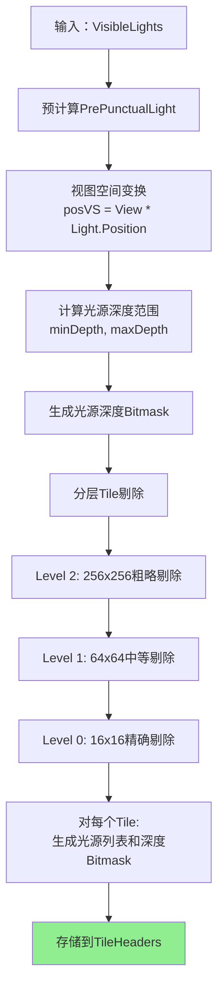
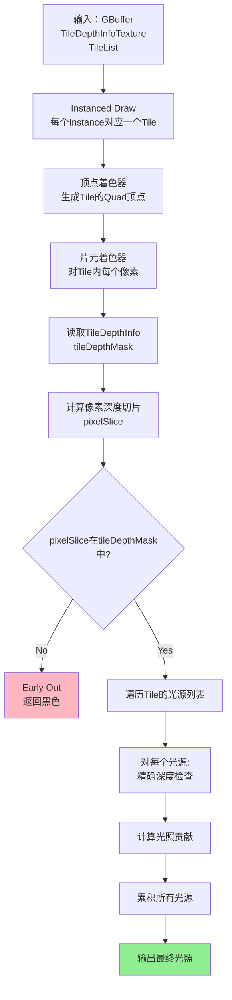

# TileDepthRange深度Bitmask算法详解

## 目录
1. [算法概述](#1-算法概述)
2. [深度切片划分](#2-深度切片划分)
3. [Bitmask生成算法](#3-bitmask生成算法)
4. [光源相交判断](#4-光源相交判断)
5. [完整实现流程](#5-完整实现流程)
6. [优化技巧](#6-优化技巧)

---

## 1. 算法概述

### 1.1 核心问题

在延迟渲染的Tiled Lighting中，需要回答一个关键问题：

```
对于屏幕上的一个Tile（例如16x16像素），
哪些光源会影响这个Tile中的像素？
```

**朴素方法**（不使用Depth Bitmask）：
```
对于每个Tile:
    对于每个光源:
        检查光源球体/锥体是否与Tile的屏幕空间矩形相交
        如果相交 -> 将光源加入该Tile的列表
```

**问题**：
- 只考虑了2D屏幕空间，忽略了深度
- 光源可能在Tile的屏幕投影内，但实际不影响任何几何体
- 导致不必要的光照计算

**改进方法**（使用Depth Bitmask）：
```
额外考虑深度维度：
- 光源不仅要在屏幕上与Tile相交
- 还要在深度上与Tile中的几何体相交
```

### 1.2 Depth Bitmask的作用

```
Depth Bitmask = 32位整数
每一位代表深度空间的一个切片

例如：
Bitmask = 0b00000000_11110000_00000000_00000000
         Bit31...24 Bit23...16 Bit15...8  Bit7...0

解释：
- Bit 20-23 为1：Tile在深度切片20-23有几何体
- 其他Bit为0：这些深度范围没有几何体

用途：
光源的深度范围也可以表示为Bitmask
几何体Bitmask & 光源Bitmask = 0 ? 不相交 : 相交
```

---

## 2. 深度切片划分

### 2.1 线性深度划分

**基本原理**：将相机的near到far平面均匀划分为32个切片

```
Near Plane                                           Far Plane
    |---------------------------------------------------|
    |   |   |   |   |   | ... |   |   |   |   |   |   |
    0   1   2   3   4   5 ... 27  28  29  30  31  32
    ^                                                   ^
    切片0                                            切片31
```

**数学公式**：
```hlsl
// 输入：View Space深度值 depthVS
float nearClip = _ProjectionParams.y; // 相机近裁剪面距离
float farClip = _ProjectionParams.z;  // 相机远裁剪面距离

// 1. 归一化深度到 [0, 1]
float normalizedDepth = (depthVS - nearClip) / (farClip - nearClip);

// 2. 映射到 [0, 31] 切片索引
int sliceIndex = clamp(int(normalizedDepth * 32.0), 0, 31);

// 3. 转换为Bitmask
uint depthBit = 1u << sliceIndex;
```

### 2.2 示例计算

假设相机参数：
```
Near Plane: 0.3m
Far Plane: 100m
深度范围：99.7m
```

**切片大小**：99.7 / 32 ≈ 3.12m 每个切片

| View Space深度 | 归一化深度 | 切片索引 | Bit位置 |
|---------------|-----------|---------|---------|
| 0.3m (near) | 0.0 | 0 | Bit 0 |
| 3.42m | 0.031 | 1 | Bit 1 |
| 50.0m | 0.498 | 15 | Bit 15 |
| 100m (far) | 1.0 | 31 | Bit 31 |

### 2.3 深度值转换

**从NDC深度到View Space深度**：

```hlsl
// 1. 从深度纹理读取NDC深度（Normalized Device Coordinates）
float depthNDC = SAMPLE_DEPTH_TEXTURE(_CameraDepthTexture, uv);

// 2. 线性化深度（转换到View Space）
// 方法A：使用Unity内置函数
float depthVS = LinearEyeDepth(depthNDC);

// 方法B：手动计算（更高效）
// 使用投影矩阵的逆变换
float4 positionCS = float4(uv * 2.0 - 1.0, depthNDC, 1.0); // Clip Space
float4 positionVS = mul(_InvProjectionMatrix, positionCS); // View Space
positionVS /= positionVS.w; // 透视除法
float depthVS = -positionVS.z; // View Space深度（正值）
```

**URP使用的优化方法**：
```hlsl
// DeferredLights.cs Line 994-998
// 预计算逆投影矩阵的关键行
Matrix4x4 projScreenInv = Matrix4x4.Inverse(clip * proj);
cmd.SetGlobalVector("_unproject0", projScreenInv.GetRow(2)); // Z行
cmd.SetGlobalVector("_unproject1", projScreenInv.GetRow(3)); // W行

// 在Shader中快速重建View Space深度
float2 screenPos = uv * 2.0 - 1.0; // [-1, 1]
float depthNDC = SAMPLE_DEPTH_TEXTURE(_CameraDepthTexture, uv);
float4 temp = float4(screenPos, depthNDC, 1.0);
float viewZ = dot(temp, _unproject0);
float viewW = dot(temp, _unproject1);
float depthVS = -viewZ / viewW;
```

---

## 3. Bitmask生成算法

### 3.1 CPU端：预计算光源深度范围

在SetupLights阶段，CPU端计算每个光源的深度范围Bitmask：

```csharp
// DeferredTiler.cs (简化逻辑)
struct PrePunctualLight
{
    public Vector3 posVS;     // 光源位置 (View Space)
    public float radius;      // 光源半径
    public float minDist;     // 光源到相机的最小距离
    public ushort visLightIndex;
}

void PrecomputeLightDepthRange(ref PrePunctualLight light)
{
    // 1. 计算光源影响的深度范围
    float lightMinDepth = max(0, light.minDist);
    float lightMaxDepth = length(light.posVS) + light.radius;
    
    // 2. 归一化到[0, 1]
    float nearClip = camera.nearClipPlane;
    float farClip = camera.farClipPlane;
    float normalizedMin = (lightMinDepth - nearClip) / (farClip - nearClip);
    float normalizedMax = (lightMaxDepth - nearClip) / (farClip - nearClip);
    
    // 3. 映射到切片索引[0, 31]
    int sliceMin = clamp((int)(normalizedMin * 32), 0, 31);
    int sliceMax = clamp((int)(normalizedMax * 32), 0, 31);
    
    // 4. 生成Bitmask（从sliceMin到sliceMax都设为1）
    uint lightDepthMask = 0;
    for (int i = sliceMin; i <= sliceMax; i++)
    {
        lightDepthMask |= (1u << i);
    }
    
    // 5. 存储到TileHeaders中
    tileHeaders[tileIndex + 2] = lightDepthMask;
}
```

**示例**：
```
光源位置：(5, 3, -20) View Space
光源半径：10m
相机Near: 0.3m, Far: 100m

计算：
- minDepth = |(-20)| - 10 = 10m
- maxDepth = |(-20)| + 10 = 30m
- normalizedMin = (10 - 0.3) / 99.7 ≈ 0.097
- normalizedMax = (30 - 0.3) / 99.7 ≈ 0.298
- sliceMin = int(0.097 * 32) = 3
- sliceMax = int(0.298 * 32) = 9

Bitmask = 0b00000000_00000000_00000011_11111000
         (Bit 3-9设为1)
```

### 3.2 GPU端：计算几何体深度Bitmask

在TileDepthRangePass中，GPU采样Tile内所有像素的深度，生成Bitmask：

```hlsl
// TileDepthInfo.shader (简化)
uint ComputeTileDepthBitmask(uint2 tileID, uint2 tileSize)
{
    uint depthMask = 0;
    
    // 遍历Tile内的每个像素
    for (uint y = 0; y < tileSize.y; y++)
    {
        for (uint x = 0; x < tileSize.x; x++)
        {
            // 1. 计算像素坐标
            uint2 pixelCoord = tileID * tileSize + uint2(x, y);
            float2 uv = (pixelCoord + 0.5) / _ScreenSize.xy;
            
            // 2. 采样深度
            float depthNDC = SAMPLE_DEPTH_TEXTURE(_CameraDepthTexture, uv);
            
            // 3. 转换到View Space
            float depthVS = ReconstructViewSpaceDepth(uv, depthNDC);
            
            // 4. 确定切片索引
            float normalizedDepth = (depthVS - _NearClip) / (_FarClip - _NearClip);
            int sliceIndex = clamp(int(normalizedDepth * 32.0), 0, 31);
            
            // 5. 设置对应Bit
            depthMask |= (1u << sliceIndex);
        }
    }
    
    return depthMask;
}
```

**关键点**：
- 只要Tile内有**任何一个像素**在某个深度切片，对应Bit就设为1
- 结果是Tile覆盖的所有深度切片的并集

### 3.3 合并Bitmask：几何体 & 光源

最后一步：合并几何体和光源的Bitmask

```hlsl
// 在TileDepthInfo Pass中
uint4 FragTileDepthInfo(v2f input) : SV_Target
{
    uint2 tileID = input.tileID;
    
    // 1. 计算几何体深度Bitmask
    uint geometryDepthMask = ComputeTileDepthBitmask(tileID, uint2(16, 16));
    
    // 2. 从CPU传入的数据获取光源深度Bitmask
    uint tileIndex = tileID.x + tileID.y * _TileXCount;
    uint lightDepthMask = _DepthRanges[tileIndex];
    
    // 3. 按位与操作
    uint finalMask = geometryDepthMask & lightDepthMask;
    
    // 4. 存储到TileDepthInfo纹理
    return uint4(finalMask, 0, 0, 0);
}
```

**逻辑解释**：
```
geometryDepthMask = 0b00000000_11110000_00000000_00000000
                     (Tile中的几何体在深度切片20-23)

lightDepthMask    = 0b00000001_11111111_00000000_00000000
                     (光源影响深度切片16-24)

finalMask = geometryDepthMask & lightDepthMask
          = 0b00000000_11110000_00000000_00000000
            (相交区域：切片20-23)

如果 finalMask == 0:
    光源与几何体在深度上不相交
    跳过该Tile的光照计算
否则:
    光源可能影响该Tile
    需要执行光照计算
```

---

## 4. 光源相交判断

### 4.1 CPU端Tile-Light剔除

在SetupLights阶段，CPU会执行分层剔除：

```csharp
// DeferredTiler.cs CullFinalLights方法
void CullFinalLights(
    ref NativeArray<PrePunctualLight> lights,
    int istart, int iend, int jstart, int jend)
{
    for (int j = jstart; j < jend; ++j)
    {
        for (int i = istart; i < iend; ++i)
        {
            // 获取Tile的屏幕空间矩形
            Vector2 tileMin = GetTileMinPos(i, j);
            Vector2 tileMax = GetTileMaxPos(i, j);
            
            ushort lightCount = 0;
            uint combinedDepthMask = 0;
            
            // 遍历所有光源
            for (int l = 0; l < lights.Length; l++)
            {
                PrePunctualLight light = lights[l];
                
                // 1. 屏幕空间相交测试（2D）
                if (!IntersectsScreenRect(light, tileMin, tileMax))
                    continue;
                
                // 2. 深度相交测试（初步估计）
                float lightMinDepth = max(0, light.minDist);
                float lightMaxDepth = length(light.posVS) + light.radius;
                
                // 计算光源深度Bitmask
                uint lightDepthMask = ComputeDepthMask(lightMinDepth, lightMaxDepth);
                
                // 累积所有相交光源的深度Bitmask
                combinedDepthMask |= lightDepthMask;
                
                // 添加光源到Tile列表
                tiles[tileOffset + lightCount] = (ushort)l;
                lightCount++;
            }
            
            // 存储结果
            int headerOffset = GetTileHeaderOffset(i, j);
            tileHeaders[headerOffset + 0] = tileOffset;        // 光源列表偏移
            tileHeaders[headerOffset + 1] = lightCount;        // 光源数量
            tileHeaders[headerOffset + 2] = combinedDepthMask; // 深度Bitmask
        }
    }
}
```

### 4.2 GPU端精确剔除

在DeferredPass的Tiled Lighting阶段，GPU使用TileDepthInfo进一步剔除：

```hlsl
// TileDeferred.shader (简化)
float4 FragTileDeferredLighting(v2f input) : SV_Target
{
    // 1. 确定当前像素属于哪个Tile
    uint2 pixelCoord = input.positionCS.xy;
    uint2 tileID = pixelCoord / TILE_SIZE;
    
    // 2. 从TileList获取该Tile的信息
    TileData tile = _TileList[tileID.x + tileID.y * _TileXCount];
    uint tilePackedID = tile.packedTileID;
    uint tileLightCount = tile.lightCount;
    uint tileRelLightOffset = tile.relLightOffset;
    uint tileDepthMask = tile.depthMask; // <-- 来自TileDepthInfo
    
    // 3. 读取当前像素的深度
    float depthNDC = SAMPLE_DEPTH_TEXTURE(_CameraDepthTexture, input.uv);
    float depthVS = ReconstructViewSpaceDepth(input.uv, depthNDC);
    
    // 4. 确定像素的深度切片
    float normalizedDepth = (depthVS - _NearClip) / (_FarClip - _NearClip);
    int pixelSlice = clamp(int(normalizedDepth * 32.0), 0, 31);
    uint pixelDepthBit = 1u << pixelSlice;
    
    // 5. 检查像素深度是否在Tile的有效深度范围内
    if ((pixelDepthBit & tileDepthMask) == 0)
    {
        // 像素深度不在任何光源影响范围内
        return float4(0, 0, 0, 0);
    }
    
    // 6. 累积光照
    float3 lighting = 0;
    for (uint i = 0; i < tileLightCount; i++)
    {
        uint relLightIndex = _RelLightList[tileRelLightOffset + i];
        PunctualLightData light = _PunctualLightBuffer[relLightIndex];
        
        // 7. 精确深度范围检查（可选）
        float lightMinDepth = light.minDepth;
        float lightMaxDepth = light.maxDepth;
        if (depthVS < lightMinDepth || depthVS > lightMaxDepth)
            continue; // 像素不在这个光源的深度范围内
        
        // 8. 计算光照
        lighting += ComputeLighting(light, worldPos, normal);
    }
    
    return float4(lighting, 1);
}
```

---

## 5. 完整实现流程

### 5.1 阶段一：SetupLights (CPU)



**输出数据结构**：
```csharp
// 每个Tile的Header (4个uint)
TileHeaders[headerOffset + 0] = lightListOffset;   // 光源列表起始位置
TileHeaders[headerOffset + 1] = lightCount;        // 光源数量
TileHeaders[headerOffset + 2] = combinedDepthMask; // 所有光源的深度Bitmask并集
TileHeaders[headerOffset + 3] = listBitMask;       // 额外的剔除Bitmask
```

### 5.2 阶段二：TileDepthRangePass (GPU)

```mermaid
graph TD
    A[输入：Camera Depth Texture<br/>TileHeaders from CPU] --> B[对每个Tile]
    
    B --> C[采样Tile内所有像素深度<br/>16x16 = 256个采样]
    C --> D[转换到View Space<br/>使用_unproject0/1矩阵]
    D --> E[计算深度切片索引<br/>slice = int depthVS / sliceSize]
    E --> F[生成几何体深度Bitmask<br/>geometryMask OR= 1 << slice]
    
    F --> G[读取光源深度Bitmask<br/>lightMask = TileHeaders[2]]
    G --> H[按位与操作<br/>finalMask = geometryMask & lightMask]
    
    H --> I{finalMask == 0?}
    I -->|Yes| J[标记为空Tile<br/>无需光照计算]
    I -->|No| K[输出到TileDepthInfoTexture<br/>finalMask]
    
    style K fill:#FFD700
    style J fill:#FFB6C1
```

**伪代码**：
```hlsl
[numthreads(16, 16, 1)]
void CSComputeTileDepthInfo(uint3 threadID : SV_DispatchThreadID)
{
    uint2 tileID = threadID.xy;
    uint tileIndex = tileID.x + tileID.y * _TileXCount;
    
    // Phase 1: 采样几何体深度
    uint geometryMask = 0;
    for (uint y = 0; y < 16; y++)
    {
        for (uint x = 0; x < 16; x++)
        {
            uint2 pixelCoord = tileID * 16 + uint2(x, y);
            float depth = LoadDepth(pixelCoord);
            float depthVS = ConvertToViewSpace(depth);
            int slice = ComputeSliceIndex(depthVS);
            geometryMask |= (1u << slice);
        }
    }
    
    // Phase 2: 与光源深度相交
    uint lightMask = _DepthRanges[tileIndex];
    uint finalMask = geometryMask & lightMask;
    
    // Phase 3: 输出
    _TileDepthInfoTexture[tileID] = finalMask;
}
```

### 5.3 阶段三：DeferredPass Tiled Lighting (GPU)



---

## 6. 优化技巧

### 6.1 降采样优化 (Intermediate Mip Level)

**问题**：16x16 Tile直接采样256次，GPU波前利用率低

**解决**：先生成4x降采样版本，再合并

```
屏幕分辨率：1920x1080
Tile大小：16x16

方案A（直接计算）：
- Tile数量：120 x 68 = 8160个
- 每个Tile: 1个Thread Group
- 总Thread Groups：8160
- GPU利用率：可能不饱和

方案B（两遍计算）：
- Pass 1: 生成4x4 intermediate
  * 分辨率：480 x 270
  * Thread Groups：480 x 270 = 129600
  * GPU利用率：高
- Pass 2: 降采样合并4x4 -> 16x16
  * 分辨率：120 x 68
  * Thread Groups：8160
  * GPU利用率：中等

总体：方案B在某些GPU上更快（Switch, iOS）
```

### 6.2 深度采样优化

**优化点1：使用Hardware Depth Mipmap**
```hlsl
// 如果GPU支持，使用Depth Mipmap降采样
// 可以用更少的采样获得保守的深度范围
float depthMin = _CameraDepthTexture.SampleLevel(sampler_point_clamp, uv, mipLevel).r;
```

**优化点2：Early Z Rejection**
```hlsl
// 如果整个Tile的深度都大于光源最远距离，直接剔除
float tileMaxDepth = MaxDepthInTile(tileID);
if (tileMaxDepth < lightMinDepth)
    return 0; // 整个Tile不受该光源影响
```

### 6.3 Bitmask压缩

**场景特征**：大多数Tile只覆盖少数几个深度切片

**优化**：使用额外的Bit Range来压缩

```csharp
// TileData结构（URP实际使用）
struct TileData
{
    uint packedTileID;      // Tile坐标
    uint listBitMask;       // 深度Bitmask（32位）
    uint relLightOffset;    // 光源列表偏移
    uint lightCount;        // 光源数量（16位）+ bit range（16位）
}

// bit range优化
// 不存储完整32位，只存储min和max slice
uint bitRangeMin = firstbitlow(depthMask);  // 最低置位的Bit
uint bitRangeMax = 31 - firstbithigh(depthMask); // 最高置位的Bit
uint bitRange = (bitRangeMin << 8) | bitRangeMax;

// 在Shader中快速判断
int pixelSlice = ComputeSliceIndex(depthVS);
if (pixelSlice < bitRangeMin || pixelSlice > bitRangeMax)
    return 0; // Early out
```

### 6.4 并行化优化

**CPU端**：使用Job System并行剔除

```csharp
// DeferredLights.cs Lines 615-694
CullLightsJob job = new CullLightsJob
{
    tiler = m_Tilers[tilerLevel],
    prePunctualLights = prePunctualLights,
    coarseTiles = coarseTiles,
    coarseTileHeaders = coarseTileHeaders,
    istart = fine_istart,
    iend = fine_iend,
    jstart = fine_jstart,
    jend = fine_jend,
};

// 为每个4x4 Tile块启动一个Job
jobHandles[jobCount++] = job.Schedule(parentJobHandle);
```

**GPU端**：Wave Intrinsics优化

```hlsl
// 使用SIMD指令加速Bitmask操作
uint geometryMask = 0;

// 一次处理4个像素（Wave level）
for (uint i = 0; i < 16; i++)
{
    uint4 depths = LoadDepth4x1(tileBase + uint2(i * 4, 0));
    uint4 slices = ComputeSliceIndex4(depths);
    
    // 并行计算4个Bitmask
    uint4 masks;
    masks.x = 1u << slices.x;
    masks.y = 1u << slices.y;
    masks.z = 1u << slices.z;
    masks.w = 1u << slices.w;
    
    // 合并
    geometryMask |= (masks.x | masks.y | masks.z | masks.w);
}
```

---

## 7. 实战示例

### 示例：计算一个Tile的Depth Bitmask

**场景设置**：
```
相机参数：
- Near Plane: 0.1m
- Far Plane: 100m
- 深度范围：99.9m
- 切片大小：99.9 / 32 ≈ 3.12m

Tile坐标：(5, 3)
Tile像素范围：(80, 48) - (95, 63)

Tile内几何体深度（采样结果）：
- 像素(80,48): 15.3m -> 切片5
- 像素(81,48): 15.5m -> 切片5
- 像素(82,48): 16.2m -> 切片5
- ...
- 像素(85,50): 22.4m -> 切片7
- 像素(90,55): 30.1m -> 切片9
- 像素(95,63): 18.7m -> 切片6

光源参数：
- 位置：(10, 5, -25) View Space
- 半径：8m
- 最小深度：|(-25)| - 8 = 17m -> 切片5
- 最大深度：|(-25)| + 8 = 33m -> 切片10
```

**Step 1：计算几何体Bitmask**
```
采样结果统计：
- 切片5: 50个像素
- 切片6: 30个像素
- 切片7: 20个像素
- 切片9: 10个像素

geometryMask = 0b00000000_00000000_00000010_11100000
              = (1<<5) | (1<<6) | (1<<7) | (1<<9)
              = Bit 5, 6, 7, 9 置位
```

**Step 2：计算光源Bitmask**
```
光源深度切片：5 - 10

lightMask = 0b00000000_00000000_00000111_11100000
          = (1<<5) | (1<<6) | (1<<7) | (1<<8) | (1<<9) | (1<<10)
          = Bit 5-10 置位
```

**Step 3：相交判断**
```
finalMask = geometryMask & lightMask
          = 0b00000000_00000000_00000010_11100000
            & 0b00000000_00000000_00000111_11100000
          = 0b00000000_00000000_00000010_11100000
          = Bit 5, 6, 7, 9 置位

结论：finalMask != 0
- 光源与Tile中的几何体在深度上相交
- 需要为该Tile计算该光源的光照
- 具体影响切片5, 6, 7, 9的像素
```

**Step 4：像素级剔除**
```
在DeferredPass中，对Tile的每个像素：

像素(82, 48)：
- depthVS = 16.2m
- slice = 5
- pixelBit = 1 << 5 = 0b00100000
- pixelBit & finalMask = 0b00100000 & 0b10111100000 != 0
- 结论：计算光照

像素(87, 52)：
- depthVS = 25.0m
- slice = 8
- pixelBit = 1 << 8 = 0b100000000
- pixelBit & finalMask = 0b100000000 & 0b10111100000 == 0
- 结论：跳过光照（Early out，节省计算）
```

---

## 8. 总结

### 核心思想

**空间划分 + 位运算**：
- 空间划分：将深度连续空间离散化为32个切片
- 位运算：使用32位整数高效表示和查询

**层次优化**：
- CPU端：粗糙屏幕空间剔除
- GPU端（TileDepthRangePass）：精确深度剔除
- GPU端（DeferredPass）：像素级最终剔除

### 性能收益

**减少计算量**：
```
无Depth Bitmask：
    每个Tile计算所有通过屏幕空间剔除的光源
    计算量 = TileCount * AvgLightsPerTile * PixelsPerTile

有Depth Bitmask：
    通过深度相交测试，剔除30-70%的光源
    计算量减少30-70%
```

**提升批处理效率**：
```
Bitmask允许更激进的光源合并
一个Draw Call可以处理更多Tile
减少CPU开销
```

### 适用场景

**最佳效果**：
- 深度分布复杂的场景（多层建筑、室内外混合）
- 光源深度范围差异大
- 大量无阴影点光源

**效果一般**：
- 深度分布简单（平面场景）
- 光源深度范围相似
- 光源数量少

Depth Bitmask是Tiled Deferred Lighting的核心优化，通过巧妙利用深度信息和位运算，在保持精确性的同时大幅提升性能。
