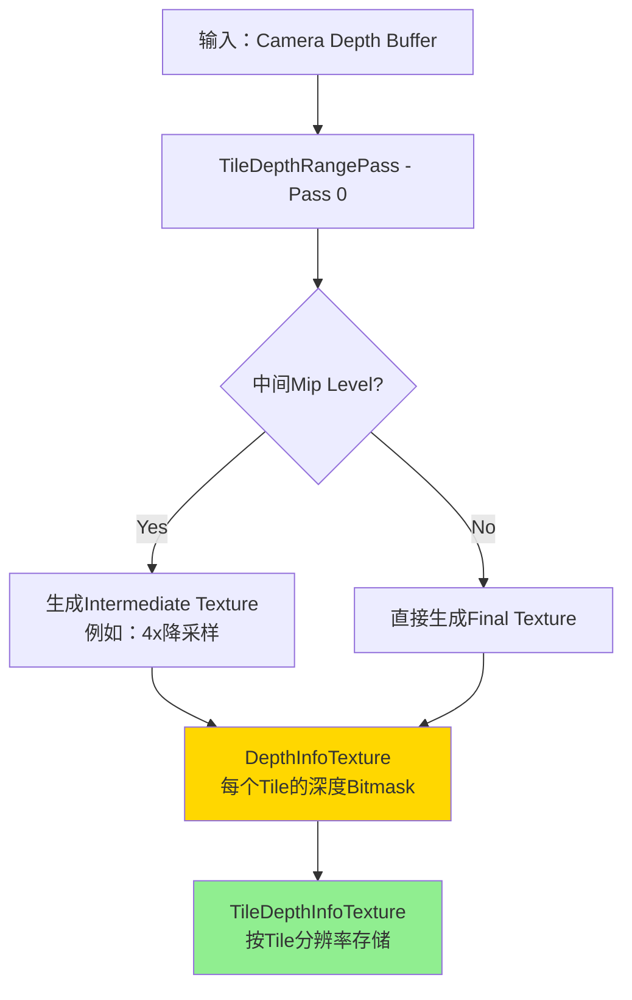
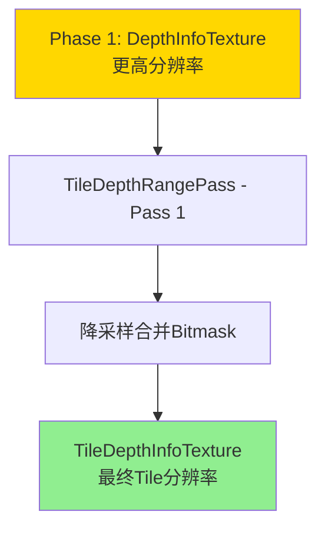
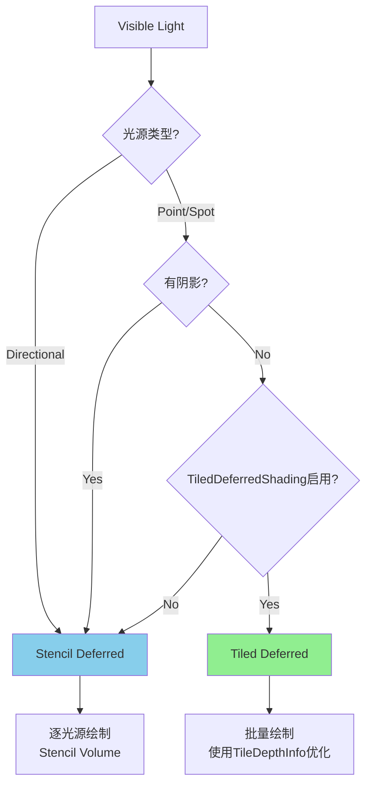
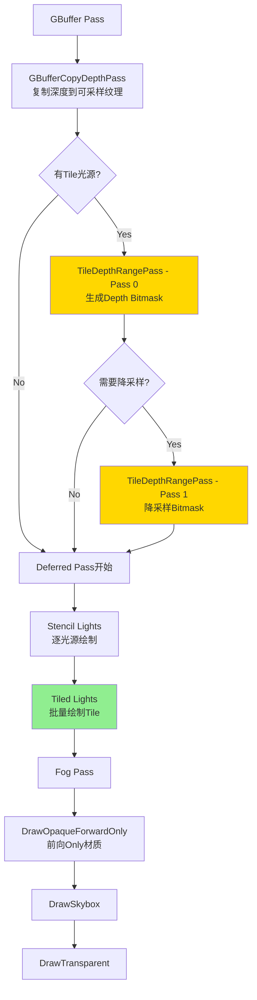

# URP延迟渲染中的Tiled Lighting和TileDepthRangePass详解

## 目录
1. [Tiled Lighting概述](#1-tiled-lighting概述)
2. [TileDepthRangePass详解](#2-tiledepthrangepass详解)
3. [Tiled Deferred vs Stencil Deferred](#3-tiled-deferred-vs-stencil-deferred)
4. [完整Deferred渲染流程](#4-完整deferred渲染流程)
5. [性能分析与优化](#5-性能分析与优化)

---

## 1. Tiled Lighting概述

### 1.1 什么是Tiled Lighting?

**Tiled Lighting** (基于Tile的光照) 是延迟渲染中的一种优化技术，主要思想是：

```
将屏幕划分为小的Tile（如16x16像素）
每个Tile计算其中像素可能受哪些光源影响
只对这些相关光源执行光照计算
```

**核心优势**：
- 减少光照计算overdraw
- 批量处理Tile，减少Draw Call
- 适合处理大量光源的场景

### 1.2 Tile划分策略

URP使用**分层Tile结构** (Hierarchical Tiling):

```csharp
// DeferredConfig.cs Lines 81-86
public const int kTilePixelWidth = 16;
public const int kTilePixelHeight = 16;
public const int kTilerDepth = 3;  // 3层分层结构
public const int kTilerSubdivisions = 4;  // 每层4x4细分
```

**分层结构**：
```
Level 2 (最粗): 256x256像素的粗略Tile
    └── Level 1: 64x64像素的中等Tile
        └── Level 0 (最细): 16x16像素的最终Tile
```

**为什么使用分层**：
1. **加速剔除**：先在粗糙层快速剔除，再细化
2. **并行处理**：使用JobSystem并行处理不同层
3. **内存效率**：避免为每个16x16 Tile都检查所有光源

---

## 2. TileDepthRangePass详解

### 2.1 Pass的作用

**TileDepthRangePass的目的**：为每个Tile生成深度范围信息（Depth Bitmask）

```
目标：计算每个Tile中，几何体在深度上的分布情况
输出：32位Bitmask，每一位代表深度的一个切片
用途：快速判断光源是否与Tile中的几何体相交
```

### 2.2 深度Bitmask原理

```
将相机的近裁剪面到远裁剪面划分为32个深度切片
对于Tile中的每个像素：
    - 读取深度值
    - 确定深度属于哪个切片
    - 在对应的Bit位置设置为1
    
最终得到32位Bitmask，表示Tile覆盖了哪些深度切片
```

**示例**：
```
Tile的Bitmask = 0b00000000_11110000_00000000_00000000
表示：该Tile只在中间的深度范围有几何体（Bit 20-23）
```

### 2.3 TileDepthRangePass执行流程

#### Phase 1: 生成Depth Info Texture



#### Phase 2: Downsample Bitmask (可选)

在某些平台（如Switch、iOS），会使用两遍Pass：



**为什么需要两遍**：
```
在16x16 Tile下，直接计算可能导致GPU利用率低
通过先生成中间分辨率（如4x降采样），可以启动更多pixel shader
然后再合并到最终Tile分辨率
```

### 2.4 代码实现分析

#### ExecuteTileDepthInfoPass (第一遍)

```csharp
// DeferredLights.cs Lines 948-1061
internal void ExecuteTileDepthInfoPass(ScriptableRenderContext context, ref RenderingData renderingData)
{
    // 1. 确定Tile和Mip Level参数
    int tilePixelWidth = 16;  // Tile宽度
    int tilePixelHeight = 16; // Tile高度
    int tileMipLevel = Log2(min(tilePixelWidth, tilePixelHeight)); // = 4
    int intermediateMipLevel = kTileDepthInfoIntermediateLevel; // 平台相关（1或-1）
    
    // 2. 计算输出分辨率
    int alignment = 1 << intermediateMipLevel;
    int depthInfoWidth = (RenderWidth + alignment - 1) >> intermediateMipLevel;
    int depthInfoHeight = (RenderHeight + alignment - 1) >> intermediateMipLevel;
    
    // 3. 设置Shader参数
    cmd.SetGlobalTexture("_DepthTex", depthSurface);  // 输入：深度图
    cmd.SetGlobalInt("_DownsamplingWidth", tilePixelWidth);
    cmd.SetGlobalInt("_DownsamplingHeight", tilePixelHeight);
    
    // 4. 设置深度重投影参数（用于计算View Space深度）
    Matrix4x4 projScreenInv = Matrix4x4.Inverse(clip * proj);
    cmd.SetGlobalVector("_unproject0", projScreenInv.GetRow(2));
    cmd.SetGlobalVector("_unproject1", projScreenInv.GetRow(3));
    
    // 5. 批量处理（避免缓冲区溢出）
    int tileY = 0;
    int tileYIncrement = kPreferredCBufferSize / (tileXCount * 4);
    
    while (tileY < tileYCount)
    {
        // 准备该批次的深度范围数据
        for (int j = tileY; j < tileYEnd; ++j)
        {
            for (int i = 0; i < tileXCount; ++i)
            {
                // 从Tile Headers获取已计算的深度范围
                int tileLightCount = tileHeaders[headerOffset + 1];
                uint listDepthRange = tileLightCount == 0 
                    ? invalidDepthRange 
                    : tileHeaders[headerOffset + 2];
                depthRanges[i + (j - tileY) * tileXCount] = listDepthRange;
            }
        }
        
        // 上传到GPU缓冲区
        _depthRanges.SetData(depthRanges);
        cmd.SetGlobalBuffer("_DepthRanges", _depthRanges);
        
        // 执行Blit（调用Shader）
        cmd.Blit(depthSurface, depthInfoSurface, m_TileDepthInfoMaterial, 0);
        
        tileY = tileYEnd;
    }
}
```

#### ExecuteDownsampleBitmaskPass (第二遍，可选)

```csharp
// DeferredLights.cs Lines 1063-1114
internal void ExecuteDownsampleBitmaskPass(ScriptableRenderContext context, ref RenderingData renderingData)
{
    // 从中间分辨率降采样到最终Tile分辨率
    
    // 1. 设置输入纹理（Phase 1的输出）
    cmd.SetGlobalTexture("_BitmaskTex", depthInfoSurface);
    
    // 2. 设置降采样参数
    int diffWidthLevel = tileWidthLevel - intermediateMipLevel;
    int diffHeightLevel = tileHeightLevel - intermediateMipLevel;
    cmd.SetGlobalInt("_DownsamplingWidth", tilePixelWidth);
    cmd.SetGlobalInt("_DownsamplingHeight", tilePixelHeight);
    
    // 3. 执行降采样Blit（合并Bitmask）
    cmd.Blit(depthInfoSurface, tileDepthInfoSurface, m_TileDepthInfoMaterial, 1);
}
```

### 2.5 Shader中的深度Bitmask计算

**伪代码逻辑**：
```hlsl
// TileDepthInfo.shader (简化)
float4 FragTileDepthInfo(v2f input) : SV_Target
{
    // 1. 计算当前像素对应的Tile坐标
    uint2 tileID = input.screenPos.xy / TILE_SIZE;
    
    // 2. 采样该Tile内所有像素的深度
    uint depthBitmask = 0;
    for (int y = 0; y < TILE_SIZE; y++)
    {
        for (int x = 0; x < TILE_SIZE; x++)
        {
            float depth = SAMPLE_DEPTH(tileID * TILE_SIZE + uint2(x, y));
            
            // 3. 将深度值转换为View Space
            float depthVS = LinearEyeDepth(depth);
            
            // 4. 确定深度切片索引（0-31）
            float nearClip = _ProjectionParams.y;
            float farClip = _ProjectionParams.z;
            float normalizedDepth = (depthVS - nearClip) / (farClip - nearClip);
            uint sliceIndex = clamp(normalizedDepth * 32, 0, 31);
            
            // 5. 在对应位设置Bit
            depthBitmask |= (1u << sliceIndex);
        }
    }
    
    // 6. 查找该Tile的光源深度范围（从CPU传入）
    uint tileIndex = tileID.x + tileID.y * _tileXCount;
    uint lightDepthRange = _DepthRanges[tileIndex];
    
    // 7. 合并几何体深度和光源深度范围
    uint finalBitmask = depthBitmask & lightDepthRange;
    
    // 8. 编码为纹理输出（R32_UInt）
    return finalBitmask;
}
```

**关键点**：
1. **深度切片划分**：将near到far均匀划分为32个切片
2. **Bitmask合并**：几何体深度范围 & 光源深度范围
3. **优化剔除**：如果Bitmask为0，说明光源与几何体不相交

---

## 3. Tiled Deferred vs Stencil Deferred

URP延迟渲染支持两种光照策略：

### 3.1 Tiled Deferred (基于Tile)

**适用光源**：
```csharp
// DeferredLights.cs Line 1866
bool IsTileLight(VisibleLight visibleLight)
{
    // 无阴影的Point Light和Spot Light
    return (visibleLight.lightType == LightType.Point && visibleLight.light.shadows == LightShadows.None)
        || (visibleLight.lightType == LightType.Spot && visibleLight.light.shadows == LightShadows.None);
}
```

**渲染方式**：
```
1. 光源剔除到Tile
2. 批量绘制（Instanced Drawing）
   - 每个Tile是一个Instance
   - 一次Draw Call处理多个Tile
3. 在Shader中，根据TileID查找光源列表
```

**优势**：
- 减少Draw Call（批量绘制）
- 高效处理大量无阴影光源
- 利用Tile深度信息加速剔除

**限制**：
- 不支持阴影（阴影需要额外的Shader采样）
- 不支持Light Cookie

### 3.2 Stencil Deferred (基于Stencil Volume)

**适用光源**：
```
- 所有Directional Light
- 有阴影的Point/Spot Light
- 有Cookie的光源
- Tile Deferred无法处理的光源
```

**渲染方式**：
```
1. 为每个光源绘制几何体积（Light Volume）：
   - Directional Light: 全屏Quad
   - Point Light: Sphere Mesh
   - Spot Light: Cone Mesh (Hemisphere)

2. 两遍渲染：
   Pass 1 (Stencil): 标记光源影响的像素
   Pass 2 (Lighting): 只对标记的像素计算光照

3. 使用Stencil Test避免计算不受影响的像素
```

**优势**：
- 支持阴影和Cookie
- 精确控制光照区域
- 适合少量复杂光源

**劣势**：
- 每个光源至少2个Draw Call
- 几何体变换和光栅化开销

### 3.3 混合策略

URP同时使用两种策略：

```csharp
// DeferredLights.cs Lines 1127-1154
internal void ExecuteDeferredPass(...)
{
    // 1. 先渲染Stencil光源（包括主光源SSAO）
    RenderStencilLights(context, cmd, ref renderingData);
    
    // 2. 再渲染Tile光源（批量处理）
    RenderTileLights(context, cmd, ref renderingData);
    
    // 3. 最后渲染Fog
    RenderFog(context, cmd, ref renderingData);
}
```

**决策逻辑**：


---

## 4. 完整Deferred渲染流程

### 4.1 流程图



### 4.2 关键判断条件

#### 是否执行TileDepthRangePass?

```csharp
// UniversalRenderer.cs Lines 1046-1058
if (m_DeferredLights.HasTileLights())
{
    // Pass 0: 计算每个Tile的深度Bitmask
    EnqueuePass(m_TileDepthRangePass);
    
    // Pass 1 (可选): 降采样Bitmask
    if (m_DeferredLights.HasTileDepthRangeExtraPass())
        EnqueuePass(m_TileDepthRangeExtraPass);
}
```

**`HasTileLights()` 判断**：
```csharp
// DeferredLights.cs Lines 934-937
internal bool HasTileLights()
{
    return m_HasTileVisLights;
}

// 在SetupLights中设置
m_HasTileVisLights = this.TiledDeferredShading 
                     && CheckHasTileLights(ref renderingData.lightData.visibleLights);
```

**`HasTileDepthRangeExtraPass()` 判断**：
```csharp
// DeferredLights.cs Lines 939-946
internal bool HasTileDepthRangeExtraPass()
{
    int tileMipLevel = Log2(Min(tilePixelWidth, tilePixelHeight)); // = 4
    int intermediateMipLevel = kTileDepthInfoIntermediateLevel; // Switch/iOS = 1, 其他 = -1
    
    return intermediateMipLevel >= 0 && intermediateMipLevel < tileMipLevel;
    // Switch/iOS: 1 < 4 = true (需要额外Pass)
    // PC: -1 < 4 = false (不需要)
}
```

**平台差异**：
```csharp
// DeferredConfig.cs Lines 94-98
#if UNITY_SWITCH || UNITY_IOS
    public const int kTileDepthInfoIntermediateLevel = 1;  // 使用中间层
#else
    public const int kTileDepthInfoIntermediateLevel = -1; // 直接生成最终结果
#endif
```

---

## 5. 性能分析与优化

### 5.1 Tiled Lighting的性能优势

#### 传统Stencil Deferred

```
场景：100个Point Light
Draw Calls：100 * 2 = 200
    - 100个Stencil Pass
    - 100个Lighting Pass
Overdraw：每个光源覆盖的像素都要渲染
```

#### Tiled Deferred

```
场景：100个Point Light (无阴影)
Draw Calls：2 (Lit + SimpleLit)
Batch处理：所有Tile在2个Draw Call中完成
Overdraw：利用深度Bitmask剔除，只计算有效像素
```

**性能提升**：
- Draw Call减少 98%
- 批量渲染减少CPU开销
- 深度优化减少GPU overdraw

### 5.2 TileDepthRangePass的开销

**额外成本**：
```
1. Depth Bitmask计算
   - 全屏Pass（可能需要2遍）
   - 每个Tile采样16x16=256个深度值
   
2. 内存占用
   - TileDepthInfoTexture: (screenWidth/16) * (screenHeight/16) * 4 bytes
   - 1920x1080 -> 120 * 68 * 4 = 32KB (很小)
```

**何时值得**：
```
Light Count >= 10 个无阴影Point/Spot Light
    => TileDepthRangePass开销 < 节省的Draw Call开销
```

### 5.3 优化建议

#### 1. 合理使用光源阴影

```csharp
// 阴影光源会回退到Stencil Deferred
// 如果不需要实时阴影，可以禁用
light.shadows = LightShadows.None; // 使用Tiled Deferred
```

#### 2. 控制光源数量

```
Tiled Deferred适合：
    - 大量(>10)无阴影光源
    - 光源分布不均匀（某些Tile密集）
    
Stencil Deferred适合：
    - 少量(<10)光源
    - 需要阴影和Cookie
    - 光源均匀分布
```

#### 3. 调整Tile大小

```csharp
// DeferredConfig.cs
// 较大的Tile (如32x32)：
// + 减少Tile数量，降低内存和计算
// - 粗糙剔除，可能增加光照计算
// 
// 较小的Tile (如8x8)：
// + 精确剔除，减少光照计算
// - 增加Tile数量，增加内存和管理开销
// 
// URP默认：16x16 是经验平衡值
```

#### 4. 启用Job System

```csharp
// DeferredLights.cs Line 501
this.UseJobSystem = true; // 默认启用

// 光源剔除到Tile使用多线程并行处理
// 在复杂场景中可以显著提升CPU性能
```

### 5.4 性能对比表

| 场景特征 | Tiled Deferred | Stencil Deferred | 推荐 |
|---------|----------------|------------------|------|
| 10+无阴影光源 | **很好** | 一般 | Tiled |
| 少量有阴影光源 | 不支持 | **很好** | Stencil |
| 混合（部分阴影） | **好** | 好 | Tiled+Stencil |
| 光源密集区域 | **很好** | 一般 | Tiled |
| 光源均匀分布 | 好 | **很好** | Stencil |
| 移动平台 | **很好** | 一般 | Tiled (节省Draw Call) |
| PC/Console | **很好** | 好 | Tiled (处理更多光源) |

---

## 6. 实战案例

### 案例1: 夜晚城市场景 (100+路灯)

```
配置：
- 100个Point Light (无阴影，模拟路灯)
- 1个Directional Light (月光，有阴影)
- 分辨率：1920x1080

执行流程：
1. GBuffer Pass
2. GBufferCopyDepthPass
3. TileDepthRangePass (1遍，PC平台)
   - Tile数量：120 x 68 = 8160
   - 每个Tile计算深度Bitmask
4. DeferredPass:
   - Stencil: 月光(Directional) - 2 Draw Calls
   - Tiled: 100个路灯 - 2 Draw Calls (批量)
   - 总计：4 Draw Calls

对比传统Stencil：
   - 101个光源 * 2 = 202 Draw Calls

性能提升：98%减少Draw Call
```

### 案例2: 室内场景 (少量阴影灯)

```
配置：
- 5个Spot Light (全部有阴影)
- 分辨率：1280x720

执行流程：
1. GBuffer Pass
2. GBufferCopyDepthPass
3. TileDepthRangePass 跳过 (没有Tile光源)
4. DeferredPass:
   - Stencil: 5个灯 - 10 Draw Calls
   - Tiled: 跳过
   - 总计：10 Draw Calls

结论：Tiled Deferred不适用，使用Stencil处理阴影光源
```

### 案例3: 混合场景 (部分阴影)

```
配置：
- 1个Directional Light (主光源，有阴影)
- 50个Point Light (环境光，无阴影)
- 5个Spot Light (重点照明，有阴影)
- 分辨率：2560x1440

执行流程：
1. GBuffer Pass
2. GBufferCopyDepthPass
3. TileDepthRangePass (1遍)
   - 为50个无阴影Point Light准备
4. DeferredPass:
   - Stencil:
     * 1个Directional - 2 Draw Calls
     * 5个Spot - 10 Draw Calls
   - Tiled:
     * 50个Point - 2 Draw Calls
   - 总计：14 Draw Calls

对比全Stencil：
   - 56个光源 * 2 = 112 Draw Calls

性能提升：87.5%减少Draw Call
```

---

## 7. 调试和可视化

### 7.1 查看Tile划分

```csharp
// 在Frame Debugger中查看
// TileDepthRangePass输出的TileDepthInfoTexture
// 可以可视化每个Tile的深度Bitmask

// Shader可视化示例：
float4 VisualizeTileBitmask(uint2 tileID)
{
    uint bitmask = _TileDepthInfoTexture[tileID].r;
    int bitCount = countbits(bitmask); // 计算有多少个深度切片被占用
    float density = bitCount / 32.0; // 归一化
    return float4(density, density, density, 1);
}
```

### 7.2 分析光源分布

```csharp
// DeferredLights.cs 提供调试接口
// 可以查看每个Tile包含的光源数量

Debug.Log($"Tile ({i},{j}): {tileLightCount} lights");
// 识别热点Tile（光源过多的Tile）
```

### 7.3 性能Profiler

```
CPU:
- DeferredLights.SetupLights: 光源剔除和Tile分配
- TileDepthRangePass.Execute: Bitmask计算

GPU:
- TileDepthInfo Pass: 深度采样和Bitmask生成
- Tiled Deferred Pass: 批量光照计算
- Stencil Deferred Pass: 逐光源绘制
```

---

## 8. 总结

### TileDepthRangePass的核心价值

1. **加速光源剔除**
   - 通过深度Bitmask快速判断光源与几何体相交
   - 避免不必要的光照计算

2. **支持批量渲染**
   - 将多个Tile合并到一个Draw Call
   - 显著减少CPU开销

3. **优化GPU性能**
   - 精确控制每个Tile的光照计算
   - 减少光照计算的overdraw

### 使用建议

**启用Tiled Deferred**：
```
✓ 场景有大量(>10)无阴影Point/Spot Light
✓ 光源分布不均匀（某些区域密集）
✓ 需要优化移动平台性能
✓ Draw Call是性能瓶颈
```

**使用Stencil Deferred**：
```
✓ 光源数量少(<10)
✓ 大部分光源需要阴影
✓ 使用Light Cookie
✓ GPU Fill Rate是瓶颈
```

**混合使用** (推荐)：
```
✓ 主光源和少量阴影光使用Stencil
✓ 大量环境光使用Tiled
✓ 让URP自动根据光源类型选择策略
```

### 关键配置

```csharp
// UniversalRendererData
renderingMode = RenderingMode.Deferred; // 启用延迟渲染

// DeferredLights
TiledDeferredShading = true;  // 启用Tiled优化 (默认true)
UseJobSystem = true;          // 并行剔除 (默认true)

// 光源设置
light.shadows = LightShadows.None; // 无阴影 -> Tiled
light.shadows = LightShadows.Soft; // 有阴影 -> Stencil
```

Tiled Deferred Lighting结合TileDepthRangePass是URP延迟渲染的核心优化技术，在处理大量光源的场景中能带来显著的性能提升。
