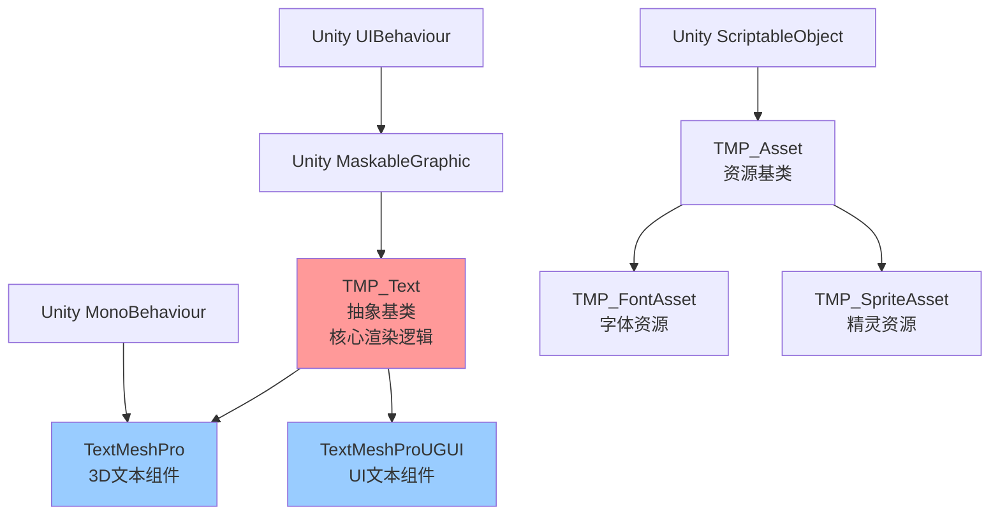
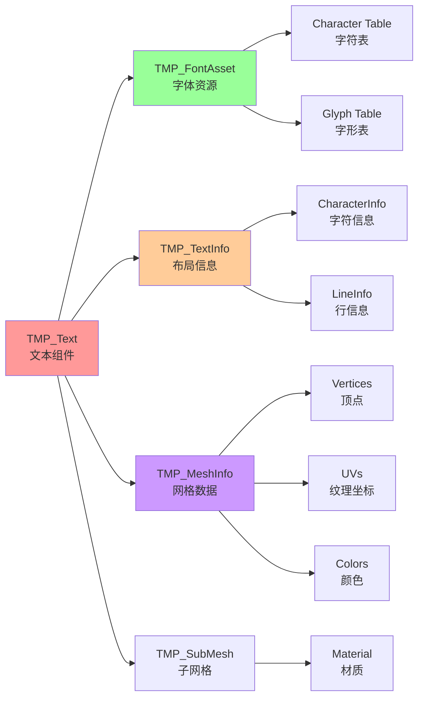
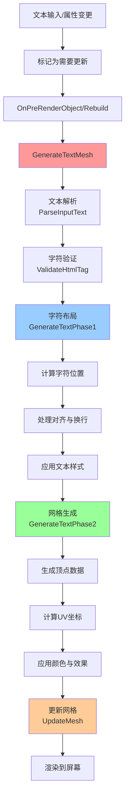
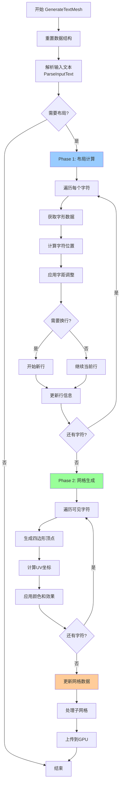
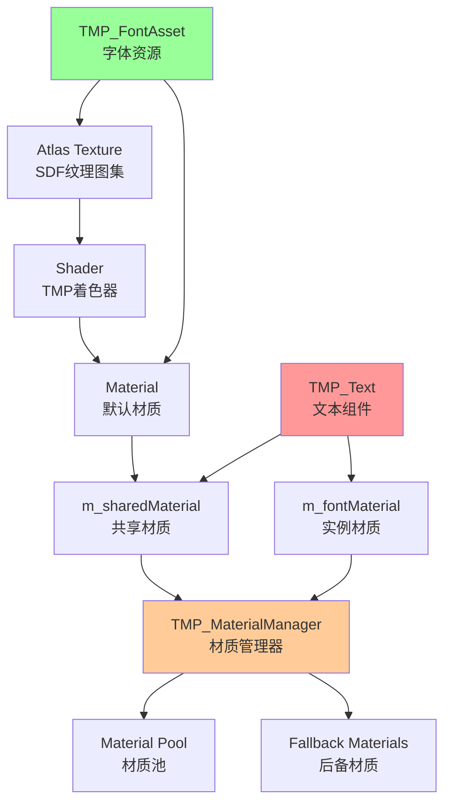

# TextMeshPro Runtime 源码结构与核心渲染机制分析

## 目录
1. [项目概述](#项目概述)
2. [源码结构分析](#源码结构分析)
3. [核心架构设计](#核心架构设计)
4. [核心渲染机制](#核心渲染机制)
5. [文本布局与生成流程](#文本布局与生成流程)
6. [材质与着色器系统](#材质与着色器系统)
7. [关键设计模式](#关键设计模式)
8. [总结](#总结)

---

## 项目概述

TextMeshPro (TMP) 是 Unity 的高级文本渲染解决方案，提供了比传统 UI Text 更强大的文本渲染能力。该项目位于 `com.unity.textmeshpro@3.0.6/Scripts/Runtime` 目录下，包含约 100 个源文件。

### 主要特性
- **高质量文本渲染**：使用 Signed Distance Field (SDF) 技术
- **丰富的文本样式**：支持富文本标签、渐变、轮廓、阴影等
- **双渲染模式**：支持 3D 世界空间和 UI Canvas 渲染
- **性能优化**：动态网格生成、对象池、材质管理
- **可扩展性**：支持自定义字体、精灵、样式表

---

## 源码结构分析

### 文件组织架构

```
Runtime/
├── 核心文本组件 (Core Text Components)
│   ├── TMP_Text.cs                    # 抽象基类，核心文本渲染逻辑
│   ├── TextMeshPro.cs                 # 3D 文本组件
│   └── TextMeshProUGUI.cs             # UI 文本组件
│
├── 资源管理 (Asset Management)
│   ├── TMP_FontAsset.cs               # 字体资源
│   ├── TMP_SpriteAsset.cs             # 精灵资源
│   ├── TMP_StyleSheet.cs              # 样式表
│   ├── TMP_Settings.cs                # 全局设置
│   └── MaterialReferenceManager.cs    # 材质引用管理
│
├── 字符与字形 (Characters & Glyphs)
│   ├── TMP_Character.cs               # 字符定义
│   ├── TMP_TextElement.cs             # 文本元素基类
│   ├── TMP_Sprite.cs                  # 精灵字符
│   └── TMP_FontFeatureTable.cs        # 字体特性表
│
├── 网格与渲染 (Mesh & Rendering)
│   ├── TMP_MeshInfo.cs                # 网格数据结构
│   ├── TMP_SubMesh.cs                 # 3D 子网格
│   ├── TMP_SubMeshUI.cs               # UI 子网格
│   └── TMP_ShaderUtilities.cs         # 着色器工具
│
├── 文本信息 (Text Information)
│   ├── TMP_TextInfo.cs                # 文本布局信息
│   ├── TMP_CharacterInfo.cs           # 字符信息
│   ├── TMP_LineInfo.cs                # 行信息
│   └── TMP_TextUtilities.cs           # 文本工具函数
│
├── UI 组件 (UI Components)
│   ├── TMP_InputField.cs              # 输入框
│   ├── TMP_Dropdown.cs                # 下拉菜单
│   └── TMP_SelectionCaret.cs          # 选择光标
│
├── 工具与管理 (Utilities & Management)
│   ├── TMP_UpdateManager.cs           # 更新管理器
│   ├── TMP_MaterialManager.cs         # 材质管理器
│   ├── TMP_ObjectPool.cs              # 对象池
│   ├── TMP_ListPool.cs                # 列表池
│   └── TMP_TextParsingUtilities.cs    # 文本解析工具
│
└── 其他 (Others)
    ├── FastAction.cs                  # 快速事件系统
    ├── TextContainer.cs               # 文本容器
    └── ITextPreProcessor.cs           # 文本预处理接口
```

### 核心模块分类

#### 1. **文本渲染核心** (30%)
- [`TMP_Text.cs`](TMP_Text.cs) - 最核心的类，包含所有文本渲染逻辑（约 9000+ 行）
- [`TextMeshPro.cs`](TextMeshPro.cs) - 3D 文本实现
- [`TextMeshProUGUI.cs`](TextMeshProUGUI.cs) - UI 文本实现

#### 2. **资源系统** (25%)
- 字体资源管理（FontAsset）
- 精灵资源管理（SpriteAsset）
- 材质管理（MaterialManager）
- 资源加载与缓存

#### 3. **网格生成** (20%)
- 顶点数据生成
- UV 映射
- 子网格管理
- 动态网格更新

#### 4. **文本布局** (15%)
- 文本解析
- 字符定位
- 行布局
- 对齐与换行

#### 5. **UI 组件** (10%)
- 输入框
- 下拉菜单
- 交互处理

---

## 核心架构设计

### 类继承关系图



### 核心组件交互图



---

## 核心渲染机制

### 渲染流程概览

TextMeshPro 的渲染流程可以分为以下几个主要阶段：



### 1. 文本更新触发机制

TMP_Text 使用脏标记（Dirty Flag）模式来优化性能：

```csharp
// 关键标记位
protected bool m_havePropertiesChanged;  // 属性已更改
protected bool m_isInputParsingRequired; // 需要解析输入
protected bool m_isCalculateSizeRequired; // 需要计算尺寸
```

**触发更新的场景：**
- 文本内容变更（`text` 属性）
- 字体或材质变更
- 颜色、大小等样式属性变更
- 布局容器尺寸变更
- 手动调用 `SetVerticesDirty()` 或 `SetLayoutDirty()`

### 2. 文本解析阶段（Phase 0）

**主要任务：**
- 解析富文本标签（`<color>`, `<size>`, `<b>`, `<i>` 等）
- 处理转义字符
- 验证字符是否在字体中存在
- 构建字符数组

**关键方法：**
- `ParseInputText()` - 解析输入文本
- `ValidateHtmlTag()` - 验证 HTML 标签
- `GetCharacterFromFontAsset()` - 从字体获取字符

**富文本标签示例：**
```
<color=#FF0000>红色文本</color>
<size=50>大号文本</size>
<b>粗体</b> <i>斜体</i>
<sprite=0> 插入精灵
```

### 3. 文本布局阶段（Phase 1）

**主要任务：**
- 计算每个字符的位置和尺寸
- 处理行布局和换行
- 应用对齐方式
- 处理文本溢出

**关键数据结构：**

```csharp
// TMP_CharacterInfo - 存储每个字符的信息
public struct TMP_CharacterInfo
{
    public char character;           // 字符
    public int index;                // 索引
    public Vector3 bottomLeft;       // 左下角位置
    public Vector3 topRight;         // 右上角位置
    public float ascender;           // 上升高度
    public float descender;          // 下降高度
    public float baseLine;           // 基线
    public bool isVisible;           // 是否可见
    public int lineNumber;           // 所在行号
    public int materialReferenceIndex; // 材质引用索引
    // ... 更多字段
}
```

**布局计算流程：**

1. **字符定位**：
   - 从字体资源获取字形（Glyph）信息
   - 计算字符的基线位置
   - 应用字符间距（kerning）

2. **行布局**：
   - 检测换行符和自动换行
   - 计算行高和行间距
   - 处理行对齐（左对齐、居中、右对齐、两端对齐）

3. **文本对齐**：
   - 水平对齐：Left, Center, Right, Justified
   - 垂直对齐：Top, Middle, Bottom, Baseline

4. **溢出处理**：
   - Overflow：文本超出容器
   - Ellipsis：显示省略号
   - Truncate：截断文本
   - ScrollRect：滚动显示

### 4. 网格生成阶段（Phase 2）

**主要任务：**
- 为每个可见字符生成四边形（Quad）
- 计算顶点位置、UV 坐标、颜色
- 应用文本效果（轮廓、阴影、渐变等）
- 生成子网格（用于多材质）

**网格数据结构：**

```csharp
// TMP_MeshInfo - 存储网格数据
public struct TMP_MeshInfo
{
    public Mesh mesh;                // Unity 网格
    public Vector3[] vertices;       // 顶点位置
    public Vector3[] normals;        // 法线
    public Vector4[] tangents;       // 切线
    public Vector2[] uvs0;           // UV0（字形纹理坐标）
    public Vector2[] uvs2;           // UV2（效果参数）
    public Color32[] colors32;       // 顶点颜色
    public int[] triangles;          // 三角形索引
    // ...
}
```

**顶点生成流程：**

1. **基础四边形**：
   - 每个字符生成 4 个顶点（左下、左上、右上、右下）
   - 生成 6 个索引（2 个三角形）

2. **UV 映射**：
   - UV0：映射到字体纹理（SDF 纹理）
   - UV2：存储效果参数（轮廓宽度、软度等）

3. **顶点颜色**：
   - 应用文本颜色
   - 应用渐变效果
   - 应用顶点颜色动画

4. **文本效果**：
   - **轮廓（Outline）**：通过 Shader 实现
   - **阴影（Shadow）**：生成额外的顶点
   - **下划线/删除线**：生成额外的四边形
   - **渐变（Gradient）**：通过顶点颜色实现

### 5. 网格更新与渲染

**3D 文本（TextMeshPro）：**
```csharp
// 使用 MeshFilter 和 MeshRenderer
m_mesh = GetComponent<MeshFilter>().mesh;
m_mesh.vertices = vertices;
m_mesh.uv = uvs;
m_mesh.colors32 = colors;
m_mesh.triangles = triangles;
```

**UI 文本（TextMeshProUGUI）：**
```csharp
// 使用 CanvasRenderer
canvasRenderer.SetMesh(m_mesh);
canvasRenderer.SetMaterial(m_sharedMaterial, 0);
```

**子网格管理：**
- 当文本包含多种材质（如字体 + 精灵）时，创建子网格
- 每个子网格对应一个材质
- 使用 `TMP_SubMesh` 或 `TMP_SubMeshUI` 管理

---

## 文本布局与生成流程

### 详细流程图



### 关键算法详解

#### 1. 字距调整（Kerning）

字距调整用于优化特定字符对之间的间距，提高可读性：

```
示例：
"AV" - 'A' 和 'V' 之间可以更紧密
"To" - 'T' 和 'o' 之间可以更紧密
```

**实现原理：**
- 字体资源包含字距调整表（Kerning Pair Table）
- 查找当前字符和前一个字符的字距值
- 调整当前字符的 X 位置

#### 2. 自动换行算法

**换行策略：**
- **字符换行**：在任意字符处换行
- **单词换行**：在空格或标点处换行
- **强制换行**：遇到 `\n` 换行符

**算法流程：**
1. 累加字符宽度
2. 检查是否超出容器宽度
3. 如果超出，回溯到上一个有效断点
4. 开始新行，重置 X 位置

#### 3. 文本对齐算法

**水平对齐：**
- **左对齐**：X 偏移 = 0
- **居中**：X 偏移 = (容器宽度 - 行宽度) / 2
- **右对齐**：X 偏移 = 容器宽度 - 行宽度
- **两端对齐**：调整字符间距，使行宽度等于容器宽度

**垂直对齐：**
- **顶部对齐**：Y 偏移 = 0
- **中部对齐**：Y 偏移 = (容器高度 - 文本高度) / 2
- **底部对齐**：Y 偏移 = 容器高度 - 文本高度

---

## 材质与着色器系统

### SDF（Signed Distance Field）技术

TextMeshPro 的核心渲染技术是 **SDF（有向距离场）**，这是一种高质量的文本渲染技术。

**SDF 原理：**
- 字体纹理存储的不是像素颜色，而是到字形边缘的距离
- 距离值编码在纹理的 Alpha 通道中
- Shader 根据距离值动态生成清晰的边缘

**优势：**
- **缩放无损**：可以任意缩放而不失真
- **丰富效果**：轻松实现轮廓、阴影、发光等效果
- **性能优异**：单个纹理支持多种尺寸

### 材质系统架构



### 着色器参数

**关键 Shader 属性：**

```csharp
// TMP_ShaderUtilities.cs 中定义的 Shader 属性 ID
public static int ID_FaceTex;           // 字体纹理
public static int ID_FaceColor;         // 文字颜色
public static int ID_FaceDilate;        // 膨胀/收缩
public static int ID_OutlineColor;      // 轮廓颜色
public static int ID_OutlineWidth;      // 轮廓宽度
public static int ID_OutlineSoftness;   // 轮廓软度
public static int ID_UnderlayColor;     // 底层颜色（阴影）
public static int ID_UnderlayOffsetX;   // 阴影偏移X
public static int ID_UnderlayOffsetY;   // 阴影偏移Y
public static int ID_GlowColor;         // 发光颜色
public static int ID_GlowOffset;        // 发光偏移
// ... 更多属性
```

### 材质管理策略

**材质实例化：**
- **共享材质**：多个文本对象共享同一材质（节省内存）
- **实例材质**：每个文本对象独立材质（支持独立属性）

**材质池：**
- 使用 `TMP_MaterialManager` 管理材质实例
- 避免重复创建相同的材质
- 自动清理未使用的材质

**后备字体系统：**
- 当主字体缺少某个字符时，从后备字体查找
- 支持多级后备字体链
- 自动创建后备材质

---

## 关键设计模式

### 1. 模板方法模式（Template Method）

[`TMP_Text`](TMP_Text.cs) 作为抽象基类，定义了文本渲染的算法骨架：

```csharp
// TMP_Text.cs
protected abstract void GenerateTextMesh(); // 抽象方法

// TextMeshPro.cs - 3D 实现
protected override void GenerateTextMesh() { ... }

// TextMeshProUGUI.cs - UI 实现
protected override void GenerateTextMesh() { ... }
```

### 2. 对象池模式（Object Pool）

使用 [`TMP_ObjectPool`](TMP_ObjectPool.cs) 和 [`TMP_ListPool`](TMP_ListPool.cs) 减少 GC 压力：

```csharp
// 获取对象
var list = TMP_ListPool<int>.Get();

// 使用对象
list.Add(1);

// 归还对象
TMP_ListPool<int>.Release(list);
```

### 3. 单例模式（Singleton）

多个管理器使用单例模式：
- [`TMP_UpdateManager`](TMP_UpdateManager.cs) - 更新管理
- [`MaterialReferenceManager`](MaterialReferenceManager.cs) - 材质引用管理
- [`TMP_ResourcesManager`](TMP_ResourcesManager.cs) - 资源管理

### 4. 观察者模式（Observer）

使用 [`FastAction`](FastAction.cs) 实现轻量级事件系统：

```csharp
// 定义事件
public static FastAction<object, Compute_DT_EventArgs> COMPUTE_DT_EVENT;

// 订阅事件
TMPro_EventManager.COMPUTE_DT_EVENT.Add(OnComputeDT);

// 触发事件
TMPro_EventManager.COMPUTE_DT_EVENT.Call(this, args);
```

### 5. 策略模式（Strategy）

文本溢出处理使用策略模式：
- Overflow
- Ellipsis
- Masking
- Truncate
- ScrollRect
- Page

### 6. 工厂模式（Factory）

[`TMP_DefaultControls`](TMP_DefaultControls.cs) 用于创建标准 UI 控件：

```csharp
// 创建 TextMeshPro UI 对象
GameObject textObject = TMP_DefaultControls.CreateText(resources);

// 创建输入框
GameObject inputField = TMP_DefaultControls.CreateInputField(resources);
```

---

## 总结

### 核心优势

1. **高质量渲染**
   - SDF 技术实现无损缩放
   - 丰富的文本效果（轮廓、阴影、渐变等）
   - 支持复杂的富文本标签

2. **性能优化**
   - 对象池减少 GC
   - 脏标记避免不必要的更新
   - 材质共享和批处理
   - 动态网格生成

3. **灵活扩展**
   - 支持自定义字体和精灵
   - 可扩展的样式表系统
   - 文本预处理接口
   - 丰富的事件回调

4. **双渲染模式**
   - 3D 世界空间文本（TextMeshPro）
   - UI Canvas 文本（TextMeshProUGUI）
   - 统一的核心逻辑

### 架构特点

1. **清晰的职责分离**
   - 文本组件：负责渲染和交互
   - 资源管理：负责字体、材质、精灵
   - 工具类：提供辅助功能

2. **高度模块化**
   - 核心逻辑在 TMP_Text 基类
   - 3D 和 UI 实现分离
   - 独立的子系统（材质、网格、布局）

3. **性能导向设计**
   - 延迟更新机制
   - 对象池和缓存
   - 批处理和合并

### 渲染流程总结

```
文本输入 → 脏标记 → 解析文本 → 布局计算 → 网格生成 → 渲染输出
   ↓          ↓         ↓          ↓          ↓          ↓
 属性变更   优化更新   富文本     字符定位   顶点数据   GPU渲染
                      标签处理   行布局     UV/颜色
                      字符验证   对齐换行   效果应用
```

### 关键技术点

1. **SDF 渲染技术** - 核心竞争力
2. **动态网格生成** - 实时文本更新
3. **富文本解析** - 强大的文本样式
4. **材质管理系统** - 高效的资源利用
5. **对象池机制** - 性能优化
6. **双模式支持** - 3D 和 UI 统一

### 代码质量

- **代码规模**：约 20,000+ 行核心代码
- **核心类**：[`TMP_Text.cs`](TMP_Text.cs) 约 9,000 行
- **注释完善**：关键算法有详细注释
- **设计模式**：大量使用经典设计模式
- **可维护性**：模块化设计，职责清晰

---

## 推荐学习路径

如果你想深入学习 TextMeshPro 源码，建议按以下顺序：

1. **入门阶段**
   - 阅读 [`TMP_Text.cs`](TMP_Text.cs) 的主要方法
   - 理解 [`TMP_CharacterInfo`](TMP_CharacterInfo.cs) 和 [`TMP_TextInfo`](TMP_TextInfo.cs)
   - 学习 [`TMP_MeshInfo`](TMP_MeshInfo.cs) 网格数据结构

2. **进阶阶段**
   - 研究 `GenerateTextMesh()` 方法的完整流程
   - 理解富文本解析机制
   - 学习材质和着色器系统

3. **高级阶段**
   - 研究性能优化技巧
   - 学习自定义扩展方法
   - 理解 SDF 渲染原理

4. **实践阶段**
   - 创建自定义文本效果
   - 实现自定义富文本标签
   - 优化大量文本的渲染性能

---

## 参考资源

- **官方文档**：Unity TextMeshPro Documentation
- **核心类文件**：
  - [`TMP_Text.cs`](TMP_Text.cs) - 核心渲染逻辑
  - [`TextMeshPro.cs`](TextMeshPro.cs) - 3D 文本实现
  - [`TextMeshProUGUI.cs`](TextMeshProUGUI.cs) - UI 文本实现
  - [`TMP_FontAsset.cs`](TMP_FontAsset.cs) - 字体资源管理
  - [`TMP_MeshInfo.cs`](TMP_MeshInfo.cs) - 网格数据结构

---

**文档版本**：1.0  
**分析日期**：2026-01-17  
**TextMeshPro 版本**：3.0.6
